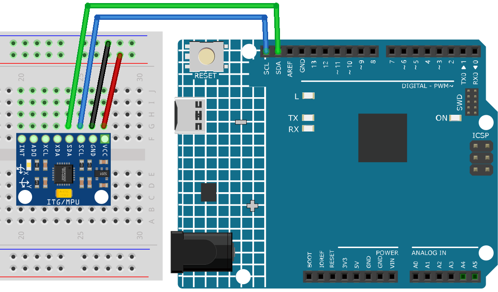

.. _3d_simulator:

3D Simulator
==============================================================

.. note::
  
  🌟 Welcome to the SunFounder Facebook Community! Whether you're into Raspberry Pi, Arduino, or ESP32, you'll find inspiration, help ideas here.
   
  - ✅ Be the first to get free learning resources. 
   
  - ✅ Stay updated on new products & exclusive giveaways. 
   
  - ✅ Share your creations and get real feedback.
   
  * 👉 Need faster updates or support? Click [|link_sf_facebook|] join our Facebook community 

  * 👉 Or join our WhatsApp group: Click [|link_sf_whatsapp|]
   
Kit purchase
------------------------

Looking for parts? Check out our all-in-one kits below — packed with components, beginner-friendly guides, and tons of fun.

.. image:: img/ultimate_sensor_kit.png
   :width: 100%
   :align: center
   :target: https://www.sunfounder.com/collections/arduino-kits-bundles/products/sunfounder-ultimate-sensor-kit-with-original-arduino-uno-r4-minima?ref=jbzmncle

.. raw:: html

     

.. list-table::
   :widths: 20 20 20
   :header-rows: 1

   * - Name
     - Includes Arduino board
     - PURCHASE LINK
   * - Elite Explorer Kit
     - Arduino Uno R4 WiFi
     - |link_elite_buy|
   * - 3 in 1 Ultimate Starter Kit
     - Arduino Uno R4 Minima
     - |link_arduinor4_buy|

Course Introduction
------------------------

In this lesson, we will learn how to use the MPU6050 Module with Arduino R4 and Processing to create dynamic motion tracking for a 3D model.

.. .. raw:: html

..  <iframe width="700" height="394" src="https://www.youtube.com/embed/6XZA62vVi3Y" title="YouTube video player" frameborder="0" allow="accelerometer; autoplay; clipboard-write; encrypted-media; gyroscope; picture-in-picture; web-share" referrerpolicy="strict-origin-when-cross-origin" allowfullscreen></iframe>

.. note::

  If this is your first time working with an Arduino project, we recommend downloading and reviewing the basic materials first.
  
  * :ref:`install_arduino`
  * :ref:`introduce_arduino`

**Required Components**

In this project, we need the following components:

.. list-table::
    :widths: 5 20 5 20
    :header-rows: 1

    *   - SN
        - COMPONENT INTRODUCTION	
        - QUANTITY
        - PURCHASE LINK

    *   - 1
        - Arduino UNO R4 Minima
        - 1
        - |link_unor4_buy|
    *   - 2
        - USB Type-C cable
        - 1
        - 
    *   - 3
        - Breadboard
        - 1
        - |link_breadboard_buy|
    *   - 4
        - Wires
        - Several
        - |link_wires_buy|
    *   - 5
        - MPU6050 Module
        - 1
        - |link_mpu6050_buy|

**Wiring**

**Common Connections:**

* **MPU6050**

  - **SDA:** Connect to **SDA** on the Arduino.
  - **SCL:** Connect to **SCL** on the Arduino.
  - **GND:** Connect to **GND** on the Arduino.
  - **VCC:** Connect to **5V** on the Arduino.

**Writing the Code**

.. note::

.. note::

 * Build the circuit.

 * Upload the code to the Arduino board using Arduino IDE.

 * In the Arduino IDE, check the current Arduino port(COMx).

 * The ``3DSimulator`` is used here. You can click here :download:`3DSimulator.zip </_static/3DSimulator.zip>` to download it. 
 
 * Open 3DSimulator.pde in the |link_processing_ide|.

 * Modify the code in line 8 to ensure the correct port number(COMx).

 * Run the Processing sketch.

.. code-block:: arduino

      #include <Wire.h>
      #include <MPU6050.h>

      MPU6050 mpu;

      // Raw data
      int16_t ax, ay, az;
      int16_t gx, gy, gz;

      // Angle data
      float roll = 0.0;
      float pitch = 0.0;
      float yaw = 0.0;

      // Gyro offset
      float gyroOffsetX = 0.0;
      float gyroOffsetY = 0.0;
      float gyroOffsetZ = 0.0;

      // Timing
      unsigned long lastTime = 0;
      float dt = 0.0;

      // Complementary filter coefficient
      const float alpha = 0.98;

      // ---------------------- Gyro Calibration ----------------------
      void calibrateGyro() {
        const int samples = 500;
        long sumX = 0;
        long sumY = 0;
        long sumZ = 0;

        Serial.println("Calibrating gyro... Keep MPU6050 still.");

        for (int i = 0; i < samples; i++) {
          mpu.getMotion6(&ax, &ay, &az, &gx, &gy, &gz);
          sumX += gx;
          sumY += gy;
          sumZ += gz;
          delay(5);
        }

        gyroOffsetX = sumX / (float)samples;
        gyroOffsetY = sumY / (float)samples;
        gyroOffsetZ = sumZ / (float)samples;

        Serial.println("Calibration done.");
      }

      void setup() {
        Serial.begin(115200);
        Wire.begin();

        mpu.initialize();

        if (!mpu.testConnection()) {
          Serial.println("MPU6050 Connection Failed");
          while (1);
        }

        delay(1000);

        calibrateGyro();

        lastTime = millis();
      }

      void loop() {
        // Read MPU6050 data
        mpu.getMotion6(&ax, &ay, &az, &gx, &gy, &gz);

        // Calculate delta time
        unsigned long currentTime = millis();
        dt = (currentTime - lastTime) / 1000.0;
        lastTime = currentTime;

        // Convert accelerometer raw data to g
        float accX = ax / 16384.0;
        float accY = ay / 16384.0;
        float accZ = az / 16384.0;

        // Convert gyro raw data to deg/s and remove offset
        float gyroX = (gx - gyroOffsetX) / 131.0;
        float gyroY = (gy - gyroOffsetY) / 131.0;
        float gyroZ = (gz - gyroOffsetZ) / 131.0;

        // Calculate accelerometer angles
        float accRoll  = atan2(accY, accZ) * 180.0 / PI;
        float accPitch = atan2(-accX, sqrt(accY * accY + accZ * accZ)) * 180.0 / PI;

        // Complementary filter
        roll  = alpha * (roll + gyroX * dt) + (1.0 - alpha) * accRoll;
        pitch = alpha * (pitch + gyroY * dt) + (1.0 - alpha) * accPitch;

        // Yaw only from gyro integration
        yaw += gyroZ * dt;

        // Send data to Processing
        Serial.print(roll);
        Serial.print(",");
        Serial.print(pitch);
        Serial.print(",");
        Serial.println(yaw);

        delay(10);  // about 100Hz
      }