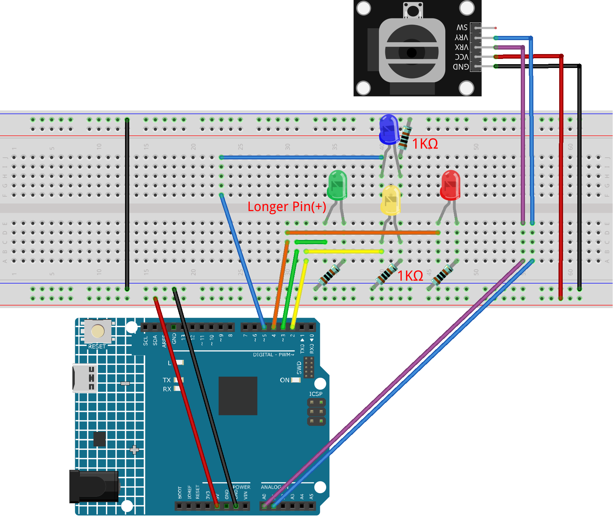

.. _joystick_led:

Joystick LED
==============================================================

.. note::
  
  🌟 Welcome to the SunFounder Facebook Community! Whether you're into Raspberry Pi, Arduino, or ESP32, you'll find inspiration, help ideas here.
   
  - ✅ Be the first to get free learning resources. 
   
  - ✅ Stay updated on new products & exclusive giveaways. 
   
  - ✅ Share your creations and get real feedback.
   
  * 👉 Need faster updates or support? Click [|link_sf_facebook|] join our Facebook community 

  * 👉 Or join our WhatsApp group: Click [|link_sf_whatsapp|]
   
Kit purchase
------------------------

Looking for parts? Check out our all-in-one kits below — packed with components, beginner-friendly guides, and tons of fun.

.. image:: img/elite_explore_kit.png
   :width: 100%
   :align: center
   :target: https://www.sunfounder.com/collections/arduino-kits-bundles/products/sunfounder-elite-explorer-kit-with-official-arduino-uno-r4-wifi?ref=jbzmncle

.. raw:: html

     

.. list-table::
   :widths: 20 20 20
   :header-rows: 1

   * - Name
     - Includes Arduino board
     - PURCHASE LINK
   * - Ultimate Sensor Kit
     - Arduino Uno R4 Minima
     - |link_ultimate_sensor_buy|
   * - Elite Explorer Kit
     - Arduino Uno R4 WiFi
     - |link_elite_buy|
   * - 3 in 1 Ultimate Starter Kit
     - Arduino Uno R4 Minima
     - |link_arduinor4_buy|
   * - Universal Maker Sensor Kit
     - ×
     - |link_umsk_buy|

Course Introduction
------------------------

In this lesson, you will learn how to use Arduino along with Joystick Module, LEDs, and resistors to create a light play. 

.. raw:: html

 <iframe width="700" height="394" src="https://www.youtube.com/embed/fUy11dLVjyU?si=hzWrqQk3RCWmN1Xg" title="YouTube video player" frameborder="0" allow="accelerometer; autoplay; clipboard-write; encrypted-media; gyroscope; picture-in-picture; web-share" referrerpolicy="strict-origin-when-cross-origin" allowfullscreen></iframe>

.. note::

  If this is your first time working with an Arduino project, we recommend downloading and reviewing the basic materials first.
  
  * :ref:`install_arduino`
  * :ref:`introduce_arduino`

**Required Components**

In this project, we need the following components:

.. list-table::
    :widths: 5 20 5 20
    :header-rows: 1

    *   - SN
        - COMPONENT INTRODUCTION	
        - QUANTITY
        - PURCHASE LINK

    *   - 1
        - Arduino UNO R4 Minima
        - 1
        - |link_unor4_buy|
    *   - 2
        - USB Type-C cable
        - 1
        - 
    *   - 3
        - Breadboard
        - 1
        - |link_breadboard_buy|
    *   - 4
        - Wires
        - Several
        - |link_wires_buy|
    *   - 5
        - 1kΩ resistor
        - Several
        - |link_resistor_buy|
    *   - 6
        - LED
        - Several
        - |link_led_buy|
    *   - 6
        - Joystick Module
        - 1
        - |link_joystick_buy|

**Wiring**

**Common Connections:**

* **LED**

  - Connect the LEDs **cathode** to a **1kΩ resistor** then to the negative power bus on the breadboard, and the LEDs **anode** to **2** to **5** on the Arduino.

* **Joystick Module**

  - **VRY:** Connect to **A1** on the Arduino.
  - **VRX:** Connect to **A0** on the Arduino.
  - **GND:** Connect to breadboard’s negative power bus.
  - **VCC:** Connect to breadboard’s red power bus.

**Writing the Code**

.. note::

    * You can copy this code into **Arduino IDE**. 
    * Don't forget to select the board(Arduino UNO R4 Minima) and the correct port before clicking the **Upload** button.

.. code-block:: arduino

      // LED pin definitions
      const int redLED = 4;    // Represents negative X direction (X low) 
      const int yellowLED = 2; // Represents negative Y direction (Y low)
      const int greenLED = 3;  // Represents positive X direction (X high) →
      const int blueLED = 5;   // Represents positive Y direction (Y high)

      // Joystick pin definitions
      const int xPin = A0;
      const int yPin = A1;

      // Define the range for analog values and midpoint
      const int MID_VAL = 512;
      const int DEAD_ZONE = 100;  // Dead zone range (adjust as needed)

      void setup() {
        pinMode(redLED, OUTPUT);
        pinMode(yellowLED, OUTPUT);
        pinMode(greenLED, OUTPUT);
        pinMode(blueLED, OUTPUT);

        // Initialize all LEDs to OFF
        digitalWrite(redLED, LOW);
        digitalWrite(yellowLED, LOW);
        digitalWrite(greenLED, LOW);
        digitalWrite(blueLED, LOW);

        Serial.begin(9600);
      }

      void loop() {
        int xVal = analogRead(xPin);
        int yVal = analogRead(yPin);

        Serial.print("X: "); Serial.print(xVal);
        Serial.print("  Y: "); Serial.println(yVal);

        // Turn off all LEDs
        digitalWrite(redLED, LOW);
        digitalWrite(yellowLED, LOW);
        digitalWrite(greenLED, LOW);
        digitalWrite(blueLED, LOW);

        // Calculate the offset from the midpoint
        int dx = xVal - MID_VAL;
        int dy = yVal - MID_VAL;

        // If the offset is within the dead zone, do not light up any LED
        if (abs(dx) < DEAD_ZONE && abs(dy) < DEAD_ZONE) {
          // No LEDs are turned on
        } else {
          // Consider both X and Y; select the direction with the larger offset
          if (abs(dx) > abs(dy)) {
            // X-axis has a larger offset, determine the direction
            if (dx > 0) {
              // Positive X direction => Turn on green LED (right)
              digitalWrite(greenLED, HIGH);
            } else {
              // Negative X direction => Turn on red LED (left)
              digitalWrite(redLED, HIGH);
            }
          } else {
            // Y-axis has a larger offset, determine the direction
            if (dy > 0) {
              // Positive Y direction => Turn on blue LED (up)
              digitalWrite(blueLED, HIGH);
            } else {
              // Negative Y direction => Turn on yellow LED (down)
              digitalWrite(yellowLED, HIGH);
            }
          }
        }

        delay(100);
      }
