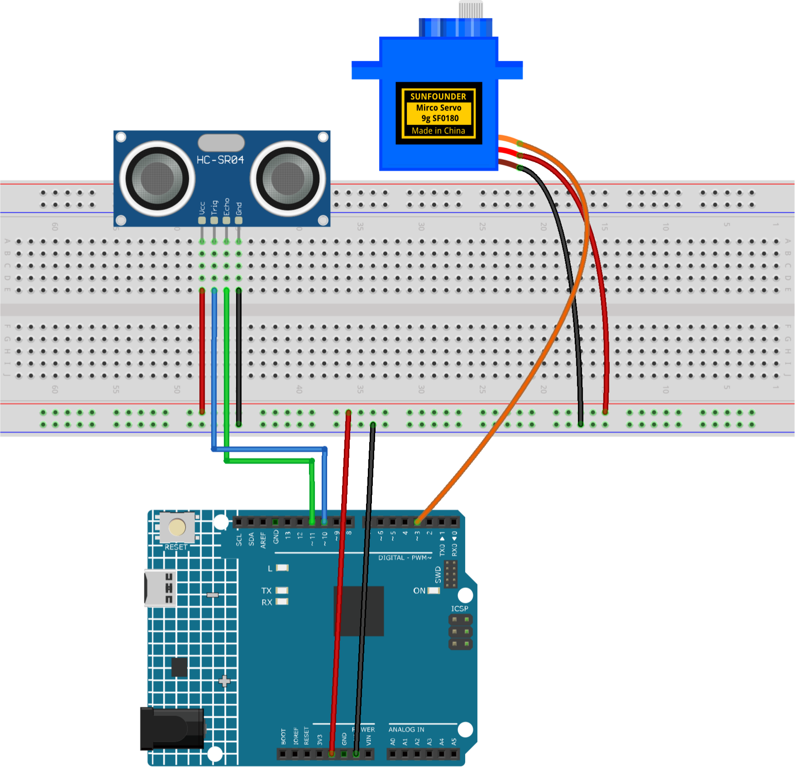

.. _prs1.0:

PRS Machine 1.0
==============================================================

.. note::
  
  🌟 Welcome to the SunFounder Facebook Community! Whether you're into Raspberry Pi, Arduino, or ESP32, you'll find inspiration, help ideas here.
   
  - ✅ Be the first to get free learning resources. 
   
  - ✅ Stay updated on new products & exclusive giveaways. 
   
  - ✅ Share your creations and get real feedback.
   
  * 👉 Need faster updates or support? Click [|link_sf_facebook|] join our Facebook community 

  * 👉 Or join our WhatsApp group: Click [|link_sf_whatsapp|]

Kit purchase
------------------------

Looking for parts? Check out our all-in-one kits below — packed with components, beginner-friendly guides, and tons of fun.

.. image:: img/ultimate_sensor_kit.png
   :width: 100%
   :align: center
   :target: https://www.sunfounder.com/collections/arduino-kits-bundles/products/sunfounder-ultimate-sensor-kit-with-original-arduino-uno-r4-minima?ref=jbzmncle

.. raw:: html

     

.. list-table::
   :widths: 20 20 20
   :header-rows: 1

   * - Name
     - Includes Arduino board
     - PURCHASE LINK
   * - Elite Explorer Kit
     - Arduino Uno R4 WiFi
     - |link_elite_buy|
   * - 3 in 1 Ultimate Starter Kit
     - Arduino Uno R4 Minima
     - |link_arduinor4_buy|

Course Introduction
------------------------

In this project, you will use an Arduino board, a servo motor, and an Ultrasonic Sensor Module to build a PRS machine.

.. .. raw:: html

..  <iframe width="700" height="394" src="https://www.youtube.com/embed/BA5O5NMWYIg?si=w2SlwgzK_UgR_0lz" title="YouTube video player" frameborder="0" allow="accelerometer; autoplay; clipboard-write; encrypted-media; gyroscope; picture-in-picture; web-share" referrerpolicy="strict-origin-when-cross-origin" allowfullscreen></iframe>

.. note::

  If this is your first time working with an Arduino project, we recommend downloading and reviewing the basic materials first.
  
  * :ref:`install_arduino`
  * :ref:`introduce_arduino`

**Required Components**

In this project, we need the following components:

.. list-table::
    :widths: 5 20 5 20
    :header-rows: 1

    *   - SN
        - COMPONENT INTRODUCTION	
        - QUANTITY
        - PURCHASE LINK

    *   - 1
        - Arduino UNO R4 Minima/Arduino UNO R4 WIFI
        - 1
        - |link_unor4_wifi_buy|
    *   - 2
        - USB Type-C cable
        - 1
        - 
    *   - 3
        - Breadboard
        - 1
        - |link_breadboard_buy|
    *   - 4
        - Wires
        - Several
        - |link_wires_buy|
    *   - 5
        - Ultrasonic Sensor Module
        - 2
        - |link_ultrasonic_buy|
    *   - 6
        - Digital Servo Motor
        - 1
        - |link_motor_buy|

**Wiring**

**Common Connections:**

* **Digital Servo Motor**

  - Connect to breadboard’s positive power bus.
  - Connect to breadboard’s negative power bus.
  - Connect to  **3** on the Arduino.

* **Ultrasonic Sensor Module Front**

  - **Trig:** Connect to **10** on the Arduino.
  - **Echo:** Connect to **11** on the Arduino.
  - **GND:** Connect to breadboard’s negative power bus.
  - **VCC:** Connect to breadboard’s red power bus.

**Writing the Code**

.. note::

    * You can copy this code into **Arduino IDE**. 
    * Don't forget to select the board(Arduino UNO R4 Minima/WIFI) and the correct port before clicking the **Upload** button.

.. code-block:: arduino

      #include <Servo.h>

      // Ultrasonic sensor pins
      const int trigPin = 10;
      const int echoPin = 11;

      // Servo signal pin
      const int servoPin = 3;

      Servo gameServo;

      // Prevent repeated triggering
      bool hasPlayed = false;

      // Variables for shake animation
      int shakePos = 60;
      bool movingRight = true;

      void setup() {
        Serial.begin(9600);

        // Set ultrasonic sensor pins
        pinMode(trigPin, OUTPUT);
        pinMode(echoPin, INPUT);

        // Attach servo motor
        gameServo.attach(servoPin);

        // Start from the center position
        gameServo.write(90);

        // Create a random seed
        randomSeed(analogRead(A0));
      }

      void loop() {
        // Read the current distance
        float distance = readDistance();

        Serial.print("Distance: ");
        Serial.print(distance);
        Serial.println(" cm");

        // Hand detected: show a random result
        if (distance > 0 && distance < 15 && !hasPlayed) {
          playGame();
          hasPlayed = true;
        }

        // Reset when the hand moves away
        if (distance >= 20 || distance == -1) {
          hasPlayed = false;
        }

        // Keep shaking while waiting
        if (!hasPlayed) {
          shakeAnimation();
        }

        delay(30);
      }

      // Measure distance with the ultrasonic sensor
      float readDistance() {
        digitalWrite(trigPin, LOW);
        delayMicroseconds(2);

        digitalWrite(trigPin, HIGH);
        delayMicroseconds(10);
        digitalWrite(trigPin, LOW);

        long duration = pulseIn(echoPin, HIGH, 30000);

        // No signal received
        if (duration == 0) {
          return -1;
        }

        // Convert time to distance
        return duration / 58.0;
      }

      // Servo shake animation
      void shakeAnimation() {
        if (movingRight) {
          shakePos += 3;

          if (shakePos >= 120) {
            movingRight = false;
          }

        } else {
          shakePos -= 3;

          if (shakePos <= 60) {
            movingRight = true;
          }
        }

        gameServo.write(shakePos);
      }

      // Randomly choose Rock, Paper, or Scissors
      void playGame() {
        int result = random(0, 3);

        if (result == 0) {
          gameServo.write(0);
          Serial.println("Rock!");
        } 
        else if (result == 1) {
          gameServo.write(90);
          Serial.println("Paper!");
        } 
        else {
          gameServo.write(180);
          Serial.println("Scissors!");
        }

        delay(1000);
      }

