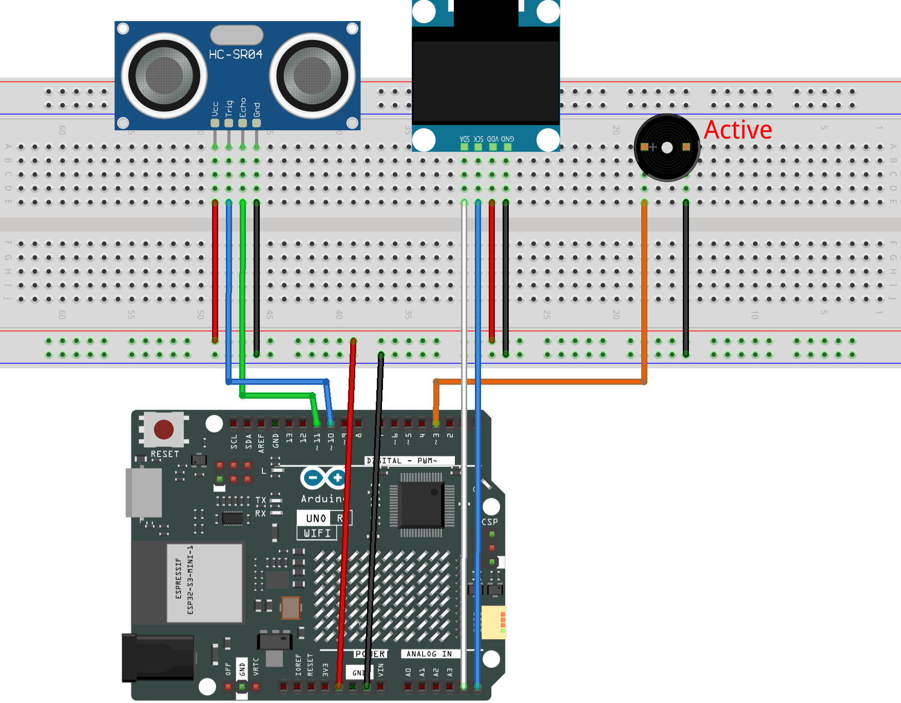

.. _prs2.0:

PRS Machine 2.0
==============================================================

.. note::
  
  🌟 Welcome to the SunFounder Facebook Community! Whether you're into Raspberry Pi, Arduino, or ESP32, you'll find inspiration, help ideas here.
   
  - ✅ Be the first to get free learning resources. 
   
  - ✅ Stay updated on new products & exclusive giveaways. 
   
  - ✅ Share your creations and get real feedback.
   
  * 👉 Need faster updates or support? Click [|link_sf_facebook|] join our Facebook community 

  * 👉 Or join our WhatsApp group: Click [|link_sf_whatsapp|]

Kit purchase
------------------------

Looking for parts? Check out our all-in-one kits below — packed with components, beginner-friendly guides, and tons of fun.

.. image:: img/elite_explore_kit.png
   :width: 100%
   :align: center
   :target: https://www.sunfounder.com/collections/arduino-kits-bundles/products/sunfounder-elite-explorer-kit-with-official-arduino-uno-r4-wifi?ref=jbzmncle

.. raw:: html

     

.. list-table::
   :widths: 20 20 20
   :header-rows: 1

   * - Name
     - Includes Arduino board
     - PURCHASE LINK
   * - Elite Explorer Kit
     - Arduino Uno R4 WiFi
     - |link_elite_buy|
   * - 3 in 1 Ultimate Starter Kit
     - Arduino Uno R4 Minima
     - |link_arduinor4_buy|

Course Introduction
------------------------

In this project, you will use an Arduino board, OLED screen, Active Buzzer, and an Ultrasonic Sensor Module to build a PRS machine2.0.

.. raw:: html

  <iframe width="700" height="394" src="https://www.youtube.com/embed/b-yM41x-DWY" title="YouTube video player" frameborder="0" allow="accelerometer; autoplay; clipboard-write; encrypted-media; gyroscope; picture-in-picture; web-share" referrerpolicy="strict-origin-when-cross-origin" allowfullscreen></iframe>

.. note::

  If this is your first time working with an Arduino project, we recommend downloading and reviewing the basic materials first.
  
  * :ref:`install_arduino`
  * :ref:`introduce_arduino`

**Required Components**

In this project, we need the following components:

.. list-table::
    :widths: 5 20 5 20
    :header-rows: 1

    *   - SN
        - COMPONENT INTRODUCTION	
        - QUANTITY
        - PURCHASE LINK

    *   - 1
        - Arduino UNO R4 Minima/Arduino UNO R4 WIFI
        - 1
        - |link_unor4_wifi_buy|
    *   - 2
        - USB Type-C cable
        - 1
        - 
    *   - 3
        - Breadboard
        - 1
        - |link_breadboard_buy|
    *   - 4
        - Wires
        - Several
        - |link_wires_buy|
    *   - 5
        - Ultrasonic Sensor Module
        - 1
        - |link_ultrasonic_buy|
    *   - 6
        - OLED Display Module
        - 1
        - |link_oled_buy|
    *   - 7
        - Active Buzzer
        - 1
        - 

**Wiring**

**Common Connections:**

* **Active Buzzer**

  - **＋:** Connect to **3** on the Arduino.
  - **－:** Connect to breadboard’s negative power bus.

* **Ultrasonic Sensor Module Front**

  - **Trig:** Connect to **10** on the Arduino.
  - **Echo:** Connect to **11** on the Arduino.
  - **GND:** Connect to breadboard’s negative power bus.
  - **VCC:** Connect to breadboard’s red power bus.

* **OLED Display Module**

  - **SDA:** Connect to **A4** on the Arduino.
  - **SCK:** Connect to **A5** on the Arduino.
  - **GND:** Connect to breadboard’s negative power bus.
  - **VCC:** Connect to breadboard’s red power bus.

**Writing the Code**

.. note::

    * You can copy this code into **Arduino IDE**. 
    * To install the library, use the Arduino Library Manager and search for **Adafruit_GFX** and **Adafruit SSD1306** and install it.
    * Don't forget to select the board(Arduino UNO R4 Minima/WIFI) and the correct port before clicking the **Upload** button.

.. code-block:: arduino

      #include <Wire.h>
      #include <Adafruit_GFX.h>
      #include <Adafruit_SSD1306.h>

      // OLED display settings
      #define SCREEN_WIDTH 128
      #define SCREEN_HEIGHT 64
      #define OLED_RESET -1
      #define SCREEN_ADDRESS 0x3C

      // Bitmap size
      #define ICON_WIDTH 64
      #define ICON_HEIGHT 40

      // Create OLED object
      Adafruit_SSD1306 display(
        SCREEN_WIDTH,
        SCREEN_HEIGHT,
        &Wire,
        OLED_RESET
      );

      // Ultrasonic sensor pins
      const int trigPin = 10;
      const int echoPin = 11;

      // Active buzzer pin
      const int buzzerPin = 3;

      // Prevent repeated triggers
      bool hasPlayed = false;

      // Icon animation timing
      int currentIcon = 0;
      unsigned long lastIconTime = 0;

      // Time between icon changes
      const unsigned long iconInterval = 100;

      const uint8_t rockBitmap[] PROGMEM = {
        0x00, 0x00, 0x00, 0x00, 0x00, 0x00, 0x00, 0x00, 0x00, 0x00, 0x00, 0x00, 0x00, 0x00, 0x00, 0x00,
        0x00, 0x00, 0x00, 0x00, 0x00, 0x00, 0x00, 0x00, 0x00, 0x00, 0x00, 0x00, 0x00, 0x00, 0x00, 0x00,
        0x00, 0x00, 0x00, 0x00, 0x00, 0x00, 0x00, 0x00, 0x00, 0x00, 0x00, 0x00, 0x00, 0x00, 0x00, 0x00,
        0x00, 0x00, 0x00, 0x00, 0x00, 0x00, 0x00, 0x00, 0x00, 0x00, 0x00, 0x00, 0x00, 0x00, 0x00, 0x00,
        0x00, 0x00, 0x00, 0x00, 0x00, 0x00, 0x00, 0x00, 0x01, 0x00, 0x00, 0x00, 0x00, 0x00, 0x00, 0x00,
        0x00, 0xC0, 0x00, 0x00, 0x00, 0x00, 0x00, 0x80, 0x00, 0x20, 0x00, 0x7C, 0x7C, 0x00, 0x03, 0x00,
        0x00, 0x00, 0x00, 0xC1, 0x83, 0x00, 0x04, 0x00, 0x00, 0x00, 0x01, 0x80, 0x01, 0xE0, 0x04, 0x00,
        0x00, 0x00, 0x03, 0x00, 0x00, 0xF0, 0x00, 0x00, 0x00, 0x00, 0x06, 0x00, 0x00, 0x18, 0x00, 0x00,
        0x00, 0x00, 0x7C, 0x00, 0x00, 0x0C, 0x00, 0x00, 0x0C, 0x00, 0x60, 0x00, 0x00, 0x0C, 0x00, 0x00,
        0x00, 0x00, 0x80, 0x00, 0x00, 0x0C, 0x00, 0x00, 0x00, 0x00, 0x80, 0x00, 0x02, 0x02, 0x01, 0x80,
        0x00, 0x01, 0x80, 0x02, 0x02, 0x02, 0x01, 0x00, 0x00, 0x01, 0x00, 0x02, 0x01, 0x02, 0x00, 0x00,
        0x00, 0x06, 0x00, 0x01, 0x81, 0x01, 0x00, 0x00, 0xC0, 0x06, 0x01, 0x01, 0x80, 0x81, 0x00, 0x00,
        0x30, 0x04, 0x01, 0x00, 0x40, 0x81, 0x00, 0x00, 0x00, 0x08, 0x00, 0x80, 0x40, 0x41, 0x80, 0x38,
        0x00, 0x18, 0x00, 0x40, 0x20, 0x41, 0x00, 0x00, 0x00, 0x30, 0x00, 0x60, 0x30, 0x23, 0x00, 0x00,
        0x00, 0x30, 0x00, 0x20, 0x30, 0x23, 0x80, 0x00, 0x00, 0x30, 0x20, 0x10, 0x08, 0x3E, 0xE0, 0x00,
        0x00, 0x30, 0x10, 0x18, 0x08, 0x30, 0x60, 0x00, 0x00, 0x30, 0x10, 0x08, 0x04, 0xE2, 0x60, 0x00,
        0x00, 0x30, 0x08, 0x04, 0x07, 0x00, 0x60, 0x00, 0x00, 0x30, 0x08, 0x04, 0x07, 0x00, 0x60, 0x00,
        0x00, 0x18, 0x04, 0x02, 0x1C, 0x00, 0x60, 0x00, 0x00, 0x08, 0x06, 0x03, 0x18, 0x00, 0x60, 0x00,
        0x00, 0x06, 0x01, 0x01, 0xF0, 0x00, 0x80, 0x00, 0x00, 0x07, 0x01, 0x80, 0x60, 0xC1, 0x80, 0x00,
        0x00, 0x01, 0x00, 0x41, 0xA0, 0xDF, 0x00, 0x00, 0x00, 0x00, 0xC0, 0x3E, 0x30, 0xE0, 0x00, 0x00
      };

      const uint8_t scissorsBitmap[] PROGMEM = {
        0x00, 0x00, 0x00, 0x00, 0x00, 0x00, 0x00, 0x00, 0x00, 0x00, 0x00, 0x00, 0x00, 0x00, 0x00, 0x00,
        0x00, 0x00, 0x00, 0x00, 0x00, 0x00, 0x00, 0x00, 0x00, 0x00, 0x00, 0x00, 0x00, 0x00, 0x00, 0x00,
        0x00, 0x00, 0x00, 0x00, 0x00, 0x00, 0x00, 0x00, 0x00, 0x00, 0x00, 0x00, 0x00, 0x00, 0x00, 0x00,
        0x00, 0x00, 0x00, 0x0E, 0x00, 0x00, 0x00, 0x00, 0x00, 0x00, 0x00, 0x0E, 0x00, 0x00, 0x00, 0x00,
        0x00, 0x00, 0x00, 0x11, 0x80, 0x00, 0x00, 0x00, 0x00, 0x00, 0x00, 0x20, 0xC0, 0x00, 0x00, 0x00,
        0x01, 0x00, 0x00, 0x20, 0xC0, 0x00, 0x00, 0x02, 0x00, 0x80, 0x00, 0x20, 0xC0, 0x07, 0xC0, 0x04,
        0x00, 0x40, 0x00, 0x20, 0xC0, 0x08, 0x30, 0x08, 0x00, 0x20, 0x00, 0x20, 0xC0, 0x08, 0x30, 0x30,
        0x00, 0x00, 0x00, 0x20, 0xC0, 0x18, 0x30, 0x00, 0x00, 0x00, 0x00, 0x20, 0xC0, 0x30, 0x20, 0x00,
        0x00, 0x00, 0x00, 0x20, 0xC0, 0x60, 0x60, 0x00, 0x00, 0x00, 0x00, 0x20, 0xC0, 0xC0, 0x80, 0x0C,
        0x00, 0x00, 0x00, 0x20, 0xC1, 0x81, 0x00, 0x00, 0x00, 0x00, 0x00, 0x20, 0xC3, 0x02, 0x00, 0x00,
        0x00, 0x00, 0x00, 0x20, 0xC3, 0x06, 0x00, 0x00, 0x1E, 0x00, 0x00, 0x20, 0xC6, 0x06, 0x00, 0x03,
        0x03, 0x00, 0x00, 0x20, 0xCC, 0x08, 0x00, 0x06, 0x00, 0x00, 0x00, 0x20, 0xD0, 0x10, 0x00, 0x00,
        0x00, 0x00, 0x00, 0x20, 0xF0, 0x30, 0x00, 0x00, 0x00, 0x00, 0x00, 0x40, 0x60, 0x60, 0x00, 0x00,
        0x00, 0x00, 0x00, 0x40, 0x00, 0xF8, 0x00, 0x00, 0x00, 0x00, 0x00, 0xC0, 0x01, 0x88, 0x00, 0x00,
        0x00, 0x00, 0x03, 0x7F, 0xC3, 0x08, 0x00, 0x00, 0x00, 0x00, 0x06, 0x00, 0x26, 0x0C, 0x00, 0x00,
        0x00, 0x00, 0x08, 0x00, 0x9C, 0x1E, 0x00, 0x00, 0x03, 0x00, 0x08, 0x00, 0x10, 0x13, 0x00, 0x04,
        0x1E, 0x00, 0x08, 0x00, 0x30, 0x21, 0x00, 0x03, 0x1C, 0x00, 0x08, 0x07, 0xF0, 0xC1, 0x00, 0x01,
        0x00, 0x00, 0x08, 0x01, 0x11, 0x81, 0x00, 0x00, 0x00, 0x00, 0x08, 0x00, 0x8F, 0x07, 0x00, 0x00,
        0x00, 0x00, 0x04, 0x00, 0x82, 0x0E, 0x00, 0x00, 0x00, 0x00, 0x03, 0x00, 0x82, 0x18, 0x00, 0x00,
        0x00, 0x00, 0x03, 0x00, 0x81, 0xE8, 0x00, 0x00, 0x00, 0x00, 0x01, 0x81, 0x00, 0x18, 0x00, 0x00
      };

      const uint8_t paperBitmap[] PROGMEM = {
        0x00, 0x00, 0x00, 0x00, 0x00, 0x00, 0x00, 0x00, 0x00, 0x00, 0x00, 0x00, 0x00, 0x00, 0x00, 0x00,
        0x00, 0x00, 0x00, 0x00, 0x00, 0x00, 0x00, 0x00, 0x00, 0x00, 0x00, 0x00, 0x00, 0x00, 0x00, 0x00,
        0x00, 0x00, 0x00, 0x00, 0x00, 0x00, 0x00, 0x00, 0x00, 0x00, 0x00, 0x00, 0x00, 0x00, 0x00, 0x00,
        0x00, 0x00, 0x00, 0x00, 0x70, 0x00, 0x00, 0x00, 0x00, 0x00, 0x00, 0x00, 0xF0, 0x00, 0x00, 0x00,
        0x00, 0x00, 0x00, 0x1D, 0x98, 0x00, 0x00, 0x00, 0x00, 0x00, 0x00, 0x22, 0x0F, 0xC0, 0x00, 0x00,
        0x00, 0x00, 0x00, 0x42, 0x0C, 0x40, 0x00, 0x00, 0x00, 0x80, 0x00, 0x42, 0x0C, 0x20, 0x00, 0x04,
        0x00, 0x60, 0x00, 0x42, 0x0C, 0x20, 0x00, 0x18, 0x00, 0x20, 0x00, 0x42, 0x0C, 0x20, 0x00, 0x18,
        0x00, 0x10, 0x00, 0x42, 0x0C, 0x3E, 0x00, 0x00, 0x00, 0x00, 0x00, 0x42, 0x0C, 0x33, 0x00, 0x00,
        0x00, 0x00, 0x00, 0x42, 0x0C, 0x21, 0x00, 0x00, 0x00, 0x00, 0x00, 0x42, 0x0C, 0x21, 0x00, 0x00,
        0x00, 0x00, 0x00, 0x42, 0x0C, 0x21, 0x00, 0x00, 0x00, 0x00, 0x00, 0x42, 0x0C, 0x21, 0x00, 0x00,
        0x00, 0x00, 0x00, 0x42, 0x0C, 0x21, 0x00, 0x08, 0x00, 0x00, 0x00, 0x42, 0x0C, 0x21, 0x00, 0x30,
        0x03, 0xC0, 0xF8, 0x42, 0x0C, 0x21, 0x00, 0x00, 0x00, 0x00, 0x84, 0x42, 0x0C, 0xE1, 0x00, 0x00,
        0x00, 0x00, 0x83, 0x40, 0x00, 0x21, 0x00, 0x00, 0x00, 0x00, 0x81, 0x40, 0x00, 0x01, 0x00, 0x00,
        0x00, 0x00, 0x80, 0xC0, 0x00, 0x01, 0x00, 0x0F, 0x00, 0x00, 0xC0, 0xC0, 0x00, 0x01, 0x00, 0x0F,
        0x00, 0x00, 0x40, 0x21, 0xF8, 0x01, 0x00, 0x00, 0x00, 0x00, 0x20, 0x3C, 0x03, 0x01, 0x00, 0x00,
        0x01, 0xC0, 0x10, 0x03, 0x00, 0x01, 0x00, 0x00, 0x00, 0x00, 0x08, 0x00, 0xC0, 0x01, 0x00, 0x00,
        0x00, 0x00, 0x08, 0x00, 0x60, 0x01, 0x00, 0x10, 0x00, 0x30, 0x04, 0x00, 0x20, 0x01, 0x00, 0x18,
        0x00, 0x00, 0x04, 0x00, 0x10, 0x01, 0x00, 0x00, 0x00, 0x00, 0x02, 0x00, 0x10, 0x01, 0x00, 0x00,
        0x00, 0x00, 0x03, 0x00, 0x00, 0x03, 0x00, 0x00, 0x00, 0x00, 0x00, 0x00, 0x00, 0x02, 0x00, 0x00,
        0x00, 0x00, 0x00, 0x80, 0x00, 0x02, 0x00, 0x00, 0x00, 0x08, 0x00, 0x40, 0x00, 0x06, 0x00, 0x20
      };

      void setup() {

        Serial.begin(9600);

        // Configure sensor pins
        pinMode(trigPin, OUTPUT);
        pinMode(echoPin, INPUT);

        // Configure buzzer pin
        pinMode(buzzerPin, OUTPUT);

        // Create a random seed
        randomSeed(analogRead(A0));

        // Initialize OLED
        if (!display.begin(
              SSD1306_SWITCHCAPVCC,
              SCREEN_ADDRESS)) {

          Serial.println("OLED not found");

          while (true);
        }

        display.clearDisplay();
        display.display();
      }

      void loop() {

        // Read current distance
        float distance = readDistance();

        Serial.print("Distance: ");
        Serial.print(distance);
        Serial.println(" cm");

        // Object detected
        if (distance > 0 &&
            distance < 9 &&
            !hasPlayed) {

          // Pick a random result
          int result = random(0, 3);

          // Show result immediately
          showIcon(result, true);

          // Let OLED refresh first
          delay(50);

          // Play confirmation sound
          playResultSound();

          hasPlayed = true;

          if (result == 0) {
            Serial.println("Result: ROCK");
          }
          else if (result == 1) {
            Serial.println("Result: SCISSORS");
          }
          else {
            Serial.println("Result: PAPER");
          }
        }

        // Reset when clear
        if (distance >= 20 ||
            distance == -1) {

          hasPlayed = false;
        }

        // Cycle through icons
        if (!hasPlayed) {

          if (millis() - lastIconTime >= iconInterval) {

            lastIconTime = millis();

            showIcon(currentIcon, false);

            currentIcon++;

            if (currentIcon > 2) {
              currentIcon = 0;
            }
          }
        }

        delay(30);
      }

      // Measure distance in cm
      float readDistance() {

        // Send trigger pulse
        digitalWrite(trigPin, LOW);
        delayMicroseconds(2);

        digitalWrite(trigPin, HIGH);
        delayMicroseconds(10);

        digitalWrite(trigPin, LOW);

        long duration =
          pulseIn(
            echoPin,
            HIGH,
            30000
          );

        // No echo received
        if (duration == 0) {
          return -1;
        }

        // Convert to centimeters
        return duration / 58.0;
      }

      // Display selected icon
      // 0 = Rock
      // 1 = Scissors
      // 2 = Paper
      void showIcon(
        int icon,
        bool isResult) {

        display.clearDisplay();

        if (isResult) {
          drawSparkles();
        }

        if (icon == 0) {

          display.drawBitmap(
            32,
            5,
            rockBitmap,
            ICON_WIDTH,
            ICON_HEIGHT,
            SSD1306_WHITE
          );

          drawLabel("ROCK", 52);
        }

        else if (icon == 1) {

          display.drawBitmap(
            32,
            5,
            scissorsBitmap,
            ICON_WIDTH,
            ICON_HEIGHT,
            SSD1306_WHITE
          );

          drawLabel("SCISSORS", 40);
        }

        else {

          display.drawBitmap(
            32,
            5,
            paperBitmap,
            ICON_WIDTH,
            ICON_HEIGHT,
            SSD1306_WHITE
          );

          drawLabel("PAPER", 49);
        }

        display.display();
      }

      // Draw icon label
      void drawLabel(
        const char *text,
        int x) {

        display.setTextColor(
          SSD1306_WHITE);

        display.setTextSize(1);

        display.setCursor(x, 54);

        display.println(text);
      }

      // Draw result effect
      void drawSparkles() {

        display.drawLine(
          14, 18,
          22, 18,
          SSD1306_WHITE);

        display.drawLine(
          18, 14,
          18, 22,
          SSD1306_WHITE);

        display.drawLine(
          106, 18,
          114, 18,
          SSD1306_WHITE);

        display.drawLine(
          110, 14,
          110, 22,
          SSD1306_WHITE);

        display.drawLine(
          14, 42,
          22, 42,
          SSD1306_WHITE);

        display.drawLine(
          18, 38,
          18, 46,
          SSD1306_WHITE);

        display.drawLine(
          106, 42,
          114, 42,
          SSD1306_WHITE);

        display.drawLine(
          110, 38,
          110, 46,
          SSD1306_WHITE);
      }

      // Play a simple confirmation beep
      void playResultSound() {

        digitalWrite(
          buzzerPin,
          HIGH);

        delay(120);

        digitalWrite(
          buzzerPin,
          LOW);

        delay(80);

        digitalWrite(
          buzzerPin,
          HIGH);

        delay(120);

        digitalWrite(
          buzzerPin,
          LOW);
      }
