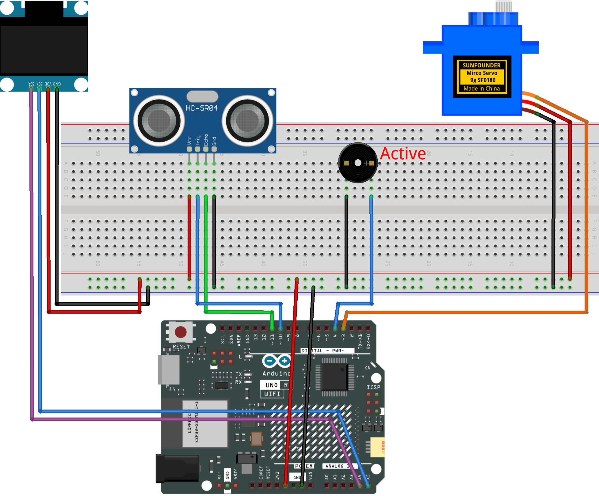

.. _rps3.0:

RPS Machine 3.0
==============================================================

.. note::
  
  🌟 Welcome to the SunFounder Facebook Community! Whether you're into Raspberry Pi, Arduino, or ESP32, you'll find inspiration, help ideas here.
   
  - ✅ Be the first to get free learning resources. 

  - ✅ Stay updated on new products & exclusive giveaways. 

  - ✅ Share your creations and get real feedback.

  * 👉 Need faster updates or support? Click [|link_sf_facebook|] join our Facebook community 

  * 👉 Or join our WhatsApp group: Click [|link_sf_whatsapp|]

Kit purchase
------------------------

Looking for parts? Check out our all-in-one kits below — packed with components, beginner-friendly guides, and tons of fun.

.. image:: img/elite_explore_kit.png
   :width: 100%
   :align: center
   :target: https://www.sunfounder.com/collections/arduino-kits-bundles/products/sunfounder-elite-explorer-kit-with-official-arduino-uno-r4-wifi?ref=jbzmncle

.. raw:: html

     

.. list-table::
   :widths: 20 20 20
   :header-rows: 1

   * - Name
     - Includes Arduino board
     - PURCHASE LINK
   * - Elite Explorer Kit
     - Arduino Uno R4 WiFi
     - |link_elite_buy|
   * - 3 in 1 Ultimate Starter Kit
     - Arduino Uno R4 Minima
     - |link_arduinor4_buy|

Course Introduction
------------------------

In this project, you will use an Arduino board, a servo motor, OLED screen, Active Buzzer, and an Ultrasonic Sensor Module to build a RPS machine3.0.

.. raw:: html

  <iframe width="700" height="394" src="https://www.youtube.com/embed/dZE279n7fuw" title="YouTube video player" frameborder="0" allow="accelerometer; autoplay; clipboard-write; encrypted-media; gyroscope; picture-in-picture; web-share" referrerpolicy="strict-origin-when-cross-origin" allowfullscreen></iframe>

.. note::

  If this is your first time working with an Arduino project, we recommend downloading and reviewing the basic materials first.
  
  * :ref:`install_arduino`
  * :ref:`introduce_arduino`

**Required Components**

In this project, we need the following components:

.. list-table::
    :widths: 5 20 5 20
    :header-rows: 1

    *   - SN
        - COMPONENT INTRODUCTION	
        - QUANTITY
        - PURCHASE LINK

    *   - 1
        - Arduino UNO R4 Minima/Arduino UNO R4 WIFI
        - 1
        - |link_unor4_wifi_buy|
    *   - 2
        - USB Type-C cable
        - 1
        - 
    *   - 3
        - Breadboard
        - 1
        - |link_breadboard_buy|
    *   - 4
        - Wires
        - Several
        - |link_wires_buy|
    *   - 5
        - Ultrasonic Sensor Module
        - 1
        - |link_ultrasonic_buy|
    *   - 6
        - OLED Display Module
        - 1
        - |link_oled_buy|
    *   - 7
        - Active Buzzer
        - 1
        - 
    *   - 8
        - Digital Servo Motor
        - 1
        - |link_motor_buy|

**Wiring**

**Common Connections:**

* **Digital Servo Motor**

  - Connect to breadboard’s positive power bus.
  - Connect to breadboard’s negative power bus.
  - Connect to  **3** on the Arduino.

* **Active Buzzer**

  - **＋:** Connect to **4** on the Arduino.
  - **－:** Connect to breadboard’s negative power bus.

* **Ultrasonic Sensor Module Front**

  - **Trig:** Connect to **10** on the Arduino.
  - **Echo:** Connect to **11** on the Arduino.
  - **GND:** Connect to breadboard’s negative power bus.
  - **VCC:** Connect to breadboard’s red power bus.

* **OLED Display Module**

  - **SDA:** Connect to **A4** on the Arduino.
  - **SCK:** Connect to **A5** on the Arduino.
  - **GND:** Connect to breadboard’s negative power bus.
  - **VCC:** Connect to breadboard’s red power bus.

**Writing the Code**

.. note::

    * You can copy this code into **Arduino IDE**. 
    * To install the library, use the Arduino Library Manager and search for **Adafruit_GFX** and **Adafruit SSD1306** and install it.
    * Don't forget to select the board(Arduino UNO R4 Minima/WIFI) and the correct port before clicking the **Upload** button.

.. code-block:: arduino

      #include <Wire.h>
      #include <Servo.h>
      #include <Adafruit_GFX.h>
      #include <Adafruit_SSD1306.h>

      // OLED screen settings
      #define SCREEN_WIDTH 128
      #define SCREEN_HEIGHT 64
      #define OLED_RESET -1
      #define SCREEN_ADDRESS 0x3C

      Adafruit_SSD1306 display(
        SCREEN_WIDTH,
        SCREEN_HEIGHT,
        &Wire,
        OLED_RESET
      );

      // Ultrasonic sensor pins
      const int trigPin = 10;
      const int echoPin = 11;

      // Servo and active buzzer pins
      const int servoPin = 3;
      const int buzzerPin = 4;

      // Distance settings in centimeters
      const int triggerDistance = 8;
      const int resetDistance = 10;

      Servo gameServo;

      // Prevent the game from triggering repeatedly
      // while your hand is still close to the sensor.
      bool hasPlayed = false;

      // Variables for the servo's idle shaking motion
      int shakePos = 60;
      bool movingRight = true;

      // Prevent unnecessary OLED refreshes in idle mode
      bool idleFaceShown = false;

      void setup() {
        Serial.begin(9600);

        pinMode(trigPin, OUTPUT);
        pinMode(echoPin, INPUT);
        pinMode(buzzerPin, OUTPUT);

        gameServo.attach(servoPin);
        gameServo.write(90);

        // Use noise from an analog pin to make random results less predictable.
        randomSeed(analogRead(A0));

        // Start the OLED display.
        if (!display.begin(SSD1306_SWITCHCAPVCC, SCREEN_ADDRESS)) {
          Serial.println("OLED not found. Check the wiring and I2C address.");
          while (true);
        }

        drawIdleFace();
      }

      void loop() {
        float distance = readDistance();

        Serial.print("Distance: ");
        Serial.print(distance);
        Serial.println(" cm");

        // Start a new round when your hand is closer than triggerDistance.
        if (distance > 0 && distance < triggerDistance && !hasPlayed) {
          playGame();

          hasPlayed = true;
          idleFaceShown = false;
        }

        // Reset the game when your hand moves away.
        // The small gap between triggerDistance and resetDistance helps reduce false triggers.
        if (distance >= resetDistance || distance == -1) {
          hasPlayed = false;
        }

        // While waiting, move the servo back and forth and show the idle face.
        if (!hasPlayed) {
          shakeAnimation();

          if (!idleFaceShown) {
            drawIdleFace();
            idleFaceShown = true;
          }
        }

        delay(30);
      }

      float readDistance() {
        // Send a short pulse to trigger the ultrasonic sensor.
        digitalWrite(trigPin, LOW);
        delayMicroseconds(2);

        digitalWrite(trigPin, HIGH);
        delayMicroseconds(10);

        digitalWrite(trigPin, LOW);

        // Measure how long it takes for the echo signal to return.
        // The timeout prevents the program from waiting too long.
        long duration = pulseIn(echoPin, HIGH, 30000);

        // If no echo is received, return -1 as an invalid reading.
        if (duration == 0) {
          return -1;
        }

        // Convert travel time to distance in centimeters.
        return duration / 58.0;
      }

      void shakeAnimation() {
        // Move the servo from 60 degrees to 120 degrees, then back again.
        if (movingRight) {
          shakePos += 3;

          if (shakePos >= 120) {
            movingRight = false;
          }
        } else {
          shakePos -= 3;

          if (shakePos <= 60) {
            movingRight = true;
          }
        }

        gameServo.write(shakePos);
      }

      void playGame() {
        // Randomly choose Rock, Paper, or Scissors.
        int gameResult = random(0, 3);

        // Randomly choose a result face.
        // 1 = Happy, 2 = Angry, 3 = Surprised
        // The idle face is only used while waiting.
        int faceResult = random(1, 4);

        if (gameResult == 0) {
          gameServo.write(0);
          Serial.println("ROCK");
        } else if (gameResult == 1) {
          gameServo.write(90);
          Serial.println("PAPER");
        } else {
          gameServo.write(180);
          Serial.println("SCISSORS");
        }

        if (faceResult == 1) {
          drawHappyFace();
          Serial.println("Face: Happy");
        } else if (faceResult == 2) {
          drawAngryFace();
          Serial.println("Face: Angry");
        } else {
          drawSurprisedFace();
          Serial.println("Face: Surprised");
        }

        playResultSound();

        // Keep the result on the screen briefly before returning to idle mode.
        delay(500);
      }

      void playResultSound() {
        // This code is for an active buzzer.
        // If you are using a passive buzzer, use tone() instead.
        digitalWrite(buzzerPin, HIGH);
        delay(120);

        digitalWrite(buzzerPin, LOW);
        delay(80);

        digitalWrite(buzzerPin, HIGH);
        delay(120);

        digitalWrite(buzzerPin, LOW);
      }

      void drawIdleFace() {
        display.clearDisplay();

        // Calm eyes
        display.fillRoundRect(20, 18, 28, 14, 6, SSD1306_WHITE);
        display.fillRoundRect(80, 18, 28, 14, 6, SSD1306_WHITE);

        // Small smile
        display.drawPixel(50, 48, SSD1306_WHITE);
        display.drawPixel(51, 49, SSD1306_WHITE);
        display.fillRoundRect(52, 50, 24, 4, 2, SSD1306_WHITE);
        display.drawPixel(77, 49, SSD1306_WHITE);
        display.drawPixel(78, 48, SSD1306_WHITE);

        display.display();
      }

      void drawHappyFace() {
        display.clearDisplay();

        // Smiling eyes
        display.fillRoundRect(18, 18, 32, 8, 4, SSD1306_WHITE);
        display.fillRoundRect(78, 18, 32, 8, 4, SSD1306_WHITE);

        // Big smile
        display.fillRoundRect(40, 40, 48, 20, 10, SSD1306_WHITE);
        display.fillRoundRect(45, 40, 38, 10, 5, SSD1306_BLACK);

        display.display();
      }

      void drawAngryFace() {
        display.clearDisplay();

        // Slanted eyebrows
        display.fillTriangle(14, 14, 50, 14, 50, 24, SSD1306_WHITE);
        display.fillTriangle(78, 14, 114, 14, 78, 24, SSD1306_WHITE);

        // Narrow eyes
        display.fillRoundRect(18, 24, 30, 12, 4, SSD1306_WHITE);
        display.fillRoundRect(80, 24, 30, 12, 4, SSD1306_WHITE);

        // Flat mouth
        display.fillRoundRect(44, 48, 40, 8, 3, SSD1306_WHITE);

        display.display();
      }

      void drawSurprisedFace() {
        display.clearDisplay();

        // Wide eyes with small pupils
        display.fillRoundRect(18, 10, 32, 26, 8, SSD1306_WHITE);
        display.fillCircle(34, 23, 3, SSD1306_BLACK);

        display.fillRoundRect(78, 10, 32, 26, 8, SSD1306_WHITE);
        display.fillCircle(94, 23, 3, SSD1306_BLACK);

        // Open mouth
        display.fillRoundRect(56, 38, 16, 22, 8, SSD1306_WHITE);
        display.fillRoundRect(60, 42, 8, 14, 4, SSD1306_BLACK);

        display.display();
      }