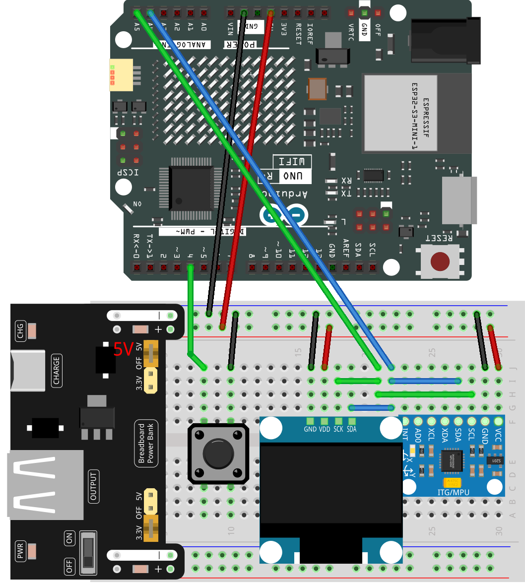

.. _accel3d:

Accel3D
==============================================================

.. note::
  
  🌟 Welcome to the SunFounder Facebook Community! Whether you're into Raspberry Pi, Arduino, or ESP32, you'll find inspiration, help ideas here.
   
  - ✅ Be the first to get free learning resources. 
   
  - ✅ Stay updated on new products & exclusive giveaways. 
   
  - ✅ Share your creations and get real feedback.
   
  * 👉 Need faster updates or support? Click [|link_sf_facebook|] join our Facebook community 

  * 👉 Or join our WhatsApp group: Click [|link_sf_whatsapp|]
   
  * 🎁 Looking for parts?Check out our all-in-one kits below — packed with components, beginner-friendly guides, and tons of fun.
  
  .. list-table::
    :widths: 20 20 20
    :header-rows: 1

    *   - Name	
        - Includes Arduino board
        - PURCHASE LINK
    *   - Elite Explorer Kit	
        - Arduino Uno R4 WiFi
        - |link_elite_buy|
    *   - Ultimate Sensor Kit	
        - Arduino Uno R4 Minima
        - |link_arduinor4_buy|
    *   - Universal Maker Sensor Kit
        - ×
        - |link_umsk_buy|

Course Introduction
------------------------

In this lesson, you'll use an MPU6050 motion sensor, an OLED display, and a button with the Arduino to create an interactive 3D shape viewer.

By tilting the device, you can monitor live accelerometer data and watch a cube or pyramid rotate on the screen. Pressing the button switches between the two shapes, while real-time plots display X and Y acceleration values for visual feedback.

.. .. raw:: html

..  <iframe width="700" height="394" src="https://www.youtube.com/embed/KkPsawETYfg?si=4nMpy4ZNZjKVSooc" title="YouTube video player" frameborder="0" allow="accelerometer; autoplay; clipboard-write; encrypted-media; gyroscope; picture-in-picture; web-share" referrerpolicy="strict-origin-when-cross-origin" allowfullscreen></iframe>

.. note::

  If this is your first time working with an Arduino project, we recommend downloading and reviewing the basic materials first.

  * :ref:`install_arduino`
  * :ref:`introduce_arduino`

**Required Components**

In this project, we need the following components:

.. list-table::
    :widths: 5 20 5 20
    :header-rows: 1

    *   - SN
        - COMPONENT INTRODUCTION	
        - QUANTITY
        - PURCHASE LINK

    *   - 1
        - Arduino UNO R4 Minima
        - 1
        - |link_unor4_buy|
    *   - 2
        - USB Type-C cable
        - 1
        - 
    *   - 3
        - Breadboard
        - 1
        - |link_breadboard_buy|
    *   - 4
        - Wires
        - Several
        - |link_wires_buy|
    *   - 5
        - Button
        - 1
        - |link_button_buy|
    *   - 6
        - OLED Display Module
        - 1
        - |link_oled_buy|
    *   - 7
        - MPU6050 Module
        - 1
        - |link_mpu6050_buy|

**Wiring**

**Common Connections:**

* **OLED Display Module**

  - **SDA:** Connect to **A4** on the Arduino.
  - **SCK:** Connect to **A5** on the Arduino.
  - **GND:** Connect to breadboard’s negative power bus.
  - **VCC:** Connect to breadboard’s red power bus.

* **Button**

  - Connect to the breadboard’s negative power bus, and the other end to **4** on the Arduino board.

* **MPU6050**

  - **SDA:** Connect to **A4** on the Arduino.
  - **SCL:** Connect to **A5** on the Arduino.
  - **GND:** Connect to breadboard’s negative power bus.
  - **VCC:** Connect to breadboard’s red power bus.

**Writing the Code**

.. note::

    * You can copy this code into **Arduino IDE**. 
    * To install the library, use the Arduino Library Manager and search for **Adafruit SSD1306** and **Adafruit GFX** and **MPU6050** and install it.
    * Don't forget to select the board(Arduino UNO R4 Minima) and the correct port before clicking the **Upload** button.

.. code-block:: arduino

      #include <Wire.h>
      #include <Adafruit_GFX.h>
      #include <Adafruit_SSD1306.h>
      #include <Adafruit_MPU6050.h>

      #define SCREEN_WIDTH 128
      #define SCREEN_HEIGHT 64
      #define OLED_RESET -1
      #define BUTTON_PIN 4

      Adafruit_SSD1306 display(SCREEN_WIDTH, SCREEN_HEIGHT, &Wire, OLED_RESET);
      Adafruit_MPU6050 mpu;

      bool isCube = true;
      bool lastButtonState = HIGH;

      float ax, ay, az;

      #define PLOT_START_X 90
      int plotDataX[SCREEN_WIDTH - PLOT_START_X];
      int plotDataY[SCREEN_WIDTH - PLOT_START_X];

      const int cubePoints[8][3] = {
        {-15, -15, -15}, {15, -15, -15}, {15, 15, -15}, {-15, 15, -15},
        {-15, -15, 15}, {15, -15, 15}, {15, 15, 15}, {-15, 15, 15}
      };

      const int pyramidPoints[5][3] = {
        {0, -20, 0},
        {15, 15, -15},
        {15, 15, 15},
        {-15, 15, 15},
        {-15, 15, -15}
      };

      void setup() {
        pinMode(BUTTON_PIN, INPUT_PULLUP);
        
        Wire.begin();
        if (!display.begin(SSD1306_SWITCHCAPVCC, 0x3C)) {
          while (1);
        }
        display.clearDisplay();

        if (!mpu.begin()) {
          while (1);
        }
        mpu.setAccelerometerRange(MPU6050_RANGE_8_G);
        mpu.setGyroRange(MPU6050_RANGE_500_DEG);
        mpu.setFilterBandwidth(MPU6050_BAND_5_HZ);

        for (int i = 0; i < SCREEN_WIDTH - PLOT_START_X; i++) {
          plotDataX[i] = SCREEN_HEIGHT / 2;
          plotDataY[i] = SCREEN_HEIGHT / 2;
        }
      }

      void loop() {
        handleButton();
        readMPU();

        display.clearDisplay();
        drawStats();
        draw3DShape();
        drawPacketMonitor();
        display.display();
      }

      void handleButton() {
        bool currentButtonState = digitalRead(BUTTON_PIN);
        if (currentButtonState == LOW && lastButtonState == HIGH) {
          isCube = !isCube;
        }
        lastButtonState = currentButtonState;
      }

      void readMPU() {
        sensors_event_t a, g, temp;
        mpu.getEvent(&a, &g, &temp);
        ax = a.acceleration.x;
        ay = a.acceleration.y;
        az = a.acceleration.z;
      }

      void drawStats() {
        display.setTextSize(1);
        display.setTextColor(SSD1306_WHITE);
        display.setCursor(0, 0);
        display.print("X:");
        display.print(ax, 1);
        display.setCursor(0, 8);
        display.print("Y:");
        display.print(ay, 1);
        display.setCursor(0, 16);
        display.print("Z:");
        display.print(az, 1);
      }

      void draw3DShape() {
        float angleX = millis() * 0.001;
        float angleY = millis() * 0.0015;

        if (isCube) {
          for (int i = 0; i < 8; i++) {
            for (int j = i + 1; j < 8; j++) {
              if (isConnectedCube(i, j)) {
                drawLine3D(cubePoints[i], cubePoints[j], angleX, angleY);
              }
            }
          }
        } else {
          for (int i = 0; i < 5; i++) {
            for (int j = i + 1; j < 5; j++) {
              if (isConnectedPyramid(i, j)) {
                drawLine3D(pyramidPoints[i], pyramidPoints[j], angleX, angleY);
              }
            }
          }
        }
      }

      bool isConnectedCube(int i, int j) {
        int edges[12][2] = {
          {0,1},{1,2},{2,3},{3,0},
          {4,5},{5,6},{6,7},{7,4},
          {0,4},{1,5},{2,6},{3,7}
        };
        for (int k = 0; k < 12; k++) {
          if ((edges[k][0] == i && edges[k][1] == j) || (edges[k][0] == j && edges[k][1] == i)) {
            return true;
          }
        }
        return false;
      }

      bool isConnectedPyramid(int i, int j) {
        int edges[8][2] = {
          {0,1},{0,2},{0,3},{0,4},
          {1,2},{2,3},{3,4},{4,1}
        };
        for (int k = 0; k < 8; k++) {
          if ((edges[k][0] == i && edges[k][1] == j) || (edges[k][0] == j && edges[k][1] == i)) {
            return true;
          }
        }
        return false;
      }

      void drawLine3D(const int p1[3], const int p2[3], float angleX, float angleY) {
        int x0, y0, x1, y1;
        project(p1, angleX, angleY, x0, y0);
        project(p2, angleX, angleY, x1, y1);
        display.drawLine(x0, y0, x1, y1, SSD1306_WHITE);
      }

      void project(const int point[3], float angleX, float angleY, int &x, int &y) {
        float x1 = point[0];
        float y1 = point[1] * cos(angleX) - point[2] * sin(angleX);
        float z1 = point[1] * sin(angleX) + point[2] * cos(angleX);

        float x2 = x1 * cos(angleY) + z1 * sin(angleY);
        float y2 = y1;
        float z2 = -x1 * sin(angleY) + z1 * cos(angleY);

        float scale = 90.0 / (z2 + 90); // Larger shapes
        x = (int)(x2 * scale) + 55; // Centered right
        y = (int)(y2 * scale) + SCREEN_HEIGHT/2;
      }

      void drawPacketMonitor() {
        for (int i = 0; i < SCREEN_WIDTH - PLOT_START_X - 1; i++) {
          plotDataX[i] = plotDataX[i+1];
          plotDataY[i] = plotDataY[i+1];
        }

        int newX = map((int)(ax * 10.0), -100, 100, 0, SCREEN_HEIGHT/2 - 1);
        int newY = map((int)(ay * 10.0), -100, 100, 0, SCREEN_HEIGHT/2 - 1);
        
        newX = constrain(newX, 0, SCREEN_HEIGHT/2 - 1);
        newY = constrain(newY, 0, SCREEN_HEIGHT/2 - 1);

        plotDataX[SCREEN_WIDTH - PLOT_START_X - 1] = newX;
        plotDataY[SCREEN_WIDTH - PLOT_START_X - 1] = newY;

        // Draw top monitor for X
        for (int i = 0; i < SCREEN_WIDTH - PLOT_START_X; i++) {
          int x = PLOT_START_X + i;
          display.drawFastVLine(x, 0 + (SCREEN_HEIGHT/4 - plotDataX[i]/2), plotDataX[i]/2, SSD1306_WHITE);
        }

        // Draw bottom monitor for Y
        for (int i = 0; i < SCREEN_WIDTH - PLOT_START_X; i++) {
          int x = PLOT_START_X + i;
          display.drawFastVLine(x, SCREEN_HEIGHT/2 + (SCREEN_HEIGHT/4 - plotDataY[i]/2), plotDataY[i]/2, SSD1306_WHITE);
        }
      }