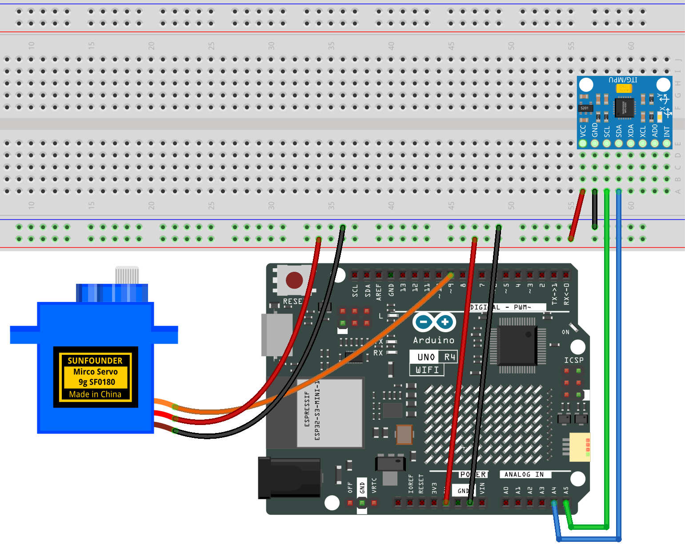

.. _angle_controller:

Angle Controller
==============================================================

.. note::
  
  🌟 Welcome to the SunFounder Facebook Community! Whether you're into Raspberry Pi, Arduino, or ESP32, you'll find inspiration, help ideas here.
   
  - ✅ Be the first to get free learning resources. 
   
  - ✅ Stay updated on new products & exclusive giveaways. 
   
  - ✅ Share your creations and get real feedback.
   
  * 👉 Need faster updates or support? Click [|link_sf_facebook|] join our Facebook community 

  * 👉 Or join our WhatsApp group: Click [|link_sf_whatsapp|]
   
  * 🎁 Looking for parts?Check out our all-in-one kits below — packed with components, beginner-friendly guides, and tons of fun.
  
  .. list-table::
    :widths: 20 20 20
    :header-rows: 1

    *   - Name	
        - Includes Arduino board
        - PURCHASE LINK
    *   - Ultimate Sensor Kit
        - Arduino Uno R4 Minima
        - |link_ultimate_sensor_buy|
    *   - Elite Explorer Kit	
        - Arduino Uno R4 WiFi
        - |link_elite_buy|
    *   - 3 in 1 Ultimate Starter Kit	
        - Arduino Uno R4 Minima
        - |link_arduinor4_buy|
    *   - Universal Maker Sensor Kit
        - ×
        - |link_umsk_buy|

Course Introduction
------------------------

In this lesson, you’ll learn how to use the MPU6050 module with the Arduino to control a servo motor.

In this setup, the servo’s angle changes according to the tilt of the MPU6050 sensor. As you tilt the module, the Arduino reads the pitch angle and smoothly adjusts the servo position based on the sensor’s orientation.

.. .. raw:: html

..  <iframe width="700" height="394" src="https://www.youtube.com/embed/begRxqybzGA?si=fvQztEa8NYXPeAe0" title="YouTube video player" frameborder="0" allow="accelerometer; autoplay; clipboard-write; encrypted-media; gyroscope; picture-in-picture; web-share" referrerpolicy="strict-origin-when-cross-origin" allowfullscreen></iframe>

.. note::

  If this is your first time working with an Arduino project, we recommend downloading and reviewing the basic materials first.

  * :ref:`install_arduino`
  * :ref:`introduce_arduino`

**Required Components**

In this project, we need the following components:

.. list-table::
    :widths: 5 20 5 20
    :header-rows: 1

    *   - SN
        - COMPONENT INTRODUCTION	
        - QUANTITY
        - PURCHASE LINK

    *   - 1
        - Arduino UNO R4 WIFI
        - 1
        - |link_unor4_wifi_buy|
    *   - 2
        - USB Type-C cable
        - 1
        - 
    *   - 3
        - Breadboard
        - 1
        - |link_breadboard_buy|
    *   - 4
        - Wires
        - Several
        - |link_wires_buy|
    *   - 5
        - Digital Servo Motor
        - 1
        - |link_motor_buy|
    *   - 6
        - MPU6050 Module
        - 1
        - |link_mpu6050_buy|

**Wiring**

**Common Connections:**

* **Digital Servo Motor**

  - Connect to breadboard’s positive power bus.
  - Connect to breadboard’s negative power bus.
  - Connect to **9** on the Arduino.

* **MPU6050**

  - **SDA:** Connect to **A4** on the Arduino.
  - **SCL:** Connect to **A5** on the Arduino.
  - **GND:** Connect to breadboard’s negative power bus.
  - **VCC:** Connect to breadboard’s red power bus.

**Writing the Code**

.. note::

    * You can copy this code into **Arduino IDE**. 
    * To install the library, use the Arduino Library Manager and search for **Adafruit_MPU6050** , **Adafruit_Sensor** and install it.
    * Don't forget to select the board(Arduino UNO R4 WIFI) and the correct port before clicking the **Upload** button.

.. code-block:: arduino

      #include <Wire.h>
      #include <Adafruit_MPU6050.h>
      #include <Adafruit_Sensor.h>
      #include <Servo.h>
      #include <math.h>

      // Create MPU6050 object
      Adafruit_MPU6050 mpu;
      // Create Servo object
      Servo servo;

      const int servoPin = 9;    // Pin for servo signal
      const int samples = 25;    // Number of readings to average

      // Map a float from one range to another
      float mapFloat(float x, float in_min, float in_max, float out_min, float out_max) {
        return (x - in_min) * (out_max - out_min) / (in_max - in_min) + out_min;
      }

      // Compute Euclidean distance of two values
      float distVal(float a, float b) {
        return sqrt(a * a + b * b);
      }

      // Calculate rotation around Y axis (pitch) in degrees
      float getYRotation(float ax, float ay, float az) {
        float radians = atan2(ax, distVal(ay, az));
        return -degrees(radians);  // Negate to match original orientation
      }

      void setup() {
        Serial.begin(115200);
        Wire.begin();

        if (!mpu.begin()) {
          Serial.println("MPU6050 initialization failed");
          while (1) {
            delay(10);
          }
        }
        Serial.println("MPU6050 initialized");

        // Set sensor ranges and filter
        mpu.setAccelerometerRange(MPU6050_RANGE_8_G);
        mpu.setGyroRange(MPU6050_RANGE_500_DEG);
        mpu.setFilterBandwidth(MPU6050_BAND_21_HZ);

        // Attach servo to pin
        servo.attach(servoPin);
        delay(100);  // Allow sensor to stabilize
      }

      void loop() {
        float totalAngle = 0;

        // Take multiple readings and sum their angles
        for (int i = 0; i < samples; i++) {
          sensors_event_t accel, gyro, temp;
          mpu.getEvent(&accel, &gyro, &temp);
          float angleY = getYRotation(accel.acceleration.x,
                                      accel.acceleration.y,
                                      accel.acceleration.z);
          totalAngle += angleY;
          // Optional small delay (e.g., delay(5);) for even sampling intervals
        }

        // Compute average angle
        float avgAngle = totalAngle / samples;

        // Map from [-90, 90] to [180, 0] for reversed direction
        float servoAngle = mapFloat(avgAngle, -90.0, 90.0, 180.0, 0.0);
        servoAngle = constrain(servoAngle, 0.0, 180.0);

        // Move servo
        servo.write((int)servoAngle);

        // Print debug info
        Serial.print("Avg Y Angle: ");
        Serial.print(avgAngle);
        Serial.print("  ->  Servo Angle: ");
        Serial.println(servoAngle);

        delay(100);  // Update every 100 ms
      }
