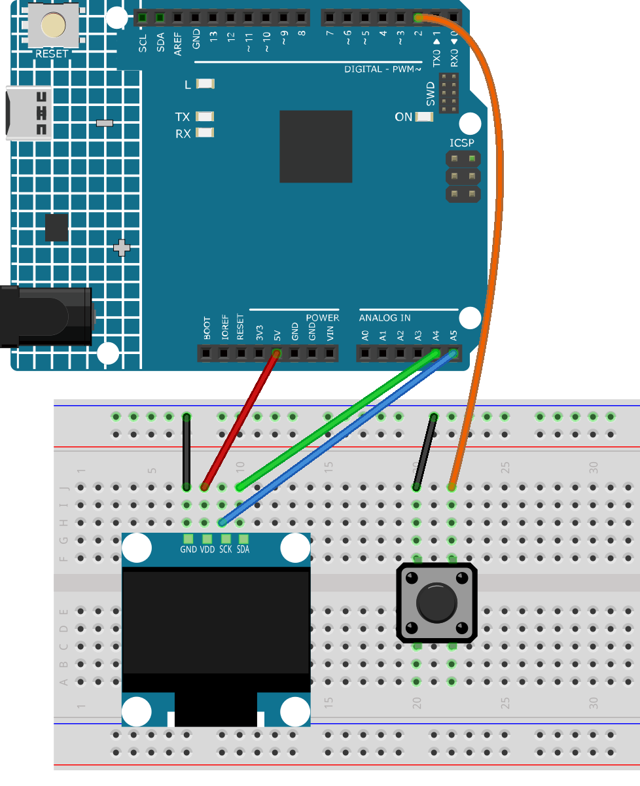

.. _ardu_bird:

Ardu Bird
==============================================================

.. note::
  
  🌟 Welcome to the SunFounder Facebook Community! Whether you're into Raspberry Pi, Arduino, or ESP32, you'll find inspiration, help ideas here.
   
  - ✅ Be the first to get free learning resources. 
   
  - ✅ Stay updated on new products & exclusive giveaways. 
   
  - ✅ Share your creations and get real feedback.
   
  * 👉 Need faster updates or support? Click [|link_sf_facebook|] join our Facebook community 

  * 👉 Or join our WhatsApp group: Click [|link_sf_whatsapp|]
   
Kit purchase
------------------------

Looking for parts? Check out our all-in-one kits below — packed with components, beginner-friendly guides, and tons of fun.

.. image:: img/elite_explore_kit.png
   :width: 100%
   :align: center
   :target: https://www.sunfounder.com/collections/arduino-kits-bundles/products/sunfounder-elite-explorer-kit-with-official-arduino-uno-r4-wifi?ref=jbzmncle

.. raw:: html

     

.. list-table::
   :widths: 20 20 20
   :header-rows: 1

   * - Name
     - Includes Arduino board
     - PURCHASE LINK
   * - Ultimate Sensor Kit
     - Arduino Uno R4 Minima
     - |link_ultimate_sensor_buy|
   * - Elite Explorer Kit
     - Arduino Uno R4 WiFi
     - |link_elite_buy|
   * - 3 in 1 Ultimate Starter Kit
     - Arduino Uno R4 Minima
     - |link_arduinor4_buy|
   * - Universal Maker Sensor Kit
     - ×
     - |link_umsk_buy|

Course Introduction
------------------------

This Arduino project uses an OLED display, Button to play a classic Flappy Bird game with Button-controlled moves.

.. raw:: html

  <iframe width="700" height="394" src="https://www.youtube.com/embed/R25iKgi3pnk?si=Zbt8vk2p3y-_QJS3" title="YouTube video player" frameborder="0" allow="accelerometer; autoplay; clipboard-write; encrypted-media; gyroscope; picture-in-picture; web-share" referrerpolicy="strict-origin-when-cross-origin" allowfullscreen></iframe>

.. note::

  If this is your first time working with an Arduino project, we recommend downloading and reviewing the basic materials first.

  * :ref:`install_arduino`
  * :ref:`introduce_arduino`

**Required Components**

In this project, we need the following components:

.. list-table::
    :widths: 5 20 5 20
    :header-rows: 1

    *   - SN
        - COMPONENT INTRODUCTION	
        - QUANTITY
        - PURCHASE LINK

    *   - 1
        - Arduino UNO R4 Minima/Arduino UNO R4 WIFI
        - 1
        - |link_unor4_buy|
    *   - 2
        - USB Type-C cable
        - 1
        - 
    *   - 3
        - Breadboard
        - 1
        - |link_breadboard_buy|
    *   - 4
        - Wires
        - Several
        - |link_wires_buy|
    *   - 5
        - Button
        - 1
        - |link_button_buy|
    *   - 6
        - OLED Display Module
        - 1
        - |link_oled_buy|

**Wiring**

**Common Connections:**

* **OLED Display Module**

  - **SDA:** Connect to **A4** on the Arduino.
  - **SCK:** Connect to **A5** on the Arduino.
  - **GND:** Connect to breadboard’s negative power bus.
  - **VCC:** Connect to breadboard’s red power bus.

* **Button**

  - Connect to the breadboard’s negative power bus, and the other end to **2** on the Arduino board.

**Writing the Code**

.. note::

    * You can copy this code into **Arduino IDE**. 
    * To install the library, use the Arduino Library Manager and search for **Adafruit_GFX** and **Adafruit SSD1306** and install it.
    * Don't forget to select the board(Arduino UNO R4 Minima) and the correct port before clicking the **Upload** button.

.. code-block:: arduino

      #include <Arduino.h>
      #include <Wire.h>
      #include <Adafruit_GFX.h>
      #include <Adafruit_SSD1306.h>

      // OLED display settings
      const int SCREEN_WIDTH = 128;
      const int SCREEN_HEIGHT = 64;
      const int OLED_RESET = -1;
      const int SCREEN_ADDRESS = 0x3C; // I2C address of the display, see datasheet
      Adafruit_SSD1306 display(SCREEN_WIDTH, SCREEN_HEIGHT, &Wire, OLED_RESET);

      const bool DEBUG_PRINT = false;  // set to true for debug output in Serial Monitor

      // Button & physics
      const int BUTTON_PIN = 2; // push button on digital pin 2
      const int SCALE_FACTOR = 10;  // scale factor 10 for more precise movement
      const int GRAVITY = 5; // gravity applied to the character each frame
      const int JUMP_STRENGTH = -25; // jump acceleration when push button is pressed
      const int PIPE_WIDTH = 15 * SCALE_FACTOR; // pipes are 15px wide on display
      const int PIPE_GAP = 30 * SCALE_FACTOR; // gap in pipes 30px high
      const int PIPE_SPEED = 10; // side scroll speed
      const int PIPE_SPACING = 65 * SCALE_FACTOR;  // default spacing between 2 pipes

      // Size of player sprite
      const int BIRD_WIDTH_PX = 10;
      const int BIRD_HEIGHT_PX = 8;

      // Game variables
      int birdY; // vertical position of the player (scaled by SCALE_FACTOR)
      float velocity = 0; // combined vertical velocity of the player (scaled)
      bool gameOver = false;
      int score = 0;
      unsigned long frameCounter = 0;
      unsigned long gameOverTime = 0;

      // Game state
      enum GameState { STARTSCREEN,
                      HIGHSCORE,
                      PLAYING };
      GameState gameState = STARTSCREEN;

      // Data type for a pipe (x-position, height of the upper part)
      struct Pipe {
        int x;
        int height;
      };

      // Maximum 3 pipes simultaneously
      const int MAX_PIPES = 3;
      Pipe pipes[MAX_PIPES];

      // Highscore
      long highscores[5] = {};
      int newHighscoreIndex = -1;
      unsigned long highscoreTime = 0;
      bool showBlink = true;
      unsigned long lastBlinkTime = 0;

      // Framerate control
      const int FRAME_TIME = 40;  // 40ms per frame = 25 FPS
      unsigned long lastFrameTime = 0;

      // Graphics for player sprite
      // converted from PNG with https://javl.github.io/image2cpp/

      // 'bird1', 10x8px
      const uint8_t epd_bitmap_bird1[] PROGMEM = {
        0x0e, 0x00, 0x15, 0x00, 0x60, 0x80, 0x81, 0x80, 0xfc, 0xc0, 0xfb, 0x80, 0x71, 0x00, 0x1e, 0x00
      };
      // 'bird2', 10x8px
      const uint8_t epd_bitmap_bird2[] PROGMEM = {
        0x0e, 0x00, 0x15, 0x00, 0x70, 0x80, 0xf9, 0x80, 0xfc, 0xc0, 0x83, 0x80, 0x71, 0x00, 0x1e, 0x00
      };

      // Array of all bitmaps for convenience. (Total bytes used to store images in PROGMEM = 64)
      const int epd_bitmap_allArray_LEN = 2;
      const uint8_t* epd_bitmap_allArray[2] = {
        epd_bitmap_bird1,
        epd_bitmap_bird2
      };

      void setup() {
        Serial.begin(9600);

        pinMode(BUTTON_PIN, INPUT_PULLUP);
        randomSeed(analogRead(A0)); // use A0 on UNO R4 cores

        // IMPORTANT for UNO R4:
        // Keep using the default Wire() instance; wiring remains as provided.
        // Initialize display or pause on error
        if (!display.begin(SSD1306_SWITCHCAPVCC, SCREEN_ADDRESS)) {
          Serial.println(F("SSD1306 allocation failed"));
          while (1) {
            delay(100);
          }
        }

        gameState = STARTSCREEN;  
      }

      void loop() {
        unsigned long currentTime = millis();

        // ensure that the next frame is only calculated after FRAME_TIME
        if (currentTime - lastFrameTime < FRAME_TIME) return;
        lastFrameTime = currentTime;
        frameCounter++;

        switch (gameState) {
          case STARTSCREEN:
            renderStartScreen();
            if (anyKeyPressed()) {
              resetGame(); // reset variables
              gameState = PLAYING; // start game
            }
            break;

          case PLAYING:
            if (gameOver) {
              // after game over, automatically switch to highscore screen after 3 seconds
              if (millis() - gameOverTime > 3000) {  
                gameState = HIGHSCORE;
                highscoreTime = millis();
              }
              // or player presses button (1 sec pause), then start new game immediately
              if ((millis() - gameOverTime > 1000) && anyKeyPressed()) {
                resetGame();
                gameState = PLAYING;
              }
            } else {
              // if button pressed, add negative acceleration (upwards)
              if (digitalRead(BUTTON_PIN) == LOW) velocity = JUMP_STRENGTH;
              velocity += GRAVITY; // apply gravity
              velocity = constrain(velocity, -50.0f, 50.0f); // limit velocity to prevent too fast falling or rising

              // calculate player position
              birdY += (int)velocity;
              // if player at top (y=0), do not go off screen
              if (birdY < 0) birdY = 0;

              if (DEBUG_PRINT) {
                Serial.print("Vel: ");
                Serial.println(velocity);
              }

              movePipes();
              checkCollision();
            }
            drawGame();
            break;

          case HIGHSCORE:
            renderHighscoreScreen();
            // after 8 seconds without button press, switch to start screen
            if (millis() - gameOverTime > 8000) {
              gameState = STARTSCREEN;
            }
            // or start new game if button pressed
            if (anyKeyPressed()) {
              resetGame();
              gameState = PLAYING;
            }
            break;
        }
      }

      // PULLUP logic: LOW means pressed
      bool anyKeyPressed() {
        return digitalRead(BUTTON_PIN) == LOW;
      }

      // ---- Reset game ---- //
      void resetGame() {
        // set start position of the player to 1/5 of the screen height
        birdY = SCREEN_HEIGHT * SCALE_FACTOR / 5;
        velocity = 0;
        score = 0;
        gameOver = false;

        // create first pipe just outside the screen edge
        pipes[0].x = SCREEN_WIDTH * SCALE_FACTOR;

        pipes[0].height = generatePipeHeight();
        // create pipes 2 and 3 with random variation in spacing
        for (int i = 1; i < MAX_PIPES; i++) {
          pipes[i].x = SCREEN_WIDTH * SCALE_FACTOR + i * PIPE_SPACING + random(-20, 20) * SCALE_FACTOR;
          pipes[i].height = generatePipeHeight();
        }
      }

      // generate random height of the upper pipe section,
      // leaving at least space for gap and 10px for lower part
      int generatePipeHeight() {
        return random(10 * SCALE_FACTOR, SCREEN_HEIGHT * SCALE_FACTOR - PIPE_GAP - 10 * SCALE_FACTOR);
      }

      // move pipes toward the player
      void movePipes() {

        int currentSpeed = PIPE_SPEED + score; // pipes move faster and faster

        for (int i = 0; i < MAX_PIPES; i++) {
          // move pipe position left by currentSpeed
          pipes[i].x -= currentSpeed;

          // if pipe leaves the left edge, immediately create a new pipe at the right edge
          if (pipes[i].x < -PIPE_WIDTH) {
            pipes[i].x = findFurthestPipe() + PIPE_SPACING + random(-20, 20) * SCALE_FACTOR;  // place new pipe far right
            pipes[i].height = random(10 * SCALE_FACTOR, SCREEN_HEIGHT * SCALE_FACTOR - PIPE_GAP - 10 * SCALE_FACTOR);
            score++;
          }
        }
      }

      // helper function to find the pipe farthest to the right
      int findFurthestPipe() {
        int maxX = 0;
        for (int i = 0; i < MAX_PIPES; i++) {
          if (pipes[i].x > maxX) {
            maxX = pipes[i].x;
          }
        }
        return maxX;
      }

      // ---- Collision detection ---- //
      void checkCollision() {

        // collision check with a 2px smaller hitbox (Collision Forgiveness),
        // because the player is more round → avoids unfair edge hits
        for (int i = 0; i < MAX_PIPES; i++) {
          // check if the player overlaps horizontally with a pipe 
          if (pipes[i].x < (15 + 2) * SCALE_FACTOR && pipes[i].x + PIPE_WIDTH > (15 - 2) * SCALE_FACTOR) {
            // check if the player hits the pipe vertically (top or bottom)
            if ((birdY - 2 * SCALE_FACTOR) < pipes[i].height || (birdY + 2 * SCALE_FACTOR) > pipes[i].height + PIPE_GAP) {
              gameOver = true;
              gameOverTime = millis();
              saveHighscores(score);
            }
          }
        }

        // if player below the screen bottom
        if (birdY >= SCREEN_HEIGHT * SCALE_FACTOR) {
          gameOver = true;
          gameOverTime = millis();
          saveHighscores(score);
        }
      }

      // ---- Draw game ---- //
      void drawGame() {
        display.clearDisplay();

        drawBird();
        drawPipes();
        drawScore();

        if (gameOver) displayGameOver();  // if game over, display overlay

        display.display();
      }

      void drawBird() {
        int birdFrame = (frameCounter / 5) % 2;
        display.drawBitmap(15 - BIRD_WIDTH_PX / 2, birdY / SCALE_FACTOR - BIRD_HEIGHT_PX / 2,
                          epd_bitmap_allArray[birdFrame], BIRD_WIDTH_PX, BIRD_HEIGHT_PX, SSD1306_WHITE);
      }

      void drawPipes() {
        for (int pipeIndex = 0; pipeIndex < MAX_PIPES; pipeIndex++) {
          int pipeX = pipes[pipeIndex].x / SCALE_FACTOR;
          int upperPipeHeight = pipes[pipeIndex].height / SCALE_FACTOR;
          int gapHeight = PIPE_GAP / SCALE_FACTOR;
          int lowerPipeY = upperPipeHeight + gapHeight;
          int lowerPipeHeight = SCREEN_HEIGHT - lowerPipeY;    
          int pipeWidth = PIPE_WIDTH / SCALE_FACTOR;

          // upper pipe segment (vertical)
          display.fillRect(pipeX, 0, pipeWidth, upperPipeHeight - 6, SSD1306_WHITE);
          // pipe head top (horizontal cap)
          display.fillRect(pipeX - 2, upperPipeHeight - 6, pipeWidth + 4, 6, SSD1306_WHITE);
          // pipe head bottom (horizontal cap below gap)
          display.fillRect(pipeX - 2, lowerPipeY, pipeWidth + 4, 6, SSD1306_WHITE);
          // lower pipe segment (vertical)
          display.fillRect(pipeX, lowerPipeY + 6, pipeWidth, lowerPipeHeight - 6, SSD1306_WHITE);
        }
      }

      // show current score at top right of display
      void drawScore() {
        display.setTextSize(1);
        display.setTextColor(SSD1306_WHITE);
        display.setCursor(110, 2);
        display.print(score);
      }

      // ---- Show start screen ---- //
      void renderStartScreen() {
        display.clearDisplay();
        display.setTextSize(2);
        display.setTextColor(SSD1306_WHITE);
        display.setCursor(10, 20);
        display.println("Ardu Bird");
        display.setTextSize(1);
        display.setCursor(20, 40);
        display.println("Press to start");
        display.display();
      }

      // ---- Show Game Over ---- //
      void displayGameOver() {
        display.fillRect(20, 5, SCREEN_WIDTH - 40, SCREEN_HEIGHT - 10, SSD1306_WHITE);
        display.setTextColor(SSD1306_BLACK);
        display.setTextSize(1);
        display.setCursor(38, 10);
        display.println("GAME OVER");
        display.setCursor(35, 20);
        display.println("Your score");

        int16_t x1, y1;
        uint16_t textWidth, textHeight;
        char scoreBuffer[10];               // buffer for number as string
        sprintf(scoreBuffer, "%d", score);  // convert number to string
        display.setTextSize(2);
        display.getTextBounds(scoreBuffer, 0, 0, &x1, &y1, &textWidth, &textHeight);  // calculate text width for centering
        display.setCursor(64 - textWidth / 2, 36);
        display.println(scoreBuffer);
      }

      // ---- Show Highscore list ---- //
      void renderHighscoreScreen() {
        display.clearDisplay();
        display.setTextSize(1);
        display.setTextColor(SSD1306_WHITE);
        display.setCursor(25, 2);
        display.println("HIGHSCORES");
        display.setTextSize(1);

        // current achieved score should blink if in Top10, blink status changes every 100ms
        if (millis() - lastBlinkTime > 100) {
          showBlink = !showBlink;
          lastBlinkTime = millis();
        }

        for (int i = 0; i < 5; i++) {
          if (i == newHighscoreIndex && !showBlink) {
            continue;
          }
          display.setCursor(30, 14 + (i * 9));
          display.print(i + 1);
          display.print(".    ");
          display.print(highscores[i]);
        }
        display.display();
      }

      // ---- Save highscores ---- //
      void saveHighscores(int newScore) {
        newHighscoreIndex = -1;
        for (int i = 0; i < 5; i++) {
          if (newScore > highscores[i]) {
            for (int j = 4; j > i; j--) {
              highscores[j] = highscores[j - 1];
            }
            highscores[i] = newScore;
            newHighscoreIndex = i;
            break;
          }
        }
      }
