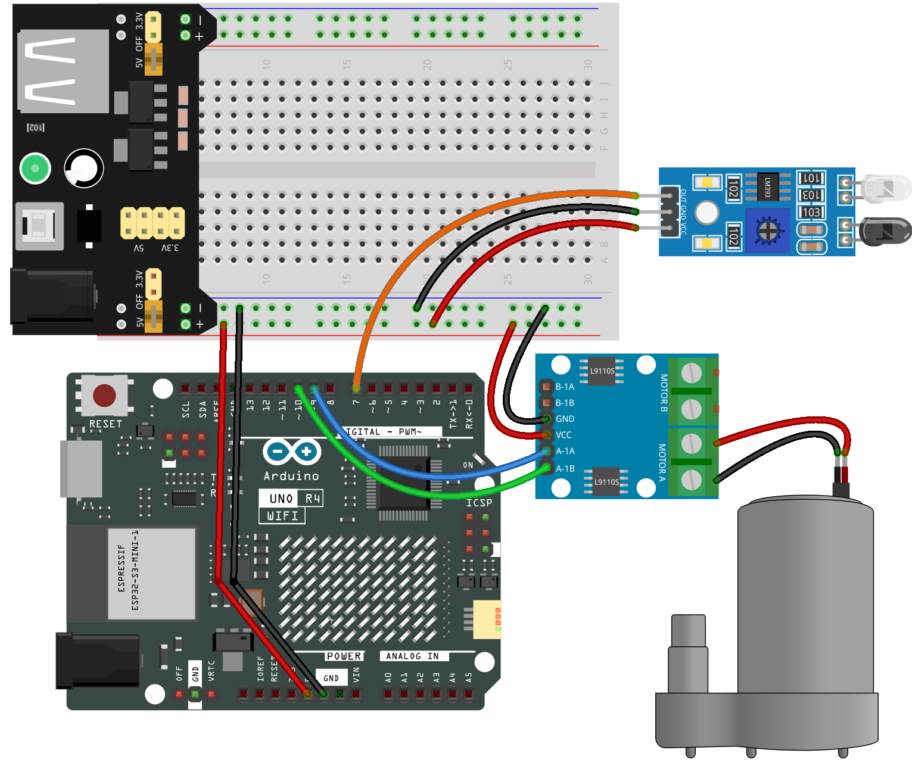

.. _auto_sanitizer:

Auto Sanitizer
==============================================================

.. note::
  
  🌟 Welcome to the SunFounder Facebook Community! Whether you're into Raspberry Pi, Arduino, or ESP32, you'll find inspiration, help ideas here.
   
  - ✅ Be the first to get free learning resources. 
   
  - ✅ Stay updated on new products & exclusive giveaways. 
   
  - ✅ Share your creations and get real feedback.
   
  * 👉 Need faster updates or support? Click [|link_sf_facebook|] join our Facebook community 

  * 👉 Or join our WhatsApp group: Click [|link_sf_whatsapp|]
   
Kit purchase
------------------------

Looking for parts? Check out our all-in-one kits below — packed with components, beginner-friendly guides, and tons of fun.

.. image:: img/elite_explore_kit.png
   :width: 100%
   :align: center
   :target: https://www.sunfounder.com/collections/arduino-kits-bundles/products/sunfounder-elite-explorer-kit-with-official-arduino-uno-r4-wifi?ref=jbzmncle

.. raw:: html

     

.. list-table::
   :widths: 20 20 20
   :header-rows: 1

   * - Name
     - Includes Arduino board
     - PURCHASE LINK
   * - Ultimate Sensor Kit
     - Arduino Uno R4 Minima
     - |link_ultimate_sensor_buy|
   * - Elite Explorer Kit
     - Arduino Uno R4 WiFi
     - |link_elite_buy|
   * - 3 in 1 Ultimate Starter Kit
     - Arduino Uno R4 Minima
     - |link_arduinor4_buy|
   * - Universal Maker Sensor Kit
     - ×
     - |link_umsk_buy|

Course Introduction
------------------------

This program uses an Arduino Uno board with an infrared obstacle avoidance sensor and a water pump.

The sensor is used to detect the presence of an object. 

When an object is detected, the water pump is activated to dispense liquid (liquid hand soap).

.. raw:: html
 
  <iframe width="700" height="394" src="https://www.youtube.com/embed/m6IWfwi86zo?si=vTmoHKBtbDE7Vwzw" title="YouTube video player" frameborder="0" allow="accelerometer; autoplay; clipboard-write; encrypted-media; gyroscope; picture-in-picture; web-share" referrerpolicy="strict-origin-when-cross-origin" allowfullscreen></iframe>

.. note::

  If this is your first time working with an Arduino project, we recommend downloading and reviewing the basic materials first.
  
  * :ref:`install_arduino`
  * :ref:`introduce_arduino`

**Required Components**

In this project, we need the following components:

.. list-table::
    :widths: 5 20 5 20
    :header-rows: 1

    *   - SN
        - COMPONENT INTRODUCTION	
        - QUANTITY
        - PURCHASE LINK

    *   - 1
        - Arduino UNO R4 WIFI
        - 1
        - |link_unor4_wifi_buy|
    *   - 2
        - USB Type-C cable
        - 1
        - 
    *   - 3
        - Breadboard
        - 1
        - |link_breadboard_buy|
    *   - 4
        - Wires
        - Several
        - |link_wires_buy|
    *   - 5
        - Power Supply
        - 1
        - |link_power_buy|
    *   - 6
        - IR Obstacle Avoidance Sensor Module
        - 1
        - |link_IR_module_buy|
    *   - 7
        - L9110 Motor Driver Module
        - 1
        - 
    *   - 8
        - Centrifugal Pump
        - 1
        - 

**Wiring**

**Common Connections:**

* **L9110 Motor Driver Module**

  - **GND:** Connect to breadboard’s negative power bus.
  - **VCC:** Connect to breadboard’s red power bus.
  - **A-1A:** Connect to **9** on the Arduino.
  - **A-1B:** Connect to **10** on the Arduino.

* **IR Obstacle Avoidance Sensor Module**

  - **OUT:** Connect to **7** on the Arduino.
  - **GND:** Connect to breadboard’s negative power bus.
  - **VCC:** Connect to breadboard’s red power bus.

* **Centrifugal Pump**

  -  Connect to **L9110 Motor Driver Module** MOTOR A.
  -  Connect to **L9110 Motor Driver Module** MOTOR A.

**Writing the Code**

.. note::

    * You can copy this code into **Arduino IDE**. 
    * Don't forget to select the board(Arduino UNO R4 Minima/WIFI) and the correct port before clicking the **Upload** button.

.. code-block:: arduino

      /*
        This program uses an Arduino Uno board with an infrared obstacle avoidance sensor and a water pump.
        The sensor is used to detect the presence of an object. When an object is detected, the water pump
        is activated to dispense liquid (liquid hand soap).

        Board: Arduino Uno R3 (or R4)
        Component: Infrared obstacle avoidance sensor and water pump
      */

      // Define the pin numbers for the Infrared obstacle avoidance sensor
      const int sensorPin = 7;
      int sensorValue;

      // Define pin numbers for the water pump
      const int pump1A = 9;
      const int pump1B = 10;

      void setup() {
        // Set the sensor pin as input
        pinMode(sensorPin, INPUT);

        // Initialize the pump pins as output
        pinMode(pump1A, OUTPUT);    
        pinMode(pump1B, OUTPUT);    

        // Keep pump1B low
        digitalWrite(pump1A, LOW); 
        digitalWrite(pump1B, LOW);  

        Serial.begin(9600);
      }

      void loop() {
        sensorValue = digitalRead(sensorPin);
        Serial.println(sensorValue);

        // If an object is detected, turn on the pump for a brief period, then turn it off
        if (sensorValue == 0) {  
          digitalWrite(pump1A, HIGH);
          delay(700);
          digitalWrite(pump1A, LOW);
          delay(1000);
        }
      }
