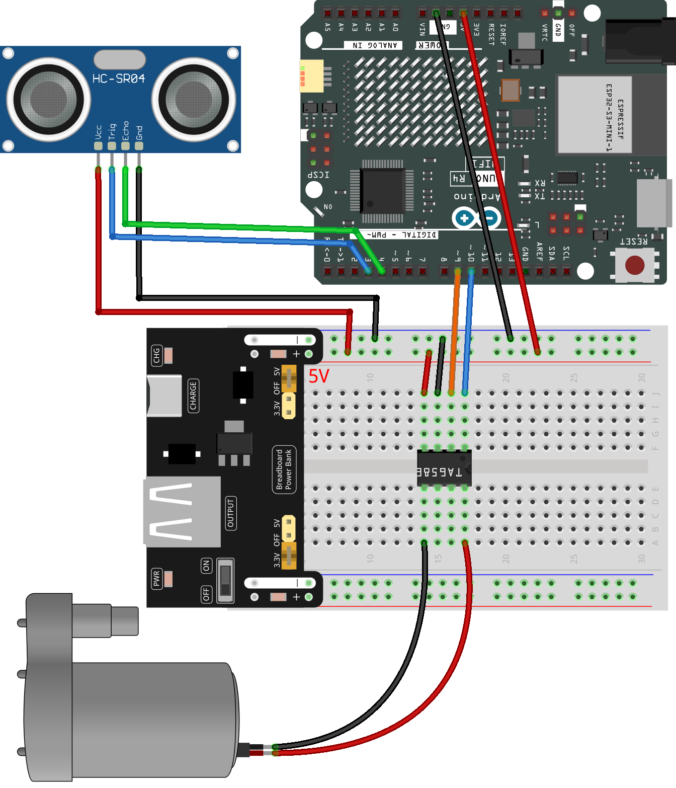

.. _auto_pump:

Auto Pump
==============================================================

.. note::
  
  🌟 Welcome to the SunFounder Facebook Community! Whether you're into Raspberry Pi, Arduino, or ESP32, you'll find inspiration, help ideas here.
   
  - ✅ Be the first to get free learning resources. 
   
  - ✅ Stay updated on new products & exclusive giveaways. 
   
  - ✅ Share your creations and get real feedback.
   
  * 👉 Need faster updates or support? Click [|link_sf_facebook|] join our Facebook community 

  * 👉 Or join our WhatsApp group: Click [|link_sf_whatsapp|]
   
  * 🎁 Looking for parts?Check out our all-in-one kits below — packed with components, beginner-friendly guides, and tons of fun.
  
  .. list-table::
    :widths: 20 20 20
    :header-rows: 1

    *   - Name	
        - Includes Arduino board
        - PURCHASE LINK
    *   - Elite Explorer Kit	
        - Arduino Uno R4 WiFi
        - |link_elite_buy|
    *   - 3 in 1 Ultimate Starter Kit
        - Arduino Uno R4 Minima
        - |link_arduinor4_buy|
    *   - Universal Maker Sensor Kit
        - ×
        - |link_umsk_buy|

Course Introduction
------------------------

This program uses an Arduino Uno board with Ultrasonic Sensor Module and a water pump.

The sensor is used to detect the presence of an object. 

When an object is detected, the water pump is activated to dispense liquid (liquid hand soap).

.. raw:: html
 
  <iframe width="700" height="394" src="https://www.youtube.com/embed/pTUmTnP-Rbo" title="YouTube video player" frameborder="0" allow="accelerometer; autoplay; clipboard-write; encrypted-media; gyroscope; picture-in-picture; web-share" referrerpolicy="strict-origin-when-cross-origin" allowfullscreen></iframe>

.. note::

  If this is your first time working with an Arduino project, we recommend downloading and reviewing the basic materials first.
  
  * :ref:`install_arduino`
  * :ref:`introduce_arduino`

**Required Components**

In this project, we need the following components:

.. list-table::
    :widths: 5 20 5 20
    :header-rows: 1

    *   - SN
        - COMPONENT INTRODUCTION	
        - QUANTITY
        - PURCHASE LINK

    *   - 1
        - Arduino UNO R4 WIFI
        - 1
        - |link_unor4_wifi_buy|
    *   - 2
        - USB Type-C cable
        - 1
        - 
    *   - 3
        - Breadboard
        - 1
        - |link_breadboard_buy|
    *   - 4
        - Wires
        - Several
        - |link_wires_buy|
    *   - 5
        - Power Supply
        - 1
        - |link_power_buy|
    *   - 6
        - Ultrasonic Sensor Module
        - 1
        - |link_ultrasonic_buy|
    *   - 7
        - TA6586 - Motor Driver Chip
        - 1
        - 
    *   - 8
        - Centrifugal Pump
        - 1
        - 

**Wiring**

**Common Connections:**

* **Ultrasonic Sensor Module**

  - **Trig:** Connect to **3** on the Arduino.
  - **Echo:** Connect to **4** on the Arduino.
  - **GND:** Connect to breadboard’s negative power bus.
  - **VCC:** Connect to breadboard’s red power bus.

* **TA6586 - Motor Driver Chip**

  - **BI:** Connect to **10** on the Arduino.
  - **FI:** Connect to **9** on the Arduino.
  - **GND:** Connect to breadboard’s negative power bus.
  - **VCC:** Connect to breadboard’s red power bus.

* **Centrifugal Pump**

  - **GND:** Connect to **TA6586** B0.
  - **VCC:** Connect to **TA6586** F0.

**Writing the Code**

.. note::

    * You can copy this code into **Arduino IDE**. 
    * Don't forget to select the board(Arduino UNO R4 Minima/WIFI) and the correct port before clicking the **Upload** button.

.. code-block:: arduino

      #include <Arduino.h>

      /*
        UNO R4 + Ultrasonic (Echo=D4, Trig=D3) + TA6586 Pump Control
        Behavior:
          - Turn pump ON when distance < ON_THRESHOLD_CM
          - Turn pump OFF when distance > OFF_THRESHOLD_CM (hysteresis)
          - Median-of-5 sampling; pulseIn timeout; min ON/OFF hold times to avoid chattering
      */

      // -------- Pins --------
      // Ultrasonic (you asked to swap): Echo -> D4, Trig -> D3
      const uint8_t ECHO_PIN = 4;
      const uint8_t TRIG_PIN = 3;

      // TA6586 motor driver pins (adjust as wired)
      const uint8_t MOTOR_BI = 9;    // IN1 / Backward input
      const uint8_t MOTOR_FI = 10;   // IN2 / Forward input

      // -------- Tuning --------
      const float    ON_THRESHOLD_CM   = 10.0f;    // pump ON below this
      const float    OFF_THRESHOLD_CM  = 12.0f;    // pump OFF above this (hysteresis)
      const uint8_t  SAMPLES           = 5;        // median-of-5
      const uint32_t PULSE_TIMEOUT_US  = 30000UL;  // 30ms (~5m max), avoid long blocking

      // Minimum hold times to protect the pump from rapid toggling
      const uint32_t MIN_ON_HOLD_MS    = 1500;     // keep ON for at least this long
      const uint32_t MIN_OFF_HOLD_MS   = 800;      // keep OFF for at least this long

      // Optional: ambient temperature (°C) for speed-of-sound correction
      const float AMBIENT_TEMP_C       = 20.0f;

      // -------- State --------
      enum PumpState { PUMP_OFF = 0, PUMP_ON = 1 };
      PumpState pumpState = PUMP_OFF;
      uint32_t lastToggleMs = 0;

      // -------- Pump helpers --------
      void pumpForward() {  // preferred ON direction (swap with pumpReverse() if needed)
        digitalWrite(MOTOR_FI, LOW);
        digitalWrite(MOTOR_BI, HIGH);
      }
      void pumpReverse() {  // alternative ON direction
        digitalWrite(MOTOR_BI, LOW);
        digitalWrite(MOTOR_FI, HIGH);
      }
      void pumpStop() {     // stop (coast). For brake, set both HIGH if datasheet recommends.
        digitalWrite(MOTOR_BI, LOW);
        digitalWrite(MOTOR_FI, LOW);
      }

      // -------- Ultrasonic helpers --------
      float usPerCm() {
        // Speed of sound (m/s) ≈ 331.4 + 0.6*T(°C)
        float v = 331.4f + 0.6f * AMBIENT_TEMP_C; // m/s
        float us_per_m = 1e6f / v;                // µs per meter (one-way)
        return (us_per_m * 0.01f) * 2.0f;         // round-trip µs for 1 cm (~58 at ~20°C)
      }

      float measureOnceCm() {
        // Send 10us trigger pulse
        digitalWrite(TRIG_PIN, LOW);
        delayMicroseconds(2);
        digitalWrite(TRIG_PIN, HIGH);
        delayMicroseconds(10);
        digitalWrite(TRIG_PIN, LOW);

        // Read echo pulse width with timeout
        unsigned long dur = pulseIn(ECHO_PIN, HIGH, PULSE_TIMEOUT_US);
        if (dur == 0) return NAN; // timeout -> invalid reading

        return dur / usPerCm();   // convert to cm
      }

      float readDistanceMedianCm() {
        float vals[SAMPLES];
        for (uint8_t i = 0; i < SAMPLES; i++) {
          vals[i] = measureOnceCm();
          delay(5); // small gap between pings to avoid cross-talk echoes
        }
        // insertion sort (small N) - NANs float to the end
        for (uint8_t i = 1; i < SAMPLES; i++) {
          float key = vals[i];
          int j = i - 1;
          while (j >= 0 && (isnan(vals[j]) || vals[j] > key)) {
            vals[j + 1] = vals[j];
            j--;
          }
          vals[j + 1] = key;
        }
        return vals[SAMPLES / 2]; // median
      }

      // -------- Setup / Loop --------
      void setup() {
        // Ultrasonic
        pinMode(ECHO_PIN, INPUT);
        pinMode(TRIG_PIN, OUTPUT);
        digitalWrite(TRIG_PIN, LOW);

        // Pump driver
        pinMode(MOTOR_BI, OUTPUT);
        pinMode(MOTOR_FI, OUTPUT);
        pumpStop(); // safe default

        // Debug serial
        Serial.begin(115200);
        Serial.println("Ultrasonic + Pump (Echo=D4, Trig=D3) ready.");
      }

      void loop() {
        float d = readDistanceMedianCm();
        uint32_t now = millis();
        bool valid = !isnan(d);

        // Simple state machine with hysteresis and min hold times
        switch (pumpState) {
          case PUMP_OFF:
            if (valid && d < ON_THRESHOLD_CM && (now - lastToggleMs >= MIN_OFF_HOLD_MS)) {
              pumpForward();              // switch to pumpReverse() if direction is wrong
              pumpState = PUMP_ON;
              lastToggleMs = now;
              Serial.println("Pump -> ON");
            }
            break;

          case PUMP_ON:
            if (valid && d > OFF_THRESHOLD_CM && (now - lastToggleMs >= MIN_ON_HOLD_MS)) {
              pumpStop();
              pumpState = PUMP_OFF;
              lastToggleMs = now;
              Serial.println("Pump -> OFF");
            }
            // Optional safety: if invalid for long time, you may force OFF after MIN_ON_HOLD_MS
            // else keep last state to avoid chattering on occasional timeouts.
            break;
        }

        // Debug print
        if (valid) {
          Serial.print("Distance(cm): ");
          Serial.print(d, 1);
          Serial.print(" | State: ");
          Serial.println(pumpState == PUMP_ON ? "ON" : "OFF");
        } else {
          Serial.println("Distance: INVALID (timeout)");
        }

        delay(60); // moderate loop rate
      }
