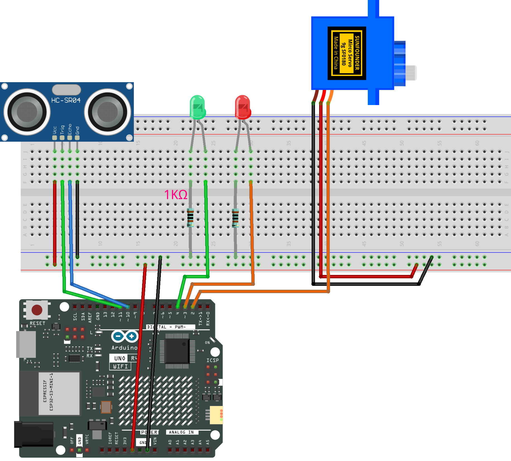

.. _barrier_gate:

Barrier Gate 1.0
==============================================================

.. note::
  
  🌟 Welcome to the SunFounder Facebook Community! Whether you're into Raspberry Pi, Arduino, or ESP32, you'll find inspiration, help ideas here.
   
  - ✅ Be the first to get free learning resources. 
   
  - ✅ Stay updated on new products & exclusive giveaways. 
   
  - ✅ Share your creations and get real feedback
   
  * 👉 Need faster updates or support? Click [|link_sf_facebook|] join our Facebook community 

  * 👉 Or join our WhatsApp group: Click [|link_sf_whatsapp|]
   
  * 🎁 Looking for parts?Check out our all-in-one kits below — packed with components, beginner-friendly guides, and tons of fun.

  .. list-table::
    :widths: 20 20 20
    :header-rows: 1

    *   - Name	
        - Includes Arduino board
        - PURCHASE LINK
    *   - Ultimate Sensor Kit
        - Arduino Uno R4 Minima
        - |link_ultimate_sensor_buy|
    *   - Elite Explorer Kit
        - Arduino Uno R4 WiFi
        - |link_elite_buy|
    *   - 3 in 1 Ultimate Starter Kit
        - Arduino Uno R4 Minima
        - |link_arduinor4_buy|

Course Introduction
------------------------

In this lesson, you'll learn how to use an ultrasonic sensor module, a digital servo motor, and LEDs with the Arduino Board to build an intelligent barrier gate system.

When the barrier is closed, the red LED turns on. If the ultrasonic sensor module detects an approaching vehicle, the digital servo motor raises the barrier, the green LED turns on, and the vehicle is allowed to pass.

.. raw:: html

   <iframe width="700" height="394" src="https://www.youtube.com/embed/FlZ96qVv4mc?si=cBEi63uHd0QD7mHI" title="YouTube video player" frameborder="0" allow="accelerometer; autoplay; clipboard-write; encrypted-media; gyroscope; picture-in-picture; web-share" referrerpolicy="strict-origin-when-cross-origin" allowfullscreen></iframe>

.. note::

  If this is your first time working with an Arduino project, we recommend downloading and reviewing the basic materials first.
  
  * :ref:`install_arduino`
  * :ref:`introduce_arduino`

**Required Components**

In this project, we need the following components:

.. list-table::
    :widths: 5 20 5 20
    :header-rows: 1

    *   - SN
        - COMPONENT INTRODUCTION	
        - QUANTITY
        - PURCHASE LINK

    *   - 1
        - Arduino UNO R4 Minima/Arduino UNO R4 WIFI
        - 1
        - |link_unor4_buy|
    *   - 2
        - USB Type-C cable
        - 1
        - 
    *   - 3
        - Breadboard
        - 1
        - |link_breadboard_buy|
    *   - 4
        - Wires
        - Several
        - |link_wires_buy|
    *   - 5
        - 1kΩ resistor
        - 2
        - |link_resistor_buy|
    *   - 6
        - Ultrasonic Sensor Module
        - 1
        - |link_ultrasonic_buy|
    *   - 7
        - LED
        - 2
        - |link_led_buy|
    *   - 8
        - Digital Servo Motor
        - 1
        - |link_motor_buy|

**Wiring**

**Common Connections:**

* **LED**

  - Connect the LEDs **anode** to a **1kΩ resistor** then to the negative power bus on the breadboard, and the LEDs **cathode** to **3**, **4** on the Arduino.

* **Digital Servo Motor**

  - Connect to breadboard’s positive power bus.
  - Connect to breadboard’s negative power bus.
  - Connect to  **2** on the Arduino.

* **Ultrasonic Sensor Module**

  - **Trig:** Connect to **11** on the Arduino.
  - **Echo:** Connect to **10** on the Arduino.
  - **GND:** Connect to breadboard’s negative power bus.
  - **VCC:** Connect to breadboard’s red power bus.

**Writing the Code**

.. note::

    * You can copy this code into **Arduino IDE**. 
    * Don't forget to select the board(Arduino UNO R4 Minima) and the correct port before clicking the **Upload** button.

.. code-block:: arduino

      #include <Servo.h>

      const int trigPin = 11;     // Trig pin of ultrasonic sensor
      const int echoPin = 10;     // Echo pin of ultrasonic sensor
      const int redLed = 3;       // Red LED pin
      const int greenLed = 4;     // Green LED pin
      const int servoPin = 2;     // Servo signal pin

      Servo barrierServo;         // Create servo object

      bool previousCarDetected = false;  // Record if a car was detected in last loop

      void setup() {
        pinMode(trigPin, OUTPUT);
        pinMode(echoPin, INPUT);
        pinMode(redLed, OUTPUT);
        pinMode(greenLed, OUTPUT);
        barrierServo.attach(servoPin);  // Attach servo to pin
        barrierServo.write(0);          // Start with barrier down
        Serial.begin(9600);             // Start serial monitor
      }

      void loop() {
        long duration, distance;

        // Send ultrasonic pulse
        digitalWrite(trigPin, LOW);
        delayMicroseconds(2);
        digitalWrite(trigPin, HIGH);
        delayMicroseconds(10);
        digitalWrite(trigPin, LOW);

        // Read the time for echo to return
        duration = pulseIn(echoPin, HIGH);
        distance = duration * 0.034 / 2;  // Convert time to distance (cm)

        Serial.print("Distance: ");
        Serial.println(distance);

        // Check if car is within 15 cm
        bool carDetected = (distance > 0 && distance < 15);

        if (carDetected) {
          // Car is detected: raise barrier and turn on green LED
          digitalWrite(redLed, LOW);
          digitalWrite(greenLed, HIGH);
          barrierServo.write(90);
        } else {
          // If car just left: delay before lowering barrier
          if (previousCarDetected) {
            delay(1000); // Wait 1 second before lowering
          }
          // No car: lower barrier and turn on red LED
          digitalWrite(redLed, HIGH);
          digitalWrite(greenLed, LOW);
          barrierServo.write(0);
        }

        previousCarDetected = carDetected; // Update last detection state

        delay(300);  // Small delay before next reading
      }
