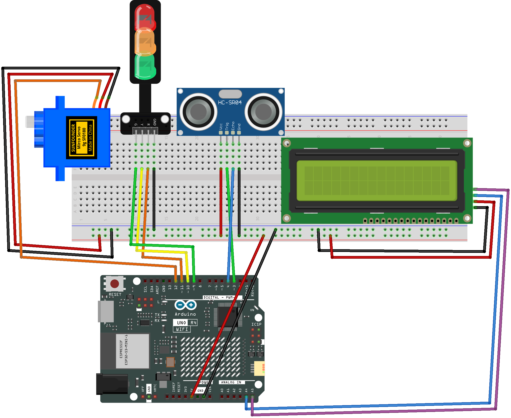

.. _barrier_gate2.0:

Barrier Gate 2.0
==============================================================

.. note::
  
  🌟 Welcome to the SunFounder Facebook Community! Whether you're into Raspberry Pi, Arduino, or ESP32, you'll find inspiration, help ideas here.
   
  - ✅ Be the first to get free learning resources. 
   
  - ✅ Stay updated on new products & exclusive giveaways. 
   
  - ✅ Share your creations and get real feedback.
   
  * 👉 Need faster updates or support? Click [|link_sf_facebook|] join our Facebook community 

  * 👉 Or join our WhatsApp group: Click [|link_sf_whatsapp|]
   
Kit purchase
------------------------

Looking for parts? Check out our all-in-one kits below — packed with components, beginner-friendly guides, and tons of fun.

.. image:: img/elite_explore_kit.png
   :width: 100%
   :align: center
   :target: https://www.sunfounder.com/collections/arduino-kits-bundles/products/sunfounder-elite-explorer-kit-with-official-arduino-uno-r4-wifi?ref=jbzmncle

.. raw:: html

     

.. list-table::
   :widths: 20 20 20
   :header-rows: 1

   * - Name
     - Includes Arduino board
     - PURCHASE LINK
   * - Ultimate Sensor Kit
     - Arduino Uno R4 Minima
     - |link_ultimate_sensor_buy|
   * - Elite Explorer Kit
     - Arduino Uno R4 WiFi
     - |link_elite_buy|
   * - 3 in 1 Ultimate Starter Kit
     - Arduino Uno R4 Minima
     - |link_arduinor4_buy|
   * - Universal Maker Sensor Kit
     - ×
     - |link_umsk_buy|

Course Introduction
------------------------

In this lesson, you'll learn how to use an ultrasonic sensor module, a digital servo motor, and Traffic light LED Module with the Arduino Board to build an intelligent barrier gate system version 2.0.

When the ultrasonic sensor module detects a vehicle, the traffic light will change from red to green, and the gate will rise, allowing the car to pass.

.. raw:: html

  <iframe width="700" height="394" src="https://www.youtube.com/embed/iHSgDp1uMHI?si=xqwuJeHBcI4jQSob" title="YouTube video player" frameborder="0" allow="accelerometer; autoplay; clipboard-write; encrypted-media; gyroscope; picture-in-picture; web-share" referrerpolicy="strict-origin-when-cross-origin" allowfullscreen></iframe>

.. note::

  If this is your first time working with an Arduino project, we recommend downloading and reviewing the basic materials first.
  
  * :ref:`install_arduino`
  * :ref:`introduce_arduino`

**Required Components**

In this project, we need the following components:

.. list-table::
    :widths: 5 20 5 20
    :header-rows: 1

    *   - SN
        - COMPONENT INTRODUCTION	
        - QUANTITY
        - PURCHASE LINK

    *   - 1
        - Arduino UNO R4 Minima/Arduino UNO R4 WIFI
        - 1
        - |link_unor4_wifi_buy|
    *   - 2
        - USB Type-C cable
        - 1
        - 
    *   - 3
        - Breadboard
        - 1
        - |link_breadboard_buy|
    *   - 4
        - Wires
        - Several
        - |link_wires_buy|
    *   - 5
        - Ultrasonic Sensor Module
        - 1
        - |link_ultrasonic_buy|
    *   - 6
        - LED Module
        - 1
        - |link_led_buy|
    *   - 7
        - Digital Servo Motor
        - 1
        - |link_motor_buy|
    *   - 8
        - I2C LCD 1602
        - 1
        - |link_i2clcd1602_buy|
    *   - 9
        - Traffic Light LED
        - 1
        - |link_trafficlinght_buy|

**Wiring**

**Common Connections:**

* **Traffic light LED**

  - **R:** Connect to **11** on the Arduino.
  - **Y:** Connect to **10** on the Arduino.
  - **G:** Connect to **9** on the Arduino.
  - **GND:** Connect to breadboard’s negative power bus.

* **Digital Servo Motor**

  - Connect to breadboard’s positive power bus.
  - Connect to breadboard’s negative power bus.
  - Connect to  **12** on the Arduino.

* **Ultrasonic Sensor Module**

  - **Trig:** Connect to **3** on the Arduino.
  - **Echo:** Connect to **4** on the Arduino.
  - **GND:** Connect to breadboard’s negative power bus.
  - **VCC:** Connect to breadboard’s red power bus.

* **I2C LCD 1602**

  - **SDA:** Connect to **A4** on the Arduino.
  - **SCL:** Connect to **A5** on the Arduino.
  - **GND:** Connect to breadboard’s negative power bus.
  - **VCC:** Connect to breadboard’s red power bus.

**Writing the Code**

.. note::

    * You can copy this code into **Arduino IDE**. 
    * To install the library, use the Arduino Library Manager and search for **LiquidCrystal I2C** and install it.
    * Don't forget to select the board(Arduino UNO R4 Minima/WIFI) and the correct port before clicking the **Upload** button.

.. code-block:: arduino

      #include <Servo.h>
      #include <Wire.h>
      #include <LiquidCrystal_I2C.h>

      // Define pin connections
      const int trigPin = 3;
      const int echoPin = 4;
      const int redPin = 11;
      const int yellowPin = 10;
      const int greenPin = 9;
      const int servoPin = 12;

      // Create LCD and Servo objects
      Servo myServo;
      LiquidCrystal_I2C lcd(0x27, 16, 2); // 16x2 I2C LCD

      void setup() {
        Serial.begin(9600);

        pinMode(trigPin, OUTPUT);
        pinMode(echoPin, INPUT);
        pinMode(redPin, OUTPUT);
        pinMode(yellowPin, OUTPUT);
        pinMode(greenPin, OUTPUT);

        myServo.attach(servoPin);
        myServo.write(90); // Start with gate closed

        lcd.init();
        lcd.backlight();
        lcd.clear();
        lcd.setCursor(2, 0);  // Center "System Ready"
        lcd.print("System Ready");
        delay(1000);
      }

      void loop() {
        // Send ultrasonic pulse
        digitalWrite(trigPin, LOW);
        delayMicroseconds(2);
        digitalWrite(trigPin, HIGH);
        delayMicroseconds(10);
        digitalWrite(trigPin, LOW);

        // Measure duration of echo
        long duration = pulseIn(echoPin, HIGH);
        float distance = duration * 0.034 / 2;

        Serial.print("Distance: ");
        Serial.print(distance);
        Serial.println(" cm");

        if (distance < 10) {  // Vehicle detected
          digitalWrite(redPin, LOW);
          digitalWrite(yellowPin, HIGH);
          digitalWrite(greenPin, LOW);
          myServo.write(90); // Keep gate closed

          lcd.clear();
          lcd.setCursor(2, 0);  // Center "Please Wait"
          lcd.print("Please Wait");

          delay(1000); // Wait 1 seconds with yellow light

          digitalWrite(yellowPin, LOW);
          digitalWrite(greenPin, HIGH);
          myServo.write(0); // Open gate

          lcd.clear();
          lcd.setCursor(1, 0);  // Center "You Can Pass!"
          lcd.print("You Can Pass!");

          delay(1500); // Wait 1.5 seconds with green light

          digitalWrite(greenPin, LOW);
          digitalWrite(redPin, HIGH);
          myServo.write(90); // Close gate

          lcd.clear();
          lcd.setCursor(4, 0);  // Center "Welcome"
          lcd.print("Welcome");
        } else {
          digitalWrite(redPin, HIGH);
          digitalWrite(yellowPin, LOW);
          digitalWrite(greenPin, LOW);
          myServo.write(90); // Keep gate closed

          lcd.clear();
          lcd.setCursor(4, 0);  // Center "Welcome"
          lcd.print("Welcome");
        }

        delay(300); // Small delay before next reading
      }
