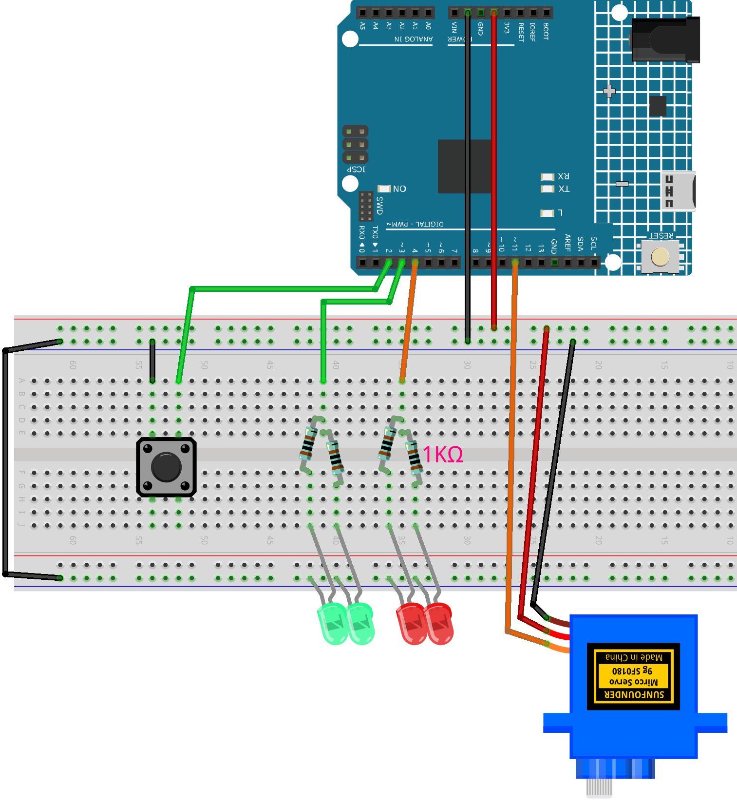

.. _barrier_gate3.0:

Barrier Gate 3.0
==============================================================

.. note::
  
  🌟 Welcome to the SunFounder Facebook Community! Whether you're into Raspberry Pi, Arduino, or ESP32, you'll find inspiration, help ideas here.
   
  - ✅ Be the first to get free learning resources. 
   
  - ✅ Stay updated on new products & exclusive giveaways. 
   
  - ✅ Share your creations and get real feedback.
   
  * 👉 Need faster updates or support? Click [|link_sf_facebook|] join our Facebook community 

  * 👉 Or join our WhatsApp group: Click [|link_sf_whatsapp|]
   
  * 🎁 Looking for parts?Check out our all-in-one kits below — packed with components, beginner-friendly guides, and tons of fun.

  .. list-table::
    :widths: 20 20 20
    :header-rows: 1

    *   - Name	
        - Includes Arduino board
        - PURCHASE LINK
    *   - Ultimate Sensor Kit
        - Arduino Uno R4 Minima
        - |link_ultimate_sensor_buy|
    *   - Elite Explorer Kit
        - Arduino Uno R4 WiFi
        - |link_elite_buy|
    *   - 3 in 1 Ultimate Starter Kit
        - Arduino Uno R4 Minima
        - |link_arduinor4_buy|

Course Introduction
------------------------

In this lesson, you'll use a button, a traffic light LED module, and a servo motor with the Arduino to simulate a manual barrier gate system.

When the button is pressed, the red light turns off, the green light turns on, and the gate opens briefly to let a car pass.

.. .. raw:: html

..  <iframe width="700" height="394" src="https://www.youtube.com/embed/iHSgDp1uMHI?si=xqwuJeHBcI4jQSob" title="YouTube video player" frameborder="0" allow="accelerometer; autoplay; clipboard-write; encrypted-media; gyroscope; picture-in-picture; web-share" referrerpolicy="strict-origin-when-cross-origin" allowfullscreen></iframe>

.. note::

  If this is your first time working with an Arduino project, we recommend downloading and reviewing the basic materials first.
  
  * :ref:`install_arduino`
  * :ref:`introduce_arduino`

**Required Components**

In this project, we need the following components:

.. list-table::
    :widths: 5 20 5 20
    :header-rows: 1

    *   - SN
        - COMPONENT INTRODUCTION	
        - QUANTITY
        - PURCHASE LINK

    *   - 1
        - Arduino UNO R4 Minima/Arduino UNO R4 WIFI
        - 1
        - |link_unor4_buy|
    *   - 2
        - USB Type-C cable
        - 1
        - 
    *   - 3
        - Breadboard
        - 1
        - |link_breadboard_buy|
    *   - 4
        - Wires
        - Several
        - |link_wires_buy|
    *   - 5
        - Button
        - 1
        - |link_button_buy|
    *   - 6
        - Digital Servo Motor
        - 1
        - |link_motor_buy|
    *   - 7
        - LED
        - 4
        - |link_led_buy|
    *   - 8
        - 1kΩ resistor
        - 4
        - |link_resistor_buy|

**Wiring**

**Common Connections:**

* **LED**

  - Connect the LEDs **cathode** to the negative power bus on the breadboard, and the LEDs **anode** to a **1kΩ resistor** then to **3**, **4** on the Arduino.

* **Digital Servo Motor**

  - Connect to breadboard’s positive power bus.
  - Connect to breadboard’s negative power bus.
  - Connect to  **11** on the Arduino.

* **Button**

  - Connect to breadboard’s negative power bus.
  - Connect to **2** on the Arduino.

**Writing the Code**

.. note::

    * You can copy this code into **Arduino IDE**. 
    * Don't forget to select the board(Arduino UNO R4 Minima/WIFI) and the correct port before clicking the **Upload** button.

.. code-block:: arduino

      #include <Servo.h>

      const int buttonPin = 2;     // Button connected to digital pin 2
      const int greenLed  = 3;     // Green LED connected to digital pin 3
      const int redLed    = 4;     // Red LED connected to digital pin 4
      const int servoPin  = 12;    // Servo signal connected to digital pin 12

      Servo barrierServo;

      void setup() {
        pinMode(buttonPin, INPUT_PULLUP);  // Enable internal pull-up on button pin
        pinMode(greenLed,  OUTPUT);
        pinMode(redLed,    OUTPUT);

        barrierServo.attach(servoPin);     // Attach servo to pin 12
        barrierServo.write(0);             // Start with barrier closed (0°)

        digitalWrite(redLed,   HIGH);      // Turn on red LED initially
        digitalWrite(greenLed, LOW);       // Turn off green LED initially

        Serial.begin(9600);                // For debugging
      }

      void loop() {
        // Check if button is pressed (active LOW)
        if (digitalRead(buttonPin) == LOW) {
          Serial.println("Button pressed: Opening barrier");

          digitalWrite(redLed,   LOW);      // Turn off red LED
          digitalWrite(greenLed, HIGH);     // Turn on green LED
          barrierServo.write(90);           // Raise barrier to 90°
          delay(2000);                      // Wait for 2 seconds

          barrierServo.write(0);            // Lower barrier back to 0°
          digitalWrite(greenLed, LOW);      // Turn off green LED
          digitalWrite(redLed,   HIGH);     // Turn on red LED
        }

        delay(100); // Short delay to debounce
      }
