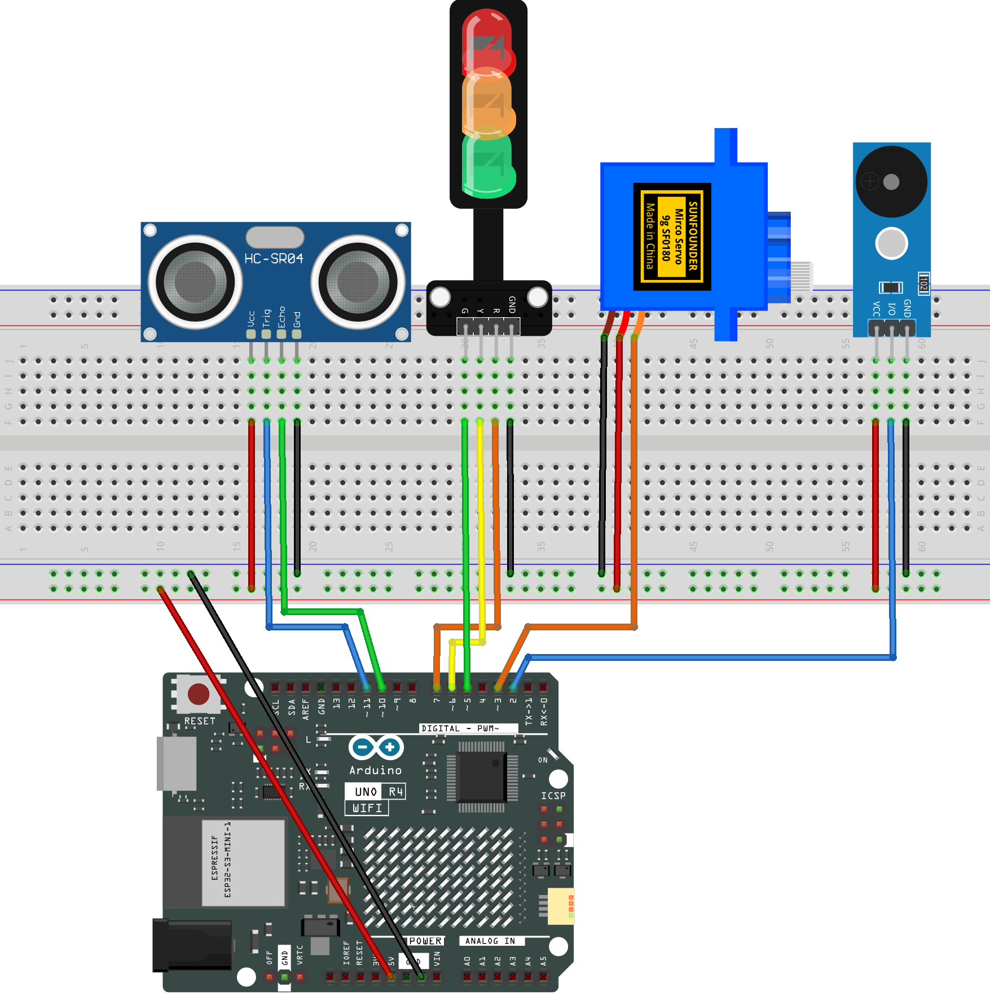

.. _barrier_gate4.0:

Barrier Gate 4.0
==============================================================

.. note::
  
  🌟 Welcome to the SunFounder Facebook Community! Whether you're into Raspberry Pi, Arduino, or ESP32, you'll find inspiration, help ideas here.
   
  - ✅ Be the first to get free learning resources. 
   
  - ✅ Stay updated on new products & exclusive giveaways. 
   
  - ✅ Share your creations and get real feedback.
   
  * 👉 Need faster updates or support? Click [|link_sf_facebook|] join our Facebook community 

  * 👉 Or join our WhatsApp group: Click [|link_sf_whatsapp|]
   
Kit purchase
------------------------

Looking for parts? Check out our all-in-one kits below — packed with components, beginner-friendly guides, and tons of fun.

.. image:: img/elite_explore_kit.png
   :width: 100%
   :align: center
   :target: https://www.sunfounder.com/collections/arduino-kits-bundles/products/sunfounder-elite-explorer-kit-with-official-arduino-uno-r4-wifi?ref=jbzmncle

.. raw:: html

     

.. list-table::
   :widths: 20 20 20
   :header-rows: 1

   * - Name
     - Includes Arduino board
     - PURCHASE LINK
   * - Ultimate Sensor Kit
     - Arduino Uno R4 Minima
     - |link_ultimate_sensor_buy|
   * - Elite Explorer Kit
     - Arduino Uno R4 WiFi
     - |link_elite_buy|
   * - 3 in 1 Ultimate Starter Kit
     - Arduino Uno R4 Minima
     - |link_arduinor4_buy|
   * - Universal Maker Sensor Kit
     - ×
     - |link_umsk_buy|

Course Introduction
------------------------

This project uses an ultrasonic sensor, traffic lights, a servo, and a buzzer to create an automatic gate system. 

When a car is detected, the lights change, the gate opens, and the buzzer signals. After the car passes, the gate closes and the red light turns back on.

.. raw:: html

  <iframe width="700" height="394" src="https://www.youtube.com/embed/6tNxSz5Q9aM?si=UmyFr0Xp0Oky8hMg" title="YouTube video player" frameborder="0" allow="accelerometer; autoplay; clipboard-write; encrypted-media; gyroscope; picture-in-picture; web-share" referrerpolicy="strict-origin-when-cross-origin" allowfullscreen></iframe>

.. note::

  If this is your first time working with an Arduino project, we recommend downloading and reviewing the basic materials first.
  
  * :ref:`install_arduino`
  * :ref:`introduce_arduino`

**Required Components**

In this project, we need the following components:

.. list-table::
    :widths: 5 20 5 20
    :header-rows: 1

    *   - SN
        - COMPONENT INTRODUCTION	
        - QUANTITY
        - PURCHASE LINK

    *   - 1
        - Arduino UNO R4 Minima/Arduino UNO R4 WIFI
        - 1
        - |link_unor4_buy|
    *   - 2
        - USB Type-C cable
        - 1
        - 
    *   - 3
        - Breadboard
        - 1
        - |link_breadboard_buy|
    *   - 4
        - Wires
        - Several
        - |link_wires_buy|
    *   - 5
        - Traffic Light LED
        - 1
        - |link_trafficlinght_buy|
    *   - 6
        - Digital Servo Motor
        - 1
        - |link_motor_buy|
    *   - 7
        - Buzzer Modudle
        - 1
        - |link_buzzer_module_buy|
    *   - 8
        - Ultrasonic Sensor Module
        - 1
        - |link_ultrasonic_buy|

**Wiring**

**Common Connections:**

* **Traffic light LED**

  - **R:** Connect to **7** on the Arduino.
  - **Y:** Connect to **6** on the Arduino.
  - **G:** Connect to **5** on the Arduino.
  - **GND:** Connect to breadboard’s negative power bus.

* **Digital Servo Motor**

  - Connect to breadboard’s positive power bus.
  - Connect to breadboard’s negative power bus.
  - Connect to  **3** on the Arduino.

* **Ultrasonic Sensor Module**

  - **Trig:** Connect to **11** on the Arduino.
  - **Echo:** Connect to **10** on the Arduino.
  - **GND:** Connect to breadboard’s negative power bus.
  - **VCC:** Connect to breadboard’s red power bus.

* **Buzzer Module**

  - **I/0:** Connect to **2** on the Arduino.
  - **＋:** Connect to breadboard’s red power bus. 
  - **－:** Connect to breadboard’s negative power bus.

**Writing the Code**

.. note::

    * You can copy this code into **Arduino IDE**. 
    * Don't forget to select the board(Arduino UNO R4 Minima/WIFI) and the correct port before clicking the **Upload** button.

.. code-block:: arduino

      #include <Servo.h>

      // Ultrasonic sensor pins
      const int trigPin = 11;
      const int echoPin = 10;

      // Traffic light pins
      const int redPin = 7;
      const int yellowPin = 6;
      const int greenPin = 5;

      // Servo and buzzer pins
      const int servoPin = 3;
      const int buzzerPin = 2;

      Servo myServo;

      // Play one beep
      void beepOnce(int freq, int dur) {
        tone(buzzerPin, freq, dur);
        delay(dur * 1.2);
        noTone(buzzerPin);
      }

      // Play three short beeps
      void beepTriple() {
        for (int i = 0; i < 3; i++) {
          tone(buzzerPin, 1500, 120);
          delay(150);
          noTone(buzzerPin);
          delay(80);
        }
      }

      // Smoothly open the gate
      void openGate() {
        for (int pos = 0; pos <= 90; pos++) {
          myServo.write(pos);
          delay(10);   // smooth speed
        }
      }

      // Smoothly close the gate
      void closeGate() {
        for (int pos = 90; pos >= 0; pos--) {
          myServo.write(pos);
          delay(10);
        }
      }

      // Read distance once
      float getDistance() {
        digitalWrite(trigPin, LOW);
        delayMicroseconds(2);
        digitalWrite(trigPin, HIGH);
        delayMicroseconds(10);
        digitalWrite(trigPin, LOW);

        long duration = pulseIn(echoPin, HIGH, 25000); // 25ms timeout
        if (duration == 0) return 999;                 // no echo

        return duration * 0.034 / 2;
      }

      void setup() {
        Serial.begin(9600);

        pinMode(trigPin, OUTPUT);
        pinMode(echoPin, INPUT);

        pinMode(redPin, OUTPUT);
        pinMode(yellowPin, OUTPUT);
        pinMode(greenPin, OUTPUT);

        pinMode(buzzerPin, OUTPUT);

        myServo.attach(servoPin);
        myServo.write(0);   // gate starts closed

        digitalWrite(redPin, HIGH); // red ON at start
      }

      void loop() {

        float distance = getDistance();
        Serial.print("Distance: ");
        Serial.println(distance);

        // Car detected
        if (distance < 10) {

          // Yellow + warning beep
          digitalWrite(redPin, LOW);
          digitalWrite(yellowPin, HIGH);
          digitalWrite(greenPin, LOW);
          beepOnce(1000, 300);

          delay(1000);

          // Green light + open gate
          digitalWrite(yellowPin, LOW);
          digitalWrite(greenPin, HIGH);

          openGate();       // smooth motion (no ultrasonic during movement)
          beepTriple();     // pass signal

          delay(1500);

          // Red light + close gate
          digitalWrite(greenPin, LOW);
          digitalWrite(redPin, HIGH);

          closeGate();      // smooth motion
          beepOnce(800, 200);

          delay(500);
        }

        delay(200);   // small delay between checks
      }
