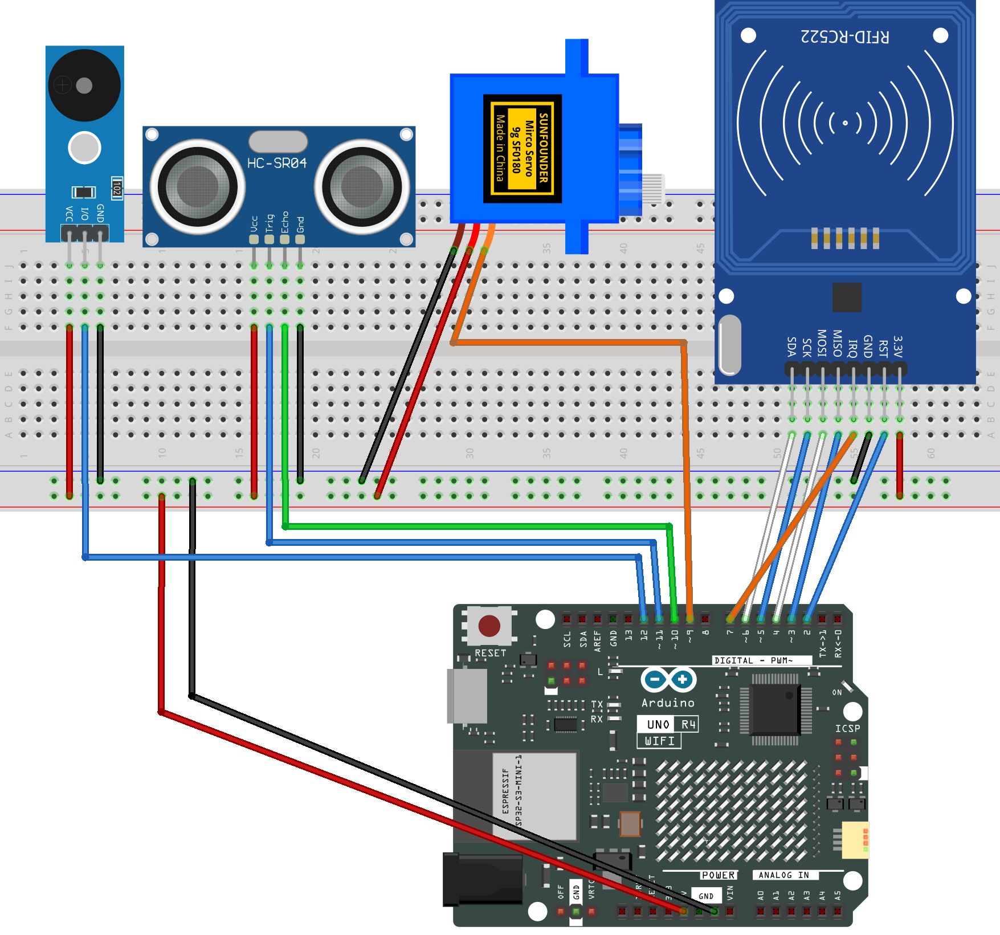

.. _barrier_gate5.0:

Barrier Gate 5.0
==============================================================

.. note::
  
  🌟 Welcome to the SunFounder Facebook Community! Whether you're into Raspberry Pi, Arduino, or ESP32, you'll find inspiration, help ideas here.
   
  - ✅ Be the first to get free learning resources. 
   
  - ✅ Stay updated on new products & exclusive giveaways. 
   
  - ✅ Share your creations and get real feedback.
   
  * 👉 Need faster updates or support? Click [|link_sf_facebook|] join our Facebook community 

  * 👉 Or join our WhatsApp group: Click [|link_sf_whatsapp|]
   
Kit purchase
------------------------

Looking for parts? Check out our all-in-one kits below — packed with components, beginner-friendly guides, and tons of fun.

.. image:: img/elite_explore_kit.png
   :width: 100%
   :align: center
   :target: https://www.sunfounder.com/collections/arduino-kits-bundles/products/sunfounder-elite-explorer-kit-with-official-arduino-uno-r4-wifi?ref=jbzmncle

.. raw:: html

     

.. list-table::
   :widths: 20 20 20
   :header-rows: 1

   * - Name
     - Includes Arduino board
     - PURCHASE LINK
   * - Ultimate Sensor Kit
     - Arduino Uno R4 Minima
     - |link_ultimate_sensor_buy|
   * - Elite Explorer Kit
     - Arduino Uno R4 WiFi
     - |link_elite_buy|
   * - 3 in 1 Ultimate Starter Kit
     - Arduino Uno R4 Minima
     - |link_arduinor4_buy|
   * - Universal Maker Sensor Kit
     - ×
     - |link_umsk_buy|

Course Introduction
------------------------

This project uses an ultrasonic sensor, MFRC522 Module, a servo, and a buzzer to create an automatic gate system. 

.. raw:: html

   <iframe width="700" height="394" src="https://www.youtube.com/embed/dH0Zgg6Uj0k?si=CFuYw1t-4MbNgd4k" title="YouTube video player" frameborder="0" allow="accelerometer; autoplay; clipboard-write; encrypted-media; gyroscope; picture-in-picture; web-share" referrerpolicy="strict-origin-when-cross-origin" allowfullscreen></iframe>

.. note::

  If this is your first time working with an Arduino project, we recommend downloading and reviewing the basic materials first.
  
  * :ref:`install_arduino`
  * :ref:`introduce_arduino`

**Required Components**

In this project, we need the following components:

.. list-table::
    :widths: 5 20 5 20
    :header-rows: 1

    *   - SN
        - COMPONENT INTRODUCTION	
        - QUANTITY
        - PURCHASE LINK

    *   - 1
        - Arduino UNO R4 Minima/Arduino UNO R4 WIFI
        - 1
        - |link_unor4_wifi_buy|
    *   - 2
        - USB Type-C cable
        - 1
        - 
    *   - 3
        - Breadboard
        - 1
        - |link_breadboard_buy|
    *   - 4
        - Wires
        - Several
        - |link_wires_buy|
    *   - 5
        - MFRC522 Module
        - 1
        - |link_mfrc522_module_buy|
    *   - 6
        - Digital Servo Motor
        - 1
        - |link_motor_buy|
    *   - 7
        - Buzzer Modudle
        - 1
        - |link_buzzer_module_buy|
    *   - 8
        - Ultrasonic Sensor Module
        - 1
        - |link_ultrasonic_buy|

**Wiring**

**Common Connections:**

* **MFRC522 Module**

  - **SDA:** Connect to **6** on the Arduino.
  - **SCK:** Connect to **5** on the Arduino.
  - **MOSI:** Connect to **4** on the Arduino.
  - **MISO:** Connect to **3** on the Arduino.
  - **IRQ:** Connect to **7** on the Arduino.
  - **GND:** Connect to breadboard’s negative power bus.
  - **RST:** Connect to **2** on the Arduino.
  - **3.3V:** Connect to breadboard’s passive power bus.

* **Digital Servo Motor**

  - Connect to breadboard’s positive power bus.
  - Connect to breadboard’s negative power bus.
  - Connect to  **9** on the Arduino.

* **Ultrasonic Sensor Module**

  - **Trig:** Connect to **11** on the Arduino.
  - **Echo:** Connect to **10** on the Arduino.
  - **GND:** Connect to breadboard’s negative power bus.
  - **VCC:** Connect to breadboard’s red power bus.

* **Buzzer Module**

  - **I/0:** Connect to **12** on the Arduino.
  - **＋:** Connect to breadboard’s red power bus. 
  - **－:** Connect to breadboard’s negative power bus.

**Writing the Code**

.. note::

    * You can copy this code into **Arduino IDE**. 
    * The ``RFID1`` library is used here. You can click here :download:`RFID1.zip </_static/RFID1.zip>` to download it.
    * Don't forget to select the board(Arduino UNO R4 Minima/WIFI) and the correct port before clicking the **Upload** button.

.. code-block:: arduino

      #include <Servo.h>
      #include <rfid1.h>

      // Ultrasonic sensor pins
      const int trigPin = 11;
      const int echoPin = 10;

      // Servo motor pin
      const int servoPin = 9;

      // Buzzer pin
      const int buzzerPin = 12;

      // RFID module
      RFID1 rfid;

      // Length of RFID UID (4 bytes)
      #define ID_LEN 4

      // Authorized card UID
      uchar userId[ID_LEN] = {0x33, 0xF8, 0xB8, 0x1A};

      // Buffer for scanned UID
      uchar userIdRead[ID_LEN];

      // Distance settings (cm)
      const int ENTRY_DISTANCE = 12;   // Detect vehicle approaching
      const int CLEAR_DISTANCE = 25;   // Detect vehicle leaving
      const int CLEAR_COUNT    = 7;    // About 1 second (7 × 150 ms)

      // Minimum time the gate stays open (ms)
      const unsigned long MIN_OPEN_TIME = 2000;

      // System states
      enum GateMode {
        WAIT_ENTRY,   // Waiting for vehicle to enter (ultrasonic)
        WAIT_EXIT     // Waiting for vehicle to exit (RFID)
      };

      GateMode mode = WAIT_ENTRY;

      // Servo object
      Servo myServo;

      // Play a simple beep sound
      void beepOnce(int freq, int dur) {
        tone(buzzerPin, freq, dur);
        delay(dur * 1.2);
        noTone(buzzerPin);
      }

      // Beep sound for unauthorized card
      void beepError() {
        for (int i = 0; i < 2; i++) {
          tone(buzzerPin, 800);
          delay(120);
          noTone(buzzerPin);
          delay(80);
        }
      }

      // Open the gate smoothly
      void openGate() {
        for (int pos = 0; pos <= 90; pos++) {
          myServo.write(pos);
          delay(10);
        }
      }

      // Close the gate smoothly
      void closeGate() {
        for (int pos = 90; pos >= 0; pos--) {
          myServo.write(pos);
          delay(10);
        }
      }

      // Measure distance using ultrasonic sensor (cm)
      float getDistance() {
        digitalWrite(trigPin, LOW);
        delayMicroseconds(2);
        digitalWrite(trigPin, HIGH);
        delayMicroseconds(10);
        digitalWrite(trigPin, LOW);

        long duration = pulseIn(echoPin, HIGH, 25000);
        if (duration == 0) return 999;

        return duration * 0.034 / 2;
      }

      // Read RFID card UID
      bool getId() {
        uchar status, str[MAX_LEN];
        status = rfid.anticoll(str);

        if (status == MI_OK) {
          for (int i = 0; i < ID_LEN; i++) {
            userIdRead[i] = str[i];
          }
          rfid.halt();
          return true;
        }
        return false;
      }

      // Compare scanned UID with authorized UID
      bool idVerify() {
        for (int i = 0; i < ID_LEN; i++) {
          if (userIdRead[i] != userId[i]) return false;
        }
        return true;
      }

      // Clear UID buffer
      void clearBuffer() {
        for (int i = 0; i < ID_LEN; i++) {
          userIdRead[i] = 0;
        }
      }

      void setup() {
        Serial.begin(9600);

        pinMode(trigPin, OUTPUT);
        pinMode(echoPin, INPUT);
        pinMode(buzzerPin, OUTPUT);

        myServo.attach(servoPin);
        myServo.write(0);   // Gate starts closed

        // RFID initialization (pin order must match wiring)
        rfid.begin(7, 5, 4, 3, 6, 2);
        rfid.init();

        Serial.println("System Ready - WAIT_ENTRY");
      }

      void loop() {

        // Entry mode: ultrasonic detection
        if (mode == WAIT_ENTRY) {

          float distance = getDistance();
          Serial.print("Distance: ");
          Serial.println(distance);

          if (distance < ENTRY_DISTANCE) {

            beepOnce(1000, 200);
            openGate();

            // Wait until the vehicle completely leaves
            int clearCounter = 0;
            while (clearCounter < CLEAR_COUNT) {
              float d = getDistance();

              if (d > CLEAR_DISTANCE)
                clearCounter++;
              else
                clearCounter = 0;

              delay(150);
            }

            closeGate();
            mode = WAIT_EXIT;
            delay(500);
          }
        }

        // Exit mode: RFID verification
        else if (mode == WAIT_EXIT) {

          uchar status, str[MAX_LEN];
          status = rfid.request(PICC_REQIDL, str);

          if (status == MI_OK) {

            clearBuffer();

            if (getId() && idVerify()) {

              beepOnce(1500, 150);
              openGate();

              // Keep gate open for a minimum time
              unsigned long openTime = millis();
              while (millis() - openTime < MIN_OPEN_TIME) {
                delay(50);
              }

              // Wait until the vehicle leaves
              int clearCounter = 0;
              while (clearCounter < CLEAR_COUNT) {
                float d = getDistance();

                if (d > CLEAR_DISTANCE)
                  clearCounter++;
                else
                  clearCounter = 0;

                delay(150);
              }

              closeGate();
              mode = WAIT_ENTRY;
              delay(500);
            }
            else {
              beepError();
            }
          }
        }

        delay(100);
      }
