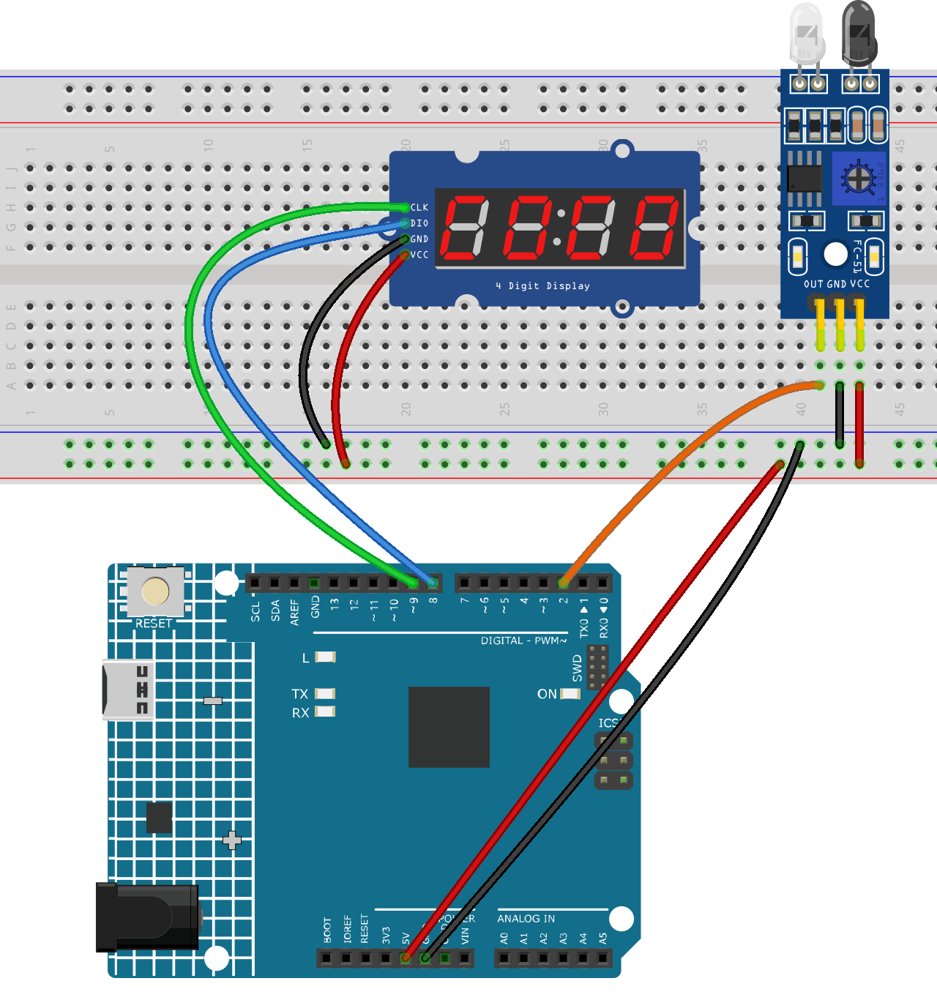

.. _basketball_game1.0:

Basketball Game 1.0
==============================================================

.. note::
  
  🌟 Welcome to the SunFounder Facebook Community! Whether you're into Raspberry Pi, Arduino, or ESP32, you'll find inspiration, help ideas here.
   
  - ✅ Be the first to get free learning resources. 
   
  - ✅ Stay updated on new products & exclusive giveaways. 
   
  - ✅ Share your creations and get real feedback.
   
  * 👉 Need faster updates or support? Click [|link_sf_facebook|] join our Facebook community 

  * 👉 Or join our WhatsApp group: Click [|link_sf_whatsapp|]
   
Kit purchase
------------------------

Looking for parts? Check out our all-in-one kits below — packed with components, beginner-friendly guides, and tons of fun.

.. image:: img/umsk_kit.png
   :width: 100%
   :align: center
   :target: https://www.sunfounder.com/collections/raspberrypi-kits/products/sunfounder-universal-maker-sensor-kit?ref=jbzmncle

.. raw:: html

     

.. list-table::
   :widths: 20 20 20
   :header-rows: 1

   * - Name
     - Includes Arduino board
     - PURCHASE LINK
   * - Ultimate Sensor Kit
     - Arduino Uno R4 Minima
     - |link_ultimate_sensor_buy|
   * - Universal Maker Sensor Kit
     - ×
     - |link_umsk_buy|

Course Introduction
------------------------

In this lesson, you’ll learn how to build a simple basketball score counter using an Arduino, an IR obstacle avoidance sensor, and a TM1637 4-digit display.

This experiment simulates real-time scoring by detecting each successful shot and automatically updating the score on the display.

.. .. raw:: html

..  <iframe width="700" height="394" src="https://www.youtube.com/embed/HLTCHluRY54?si=Qusb7o6H1rDCThMW" title="YouTube video player" frameborder="0" allow="accelerometer; autoplay; clipboard-write; encrypted-media; gyroscope; picture-in-picture; web-share" referrerpolicy="strict-origin-when-cross-origin" allowfullscreen></iframe>

.. note::

  If this is your first time working with an Arduino project, we recommend downloading and reviewing the basic materials first.
  
  * :ref:`install_arduino`
  * :ref:`introduce_arduino`

**Required Components**

In this project, we need the following components:

.. list-table::
    :widths: 5 20 5 20
    :header-rows: 1

    *   - SN
        - COMPONENT INTRODUCTION	
        - QUANTITY
        - PURCHASE LINK

    *   - 1
        - Arduino UNO R4 Minima/Arduino UNO R4 WIFI
        - 1
        - |link_arduinor4_buy|
    *   - 2
        - USB Type-C cable
        - 1
        - 
    *   - 3
        - Breadboard
        - 1
        - |link_breadboard_buy|
    *   - 4
        - Wires
        - Several
        - |link_wires_buy|
    *   - 5
        - 4-Digit Segment Display Module
        - 1
        - |link_4segment_buy|
    *   - 6
        - IR Obstacle Avoidance Sensor Module
        - 1
        - |link_IR_module_buy|

**Wiring**

**Common Connections:**

* **IR Obstacle Avoidance Sensor Module**

  - **OUT:** Connect to **2** on the Arduino.
  - **GND:** Connect to breadboard’s negative power bus.
  - **VCC:** Connect to breadboard’s red power bus.

* **4-Digit Segment Display Module**

  - **CLK:** Connect to **9** on the Arduino.
  - **DIO:** Connect to **8** on the Arduino.
  - **GND:** Connect to breadboard’s negative power bus.
  - **VCC:** Connect to breadboard’s red power bus.

**Writing the Code**

.. note::

    * You can copy this code into **Arduino IDE**. 
    * To install the library, use the Arduino Library Manager and search for **TM1637Display** and install it.
    * Don't forget to select the board(Arduino UNO R4 Minima/WIFI) and the correct port before clicking the **Upload** button.

.. code-block:: arduino

    #include <TM1637Display.h>

    // TM1637 pins
    const int CLK_PIN = 9;
    const int DIO_PIN = 8;

    // IR sensor pin
    const int IR_PIN = 2;

    // Create display object
    TM1637Display display(CLK_PIN, DIO_PIN);

    // Score value
    int score = 0;

    // Sensor states
    bool lastSensorState = HIGH;

    // Anti-double-count timing
    unsigned long lastScoreTime = 0;
    const unsigned long cooldownTime = 800;  // ms

    void setup() {
      // IR sensor input
      pinMode(IR_PIN, INPUT);

      // Set display brightness (0-7)
      display.setBrightness(7);

      // Show initial score
      display.showNumberDec(score, true);

      // Read initial sensor state
      lastSensorState = digitalRead(IR_PIN);
    }

    void loop() {
      bool currentSensorState = digitalRead(IR_PIN);

      // Count only when sensor changes from unblocked to blocked
      // Many IR obstacle modules output LOW when obstacle is detected
      if (lastSensorState == HIGH && currentSensorState == LOW) {
        if (millis() - lastScoreTime > cooldownTime) {
          score++;

          // Limit display range to 9999
          if (score > 9999) {
            score = 9999;
          }

          display.showNumberDec(score, true);
          lastScoreTime = millis();
        }
      }

      lastSensorState = currentSensorState;
    }