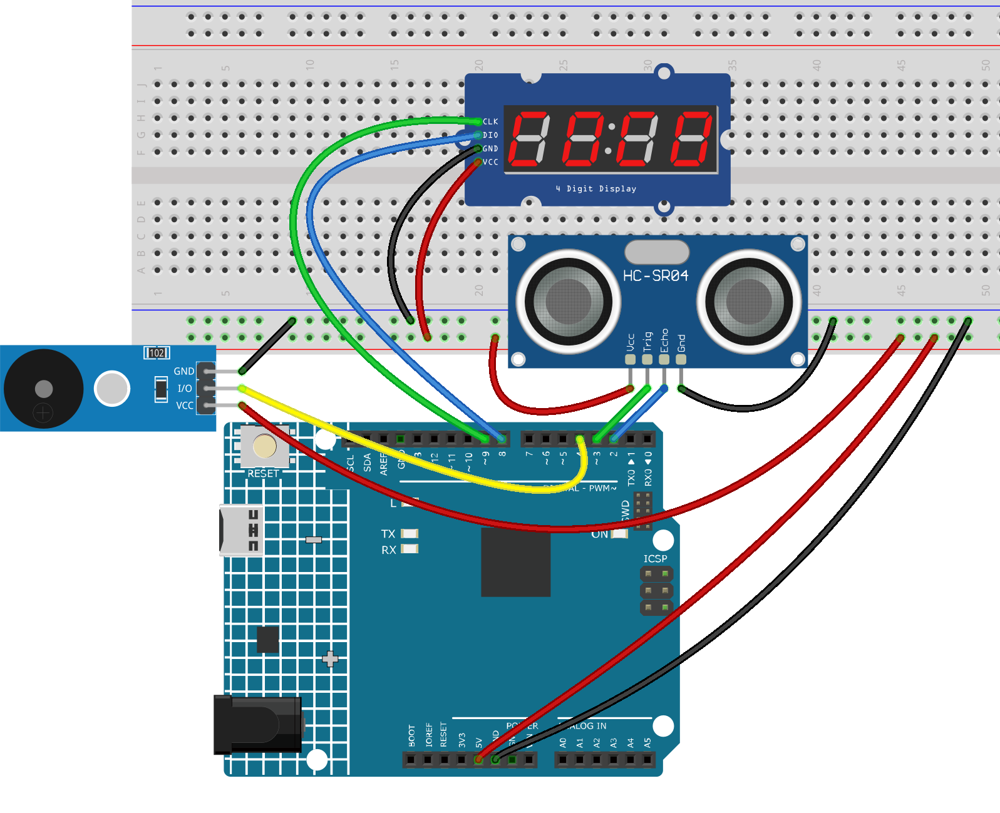

.. _basketball_game2.0:

Basketball Game 2.0
==============================================================

.. note::
  
  🌟 Welcome to the SunFounder Facebook Community! Whether you're into Raspberry Pi, Arduino, or ESP32, you'll find inspiration, help ideas here.
   
  - ✅ Be the first to get free learning resources. 
   
  - ✅ Stay updated on new products & exclusive giveaways. 
   
  - ✅ Share your creations and get real feedback.
   
  * 👉 Need faster updates or support? Click [|link_sf_facebook|] join our Facebook community 

  * 👉 Or join our WhatsApp group: Click [|link_sf_whatsapp|]
   
Kit purchase
------------------------

Looking for parts? Check out our all-in-one kits below — packed with components, beginner-friendly guides, and tons of fun.

.. image:: img/umsk_kit.png
   :width: 100%
   :align: center
   :target: https://www.sunfounder.com/collections/raspberrypi-kits/products/sunfounder-universal-maker-sensor-kit?ref=jbzmncle

.. raw:: html

     

.. list-table::
   :widths: 20 20 20
   :header-rows: 1

   * - Name
     - Includes Arduino board
     - PURCHASE LINK
   * - Ultimate Sensor Kit
     - Arduino Uno R4 Minima
     - |link_ultimate_sensor_buy|
   * - Universal Maker Sensor Kit
     - ×
     - |link_umsk_buy|

Course Introduction
------------------------

In this lesson, we will learn how to use the Ultrasonic Sensor Module, a 4-digit display, and a buzzer with the Arduino Board to build an automatic scoring system.

When an object quickly passes within the detection range, the system registers a score, updates the display, and plays a short sound.

.. .. raw:: html

..  <iframe width="700" height="394" src="https://www.youtube.com/embed/HLTCHluRY54?si=Qusb7o6H1rDCThMW" title="YouTube video player" frameborder="0" allow="accelerometer; autoplay; clipboard-write; encrypted-media; gyroscope; picture-in-picture; web-share" referrerpolicy="strict-origin-when-cross-origin" allowfullscreen></iframe>

.. note::

  If this is your first time working with an Arduino project, we recommend downloading and reviewing the basic materials first.
  
  * :ref:`install_arduino`
  * :ref:`introduce_arduino`

**Required Components**

In this project, we need the following components:

.. list-table::
    :widths: 5 20 5 20
    :header-rows: 1

    *   - SN
        - COMPONENT INTRODUCTION	
        - QUANTITY
        - PURCHASE LINK

    *   - 1
        - Arduino UNO R4 Minima/Arduino UNO R4 WIFI
        - 1
        - |link_arduinor4_buy|
    *   - 2
        - USB Type-C cable
        - 1
        - 
    *   - 3
        - Breadboard
        - 1
        - |link_breadboard_buy|
    *   - 4
        - Wires
        - Several
        - |link_wires_buy|
    *   - 5
        - 4-Digit Segment Display Module
        - 1
        - |link_4segment_buy|
    *   - 6
        - Ultrasonic Sensor Module
        - 1
        - |link_ultrasonic_buy|
    *   - 7
        - Buzzer Modudle
        - 1
        - |link_buzzer_module_buy|

**Wiring**

**Common Connections:**

* **Ultrasonic Sensor Module**

  - **Trig:** Connect to **3** on the Arduino.
  - **Echo:** Connect to **2** on the Arduino.
  - **GND:** Connect to breadboard’s negative power bus.
  - **VCC:** Connect to breadboard’s red power bus.

* **4-Digit Segment Display Module**

  - **CLK:** Connect to **9** on the Arduino.
  - **DIO:** Connect to **8** on the Arduino.
  - **GND:** Connect to breadboard’s negative power bus.
  - **VCC:** Connect to breadboard’s red power bus.

* **Buzzer Module**

  - **I/0:** Connect to **4** on the Arduino.
  - **＋:** Connect to breadboard’s red power bus. 
  - **－:** Connect to breadboard’s negative power bus.

**Writing the Code**

.. note::

    * You can copy this code into **Arduino IDE**. 
    * To install the library, use the Arduino Library Manager and search for **TM1637Display** and install it.
    * Don't forget to select the board(Arduino UNO R4 Minima/WIFI) and the correct port before clicking the **Upload** button.

.. code-block:: arduino

      #include <TM1637Display.h>

      // TM1637 pins
      const int CLK_PIN = 9;
      const int DIO_PIN = 8;

      // Ultrasonic sensor pins
      const int TRIG_PIN = 3;
      const int ECHO_PIN = 2;

      // Buzzer pin
      const int BUZZER_PIN = 4;

      // Create display object
      TM1637Display display(CLK_PIN, DIO_PIN);

      // Score value
      int score = 0;

      // Detection settings
      const float DETECT_DISTANCE = 10.0;   // cm
      const unsigned long cooldownTime = 800;   // ms
      const unsigned long detectHoldTime = 120; // ms

      bool ballDetected = false;
      unsigned long detectHoldStart = 0;
      unsigned long lastScoreTime = 0;

      void setup() {
        pinMode(TRIG_PIN, OUTPUT);
        pinMode(ECHO_PIN, INPUT);
        pinMode(BUZZER_PIN, OUTPUT);

        display.setBrightness(7);
        display.showNumberDec(score, true);
      }

      // Get distance in cm
      float getDistanceCM() {
        digitalWrite(TRIG_PIN, LOW);
        delayMicroseconds(2);

        digitalWrite(TRIG_PIN, HIGH);
        delayMicroseconds(10);
        digitalWrite(TRIG_PIN, LOW);

        long duration = pulseIn(ECHO_PIN, HIGH, 12000); // shorter timeout for faster response

        if (duration == 0) {
          return 999.0;
        }

        float distance = duration * 0.0343 / 2.0;
        return distance;
      }

      // Read multiple times quickly and use the minimum value
      float getFastDistanceCM() {
        float minDistance = 999.0;

        for (int i = 0; i < 3; i++) {
          float d = getDistanceCM();
          if (d < minDistance) {
            minDistance = d;
          }
          delayMicroseconds(300);
        }

        return minDistance;
      }

      // Play a short goal sound
      void playGoalBeep() {
        tone(BUZZER_PIN, 2000, 120);
      }

      void loop() {
        float distance = getFastDistanceCM();
        bool currentDetected = (distance <= DETECT_DISTANCE);
        unsigned long currentMillis = millis();

        if (currentDetected) {
          detectHoldStart = currentMillis;

          if (!ballDetected && (currentMillis - lastScoreTime > cooldownTime)) {
            ballDetected = true;
            score++;

            if (score > 9999) {
              score = 9999;
            }

            display.showNumberDec(score, true);
            playGoalBeep();
            lastScoreTime = currentMillis;
          }
        } else {
          if (ballDetected && (currentMillis - detectHoldStart > detectHoldTime)) {
            ballDetected = false;
          }
        }
      }