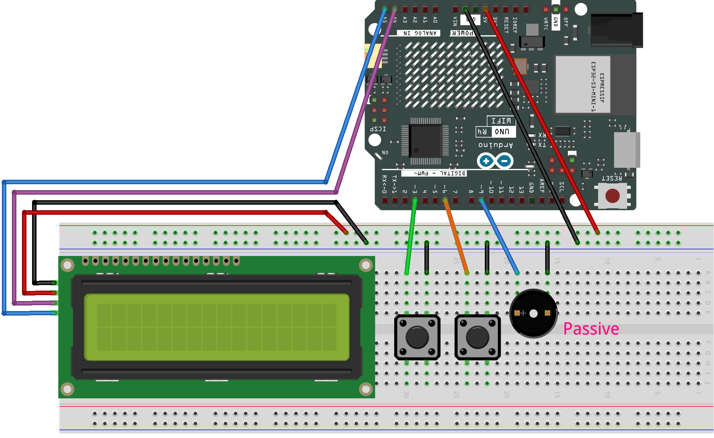

.. _bird_dash:

Bird Dash
==============================================================

.. note::
  
  🌟 Welcome to the SunFounder Facebook Community! Whether you're into Raspberry Pi, Arduino, or ESP32, you'll find inspiration, help ideas here.
   
  - ✅ Be the first to get free learning resources. 
   
  - ✅ Stay updated on new products & exclusive giveaways. 
   
  - ✅ Share your creations and get real feedback.
   
  * 👉 Need faster updates or support? Click [|link_sf_facebook|] join our Facebook community 

  * 👉 Or join our WhatsApp group: Click [|link_sf_whatsapp|]
   
Kit purchase
------------------------

Looking for parts? Check out our all-in-one kits below — packed with components, beginner-friendly guides, and tons of fun.

.. image:: img/elite_explore_kit.png
   :width: 100%
   :align: center
   :target: https://www.sunfounder.com/collections/arduino-kits-bundles/products/sunfounder-elite-explorer-kit-with-official-arduino-uno-r4-wifi?ref=jbzmncle

.. raw:: html

     

.. list-table::
   :widths: 20 20 20
   :header-rows: 1

   * - Name
     - Includes Arduino board
     - PURCHASE LINK
   * - Ultimate Sensor Kit
     - Arduino Uno R4 Minima
     - |link_ultimate_sensor_buy|
   * - Elite Explorer Kit
     - Arduino Uno R4 WiFi
     - |link_elite_buy|
   * - 3 in 1 Ultimate Starter Kit
     - Arduino Uno R4 Minima
     - |link_arduinor4_buy|
   * - Universal Maker Sensor Kit
     - ×
     - |link_umsk_buy|

Course Introduction
------------------------

This Arduino project lets you play a simple dinosaur running game using a 1602 LCD, a button, and a passive buzzer. 

The game displays obstacles and a bird character on the LCD. Press the button to make the bird jump and avoid obstacles. 

Each successful dodge increases your score, while collisions reduce your lives. The buzzer sounds for each collision, and your final score is shown when the game ends.

.. raw:: html

  <iframe width="700" height="394" src="https://www.youtube.com/embed/wFdMX5EsAMI?si=IHS4aKM4SlghFS5U" title="YouTube video player" frameborder="0" allow="accelerometer; autoplay; clipboard-write; encrypted-media; gyroscope; picture-in-picture; web-share" referrerpolicy="strict-origin-when-cross-origin" allowfullscreen></iframe>

.. note::

  If this is your first time working with an Arduino project, we recommend downloading and reviewing the basic materials first.
  
  * :ref:`install_arduino`
  * :ref:`introduce_arduino`

**Required Components**

In this project, we need the following components:

.. list-table::
    :widths: 5 20 5 20
    :header-rows: 1

    *   - SN
        - COMPONENT INTRODUCTION	
        - QUANTITY
        - PURCHASE LINK

    *   - 1
        - Arduino UNO R4 WIFI
        - 1
        - |link_unor4_wifi_buy|
    *   - 2
        - USB Type-C cable
        - 1
        - 
    *   - 3
        - Breadboard
        - 1
        - |link_breadboard_buy|
    *   - 4
        - Wires
        - Several
        - |link_wires_buy|
    *   - 5
        - I2C LCD 1602
        - 1
        - |link_i2clcd1602_buy|
    *   - 6
        - Button
        - 2
        - |link_button_buy|
    *   - 7
        - Passive buzzer
        - 1
        - |link_passive_buzzer_buy|

**Wiring**

**Common Connections:**

* **I2C LCD 1602**

  - **SDA:** Connect to **A4** on the Arduino.
  - **SCL:** Connect to **A5** on the Arduino.
  - **GND:** Connect to breadboard’s negative power bus.
  - **VCC:** Connect to breadboard’s red power bus.

* **Passive Buzzer**

  - **＋:** Connect to **9** on the Arduino.
  - **－:** Connect to breadboard’s negative power bus.

* **Button**

  - Connect to breadboard’s negative power bus.
  - Connect to **3** on the Arduino.

* **Button**

  - Connect to breadboard’s negative power bus.
  - Connect to **6** on the Arduino.

**Writing the Code**

.. note::

    * You can copy this code into **Arduino IDE**. 
    * To install the library, use the Arduino Library Manager and search for **LiquidCrystal I2C** and install it.
    * Don't forget to select the board(Arduino UNO R4 Minima) and the correct port before clicking the **Upload** button.

.. code-block:: arduino

      #include <Wire.h>
      #include <LiquidCrystal_I2C.h>

      #define BUTTON_PIN 3      // jump button pin
      #define RESTART_PIN 6     // restart button pin
      #define BUZZER_PIN 9      // buzzer pin
      #define BIRD_X 5          // fixed bird column

      LiquidCrystal_I2C lcd(0x27, 16, 2);

      // custom character IDs
      #define BIRD_CHAR   0
      #define PIPE_CHAR   1
      #define HEART_CHAR  2

      // custom character data: bird, pipe, heart
      byte birdChar[8] = {
        0b00000,
        0b00000,
        0b00110,
        0b10111,
        0b10110,
        0b11110,
        0b11110,
        0b01100
      };
      byte pipeChar[8] = {
        0b11111,
        0b11111,
        0b01110,
        0b01110,
        0b01110,
        0b01110,
        0b01110,
        0b01110
      };
      byte heart[8] = {
        0b00000,
        0b01010,
        0b11111,
        0b11111,
        0b01110,
        0b00100,
        0b00000,
        0b00000
      };

      // game state
      bool isUp = false;        // bird position flag
      bool gameOver = false;
      int lives = 3;            // starting lives
      int distance = 0;         // frame counter
      int hundreds = 0;         // hundreds digit for score
      int totalSteps = 0;       // total score

      // obstacle positions
      int obstacleX1, obstacleX2, obstacleX3;
      int oldObstacleX1, oldObstacleX2, oldObstacleX3;

      // speed control
      int obstacleSpeed = 200;  // initial frame delay
      const int minSpeed = 120;
      const int speedIncrement = 20;

      int oldPlayerRow;         // last bird row

      void setup() {
        lcd.init();             // initialize LCD
        lcd.backlight();        // turn on backlight

        // load custom characters
        lcd.createChar(BIRD_CHAR, birdChar);
        lcd.createChar(PIPE_CHAR, pipeChar);
        lcd.createChar(HEART_CHAR, heart);

        pinMode(BUTTON_PIN, INPUT_PULLUP);
        pinMode(RESTART_PIN, INPUT_PULLUP);
        pinMode(BUZZER_PIN, OUTPUT);

        randomSeed(analogRead(A0) ^ micros());
        startGame();            // reset game
      }

      void loop() {
        // check restart button
        if (digitalRead(RESTART_PIN) == LOW) {
          startGame();
          delay(200);
          return;
        }

        // read jump button
        isUp = (digitalRead(BUTTON_PIN) == LOW);

        if (!gameOver) moveObstacle();  // run game frame
      }

      // pick number of pipes with probability
      int pickCluster() {
        int r = random(10);
        if (totalSteps >= 100) {
          if (r < 5) return 1;       // 50% single
          else if (r < 8) return 2;  // 30% double
          else return 3;             // 20% triple
        } else {
          if (r < 2) return 1;       // 20% single
          else if (r < 6) return 2;  // 40% double
          else return 3;             // 40% triple
        }
      }

      void startGame() {
        // reset variables
        isUp = false;
        gameOver = false;
        lives = 3;
        distance = 0;
        hundreds = 0;
        totalSteps = 0;
        obstacleSpeed = 200;
        oldPlayerRow = 1;

        // initial obstacle cluster
        int cluster = pickCluster();
        obstacleX1 = 13;
        obstacleX2 = (cluster >= 2) ? 14 : -1;
        obstacleX3 = (cluster >= 3) ? 15 : -1;
        oldObstacleX1 = obstacleX1;
        oldObstacleX2 = obstacleX2;
        oldObstacleX3 = obstacleX3;

        // show start screen
        lcd.clear();
        lcd.setCursor(0, 0);
        lcd.print(" Bird Run 16x2 ");
        lcd.setCursor(0, 1);
        lcd.print(" Press BTN...  ");
        delay(1000);
        lcd.clear();
      }

      void moveObstacle() {
        static unsigned long lastTime = 0;
        unsigned long now = millis();
        if (now - lastTime < obstacleSpeed) return;
        lastTime = now;

        // clear old pipes
        if (oldObstacleX1 >= 0) lcd.setCursor(oldObstacleX1, 1), lcd.write(' ');
        if (oldObstacleX2 >= 0) lcd.setCursor(oldObstacleX2, 1), lcd.write(' ');
        if (oldObstacleX3 >= 0) lcd.setCursor(oldObstacleX3, 1), lcd.write(' ');

        // update score
        distance++;
        if (distance > 99) {
          distance = 0;
          hundreds++;
        }
        totalSteps = hundreds * 100 + distance;

        // activate second pipe after 100
        if (totalSteps >= 100 && obstacleX2 < 0) obstacleX2 = 16;

        // move pipes left
        if (obstacleX1 >= 0) obstacleX1--;
        if (obstacleX2 >= 0) obstacleX2--;
        if (obstacleX3 >= 0) obstacleX3--;

        // regenerate cluster when first pipe off-screen
        if (obstacleX1 < 0) {
          int cluster = pickCluster();
          obstacleX1 = 13;
          obstacleX2 = (cluster >= 2) ? 14 : -1;
          obstacleX3 = (cluster >= 3) ? 15 : -1;
          if (obstacleSpeed > minSpeed) {
            obstacleSpeed -= speedIncrement;
            if (obstacleSpeed < minSpeed) obstacleSpeed = minSpeed;
          }
        }

        // update lives display
        for (int i = 0; i < 3; i++) lcd.setCursor(i, 0), lcd.write(' ');
        for (int i = 0; i < lives; i++) lcd.setCursor(i, 0), lcd.write(byte(HEART_CHAR));

        // draw bird
        int playerRow = isUp ? 0 : 1;
        if (playerRow != oldPlayerRow) {
          lcd.setCursor(BIRD_X, oldPlayerRow);
          lcd.write(' ');
        }
        lcd.setCursor(BIRD_X, playerRow);
        lcd.write(byte(BIRD_CHAR));
        oldPlayerRow = playerRow;

        // draw pipes
        if (obstacleX1 >= 0) lcd.setCursor(obstacleX1, 1), lcd.write(byte(PIPE_CHAR));
        if (obstacleX2 >= 0) lcd.setCursor(obstacleX2, 1), lcd.write(byte(PIPE_CHAR));
        if (obstacleX3 >= 0) lcd.setCursor(obstacleX3, 1), lcd.write(byte(PIPE_CHAR));
        oldObstacleX1 = obstacleX1;
        oldObstacleX2 = obstacleX2;
        oldObstacleX3 = obstacleX3;

        // draw score
        lcd.setCursor(14, 0);
        lcd.print(hundreds);
        lcd.setCursor(14, 1);
        lcd.print(distance / 10);
        lcd.setCursor(15, 1);
        lcd.print(distance % 10);

        // collision check
        if ((obstacleX1 == BIRD_X || obstacleX2 == BIRD_X || obstacleX3 == BIRD_X) && !isUp) {
          lives--;
          tone(BUZZER_PIN, 200, 200);
          delay(250);
          noTone(BUZZER_PIN);
          if (lives <= 0) {
            gameOver = true;
            endGame();
          }
        }
      }

      // end game: show message then play melody
      void endGame() {
        lcd.clear();
        lcd.setCursor(2, 0);
        lcd.print("GAME OVER!!!");
        lcd.setCursor(1, 1);
        lcd.print("Steps: ");
        lcd.print(totalSteps);

        tone(BUZZER_PIN, 400, 100);
        delay(150);
        tone(BUZZER_PIN, 600, 100);
        delay(150);
        tone(BUZZER_PIN, 800, 150);
        delay(200);
        tone(BUZZER_PIN, 600, 150);
        delay(200);
        tone(BUZZER_PIN, 400, 200);
        delay(250);
        noTone(BUZZER_PIN);
      }
