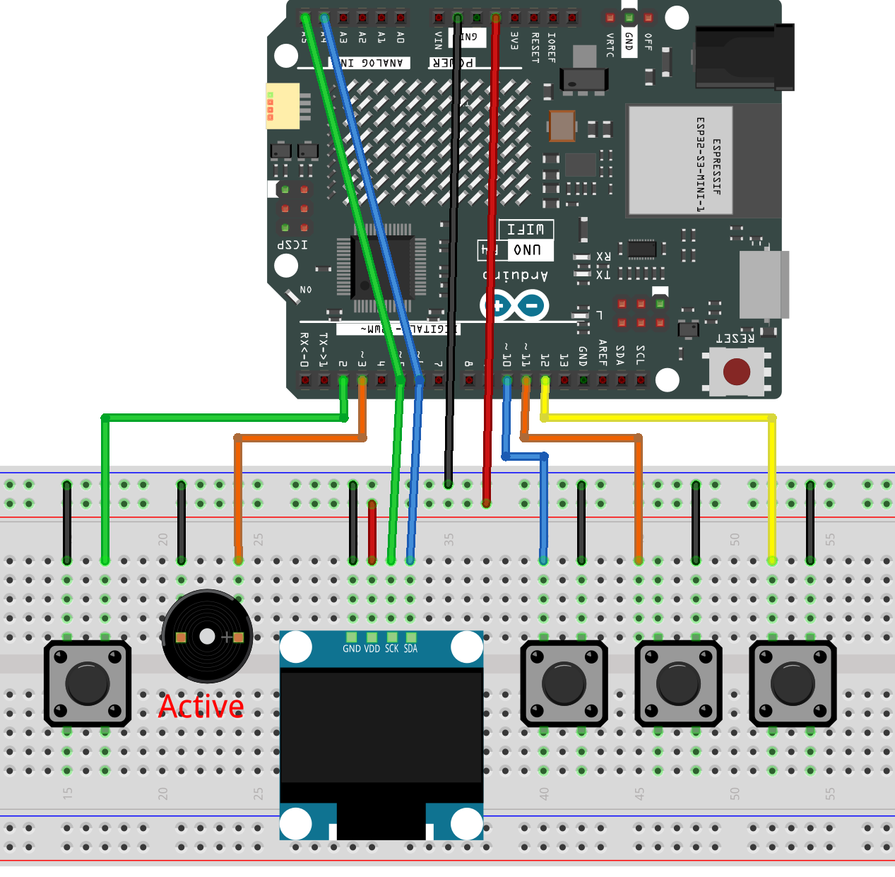

.. _bitfriend:

BitFriend
==============================================================

.. note::
  
  🌟 Welcome to the SunFounder Facebook Community! Whether you're into Raspberry Pi, Arduino, or ESP32, you'll find inspiration, help ideas here.
   
  - ✅ Be the first to get free learning resources. 
   
  - ✅ Stay updated on new products & exclusive giveaways. 
   
  - ✅ Share your creations and get real feedback.
   
  * 👉 Need faster updates or support? Click [|link_sf_facebook|] join our Facebook community 

  * 👉 Or join our WhatsApp group: Click [|link_sf_whatsapp|]
   
Kit purchase
------------------------

Looking for parts? Check out our all-in-one kits below — packed with components, beginner-friendly guides, and tons of fun.

.. image:: img/elite_explore_kit.png
   :width: 100%
   :align: center
   :target: https://www.sunfounder.com/collections/arduino-kits-bundles/products/sunfounder-elite-explorer-kit-with-official-arduino-uno-r4-wifi?ref=jbzmncle

.. raw:: html

     

.. list-table::
   :widths: 20 20 20
   :header-rows: 1

   * - Name
     - Includes Arduino board
     - PURCHASE LINK
   * - Ultimate Sensor Kit
     - Arduino Uno R4 Minima
     - |link_ultimate_sensor_buy|
   * - Elite Explorer Kit
     - Arduino Uno R4 WiFi
     - |link_elite_buy|
   * - 3 in 1 Ultimate Starter Kit
     - Arduino Uno R4 Minima
     - |link_arduinor4_buy|
   * - Universal Maker Sensor Kit
     - ×
     - |link_umsk_buy|

Course Introduction
------------------------

In this project, you'll use an Arduino R4 UNO, an OLED display, buttons, a buzzer, and EEPROM to create an interactive virtual pet game.

Navigate menus to feed, play, dress, or put your pet to sleep, with animations displayed on the OLED. Button inputs control actions, while the buzzer provides audio feedback. The pet’s stats (hunger, happiness, sleep) are saved in EEPROM for persistence between sessions.

.. raw:: html

  <iframe width="700" height="394" src="https://www.youtube.com/embed/hnBL75vK2vY?si=qihUnb2krkwOqwBV" title="YouTube video player" frameborder="0" allow="accelerometer; autoplay; clipboard-write; encrypted-media; gyroscope; picture-in-picture; web-share" referrerpolicy="strict-origin-when-cross-origin" allowfullscreen></iframe>

.. note::

  If this is your first time working with an Arduino project, we recommend downloading and reviewing the basic materials first.

  * :ref:`install_arduino`
  * :ref:`introduce_arduino`

**Required Components**

In this project, we need the following components:

.. list-table::
    :widths: 5 20 5 20
    :header-rows: 1

    *   - SN
        - COMPONENT INTRODUCTION	
        - QUANTITY
        - PURCHASE LINK

    *   - 1
        - Arduino UNO R4 Minima
        - 1
        - |link_unor4_buy|
    *   - 2
        - USB Type-C cable
        - 1
        - 
    *   - 3
        - Breadboard
        - 1
        - |link_breadboard_buy|
    *   - 4
        - Wires
        - Several
        - |link_wires_buy|
    *   - 5
        - Button
        - 4
        - |link_button_buy|
    *   - 6
        - OLED Display Module
        - 1
        - |link_oled_buy|
    *   - 7
        - Active Buzzer
        - 1
        - 

**Wiring**

**Common Connections:**

* **OLED Display Module**

  - **SDA:** Connect to **A4** on the Arduino.
  - **SCK:** Connect to **A5** on the Arduino.
  - **GND:** Connect to breadboard’s negative power bus.
  - **VCC:** Connect to breadboard’s red power bus.

* **Button**

  - **button1:** Connect to the breadboard’s negative power bus, and the other end to **2** on the Arduino board.
  - **button2:** Connect to the breadboard’s negative power bus, and the other end to **10** on the Arduino board.
  - **button3:** Connect to the breadboard’s negative power bus, and the other end to **11** on the Arduino board.
  - **button4:** Connect to the breadboard’s negative power bus, and the other end to **12** on the Arduino board.

* **Active Buzzer**

  - **＋:** Connect to **3** on the Arduino.
  - **－:** Connect to breadboard’s negative power bus.

**Writing the Code**

.. note::

    * You can copy this code into **Arduino IDE**. 
    * Use the C code ``BitFriend`` . You can click here :download:`BitFriend.zip </_static/BitFriend.zip>` to download it. 
    * To install the library, use the Arduino Library Manager and search for **Adafruit SSD1306** and **Adafruit GFX** and **EEPROM** and install it.
    * Don't forget to select the board(Arduino UNO R4 Minima) and the correct port before clicking the **Upload** button.

.. code-block:: arduino

      #include <Adafruit_GFX.h>
      #include <Adafruit_SSD1306.h>
      #include <EEPROM.h>
      #include "Scrolling_menu.h"
      #include "Alegotchi.h"
      #include "Sprites.h"

      // OLED display dimensions
      #define SCREEN_WIDTH 128
      #define SCREEN_HEIGHT 64

      // Button pins
      #define SWITCH_SCREEN 2   // Screen on/off toggle button
      #define LEFT          10  // Menu left
      #define RIGHT         12  // Menu right
      #define SELECT        11  // Menu select

      // Buzzer pin and tone definitions
      #define BUZZER_PIN     3
      #define TONE_CONN_FREQ 1000  // Menu navigation & toggle feedback (Hz)
      #define TONE_CONN_DUR   80   // Duration in ms
      #define TONE_JUMP_FREQ 1500  // Animation end feedback
      #define TONE_JUMP_DUR  120
      #define TONE_FART_FREQ  400  // Wake-up feedback
      #define TONE_FART_DUR  150
      #define TONE_WARN_FREQ  600  // Warning feedback for low stats
      #define TONE_WARN_DUR  200

      Adafruit_SSD1306 display(SCREEN_WIDTH, SCREEN_HEIGHT);

      // Tamagotchi states: 0=Home, 1=Sleep, 2=Dress, 3=Stats
      int state = 0;

      // Menu labels and icons
      char menuSections[][20] = {"Cut","Dress","Eat","Stats","Play","Sleep"};
      const unsigned char* menuIcons[]      = { beard_icon, dress_icon, eat_icon, stats_icon, play_icon, sleep_icon };
      const unsigned char* bodyArray[]      = { myBitmapbody_01, myBitmapbody_02, myBitmapbody_03, myBitmapbody_04 };
      const unsigned char* menuDressIcons[] = { backHome, myBitmapbody_01, myBitmapbody_02, myBitmapbody_03, myBitmapbody_04 };

      // Scrolling menu objects for main and dress menus
      Scrolling_menu menu(58, 32, 6);
      Scrolling_menu menuDress(58, 32, 5);

      // Variables to hold EEPROM-loaded stats
      bool sleeping;
      int  sleep_val;
      int  happiness;
      int  hunger;
      int  beardLength;
      int  expression;
      int  clothing;
      int  age;

      // Create Tamagotchi object with dummy initial values; will reassign in setup()
      Alegotchi alegotchi(false, 0, 0, 0, 0, 0, 0, 0);

      // === New screen toggle debounce & edge-detect variables ===
      bool displayEnabled       = true;
      bool lastRawState         = HIGH;              // Last raw reading from the switch pin
      bool buttonState          = HIGH;              // Debounced button state
      unsigned long lastDebounceTime = 0;
      const unsigned long debounceDelay = 50;        // Debounce time in ms

      // Input debouncing for menu buttons
      bool pressed = false;

      // Animation variables for sprite wiggle
      int spriteOffset = -1;
      unsigned long lastAnimTime = 0;
      const unsigned long animInterval = 200;  // Change sprite every 200ms

      void setup() {
        Serial.begin(9600);

        // Initialize OLED display
        if (!display.begin(SSD1306_SWITCHCAPVCC, 0x3C)) {
          Serial.println("I2C ERROR");
          while (true);
        }

        // Configure button pins
        pinMode(SWITCH_SCREEN, INPUT_PULLUP);
        pinMode(LEFT, INPUT_PULLUP);
        pinMode(RIGHT, INPUT_PULLUP);
        pinMode(SELECT, INPUT_PULLUP);

        // Configure buzzer pin
        pinMode(BUZZER_PIN, OUTPUT);

        // Load stats from EEPROM
        sleeping    = EEPROM.read(0);
        sleep_val   = EEPROM.read(1);
        happiness   = EEPROM.read(2);
        hunger      = EEPROM.read(3);
        EEPROM.get(10, age);
        beardLength = EEPROM.read(5);
        expression  = EEPROM.read(6);
        clothing    = EEPROM.read(7);

        // Reassign tamagotchi object with loaded stats
        alegotchi = Alegotchi(sleeping, sleep_val, happiness, hunger, age, beardLength, expression, clothing);

        // Clear initial display
        display.clearDisplay();
        display.display();
        delay(200);
      }

      void loop() {
        // ===== New "press once to toggle" debounce & edge-detect logic =====
        int raw = digitalRead(SWITCH_SCREEN);
        if (raw != lastRawState) {
          lastDebounceTime = millis();
        }
        if (millis() - lastDebounceTime > debounceDelay) {
          if (raw != buttonState) {
            buttonState = raw;
            if (buttonState == LOW) {
              displayEnabled = !displayEnabled;
              tone(BUZZER_PIN, TONE_CONN_FREQ, TONE_CONN_DUR);
              if (!displayEnabled) {
                display.clearDisplay();
                display.display();
              }
            }
          }
        }
        lastRawState = raw;

        // If display is off, skip rendering and logic
        if (!displayEnabled) return;

        // ===== Original state machine & rendering logic =====
        stateSelection();
        render();
        delay(10);
      }

      void stateSelection() {
        if      (state == 0) homeFunc();
        else if (state == 1) sleepFunc();
        else if (state == 2) dressFunc();
        else if (state == 3) statsFunc();
      }

      void render() {
        display.clearDisplay();
        switch (state) {
          case 0:
            displayAle();
            displayMenuFunc();
            displayStats();
            break;
          case 1:
            displaySleep();
            break;
          case 2:
            displayMenuDress();
            break;
          case 3:
            displayAge();
            break;
        }
        display.display();
      }

      void homeFunc() {
        if (!pressed) {
          if (digitalRead(SELECT) == LOW) {
            pressed = true;
            tone(BUZZER_PIN, TONE_CONN_FREQ, TONE_CONN_DUR);
            changeState(menuSections[menu.activeSection]);
          } else if (digitalRead(LEFT) == LOW) {
            pressed = true;
            tone(BUZZER_PIN, TONE_CONN_FREQ, TONE_CONN_DUR);
            menu.moveLeft();
          } else if (digitalRead(RIGHT) == LOW) {
            pressed = true;
            tone(BUZZER_PIN, TONE_CONN_FREQ, TONE_CONN_DUR);
            menu.moveRight();
          }
        } else if (digitalRead(SELECT) == HIGH && digitalRead(LEFT) == HIGH && digitalRead(RIGHT) == HIGH) {
          pressed = false;
        }
      }

      void sleepFunc() {
        if (!alegotchi.sleeping) changeState("Home");
        if (!pressed && digitalRead(SELECT) == LOW) {
          pressed = true;
          tone(BUZZER_PIN, TONE_FART_FREQ, TONE_FART_DUR);
          alegotchi.updateSleeping();
          alegotchi.updateHappiness(-3);
          changeState("Home");
        } else if (digitalRead(SELECT) == HIGH && digitalRead(LEFT) == HIGH && digitalRead(RIGHT) == HIGH) {
          pressed = false;
        }
      }

      void dressFunc() {
        if (!pressed) {
          if (digitalRead(SELECT) == LOW) {
            pressed = true;
            tone(BUZZER_PIN, TONE_CONN_FREQ, TONE_CONN_DUR);
            if (menuDress.activeSection != 0) {
              alegotchi.updateClothing(menuDress.activeSection - 1);
            }
            changeState("Home");
          } else if (digitalRead(LEFT) == LOW) {
            pressed = true;
            tone(BUZZER_PIN, TONE_CONN_FREQ, TONE_CONN_DUR);
            menuDress.moveLeft();
          } else if (digitalRead(RIGHT) == LOW) {
            pressed = true;
            tone(BUZZER_PIN, TONE_CONN_FREQ, TONE_CONN_DUR);
            menuDress.moveRight();
          }
        } else if (digitalRead(SELECT) == HIGH && digitalRead(LEFT) == HIGH && digitalRead(RIGHT) == HIGH) {
          pressed = false;
        }
      }

      void statsFunc() {
        if (!pressed && digitalRead(SELECT) == LOW) {
          pressed = true;
          tone(BUZZER_PIN, TONE_CONN_FREQ, TONE_CONN_DUR);
          changeState("Home");
        } else if (digitalRead(SELECT) == HIGH && digitalRead(LEFT) == HIGH && digitalRead(RIGHT) == HIGH) {
          pressed = false;
        }
      }

      void changeState(const char section[]) {
        display.invertDisplay(true);
        delay(50);
        display.invertDisplay(false);

        if      (!strcmp(section,"Sleep")) {
          state = 1;
          alegotchi.updateSleeping();
          alegotchi.updateHappiness(2);
          alegotchi.updateSleep(1);
        } else if (!strcmp(section,"Play")) {
          alegotchi.updateHappiness(4);
          alegotchi.updateSleep(-2);
          alegotchi.updateHunger(-2);
          displayPlay();
        } else if (!strcmp(section,"Stats")) {
          state = 3;
        } else if (!strcmp(section,"Eat")) {
          alegotchi.updateHunger(5);
          alegotchi.updateHappiness(1);
          displayEat();
        } else if (!strcmp(section,"Cut")) {
          alegotchi.updateBeardLength(0);
          if (alegotchi.beardLength >= 24) alegotchi.updateHappiness(10);
          displayCut();
        } else if (!strcmp(section,"Dress")) {
          state = 2;
        } else if (!strcmp(section,"Home")) {
          state = 0;
        }
      }

      void displayMenuFunc() {
        int y = 17, h = 16;
        display.setTextSize(1);
        display.setTextColor(SSD1306_WHITE, SSD1306_BLACK);
        display.setCursor(menu.x + 19, y + 4);
        display.println(menuSections[menu.prevSection]);
        display.drawBitmap(menu.x, y + 3, menuIcons[menu.prevSection], 10, 10, SSD1306_WHITE);
        y += h;
        display.drawRoundRect(menu.x - 5, y, 73, 16, 3, SSD1306_WHITE);
        display.setCursor(menu.x + 19, y + 4);
        display.println(menuSections[menu.activeSection]);
        display.drawBitmap(menu.x, y + 3, menuIcons[menu.activeSection], 10, 10, SSD1306_WHITE);
        y += h;
        display.setCursor(menu.x + 19, y + 4);
        display.println(menuSections[menu.nextSection]);
        display.drawBitmap(menu.x, y + 3, menuIcons[menu.nextSection], 10, 10, SSD1306_WHITE);
      }

      void displayAle() {
        unsigned long now = millis();
        if (now - lastAnimTime >= animInterval) {
          lastAnimTime = now;
          spriteOffset = -spriteOffset;
        }
        display.drawRoundRect(0, 16, 50, 48, 5, SSD1306_WHITE);
        display.fillRect(10, 18, 32, 46, SSD1306_BLACK);
        display.drawBitmap(10, 18 + spriteOffset, bodyArray[alegotchi.clothing], 32, 46, SSD1306_WHITE);
        display.drawBitmap(10, 18, feet_bg, 32, 46, SSD1306_BLACK);
        display.drawBitmap(10, 18, feet, 32, 46, SSD1306_WHITE);
        display.drawBitmap(10, 18 + spriteOffset, head_bg, 32, 46, SSD1306_BLACK);
        display.drawBitmap(10, 18 + spriteOffset, head, 32, 46, SSD1306_WHITE);
        if (alegotchi.beardLength >= 24) {
          display.drawBitmap(10, 18 + spriteOffset, beard_bg, 32, 46, SSD1306_BLACK);
          display.drawBitmap(10, 18 + spriteOffset, beard, 32, 46, SSD1306_WHITE);
        }
        display.drawBitmap(10, 18 + spriteOffset, eyes, 32, 46, SSD1306_BLACK);
      }

      void displayStats() {
        display.fillRect(1, 1, 127, 15, SSD1306_BLACK);
        display.setTextSize(1);
        display.setCursor(2, 5);  display.println("H");
        display.drawRoundRect(9, 6, 27, 6, 1, SSD1306_WHITE);
        display.fillRect(10, 7,  alegotchi.mapValue(alegotchi.happiness, 27), 4, SSD1306_WHITE);
        display.setCursor(43, 5); display.println("S");
        display.drawRoundRect(50, 6, 27, 6, 1, SSD1306_WHITE);
        display.fillRect(51, 7,  alegotchi.mapValue(alegotchi.sleep, 27), 4, SSD1306_WHITE);
        display.setCursor(85, 5); display.println("F");
        display.drawRoundRect(92, 6, 27, 6, 1, SSD1306_WHITE);
        display.fillRect(93, 7,  alegotchi.mapValue(alegotchi.hunger, 27), 4, SSD1306_WHITE);
      }

      void displaySleep() {
        display.fillRect(0, 16, 128, 48, SSD1306_BLACK);
        display.setTextSize(1);
        display.setTextColor(SSD1306_WHITE, SSD1306_BLACK);
        display.setCursor(64 - spriteOffset, 33 - spriteOffset); display.println("Z");
        display.setCursor(59 - !spriteOffset, 46 - !spriteOffset); display.println("Z");
        display.setTextSize(2);
        display.setCursor(47 - spriteOffset, 26 - !spriteOffset); display.println("Z");
      }

      void displayMenuDress() {
        display.fillRect(1, 17, 127, 47, SSD1306_BLACK);
        display.drawBitmap(3, 17, menuDressIcons[menuDress.prevSection], 32, 46, SSD1306_WHITE);
        display.drawRoundRect(39, 16, 50, 48, 5, SSD1306_WHITE);
        int sx = 49;
        if (menuDress.activeSection != 0) {
          display.fillRect(sx, 18, 32, 46, SSD1306_BLACK);
          display.drawBitmap(sx, 18, menuDressIcons[menuDress.activeSection], 32, 46, SSD1306_WHITE);
          display.drawBitmap(sx, 18, feet_bg, 32, 46, SSD1306_BLACK);
          display.drawBitmap(sx, 18, feet, 32, 46, SSD1306_WHITE);
          display.drawBitmap(sx, 18, head_bg, 32, 46, SSD1306_BLACK);
          display.drawBitmap(sx, 18, head, 32, 46, SSD1306_WHITE);
          if (alegotchi.beardLength >= 24) {
            display.drawBitmap(10, 18 + spriteOffset, beard_bg, 32, 46, SSD1306_BLACK);
            display.drawBitmap(10, 18 + spriteOffset, beard, 32, 46, SSD1306_WHITE);
          }
          display.drawBitmap(sx, 18, eyes, 32, 46, SSD1306_BLACK);
        }
        display.drawBitmap(93, 17, menuDressIcons[menuDress.nextSection], 32, 46, SSD1306_WHITE);
      }

      void displayAge() {
        display.fillRect(0, 16, 128, 48, SSD1306_BLACK);
        display.setTextSize(1);
        display.setTextColor(SSD1306_BLACK, SSD1306_WHITE);
        display.setCursor(10, 20);
        display.print("Name");
        display.setTextColor(SSD1306_WHITE);
        display.println(" SunFounder");
        display.setCursor(10, 32);
        display.setTextColor(SSD1306_BLACK, SSD1306_WHITE);
        display.print("Age");
        display.setTextColor(SSD1306_WHITE);
        display.print(" ");
        display.print(alegotchi.age / 24);
        display.println(" days");
        display.setCursor(10, 44);
        display.setTextColor(SSD1306_BLACK, SSD1306_WHITE);
        display.print("Weight");
        display.setTextColor(SSD1306_WHITE);
        display.println(" 67 kg");
      }

      void selectEatFrame(int x, int y, int f) {
        const unsigned char* bmp = (alegotchi.beardLength >= 24)
          ? (f == 1 ? eat_anim_head_b_1 : eat_anim_head_b_2)
          : (f == 1 ? eat_anim_head_n_1 : eat_anim_head_n_2);
        display.drawBitmap(x, y, bmp, 45, 40, SSD1306_WHITE);
      }

      void displayEat() {
        int sx = 30, sy = 20;
        for (int f = 1; f <= 7; f++) {
          display.clearDisplay();
          selectEatFrame(sx, sy, (f % 2) ? 1 : 2);
          if (f == 1) display.drawBitmap(sx + 50, sy + 15, eat_anim_food_1, 15, 15, SSD1306_WHITE);
          if (f == 3) display.drawBitmap(sx + 50, sy + 15, eat_anim_food_2, 15, 15, SSD1306_WHITE);
          if (f == 5) display.drawBitmap(sx + 50, sy + 15, eat_anim_food_3, 15, 15, SSD1306_WHITE);
          display.display();
          delay(500);
        }
        tone(BUZZER_PIN, TONE_JUMP_FREQ, TONE_JUMP_DUR);
        changeState("Home");
      }

      void displayPlay() {
        int sx = 50, sy = 17;
        for (int i = 0; i < 2; i++) {
          display.clearDisplay(); display.drawBitmap(sx, sy, play_anim_1, 27, 48, SSD1306_WHITE); display.display(); delay(200);
          display.clearDisplay(); display.drawBitmap(sx, sy, play_anim_2, 27, 48, SSD1306_WHITE); display.display(); delay(200);
          display.clearDisplay(); display.drawBitmap(sx, sy, play_anim_3, 27, 48, SSD1306_WHITE); display.display(); delay(200);
          display.clearDisplay(); display.drawBitmap(sx, sy, play_anim_4, 27, 48, SSD1306_WHITE); display.display(); delay(200);
          display.clearDisplay(); display.drawBitmap(sx, sy, play_anim_5, 27, 48, SSD1306_WHITE); display.display(); delay(200);
        }
        tone(BUZZER_PIN, TONE_JUMP_FREQ, TONE_JUMP_DUR);
        changeState("Home");
      }

      void displayCut() {
        int sx = 45, sy = 24;
        for (int i = 0; i < 2; i++) {
          display.clearDisplay(); display.drawBitmap(sx, sy, cut_anim_1, 37, 28, SSD1306_WHITE); display.display(); delay(500);
          display.clearDisplay(); display.drawBitmap(sx, sy, cut_anim_2, 37, 28, SSD1306_WHITE); display.display(); delay(500);
        }
        tone(BUZZER_PIN, TONE_JUMP_FREQ, TONE_JUMP_DUR);
        changeState("Home");
      }
