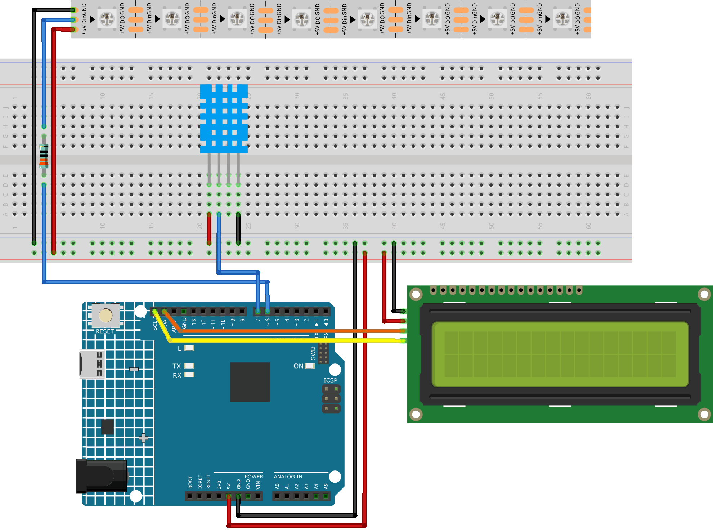

.. _breath_led_:

Breath LED
==============================================================

.. note::
  
  🌟 Welcome to the SunFounder Facebook Community! Whether you're into Raspberry Pi, Arduino, or ESP32, you'll find inspiration, help ideas here.
   
  - ✅ Be the first to get free learning resources. 
   
  - ✅ Stay updated on new products & exclusive giveaways. 

  - ✅ Share your creations and get real feedback.
   
  * 👉 Need faster updates or support? Click [|link_sf_facebook|] join our Facebook community 

  * 👉 Or join our WhatsApp group: Click [|link_sf_whatsapp|]
   
Kit purchase
------------------------

Looking for parts? Check out our all-in-one kits below — packed with components, beginner-friendly guides, and tons of fun.

.. image:: img/umsk_kit.png
   :width: 100%
   :align: center
   :target: https://www.sunfounder.com/collections/raspberrypi-kits/products/sunfounder-universal-maker-sensor-kit?ref=jbzmncle

.. raw:: html

     

.. list-table::
   :widths: 20 20 20
   :header-rows: 1

   * - Name
     - Includes Arduino board
     - PURCHASE LINK
   * - Ultimate Sensor Kit
     - Arduino Uno R4 Minima
     - |link_ultimate_sensor_buy|
   * - Universal Maker Sensor Kit
     - ×
     - |link_umsk_buy|

Course Introduction
------------------------

In this project, we use a DHT11 sensor, an LCD, and a WS2812 LED strip.

The LCD shows temperature and humidity, while the LED strip breathes in blue, yellow, or red depending on the temperature.

.. raw:: html

  <iframe width="700" height="394" src="https://www.youtube.com/embed/JlDGw2FcAio" title="YouTube video player" frameborder="0" allow="accelerometer; autoplay; clipboard-write; encrypted-media; gyroscope; picture-in-picture; web-share" referrerpolicy="strict-origin-when-cross-origin" allowfullscreen></iframe>

.. note::

  If this is your first time working with an Arduino project, we recommend downloading and reviewing the basic materials first.
  
  * :ref:`install_arduino`
  * :ref:`introduce_arduino`

**Required Components**

In this project, we need the following components:

.. list-table::
    :widths: 5 20 5 20
    :header-rows: 1

    *   - SN
        - COMPONENT INTRODUCTION	
        - QUANTITY
        - PURCHASE LINK
    
    *   - 1
        - Arduino UNO R4 Minima/Arduino UNO R4 WIFI
        - 1
        - |link_unor4_wifi_buy|
    *   - 2
        - USB Type-C cable
        - 1
        - 
    *   - 3
        - Breadboard
        - 1
        - |link_breadboard_buy|
    *   - 4
        - Wires
        - Several
        - |link_wires_buy|
    *   - 5
        - Humiture Sensor Module
        - 1
        - 
    *   - 6
        - I2C LCD 1602
        - 1
        - |link_i2clcd1602_buy|
    *   - 7
        - LED Strip
        - 1
        - |link_ws2812_buy|

**Wiring**

**Common Connections:**

* **DHT11 Humiture Sensor Module**

  - **DATA:** Connect to **7** on the Arduino.
  - **GND:** Connect to breadboard’s negative power bus.
  - **VCC:** Connect to breadboard’s red power bus.

* **I2C LCD 1602**

  - **SDA:** Connect to **SDA** on the Arduino.
  - **SCL:** Connect to **SCL** on the Arduino.
  - **GND:** Connect to breadboard’s negative power bus.
  - **VCC:** Connect to breadboard’s red power bus.

* **LED Strip**

  - **Din:** Connect to a **330Ω** resistor then to **6** on the Arduino.
  - **GND:** Connect to breadboard’s negative power bus.
  - **+5V:** Connect to breadboard’s passive power bus.

**Writing the Code**

.. note::

    * You can copy this code into **Arduino IDE**. 
    * To install the library, use the Arduino Library Manager and search for **Adafruit_NeoPixel** and install it.
    * To install the library, use the Arduino Library Manager and search for **LiquidCrystal_I2C** and install it.
    * Don't forget to select the board(Arduino UNO R4 WIFI) and the correct port before clicking the **Upload** button.

.. code-block:: arduino

      #include <Adafruit_NeoPixel.h>
      #include <LiquidCrystal_I2C.h>
      #include "DHT.h"

      // -------------------- Pins & Devices --------------------
      #define LED_PIN     6
      #define NUM_LEDS    8

      #define DHTPIN      7           // DATA pin of 4-pin DHT11 connected to D7
      #define DHTTYPE     DHT11

      // I2C LCD: 16x2, common address 0x27 (if not displayed, try 0x3F)
      LiquidCrystal_I2C lcd(0x27, 16, 2);

      Adafruit_NeoPixel strip(NUM_LEDS, LED_PIN, NEO_GRB + NEO_KHZ800);
      DHT dht(DHTPIN, DHTTYPE);

      // -------------------- Breathing parameters --------------------
      // One full breathing cycle (dim -> bright -> dim), unit: ms
      const unsigned long BREATH_PERIOD = 3000;

      // Sensor reading interval
      const unsigned long SENSOR_INTERVAL = 2000;
      unsigned long lastSensorRead = 0;

      // LCD refresh interval
      const unsigned long LCD_INTERVAL = 500;
      unsigned long lastLcd = 0;

      // Current sensor values
      float curTemp = NAN;
      float curHumi = NAN;

      // Colors: Blue (≤25) / Yellow (between 25~30) / Red (≥30)
      uint32_t colorBlue;
      uint32_t colorYellow;
      uint32_t colorRed;

      // Current target color
      uint32_t targetColor;

      void setup() {
        // Optional: enable pull-up on DHT data pin, more stable for raw sensors
        pinMode(DHTPIN, INPUT_PULLUP);

        // LED strip initialization
        strip.begin();
        strip.show();           // Clear
        strip.setBrightness(0); // Start breathing from dark

        // Preset colors
        colorBlue   = strip.Color(0, 0, 255);
        colorYellow = strip.Color(255, 180, 0);
        colorRed    = strip.Color(255, 0, 0);

        // Sensor/LCD
        dht.begin();
        lcd.init();
        lcd.backlight();

        // LCD initial message
        lcd.clear();
        lcd.setCursor(0, 0); lcd.print("WS2812 Breathing");
        lcd.setCursor(0, 1); lcd.print("DHT11 + LCD Ready");
        delay(800);
        lcd.clear();
      }

      void loop() {
        const unsigned long now = millis();

        // ---- Timed DHT11 read ----
        if (now - lastSensorRead >= SENSOR_INTERVAL) {
          lastSensorRead = now;
          curTemp = dht.readTemperature(); // Celsius
          curHumi = dht.readHumidity();

          // Select color based on rule:
          // ≤25 -> Blue; ≥30 -> Red; (25,30) -> Yellow
          if (!isnan(curTemp)) {
            if (curTemp <= 25.0) {
              targetColor = colorBlue;
            } else if (curTemp >= 30.0) {
              targetColor = colorRed;
            } else {
              targetColor = colorYellow;
            }
          } else {
            // If read fails, keep last color or default to Yellow
            targetColor = colorYellow;
          }
        }

        // ---- Breathing brightness (non-blocking) ----
        uint8_t brightness = breatheBrightness(now, BREATH_PERIOD);
        strip.setBrightness(brightness);

        // All LEDs same color
        for (int i = 0; i < NUM_LEDS; i++) {
          strip.setPixelColor(i, targetColor);
        }
        strip.show();

        // ---- Timed LCD update ----
        if (now - lastLcd >= LCD_INTERVAL) {
          lastLcd = now;
          lcd.setCursor(0, 0);
          lcd.print("T:");
          if (isnan(curTemp)) lcd.print("--.-");
          else                printPadded(lcd, curTemp, 4, 1); // width=4, 1 decimal place

          lcd.print("C H:");
          if (isnan(curHumi)) lcd.print("--");
          else                printPadded(lcd, curHumi, 2, 0);
          lcd.print("%  ");

          lcd.setCursor(0, 1);
          lcd.print("Mode:");
          if (targetColor == colorBlue)      lcd.print("BLUE     ");
          else if (targetColor == colorRed)  lcd.print("RED      ");
          else                               lcd.print("YELLOW   ");
        }
      }

      // Calculate 0..255 breathing brightness (sine wave: 0->255->0)
      uint8_t breatheBrightness(unsigned long t, unsigned long period) {
        float phase = (2.0f * PI) * ( (t % period) / (float)period );
        float s = (sinf(phase) + 1.0f) * 0.5f;   // 0..1
        int val = (int)(s * 255.0f);
        if (val < 0)   val = 0;
        if (val > 255) val = 255;
        return (uint8_t)val;
      }

      // Print value to LCD with fixed width/decimals (pad with spaces to avoid ghosting)
      void printPadded(LiquidCrystal_I2C &lcdRef, float value, int width, int decimals) {
        char buf[16];
        dtostrf(value, width + (decimals ? (decimals + 1) : 0), decimals, buf); // width includes decimal point
        lcdRef.print(buf);
      }
