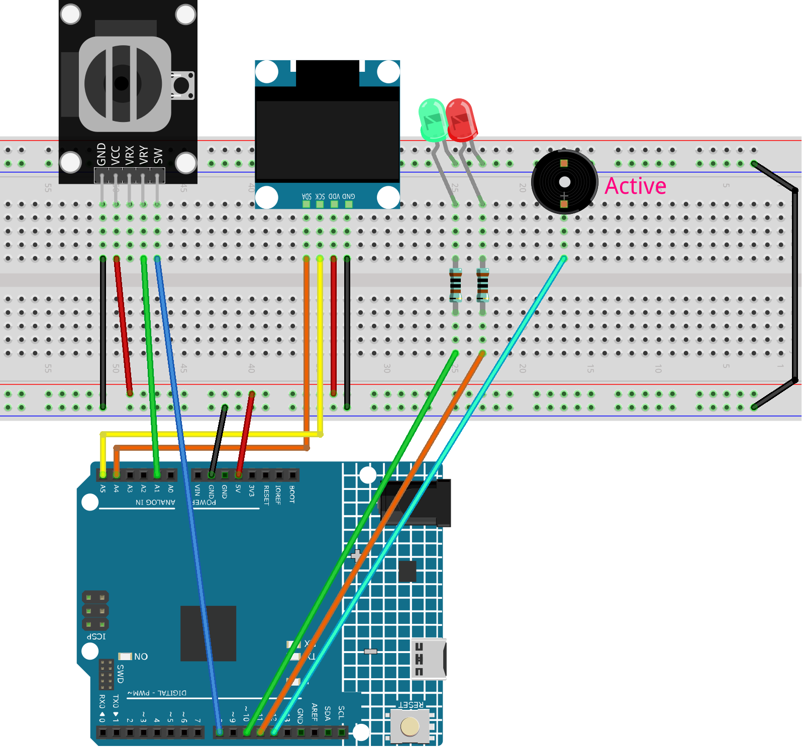

.. _brick_breaker2.0:

Brick Breaker2.0
==============================================================

.. note::
  
  🌟 Welcome to the SunFounder Facebook Community! Whether you're into Raspberry Pi, Arduino, or ESP32, you'll find inspiration, help ideas here.
   
  - ✅ Be the first to get free learning resources. 
   
  - ✅ Stay updated on new products & exclusive giveaways. 
   
  - ✅ Share your creations and get real feedback.
   
  * 👉 Need faster updates or support? Click [|link_sf_facebook|] join our Facebook community 

  * 👉 Or join our WhatsApp group: Click [|link_sf_whatsapp|]
   
Kit purchase
------------------------

Looking for parts? Check out our all-in-one kits below — packed with components, beginner-friendly guides, and tons of fun.

.. image:: img/elite_explore_kit.png
   :width: 100%
   :align: center
   :target: https://www.sunfounder.com/collections/arduino-kits-bundles/products/sunfounder-elite-explorer-kit-with-official-arduino-uno-r4-wifi?ref=jbzmncle

.. raw:: html

     

.. list-table::
   :widths: 20 20 20
   :header-rows: 1

   * - Name
     - Includes Arduino board
     - PURCHASE LINK
   * - Ultimate Sensor Kit
     - Arduino Uno R4 Minima
     - |link_ultimate_sensor_buy|
   * - Elite Explorer Kit
     - Arduino Uno R4 WiFi
     - |link_elite_buy|
   * - 3 in 1 Ultimate Starter Kit
     - Arduino Uno R4 Minima
     - |link_arduinor4_buy|
   * - Universal Maker Sensor Kit
     - ×
     - |link_umsk_buy|

Course Introduction
------------------------

In this lesson, we’ll build a Breakout-style game on an SSD1306 OLED using a joystick, LEDs, and an active buzzer, where you control a paddle to bounce a ball, break bricks, and win before the ball falls.

.. raw:: html

  <iframe width="700" height="394" src="https://www.youtube.com/embed/7pZ717-XMPE" title="YouTube video player" frameborder="0" allow="accelerometer; autoplay; clipboard-write; encrypted-media; gyroscope; picture-in-picture; web-share" referrerpolicy="strict-origin-when-cross-origin" allowfullscreen></iframe>

.. note::

  If this is your first time working with an Arduino project, we recommend downloading and reviewing the basic materials first.

  * :ref:`install_arduino`
  * :ref:`introduce_arduino`

**Required Components**

In this project, we need the following components:

.. list-table::
    :widths: 5 20 5 20
    :header-rows: 1

    *   - SN
        - COMPONENT INTRODUCTION	
        - QUANTITY
        - PURCHASE LINK

    *   - 1
        - Arduino UNO R4 WIFI
        - 1
        - |link_unor4_wifi_buy|
    *   - 2
        - USB Type-C cable
        - 1
        - 
    *   - 3
        - Breadboard
        - 1
        - |link_breadboard_buy|
    *   - 4
        - Wires
        - Several
        - |link_wires_buy|
    *   - 5
        - Joystick Module
        - 1
        - |link_joystick_buy|
    *   - 6
        - OLED Display Module
        - 1
        - |link_oled_buy|
    *   - 7
        - Active Buzzer
        - 1
        - 
    *   - 8
        - LED
        - 2
        - |link_led_buy|

**Wiring**

**Common Connections:**

* **OLED Display Module**

  - **SDA:** Connect to **A4** on the Arduino.
  - **SCK:** Connect to **A5** on the Arduino.
  - **GND:** Connect to breadboard’s negative power bus.
  - **VCC:** Connect to breadboard’s red power bus.

* **Joystick Module**

  - **VRY:** Connect to **A1** on the Arduino.
  - **SW:** Connect to **8** on the Arduino.
  - **GND:** Connect to breadboard’s negative power bus.
  - **VCC:** Connect to breadboard’s red power bus.

* **Active Buzzer**

  - **＋:** Connect to **12** on the Arduino.
  - **－:** Connect to breadboard’s negative power bus.

* **LEDS**

  - **Green:** Connect the LED **anode** to a **1kΩ resistor**, then to **10** on the Arduino, and the **cathode** to  the negative power bus on the breadboard.
  - **Red:** Connect the LED **anode** to a **1kΩ resistor**, then to **11** on the Arduino, and the **cathode** to  the negative power bus on the breadboard.

**Writing the Code**

.. note::

    * You can copy this code into **Arduino IDE**. 
    * To install the library, use the Arduino Library Manager and search for **Adafruit_GFX** and **Adafruit SSD1306** and install it.
    * Don't forget to select the board(Arduino UNO R4 Minima) and the correct port before clicking the **Upload** button.

.. code-block:: arduino

      /*
        Simple Breakout Game on SSD1306 OLED (128x64)
        - Display: SSD1306 I2C OLED (address 0x3C)
        - Input: Analog joystick (we only use the Y axis on A1), Reset button on D8 (INPUT_PULLUP)
        - Outputs:
            * Active buzzer on D12 (HIGH = ON)
            * Red LED on D11
            * Green LED on D10
        - Behavior:
            * Before game starts (or on end screen): Red ON, Green OFF
            * During gameplay: Red OFF, Green ON
            * Beep once when a brick is hit
            * Different end sounds for win/lose (rhythm patterns; active buzzer has a fixed tone)
        NOTE:
            If your panel is 128x32, change SCREEN_HEIGHT to 32 and reduce brick rows.
      */

      #include <Wire.h>
      #include <Adafruit_GFX.h>
      #include <Adafruit_SSD1306.h>

      // -------------------- Display configuration --------------------
      // OLED logical width/height in pixels. 128x64 is common for 0.96" panels.
      // If you see graphics "wrapping" on top, double-check this height.
      #define SCREEN_WIDTH 128
      #define SCREEN_HEIGHT 64

      // -1 means we are not using a dedicated RESET pin for the OLED module.
      #define OLED_RESET -1
      // I2C address for many SSD1306 modules is 0x3C.
      #define SCREEN_ADDRESS 0x3C

      // Create a display object bound to the global Wire (I2C) bus.
      Adafruit_SSD1306 display(SCREEN_WIDTH, SCREEN_HEIGHT, &Wire, OLED_RESET);

      // -------------------- Inputs --------------------
      // We only use the joystick's Y-axis (A1). Analog reads return 0..1023.
      // Center is usually ~512. You'll see slight variations with real hardware.
      const int yPin = A1;

      // Reset button pin. With INPUT_PULLUP, the pin reads HIGH when not pressed,
      // and reads LOW when the button is pressed (wired to ground).
      const int swPin = 8;

      // -------------------- Outputs --------------------
      // Active buzzer: plays a fixed tone when set HIGH.
      // (Different from a passive buzzer that needs tone() to generate frequency.)
      const int buzzerPin  = 12;

      // Two status LEDs to indicate game states.
      const int redLedPin  = 11;
      const int greenLedPin= 10;

      // Brick-hit beep length in milliseconds. Adjust to taste (50..100 is common).
      const int BEEP_MS    = 60;

      // -------------------- Game objects and parameters --------------------
      // Paddle horizontal position. Y is fixed near the bottom.
      int paddleX;

      // Paddle size in pixels. Height is small so ball can slip past it if missed.
      const int paddleWidth = 30;
      const int paddleHeight = 3;

      // Bricks arranged in a grid (rows x cols).
      const int brickRows = 3;
      const int brickCols = 6;

      // Each brick's width is computed to fill the screen width evenly.
      const int brickWidth = SCREEN_WIDTH / brickCols;
      // Brick height in pixels. Thin bricks make the playfield taller.
      const int brickHeight = 5;

      // 2D boolean grid indicating whether a brick is still present.
      bool bricks[brickRows][brickCols];

      // Joystick "dead zone" (ignore tiny movements around center).
      const int deadZone = 100;

      // Paddle step per frame when joystick is tilted far enough.
      const int speed = 8;

      // Ball speed (pixels per frame). It increases as the player hits the paddle
      // more times. We normalize the (dx,dy) so magnitude equals this speed.
      float ballSpeed = 3.0;

      // Game state flags.
      bool gameOver = false;
      bool gameWin = false;

      // Ball position (float allows sub-pixel movement for smoother motion).
      float ballX, ballY;
      // Ball velocity components.
      float ballDX, ballDY;

      // Counts how many times the ball has hit the paddle.
      // Used to ramp up the ballSpeed at certain milestones.
      int hitCount = 0;

      // -------------------- Helpers: buzzer & LEDs --------------------

      // Play a single short beep on the active buzzer.
      // NOTE: This uses delay() and is blocking for the duration.
      // For small effects like hits/end sounds it's fine.
      void buzzOnce(int ms = BEEP_MS) {
        digitalWrite(buzzerPin, HIGH);
        delay(ms);
        digitalWrite(buzzerPin, LOW);
      }

      // "Win" jingle using rhythm only (active buzzer has fixed tone).
      // Pattern: short - short - long
      void playWinSound() {
        for (int i = 0; i < 2; i++) {
          buzzOnce(80);
          delay(80);   // small gap between beeps
        }
        buzzOnce(200);
      }

      // "Lose" jingle using rhythm only.
      // Pattern: long - short - short
      void playLoseSound() {
        buzzOnce(200);
        delay(80);
        for (int i = 0; i < 2; i++) {
          buzzOnce(80);
          delay(80);
        }
      }

      // LED state: waiting (before start or on end screen).
      void setWaitingLeds() {
        digitalWrite(redLedPin, HIGH);
        digitalWrite(greenLedPin, LOW);
      }

      // LED state: actively playing.
      void setPlayingLeds() {
        digitalWrite(redLedPin, LOW);
        digitalWrite(greenLedPin, HIGH);
      }

      // -------------------- Arduino setup() --------------------
      void setup() {
        // Button uses the internal pull-up resistor.
        pinMode(swPin, INPUT_PULLUP);

        // Serial is optional but helpful for debugging.
        Serial.begin(9600);

        // Use an unconnected analog pin to seed the random generator.
        // This adds some real-world noise so ball angles vary each reset.
        randomSeed(analogRead(A2));

        // Configure outputs.
        pinMode(buzzerPin, OUTPUT);
        pinMode(redLedPin, OUTPUT);
        pinMode(greenLedPin, OUTPUT);
        digitalWrite(buzzerPin, LOW);

        // Show "waiting" state on power-up until the game is initialized.
        setWaitingLeds();

        // Initialize the OLED. If it fails, print an error and halt.
        if (!display.begin(SSD1306_SWITCHCAPVCC, SCREEN_ADDRESS)) {
          Serial.println(F("SSD1306 allocation failed"));
          for (;;); // Trap CPU here if display is not found or fails to init.
        }

        // Start immediately. You can change this to wait for a button press if desired.
        resetGame(); // Also switches LEDs to "playing" state.
      }

      // -------------------- Arduino loop() --------------------
      void loop() {
        // If the game has ended, show the end screen and handle restart.
        if (gameOver || gameWin) {
          showGameOverScreen();
          return; // Prevent normal gameplay logic from running.
        }

        // ----- 1) Read joystick and move paddle -----
        // Analog read returns 0..1023; center is ~512. We ignore values near center
        // (dead zone) to avoid jitter when the stick is released.
        int yValue = analogRead(yPin);

        if (abs(yValue - 512) > deadZone) {
          // Below ~400 means "tilted left", above ~600 means "tilted right".
          // These thresholds are a simple way to decide direction.
          if (yValue < 400) paddleX -= speed;      // move left
          else if (yValue > 600) paddleX += speed; // move right
        }

        // Keep the paddle inside the screen horizontally.
        paddleX = constrain(paddleX, 0, SCREEN_WIDTH - paddleWidth);

        // ----- 2) Move the ball -----
        // Save previous position; we use it to guess collision side on bricks.
        int oldBallX = ballX;
        int oldBallY = ballY;

        // Add velocity to position.
        ballX += ballDX;
        ballY += ballDY;

        // ----- 3) Collide with screen boundaries -----
        // Left/right walls: invert X velocity when we touch edges.
        if (ballX <= 0 || ballX >= SCREEN_WIDTH - 2) ballDX = -ballDX;

        // Top wall: invert Y velocity when we touch the top.
        if (ballY <= 0) ballDY = -ballDY;

        // ----- 4) Collide with the paddle -----
        // Simple AABB check: is the ball near the bottom where the paddle is,
        // and horizontally within the paddle width?
        if (ballY >= SCREEN_HEIGHT - paddleHeight - 1 &&
            ballX >= paddleX && ballX <= paddleX + paddleWidth) {
          // Bounce upward
          ballDY = -ballDY;

          // Count paddle hits and increase ball speed at certain milestones.
          hitCount++;
          if (hitCount == 2) ballSpeed = 4.0;
          if (hitCount == 4) ballSpeed = 5.0;
          if (hitCount == 6) ballSpeed = 6.0;

          // Cap the max speed for playability.
          ballSpeed = min(ballSpeed, 6.0);

          // Re-normalize (dx,dy) so their magnitude equals ballSpeed.
          normalizeBallSpeed();
        }

        // ----- 5) Collide with bricks (and beep when a brick is hit) -----
        // We also keep track of how many bricks remain to detect "win".
        int remainingBricks = 0;

        for (int i = 0; i < brickRows; i++) {
          for (int j = 0; j < brickCols; j++) {
            if (bricks[i][j]) {
              remainingBricks++;

              // Compute this brick's top-left corner.
              int brickX = j * brickWidth;
              int brickY = i * brickHeight;

              // Very simple overlap test: treat the ball as a small box of size ~4x4
              // by checking +/- 2 pixels around its center.
              bool hitX = (ballX + 2 >= brickX && ballX - 2 <= brickX + brickWidth);
              bool hitY = (ballY + 2 >= brickY && ballY - 2 <= brickY + brickHeight);

              if (hitX && hitY) {
                // Remove the brick.
                bricks[i][j] = false;

                // Reflect ball depending on which side we likely hit.
                // We compare with the old position to "guess" the collision axis.
                if (oldBallX < brickX || oldBallX > brickX + brickWidth) {
                  ballDX = -ballDX; // Hit from left/right -> flip X
                }
                if (oldBallY < brickY || oldBallY > brickY + brickHeight) {
                  ballDY = -ballDY; // Hit from top/bottom -> flip Y
                }

                // Play a short beep for feedback.
                buzzOnce(BEEP_MS);

                // Keep speed consistent after direction change.
                normalizeBallSpeed();

                // Exit inner loop early so we don't hit multiple bricks in one frame.
                break;
              }
            }
          }
        }

        // ----- 6) Win/Lose checks -----
        // Win: all bricks removed.
        if (remainingBricks == 0) {
          gameWin = true;
        }

        // Lose: ball falls below the bottom edge of the screen.
        if (ballY > SCREEN_HEIGHT) {
          gameOver = true;
        }

        // ----- 7) Draw the current frame -----
        drawGame();

        // ----- 8) Frame pacing -----
        // This small delay helps regulate the game speed and reduces CPU usage.
        // Note: Beeps and end sounds also use delay(), so overall pacing is human-friendly.
        delay(10);
      }

      // -------------------- Reset the game --------------------
      void resetGame() {
        // Clear game-over flags and set initial paddle/ball states.
        gameOver = false;
        gameWin = false;

        // Place the paddle at the horizontal center near the bottom.
        paddleX = SCREEN_WIDTH / 2 - paddleWidth / 2;

        // Place the ball roughly in the middle of the screen.
        ballX = SCREEN_WIDTH / 2;
        ballY = SCREEN_HEIGHT / 2;

        // Reset the ball speed and the hit counter.
        ballSpeed = 3.0;
        hitCount = 0;

        // Choose a random launch angle. We pick two ranges:
        // 30..60 degrees or 120..150 degrees, then aim upward (negative Y).
        float angle;
        if (random(0, 2) == 0) {
          angle = random(30, 60);
        } else {
          angle = random(120, 150);
        }

        // Convert degrees to radians and compute initial velocity components.
        ballDX = ballSpeed * cos(radians(angle));
        ballDY = -ballSpeed * sin(radians(angle));  // negative Y = up on the screen

        // Initialize all bricks to "present".
        for (int i = 0; i < brickRows; i++) {
          for (int j = 0; j < brickCols; j++) {
            bricks[i][j] = true;
          }
        }

        // Switch LEDs to indicate active gameplay.
        setPlayingLeds();

        // Draw the initial frame.
        drawGame();
      }

      // -------------------- Keep ball speed consistent --------------------
      // Normalize (dx,dy) so that sqrt(dx^2 + dy^2) == ballSpeed.
      // This prevents the ball from gradually speeding up or slowing down after bounces.
      void normalizeBallSpeed() {
        float magnitude = sqrt(ballDX * ballDX + ballDY * ballDY);
        if (magnitude == 0) return; // Avoid division by zero (should not happen)
        ballDX = (ballDX / magnitude) * ballSpeed;
        ballDY = (ballDY / magnitude) * ballSpeed;
      }

      // -------------------- Render everything on the OLED --------------------
      void drawGame() {
        // Clear the internal display buffer (does not show until display.display()).
        display.clearDisplay();

        // Draw paddle at the bottom. Y is SCREEN_HEIGHT - paddleHeight.
        display.fillRect(paddleX, SCREEN_HEIGHT - paddleHeight, paddleWidth, paddleHeight, WHITE);

        // Draw the ball. Radius=2 pixels is a good size for this resolution.
        display.fillCircle(ballX, ballY, 2, WHITE);

        // Draw remaining bricks. We subtract 1px from width/height to create a small gap.
        for (int i = 0; i < brickRows; i++) {
          for (int j = 0; j < brickCols; j++) {
            if (bricks[i][j]) {
              display.fillRect(j * brickWidth, i * brickHeight, brickWidth - 1, brickHeight - 1, WHITE);
            }
          }
        }

        // Push the buffer to the panel so the player can see the frame.
        display.display();
      }

      // -------------------- End screen & restart handling --------------------
      void showGameOverScreen() {
        // On the end screen we show "waiting" LEDs: red ON, green OFF.
        setWaitingLeds();

        // Prepare the message.
        display.clearDisplay();
        display.setTextSize(2);   // Bigger text for readability
        display.setTextColor(WHITE);
        display.setCursor(20, 30);

        // Show message and play the corresponding sound.
        if (gameWin) {
          display.println("You Win!");
          display.display();
          playWinSound();
        } else {
          display.println("Game Over");
          display.display();
          playLoseSound();
        }

        // Wait here until the button is pressed (active LOW).
        // Because we use INPUT_PULLUP, HIGH means "not pressed".
        while (digitalRead(swPin) == HIGH);

        // Basic debounce: wait a bit after the press is detected.
        delay(500);

        // Start a new game.
        resetGame();
      }
