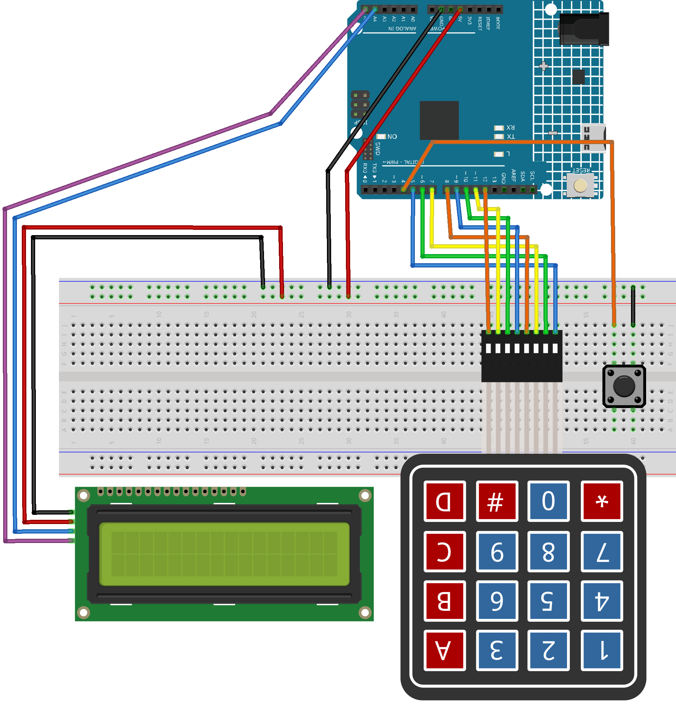

.. _calculator:

Calculator
==============================================================

.. note::
  
  🌟 Welcome to the SunFounder Facebook Community! Whether you're into Raspberry Pi, Arduino, or ESP32, you'll find inspiration, help ideas here.
   
  - ✅ Be the first to get free learning resources. 
   
  - ✅ Stay updated on new products & exclusive giveaways. 
   
  - ✅ Share your creations and get real feedback.
   
  * 👉 Need faster updates or support? Click [|link_sf_facebook|] join our Facebook community 

  * 👉 Or join our WhatsApp group: Click [|link_sf_whatsapp|]
   
Kit purchase
------------------------

Looking for parts? Check out our all-in-one kits below — packed with components, beginner-friendly guides, and tons of fun.

.. image:: img/elite_explore_kit.png
   :width: 100%
   :align: center
   :target: https://www.sunfounder.com/collections/arduino-kits-bundles/products/sunfounder-elite-explorer-kit-with-official-arduino-uno-r4-wifi?ref=jbzmncle

.. raw:: html

     

.. list-table::
   :widths: 20 20 20
   :header-rows: 1

   * - Name
     - Includes Arduino board
     - PURCHASE LINK
   * - Ultimate Sensor Kit
     - Arduino Uno R4 Minima
     - |link_ultimate_sensor_buy|
   * - Elite Explorer Kit
     - Arduino Uno R4 WiFi
     - |link_elite_buy|
   * - 3 in 1 Ultimate Starter Kit
     - Arduino Uno R4 Minima
     - |link_arduinor4_buy|
   * - Universal Maker Sensor Kit
     - ×
     - |link_umsk_buy|

Course Introduction
------------------------

This project creates a basic calculator using an Arduino, a 4×4 keypad, an I2C LCD, and a backspace button. 

Users input expressions via the keypad, view results on the LCD, and use * to clear or the button to delete characters.

.. raw:: html
 
  <iframe width="700" height="394" src="https://www.youtube.com/embed/ycnotjYgYik?si=O7JOw9KEJYwVpxTy" title="YouTube video player" frameborder="0" allow="accelerometer; autoplay; clipboard-write; encrypted-media; gyroscope; picture-in-picture; web-share" referrerpolicy="strict-origin-when-cross-origin" allowfullscreen></iframe>

.. note::

  If this is your first time working with an Arduino project, we recommend downloading and reviewing the basic materials first.
  
  * :ref:`install_arduino`
  * :ref:`introduce_arduino`

**Required Components**

In this project, we need the following components:

.. list-table::
    :widths: 5 20 5 20
    :header-rows: 1

    *   - SN
        - COMPONENT INTRODUCTION	
        - QUANTITY
        - PURCHASE LINK

    *   - 1
        - Arduino UNO R4 Minima/Arduino UNO R4 WIFI
        - 1
        - |link_unor4_buy|
    *   - 2
        - USB Type-C cable
        - 1
        - 
    *   - 3
        - Breadboard
        - 1
        - |link_breadboard_buy|
    *   - 4
        - Wires
        - Several
        - |link_wires_buy|
    *   - 5
        - Button
        - 1
        - |link_button_buy|
    *   - 6
        - KeyPad
        - 1
        - |link_keypad_buy|
    *   - 7
        - I2C LCD 1602
        - 1
        - |link_i2clcd1602_buy|

**Wiring**

**Common Connections:**

* **Keypad**

  - **RowPins:** Connect to  **5** to **8** on the Arduino.
  - **ColPins:** Connect to **9** to **12** on the Arduino.

* **I2C LCD 1602**

  - **SDA:** Connect to **A4** on the Arduino.
  - **SCL:** Connect to **A5** on the Arduino.
  - **GND:** Connect to breadboard’s negative power bus.
  - **VCC:** Connect to breadboard’s red power bus.

* **Button**

  - Connect to breadboard’s negative power bus.
  - Connect to **4** on the Arduino.

**Writing the Code**

.. note::

    * You can copy this code into **Arduino IDE**. 
    * To install the library, use the Arduino Library Manager and search for **LiquidCrystal I2C** and **Adafruit_Keypad** install it.
    * Don't forget to select the board(Arduino UNO R4 WIFI) and the correct port before clicking the **Upload** button.

.. code-block:: arduino

      #include <Adafruit_Keypad.h>
      #include <LiquidCrystal_I2C.h>

      // LCD settings
      LiquidCrystal_I2C lcd(0x27, 16, 2);

      // Red backspace button (pin 4 with internal pull-up)
      const int BACKSPACE_PIN = 4;

      // 4×4 keypad setup
      const byte ROWS = 4, COLS = 4;
      char keys[ROWS][COLS] = {
        { '1','2','3','A' },
        { '4','5','6','B' },
        { '7','8','9','C' },
        { '*','0','#','D' }
      };
      byte rowPins[ROWS] = {5, 6, 7, 8};
      byte colPins[COLS] = {9, 10, 11, 12};
      Adafruit_Keypad keypad(makeKeymap(keys), rowPins, colPins, ROWS, COLS);

      // Store the math expression as a string
      String expression = "";

      void setup() {
        Serial.begin(9600);
        lcd.init();
        lcd.backlight();
        keypad.begin();

        pinMode(BACKSPACE_PIN, INPUT_PULLUP);  // use internal pull-up

        lcd.setCursor(0, 0);
        lcd.print("Calculator Ready");
        delay(2000);  // show for 2 seconds
        lcd.clear();
      }

      void loop() {
        keypad.tick();

        // Check keypad input
        if (keypad.available()) {
          auto e = keypad.read();
          if (e.bit.EVENT == KEY_JUST_PRESSED) {
            char key = e.bit.KEY;

            if (isDigit(key)) {
              // Add digit to expression
              expression += key;
            } else if (key == 'A') {
              expression += '+';
            } else if (key == 'B') {
              expression += '-';
            } else if (key == 'C') {
              expression += '*';
            } else if (key == 'D') {
              expression += '/';
            } else if (key == '*') {
              // Clear everything
              expression = "";
              lcd.clear();
            } else if (key == '#') {
              // Calculate result
              float result = evaluateExpression(expression);
              lcd.setCursor(0, 1);
              lcd.print("= ");
              lcd.print(result, 2);  // show 2 decimal places
              return;  // return to top of loop
            }
            updateLCD();
          }
        }

        // Backspace button: remove last character
        static bool lastButtonState = HIGH;
        bool buttonState = digitalRead(BACKSPACE_PIN);
        if (lastButtonState == HIGH && buttonState == LOW) {
          if (expression.length() > 0) {
            expression.remove(expression.length() - 1);
            updateLCD();
          }
        }
        lastButtonState = buttonState;
      }

      // Show expression on line 0, clear line 1
      void updateLCD() {
        lcd.setCursor(0, 0);
        lcd.print("                ");  // clear line 0
        lcd.setCursor(0, 0);
        lcd.print(expression);
        lcd.setCursor(0, 1);
        lcd.print("                ");  // clear line 1
      }

      // Support multiple operators: left-to-right evaluation without precedence
      float evaluateExpression(String exp) {
        float result = 0;
        float num = 0;
        char op = '+';  // start with addition

        for (int i = 0; i < exp.length(); i++) {
          char c = exp[i];
          bool isLast = (i == exp.length() - 1);

          if (isDigit(c)) {
            // build the current number
            num = num * 10 + (c - '0');
          }

          // if we reach an operator or the end of the string, apply the previous op
          if (!isDigit(c) || isLast) {
            switch (op) {
              case '+': result += num; break;
              case '-': result -= num; break;
              case '*': result *= num; break;
              case '/': result = (num != 0 ? result / num : 0); break;
            }
            num = 0;     // reset number
            op = c;      // set new operator (may be digit on last iteration, but it's not used further)
          }
        }
        return result;
      }
