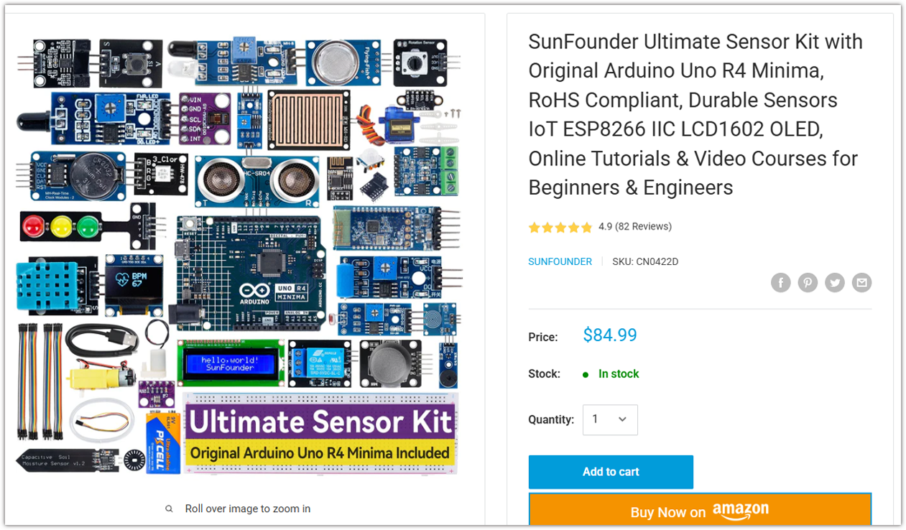
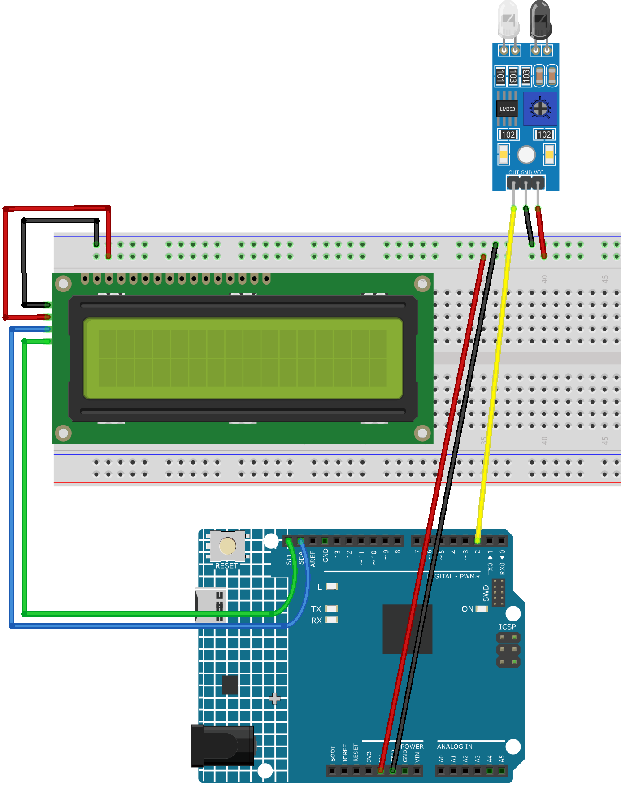

.. _cat_feeding:

Cat Feeding
==============================================================

.. note::
  
  🌟 Welcome to the SunFounder Facebook Community! Whether you're into Raspberry Pi, Arduino, or ESP32, you'll find inspiration, help ideas here.
   
  - ✅ Be the first to get free learning resources. 
   
  - ✅ Stay updated on new products & exclusive giveaways. 
   
  - ✅ Share your creations and get real feedback.
   
  * 👉 Need faster updates or support? Click [|link_sf_facebook|] join our Facebook community 

  * 👉 Or join our WhatsApp group: Click [|link_sf_whatsapp|]
   
Kit purchase
------------------------

Looking for parts? Check out our all-in-one kits below — packed with components, beginner-friendly guides, and tons of fun.

.. raw:: html

     

.. list-table::
   :widths: 20 20 20
   :header-rows: 1

   * - Name
     - Includes Arduino board
     - PURCHASE LINK
   * - Ultimate Sensor Kit
     - Arduino Uno R4 Minima
     - |link_ultimate_sensor_buy|
   * - Universal Maker Sensor Kit
     - ×
     - |link_umsk_buy|

Course Introduction
------------------------

In this lesson, you'll use an I2C LCD and an IR sensor with the Arduino UNO R4 to create a fun cat feeding game.

Each time the IR sensor detects a fish, the cat receives a meal and the LCD displays a new message. Keep feeding the cat to unlock all of its reactions.

.. .. raw:: html

..  <iframe width="700" height="394" src="https://www.youtube.com/embed/Qukv_z52B-4" title="YouTube video player" frameborder="0" allow="accelerometer; autoplay; clipboard-write; encrypted-media; gyroscope; picture-in-picture; web-share" referrerpolicy="strict-origin-when-cross-origin" allowfullscreen></iframe>

.. note::

  If this is your first time working with an Arduino project, we recommend downloading and reviewing the basic materials first.
  
  * :ref:`install_arduino`
  * :ref:`introduce_arduino`

**Required Components**

In this project, we need the following components:

.. list-table::
    :widths: 5 20 5 20
    :header-rows: 1

    *   - SN
        - COMPONENT INTRODUCTION	
        - QUANTITY
        - PURCHASE LINK

    *   - 1
        - Arduino UNO R4 Minima/Arduino UNO R4 WIFI
        - 1
        - |link_arduinor4_buy|
    *   - 2
        - USB Type-C cable
        - 1
        - 
    *   - 3
        - Breadboard
        - 1
        - |link_breadboard_buy|
    *   - 4
        - Wires
        - Several
        - |link_wires_buy|
    *   - 5
        - I2C LCD 1602
        - 1
        - |link_i2clcd1602_buy|
    *   - 6
        - IR Obstacle Avoidance Sensor Module
        - 1
        - |link_IR_module_buy|

**Wiring**

**Common Connections:**

* **IR Obstacle Avoidance Sensor Module**

  - **OUT:** Connect to **2** on the Arduino.
  - **GND:** Connect to breadboard’s negative power bus.
  - **VCC:** Connect to breadboard’s red power bus.

* **I2C LCD 1602**

  - **SDA:** Connect to **SDA** on the Arduino.
  - **SCL:** Connect to **SCL** on the Arduino.
  - **GND:** Connect to breadboard’s negative power bus.
  - **VCC:** Connect to breadboard’s red power bus.

**Writing the Code**

.. note::

    * You can copy this code into **Arduino IDE**. 
    * To install the library, use the Arduino Library Manager and search for **LiquidCrystal_I2C** and install it.
    * Don't forget to select the board(Arduino UNO R4 Minima/WIFI) and the correct port before clicking the **Upload** button.

.. code-block:: arduino

      /*
        Cat Feeding Game
        Board: Arduino UNO R4 Minima

        I2C LCD 1602:
        VCC -> 5V
        GND -> GND
        SDA -> A4 / SDA
        SCL -> A5 / SCL

        3-pin IR sensor:
        VCC -> 5V
        GND -> GND
        OUT -> D2
      */

      #include <Wire.h>
      #include <LiquidCrystal_I2C.h>

      // Most I2C LCD modules use address 0x27.
      // If the screen does not work, try changing 0x27 to 0x3F.
      LiquidCrystal_I2C lcd(0x27, 16, 2);

      // IR sensor output pin
      const byte IR_SENSOR_PIN = 2;

      // Most IR obstacle sensors output LOW when detecting an object.
      // Change LOW to HIGH if your sensor works in reverse.
      const byte SENSOR_ACTIVE_STATE = LOW;

      // Debounce and repeated-detection protection
      const unsigned long SENSOR_DEBOUNCE_TIME = 50;
      const unsigned long DETECTION_COOLDOWN = 500;

      // Number of detected fish
      byte fishCount = 0;

      // Sensor state variables
      bool lastRawState = false;
      bool stableState = false;
      bool objectAlreadyCounted = false;

      unsigned long lastSensorChangeTime = 0;
      unsigned long lastDetectionTime = 0;

      // Clear the LCD and print two lines
      void showMessage(const char *line1, const char *line2 = "") {
        lcd.clear();

        lcd.setCursor(0, 0);
        lcd.print(line1);

        lcd.setCursor(0, 1);
        lcd.print(line2);
      }

      // Update the LCD according to the number of fish
      void updateGameDisplay() {
        switch (fishCount) {
          case 0:
            showMessage("pls food");
            break;

          case 1:
            showMessage("only 1 ???", "still more");
            break;

          case 2:
            showMessage("still more!!!");
            break;

          case 3:
            showMessage("DONT BE STINGY");
            break;

          case 4:
            showMessage("I think I could", "have one more...");
            break;
        }
      }

      // Run when a new fish is detected
      void feedOneFish() {
        // Stop counting after four fish
        if (fishCount >= 4) {
          return;
        }

        fishCount++;

        Serial.print("Fish detected. Total: ");
        Serial.println(fishCount);

        updateGameDisplay();
      }

      void setup() {
        Serial.begin(115200);

        pinMode(IR_SENSOR_PIN, INPUT);

        // Start the LCD
        lcd.init();
        lcd.backlight();

        // Show the initial state
        updateGameDisplay();

        // Read the initial sensor state
        bool initialReading =
            digitalRead(IR_SENSOR_PIN) == SENSOR_ACTIVE_STATE;

        lastRawState = initialReading;
        stableState = initialReading;

        /*
          If an object is already in front of the sensor when powered on,
          wait until it is removed before counting.
        */
        objectAlreadyCounted = initialReading;

        Serial.println("Cat Feeding Game ready.");
      }

      void loop() {
        // Convert the sensor signal into:
        // true  = object detected
        // false = no object
        bool currentRawState =
            digitalRead(IR_SENSOR_PIN) == SENSOR_ACTIVE_STATE;

        // Raw signal changed
        if (currentRawState != lastRawState) {
          lastRawState = currentRawState;
          lastSensorChangeTime = millis();
        }

        // Accept the new state only after it remains stable
        if (
          millis() - lastSensorChangeTime >= SENSOR_DEBOUNCE_TIME &&
          currentRawState != stableState
        ) {
          stableState = currentRawState;

          if (stableState) {
            // Object has just entered the detection area
            if (
              !objectAlreadyCounted &&
              millis() - lastDetectionTime >= DETECTION_COOLDOWN
            ) {
              feedOneFish();

              objectAlreadyCounted = true;
              lastDetectionTime = millis();
            }
          } else {
            /*
              The fish has left the detection area.
              The sensor is now ready to detect the next fish.
            */
            objectAlreadyCounted = false;
          }
        }
      }