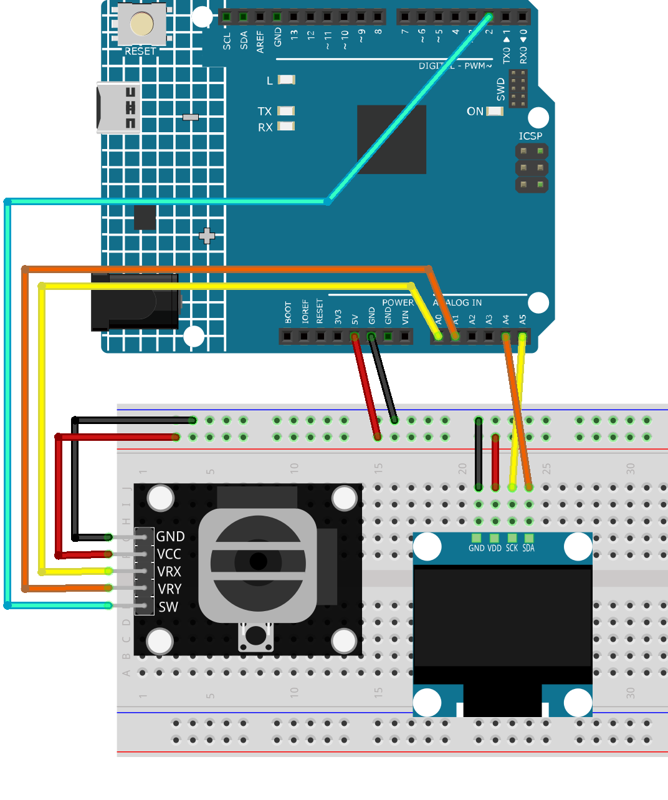

.. _catch_game:

Catch Game
==============================================================

.. note::
  
  🌟 Welcome to the SunFounder Facebook Community! Whether you're into Raspberry Pi, Arduino, or ESP32, you'll find inspiration, help ideas here.
   
  - ✅ Be the first to get free learning resources. 
   
  - ✅ Stay updated on new products & exclusive giveaways. 
   
  - ✅ Share your creations and get real feedback.
   
  * 👉 Need faster updates or support? Click [|link_sf_facebook|] join our Facebook community 

  * 👉 Or join our WhatsApp group: Click [|link_sf_whatsapp|]
   
Kit purchase
------------------------

Looking for parts? Check out our all-in-one kits below — packed with components, beginner-friendly guides, and tons of fun.

.. image:: img/elite_explore_kit.png
   :width: 100%
   :align: center
   :target: https://www.sunfounder.com/collections/arduino-kits-bundles/products/sunfounder-elite-explorer-kit-with-official-arduino-uno-r4-wifi?ref=jbzmncle

.. raw:: html

     

.. list-table::
   :widths: 20 20 20
   :header-rows: 1

   * - Name
     - Includes Arduino board
     - PURCHASE LINK
   * - Ultimate Sensor Kit
     - Arduino Uno R4 Minima
     - |link_ultimate_sensor_buy|
   * - Elite Explorer Kit
     - Arduino Uno R4 WiFi
     - |link_elite_buy|
   * - 3 in 1 Ultimate Starter Kit
     - Arduino Uno R4 Minima
     - |link_arduinor4_buy|
   * - Universal Maker Sensor Kit
     - ×
     - |link_umsk_buy|

Course Introduction
------------------------

This project is a simple catching game using an OLED display, joystick, and Arduino R4 UNO. Move the basket to catch falling apples and avoid spiky bombs. 

Catching apples increases your score, while bombs reduce it. Press the joystick button to start or restart the 30-second game.

.. raw:: html

  <iframe width="700" height="394" src="https://www.youtube.com/embed/6pLDcS7eF3A?si=HiP-DjcnpUNIi3L5" title="YouTube video player" frameborder="0" allow="accelerometer; autoplay; clipboard-write; encrypted-media; gyroscope; picture-in-picture; web-share" referrerpolicy="strict-origin-when-cross-origin" allowfullscreen></iframe>

.. note::

  If this is your first time working with an Arduino project, we recommend downloading and reviewing the basic materials first.

  * :ref:`install_arduino`
  * :ref:`introduce_arduino`

**Required Components**

In this project, we need the following components:

.. list-table::
    :widths: 5 20 5 20
    :header-rows: 1

    *   - SN
        - COMPONENT INTRODUCTION	
        - QUANTITY
        - PURCHASE LINK

    *   - 1
        - Arduino UNO R4 WIFI
        - 1
        - |link_unor4_wifi_buy|
    *   - 2
        - USB Type-C cable
        - 1
        - 
    *   - 3
        - Breadboard
        - 1
        - |link_breadboard_buy|
    *   - 4
        - Wires
        - Several
        - |link_wires_buy|
    *   - 5
        - Joystick Module
        - 1
        - |link_joystick_buy|
    *   - 6
        - OLED Display Module
        - 1
        - |link_oled_buy|

**Wiring**

**Common Connections:**

* **OLED Display Module**

  - **SDA:** Connect to **A4** on the Arduino.
  - **SCK:** Connect to **A5** on the Arduino.
  - **GND:** Connect to breadboard’s negative power bus.
  - **VCC:** Connect to breadboard’s red power bus.

* **Joystick Module**

  - **VRY:** Connect to **A1** on the Arduino.
  - **VRX:** Connect to **A0** on the Arduino.
  - **SW:** Connect to **2** on the Arduino.
  - **GND:** Connect to breadboard’s negative power bus.
  - **VCC:** Connect to breadboard’s red power bus.

**Writing the Code**

.. note::

    * You can copy this code into **Arduino IDE**. 
    * To install the library, use the Arduino Library Manager and search for **Adafruit SSD1306** and **Adafruit GFX** and install it.
    * Don't forget to select the board(Arduino UNO R4 Minima) and the correct port before clicking the **Upload** button.

.. code-block:: arduino

      #include <Wire.h>
      #include <Adafruit_GFX.h>
      #include <Adafruit_SSD1306.h>

      #define SCREEN_WIDTH 128
      #define SCREEN_HEIGHT 64
      #define OLED_RESET     -1

      Adafruit_SSD1306 display(SCREEN_WIDTH, SCREEN_HEIGHT, &Wire, OLED_RESET);

      const int JOY_X = A0;
      const int JOY_BTN = 2;

      struct Object {
        int x, y;
        bool isCoin;  // true = coin, false = bomb
        bool active;
      };

      Object falling;
      int playerX = SCREEN_WIDTH / 2;
      const int basketWidth = 16;
      int score = 0;
      unsigned long startTime;
      const int gameDuration = 30000; // 30s
      bool inGame = false;

      void setup() {
        pinMode(JOY_BTN, INPUT_PULLUP);
        display.begin(SSD1306_SWITCHCAPVCC, 0x3C);
        display.clearDisplay();
        display.setTextColor(SSD1306_WHITE);
        showTitle();
      }

      void loop() {
        if (!inGame) {
          if (digitalRead(JOY_BTN) == LOW) {
            delay(300);
            startGame();
          }
          return;
        }

        unsigned long now = millis();
        if (now - startTime >= gameDuration) {
          inGame = false;
          showGameOver();
          return;
        }

        updateJoystick();
        updateObject();
        checkCollision();
        drawGame();
        delay(50);
      }

      void showTitle() {
        display.clearDisplay();
        display.setTextSize(2);
        display.setCursor(15, 20);
        display.println("Catching");
        display.setTextSize(1);
        display.setCursor(20, 50);
        display.println("Press to Start");
        display.display();
      }

      void startGame() {
        inGame = true;
        score = 0;
        startTime = millis();
        playerX = SCREEN_WIDTH / 2;
        spawnObject();
      }

      void showGameOver() {
        display.clearDisplay();
        display.setTextSize(2);
        display.setCursor(10, 20);
        display.println("Game Over");
        display.setTextSize(1);
        display.setCursor(20, 50);
        display.print("Score: ");
        display.println(score);
        display.display();
      }

      void updateJoystick() {
        int x = analogRead(JOY_X);
        if (x < 400) playerX -= 4;
        if (x > 600) playerX += 4;
        playerX = constrain(playerX, 0, SCREEN_WIDTH - basketWidth);
      }

      void spawnObject() {
        falling.active = true;
        falling.y = 0;
        falling.x = random(0, SCREEN_WIDTH - 8);
        falling.isCoin = random(0, 10) < 7;  // 70% coin, 30% bomb
      }

      void updateObject() {
        if (!falling.active) return;
        falling.y += 4;
        if (falling.y > SCREEN_HEIGHT) {
          falling.active = false;
          spawnObject();
        }
      }

      void checkCollision() {
        if (!falling.active) return;

        if (falling.y + 6 >= 56 && falling.y + 6 <= 64) {
          if (falling.x + 6 >= playerX && falling.x <= playerX + basketWidth) {
            if (falling.isCoin) score += 1;
            else score -= 1;
            falling.active = false;
            spawnObject();
          }
        }
      }

      void drawGame() {
        display.clearDisplay();

        // Draw basket
        display.fillRect(playerX, 56, basketWidth, 6, SSD1306_WHITE);

        // Draw falling object
        if (falling.active) {
          if (falling.isCoin) {
            // Apple: big solid circle + stem + leaf
            display.fillCircle(falling.x + 6, falling.y + 6, 6, SSD1306_WHITE);          // Apple body
            display.drawLine(falling.x + 6, falling.y + 1, falling.x + 6, falling.y - 2, SSD1306_WHITE); // Stem
            display.drawPixel(falling.x + 5, falling.y - 3, SSD1306_WHITE);             // Leaf left
            display.drawPixel(falling.x + 7, falling.y - 3, SSD1306_WHITE);             // Leaf right
          } else {
            // Spiky bomb / mine: solid center + 4 spikes
            display.fillCircle(falling.x + 6, falling.y + 6, 5, SSD1306_WHITE);         // Body
            display.drawLine(falling.x + 6, falling.y + 1, falling.x + 6, falling.y - 2, SSD1306_WHITE); // Top spike
            display.drawLine(falling.x + 6, falling.y + 11, falling.x + 6, falling.y + 14, SSD1306_WHITE); // Bottom spike
            display.drawLine(falling.x + 1, falling.y + 6, falling.x - 2, falling.y + 6, SSD1306_WHITE); // Left spike
            display.drawLine(falling.x + 11, falling.y + 6, falling.x + 14, falling.y + 6, SSD1306_WHITE); // Right spike
          }
        }

        // Draw score
        display.setCursor(0, 0);
        display.setTextSize(1);
        display.print("Score: ");
        display.print(score);

        // Draw time left
        display.setCursor(80, 0);
        int remaining = (gameDuration - (millis() - startTime)) / 1000;
        display.print("Time: ");
        display.print(remaining);

        display.display();
      }
