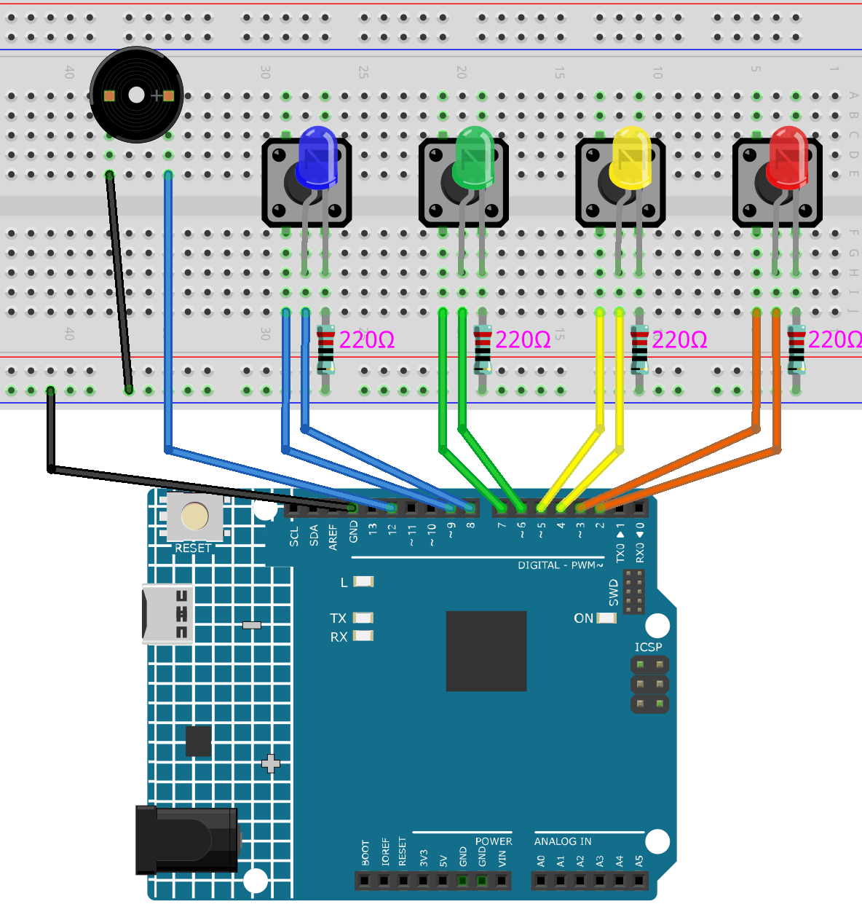

.. _color_memory:

Color Memory
==============================================================
.. note::
  
  Hello, welcome to the SunFounder Raspberry Pi & Arduino & ESP32 Enthusiasts Community on Facebook! Dive deeper into Raspberry Pi, Arduino, and ESP32 with fellow enthusiasts.

  👉 Ready to explore and create with us? Click [|link_sf_facebook|] and join today!

  To get all the components for this project, consider one of the kits below. 

  Each includes the required parts, extra components for other projects, and beginner-friendly tutorials.

  .. list-table::
    :widths: 20 20 20
    :header-rows: 1

    *   - Name	
        - Includes Arduino board
        - PURCHASE LINK
    *   - Electronic Kit	
        - ×
        - |link_electronic_buy|
    *   - Elite Explorer Kit	
        - Arduino Uno R4 WiFi
        - |link_elite_buy|
    *   - 3 in 1 Ultimate Starter Kit	
        - Arduino Uno R4 Minima
        - |link_arduinor4_buy|

Course Introduction
------------------------

In this lesson, you'll use four LCDs, four buttons, and a passive buzzer with the Arduino R4 UNO to create a color memory game.

At the start of the game, an LED lights up at random. The player must press the corresponding button to proceed. A wrong input ends the game.

.. raw:: html

    <iframe width="700" height="394" src="https://www.youtube.com/embed/Q4IQQDiqGEA?si=7FB24oI0t0SGbJW6" title="YouTube video player" frameborder="0" allow="accelerometer; autoplay; clipboard-write; encrypted-media; gyroscope; picture-in-picture; web-share" referrerpolicy="strict-origin-when-cross-origin" allowfullscreen></iframe>

.. note::

  If this is your first time working with an Arduino project, we recommend downloading and reviewing the basic materials first.
  
  * :ref:`install_arduino`
  * :ref:`introduce_arduino`

**Required Components**

In this project, we need the following components:

.. list-table::
    :widths: 5 20 5 20
    :header-rows: 1

    *   - SN
        - COMPONENT INTRODUCTION	
        - QUANTITY
        - PURCHASE LINK

    *   - 1
        - Arduino UNO R4 Minima
        - 1
        - |link_unor4_buy|
    *   - 2
        - USB Type-C cable
        - 1
        - 
    *   - 3
        - Breadboard
        - 1
        - |link_breadboard_buy|
    *   - 4
        - Wires
        - Several
        - |link_wires_buy|
    *   - 5
        - Passive Buzzer
        - 1
        - |link_passive_buzzer_buy|
    *   - 6
        - Button
        - 4
        - |link_button_buy|
    *   - 7
        - LED
        - 4
        - |link_led_buy|
    *   - 8
        - 220Ω resistor
        - 4
        - |link_resistor_buy|

**Wiring**

**Common Connections:**

* **LEDS**

  - **Blue:** Connect the LED **anode** to **8** on the Arduino, and the **cathode** to a **220Ω resistor**, then to the negative power bus on the breadboard.
  - **Green:** Connect the LED **anode** to **6** on the Arduino, and the **cathode** to a **220Ω resistor**, then to the negative power bus on the breadboard.
  - **Yellow:** Connect the LED **anode** to **4**on the Arduino , and the **cathode** to a **220Ω resistor**, then to the negative power bus on the breadboard.
  - **Red:** Connect the LED **anode** to **2** on the Arduino, and the **cathode** to a **220Ω resistor**, then to the negative power bus on the breadboard.

* **Passive Buzzer**

  - **＋:** Connect to **12** on the Arduino.
  - **－:** Connect to breadboard’s negative power bus.

* **Buttons**

  - **Blue Button:** Connect to the **Blue LED's cathode** on the breadboard, and the other end to **9** on the Arduino board.
  - **Green Butto:** Connect to the **Green LED's cathode** on the breadboard, and the other end to **7** on the Arduino board.
  - **Yellow Butto:** Connect to the **Yellow LED's cathode** on the breadboard, and the other end to **5** on the Arduino board.
  - **Red Butto:** Connect to the **Red LED's cathode** on the breadboard, and the other end to **3** on the Arduino board.

**Writing the Code**

.. note::

    * You can copy this code into **Arduino IDE**. 
    * Don't forget to select the board(Arduino UNO R4 Minima) and the correct port before clicking the **Upload** button.

.. code-block:: arduino

      // LED and button pin definitions
      const int redLED = 2;
      const int yellowLED = 4;
      const int greenLED = 6;
      const int blueLED = 8;
      const int redButton = 3;
      const int yellowButton = 5;
      const int greenButton = 7;
      const int blueButton = 9;
      const int buzzer = 12;

      int sequence[100]; // Store the random sequence
      int playerInput[100]; // Store the player's input sequence
      int level = 0; // Current game level
      bool gameOver = false; // Flag to check if the game is over

      void setup() {
        // Initialize pin modes
        pinMode(redLED, OUTPUT);
        pinMode(yellowLED, OUTPUT);
        pinMode(greenLED, OUTPUT);
        pinMode(blueLED, OUTPUT);
        
        pinMode(redButton, INPUT_PULLUP);
        pinMode(yellowButton, INPUT_PULLUP);
        pinMode(greenButton, INPUT_PULLUP);
        pinMode(blueButton, INPUT_PULLUP);
        
        pinMode(buzzer, OUTPUT);
        
        Serial.begin(9600); // Debugging purpose
        
        // Start the game
        startGame();
      }

      void loop() {
        if (!gameOver) {
          // Play the current color sequence
          playSequence();
          
          // Check player's input
          if (!getPlayerInput()) {
            endGame();
          } else {
            delay(500); // Shorten delay after player input
          }
        } else {
          // Restart the game after a short delay
          delay(1500); // Shorten restart delay
          startGame();
        }
      }

      void startGame() {
        // Initialize game state
        level = 1;
        gameOver = false;
        
        // Turn on all LEDs and play a sound to indicate game start
        digitalWrite(redLED, HIGH);
        digitalWrite(yellowLED, HIGH);
        digitalWrite(greenLED, HIGH);
        digitalWrite(blueLED, HIGH);
        tone(buzzer, 1000, 500);
        
        delay(500); // Shorten the LED on time at the start
        
        // Turn off all LEDs
        digitalWrite(redLED, LOW);
        digitalWrite(yellowLED, LOW);
        digitalWrite(greenLED, LOW);
        digitalWrite(blueLED, LOW);
        
        randomSeed(analogRead(A0)); // Use analog pin to generate a random seed
        delay(500); // Shortened delay before game starts
      }

      void playSequence() {
        // Generate a random LED sequence, ensure the number corresponds to a valid LED
        sequence[level - 1] = random(1, 5); // Generate random value between 1 and 4 for colors
        
        // Play the current LED and sound sequence
        for (int i = 0; i < level; i++) {
          lightUpLED(sequence[i]);
          delay(300); // Shortened delay between each sequence
        }
      }

      bool getPlayerInput() {
        for (int i = 0; i < level; i++) {
          bool inputReceived = false;
          
          while (!inputReceived) {
            if (digitalRead(redButton) == LOW) {
              playerInput[i] = 1; // Red button pressed
              lightUpLED(1); // Light up corresponding LED and play sound
              inputReceived = true;
            } else if (digitalRead(yellowButton) == LOW) {
              playerInput[i] = 2; // Yellow button pressed
              lightUpLED(2); // Light up corresponding LED and play sound
              inputReceived = true;
            } else if (digitalRead(greenButton) == LOW) {
              playerInput[i] = 3; // Green button pressed
              lightUpLED(3); // Light up corresponding LED and play sound
              inputReceived = true;
            } else if (digitalRead(blueButton) == LOW) {
              playerInput[i] = 4; // Blue button pressed
              lightUpLED(4); // Light up corresponding LED and play sound
              inputReceived = true;
            }
          }
          
          // Check if player input matches the sequence
          if (playerInput[i] != sequence[i]) {
            return false; // Player input is incorrect
          }
          delay(200); // Shorten delay after player input confirmation
        }
        level++; // Increase level after correct input
        return true;
      }

      void endGame() {
        gameOver = true; // Set game over flag
        
        // Flash LEDs and play sound to indicate the game is over
        for (int i = 0; i < 5; i++) {
          digitalWrite(redLED, HIGH);
          digitalWrite(yellowLED, HIGH);
          digitalWrite(greenLED, HIGH);
          digitalWrite(blueLED, HIGH);
          tone(buzzer, 1000, 300); // Quick sound for game over
          delay(200); // Faster flashing
          digitalWrite(redLED, LOW);
          digitalWrite(yellowLED, LOW);
          digitalWrite(greenLED, LOW);
          digitalWrite(blueLED, LOW);
          delay(200);
        }
      }

      void lightUpLED(int color) {
        // Light up the corresponding LED and play a sound based on the color
        switch (color) {
          case 1: // Red
            digitalWrite(redLED, HIGH);
            tone(buzzer, 500, 300);
            break;
          case 2: // Yellow
            digitalWrite(yellowLED, HIGH);
            tone(buzzer, 600, 300);
            break;
          case 3: // Green
            digitalWrite(greenLED, HIGH);
            tone(buzzer, 700, 300);
            break;
          case 4: // Blue
            digitalWrite(blueLED, HIGH);
            tone(buzzer, 800, 300);
            break;
        }
        delay(300); // Shorten LED on time
        
        // Turn off all LEDs
        digitalWrite(redLED, LOW);
        digitalWrite(yellowLED, LOW);
        digitalWrite(greenLED, LOW);
        digitalWrite(blueLED, LOW);
      }

