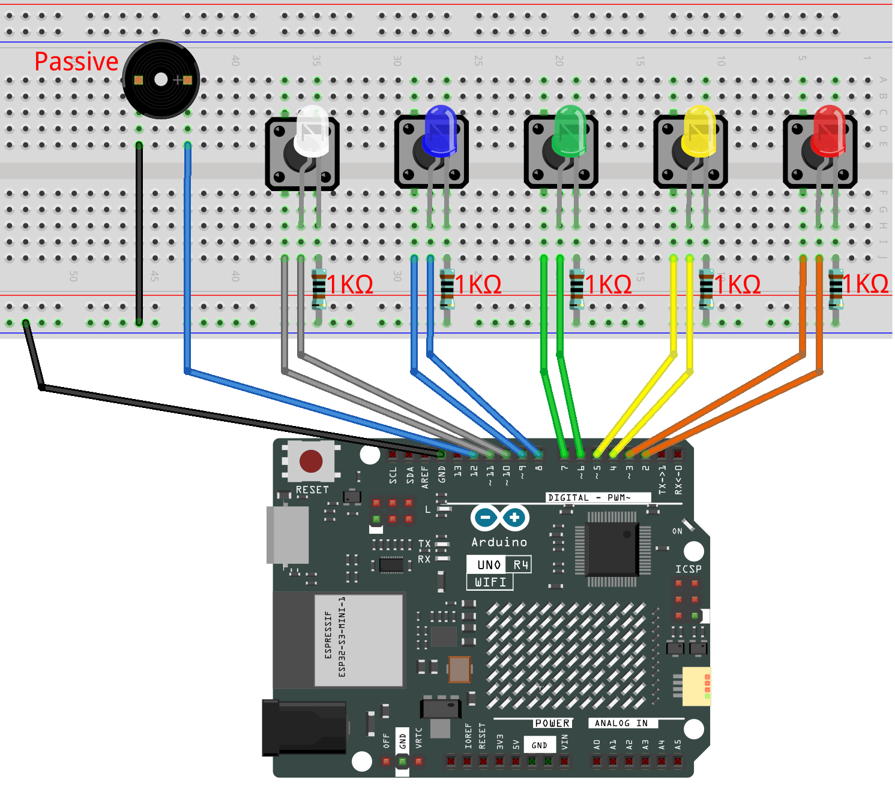

.. _color_memory2.0:

Color Memory 2.0
==============================================================

.. note::
  
  🌟 Welcome to the SunFounder Facebook Community! Whether you're into Raspberry Pi, Arduino, or ESP32, you'll find inspiration, help ideas here.
   
  - ✅ Be the first to get free learning resources. 
   
  - ✅ Stay updated on new products & exclusive giveaways. 
   
  - ✅ Share your creations and get real feedback.
   
  * 👉 Need faster updates or support? Click [|link_sf_facebook|] join our Facebook community 

  * 👉 Or join our WhatsApp group: Click [|link_sf_whatsapp|]
   
Kit purchase
------------------------

Looking for parts? Check out our all-in-one kits below — packed with components, beginner-friendly guides, and tons of fun.

.. image:: img/elite_explore_kit.png
   :width: 100%
   :align: center
   :target: https://www.sunfounder.com/collections/arduino-kits-bundles/products/sunfounder-elite-explorer-kit-with-official-arduino-uno-r4-wifi?ref=jbzmncle

.. raw:: html

     

.. list-table::
   :widths: 20 20 20
   :header-rows: 1

   * - Name
     - Includes Arduino board
     - PURCHASE LINK
   * - Ultimate Sensor Kit
     - Arduino Uno R4 Minima
     - |link_ultimate_sensor_buy|
   * - Elite Explorer Kit
     - Arduino Uno R4 WiFi
     - |link_elite_buy|
   * - 3 in 1 Ultimate Starter Kit
     - Arduino Uno R4 Minima
     - |link_arduinor4_buy|
   * - Universal Maker Sensor Kit
     - ×
     - |link_umsk_buy|

Course Introduction
------------------------

In this lesson, you'll use four LCDs, four buttons, and a passive buzzer with the Arduino R4 UNO to create a color memory game.

At the start of the game, an LED lights up at random. The player must press the corresponding button to proceed. A wrong input ends the game.

.. raw:: html

  <iframe width="700" height="394" src="https://www.youtube.com/embed/qddrlRVFplk?si=VNuLq8nkpG0O1Ze4" title="YouTube video player" frameborder="0" allow="accelerometer; autoplay; clipboard-write; encrypted-media; gyroscope; picture-in-picture; web-share" referrerpolicy="strict-origin-when-cross-origin" allowfullscreen></iframe>

.. note::

  If this is your first time working with an Arduino project, we recommend downloading and reviewing the basic materials first.
  
  * :ref:`install_arduino`
  * :ref:`introduce_arduino`

**Required Components**

In this project, we need the following components:

.. list-table::
    :widths: 5 20 5 20
    :header-rows: 1

    *   - SN
        - COMPONENT INTRODUCTION	
        - QUANTITY
        - PURCHASE LINK

    *   - 1
        - Arduino UNO R4 Minima
        - 1
        - |link_unor4_buy|
    *   - 2
        - USB Type-C cable
        - 1
        - 
    *   - 3
        - Breadboard
        - 1
        - |link_breadboard_buy|
    *   - 4
        - Wires
        - Several
        - |link_wires_buy|
    *   - 5
        - Passive Buzzer
        - 1
        - |link_passive_buzzer_buy|
    *   - 6
        - Button
        - 5
        - |link_button_buy|
    *   - 7
        - LED
        - 5
        - |link_led_buy|
    *   - 8
        - 1kΩ resistor
        - 5
        - |link_resistor_buy|

**Wiring**

**Common Connections:**

* **LEDS**

  - **White:** Connect the LED **anode** to **10** on the Arduino, and the **cathode** to a **1kΩ resistor**, then to the negative power bus on the breadboard.
  - **Blue:** Connect the LED **anode** to **8** on the Arduino, and the **cathode** to a **1kΩ resistor**, then to the negative power bus on the breadboard.
  - **Green:** Connect the LED **anode** to **6** on the Arduino, and the **cathode** to a **1kΩ resistor**, then to the negative power bus on the breadboard.
  - **Yellow:** Connect the LED **anode** to **4**on the Arduino , and the **cathode** to a **1kΩ resistor**, then to the negative power bus on the breadboard.
  - **Red:** Connect the LED **anode** to **2** on the Arduino, and the **cathode** to a **1kΩ resistor**, then to the negative power bus on the breadboard.

* **Passive Buzzer**

  - **＋:** Connect to **12** on the Arduino.
  - **－:** Connect to breadboard’s negative power bus.

* **Buttons**

  - **White Button:** Connect to the **White LED's cathode** on the breadboard, and the other end to **11** on the Arduino board.
  - **Blue Button:** Connect to the **Blue LED's cathode** on the breadboard, and the other end to **9** on the Arduino board.
  - **Green Butto:** Connect to the **Green LED's cathode** on the breadboard, and the other end to **7** on the Arduino board.
  - **Yellow Butto:** Connect to the **Yellow LED's cathode** on the breadboard, and the other end to **5** on the Arduino board.
  - **Red Butto:** Connect to the **Red LED's cathode** on the breadboard, and the other end to **3** on the Arduino board.

**Writing the Code**

.. note::

    * You can copy this code into **Arduino IDE**. 
    * Don't forget to select the board(Arduino UNO R4 Minima) and the correct port before clicking the **Upload** button.

.. code-block:: arduino

      // ==== LED and Button pin definitions ====
      const int redLED = 2;      // Red LED pin
      const int yellowLED = 4;   // Yellow LED pin
      const int greenLED = 6;    // Green LED pin
      const int blueLED = 8;     // Blue LED pin
      const int whiteLED = 10;   // White LED pin (new)

      const int redButton = 3;      // Red button pin
      const int yellowButton = 5;   // Yellow button pin
      const int greenButton = 7;    // Green button pin
      const int blueButton = 9;     // Blue button pin
      const int whiteButton = 11;   // White button pin (new)

      const int buzzer = 12;     // Buzzer pin

      // ==== Game data ====
      int sequence[100];      // Store the game sequence (LED colors)
      int playerInput[100];   // Store what the player presses
      int level = 0;          // Current length of the sequence
      bool gameOver = false;  // Flag to check if the game is over

      void setup() {
        // Set LED pins as output
        pinMode(redLED, OUTPUT);
        pinMode(yellowLED, OUTPUT);
        pinMode(greenLED, OUTPUT);
        pinMode(blueLED, OUTPUT);
        pinMode(whiteLED, OUTPUT);

        // Set button pins as input with pull-up resistors
        pinMode(redButton, INPUT_PULLUP);
        pinMode(yellowButton, INPUT_PULLUP);
        pinMode(greenButton, INPUT_PULLUP);
        pinMode(blueButton, INPUT_PULLUP);
        pinMode(whiteButton, INPUT_PULLUP);

        pinMode(buzzer, OUTPUT);

        Serial.begin(9600);  // For debugging if needed

        // Start the game
        startGame();
      }

      void loop() {
        if (!gameOver) {
          // Show the sequence to the player
          playSequence();

          // Wait for player's input
          if (!getPlayerInput()) {
            // If wrong, end the game
            endGame();
          } else {
            delay(500); // Small pause before next round
          }
        } else {
          // Restart the game after short delay
          delay(1500);
          startGame();
        }
      }

      // Reset and start a new game
      void startGame() {
        level = 0;       // Reset sequence length
        gameOver = false;

        // Flash all LEDs and play a tone to show game start
        allLEDsOn();
        tone(buzzer, 1000, 500);
        delay(500);
        allLEDsOff();

        // Make random numbers different each time
        randomSeed(analogRead(A0));
        delay(500);
      }

      // Add 2 new random colors to the sequence and replay all
      void playSequence() {
        sequence[level] = random(1, 6);     // First new color (1–5)
        sequence[level + 1] = random(1, 6); // Second new color
        level += 2; // Increase sequence length by 2

        // Show the sequence step by step
        for (int i = 0; i < level; i++) {
          lightUpLED(sequence[i]);
          delay(300);
        }
      }

      // Read the player's input and check if correct
      bool getPlayerInput() {
        for (int i = 0; i < level; i++) {
          bool inputReceived = false;

          // Wait until a button is pressed
          while (!inputReceived) {
            if (digitalRead(redButton) == LOW) {
              playerInput[i] = 1;
              lightUpLED(1);
              inputReceived = true;
            } else if (digitalRead(yellowButton) == LOW) {
              playerInput[i] = 2;
              lightUpLED(2);
              inputReceived = true;
            } else if (digitalRead(greenButton) == LOW) {
              playerInput[i] = 3;
              lightUpLED(3);
              inputReceived = true;
            } else if (digitalRead(blueButton) == LOW) {
              playerInput[i] = 4;
              lightUpLED(4);
              inputReceived = true;
            } else if (digitalRead(whiteButton) == LOW) {
              playerInput[i] = 5;
              lightUpLED(5);
              inputReceived = true;
            }
          }

          // Check if player's input matches the sequence
          if (playerInput[i] != sequence[i]) {
            return false;  // Wrong input
          }
          delay(200); // Small pause before next input
        }
        return true; // All correct
      }

      // Show "game over" animation
      void endGame() {
        gameOver = true;

        for (int i = 0; i < 5; i++) {
          allLEDsOn();
          tone(buzzer, 1000, 200);
          delay(200);
          allLEDsOff();
          delay(200);
        }
      }

      // Turn on one LED and play its tone
      void lightUpLED(int color) {
        switch (color) {
          case 1: digitalWrite(redLED, HIGH);    tone(buzzer, 500, 300); break;
          case 2: digitalWrite(yellowLED, HIGH); tone(buzzer, 600, 300); break;
          case 3: digitalWrite(greenLED, HIGH);  tone(buzzer, 700, 300); break;
          case 4: digitalWrite(blueLED, HIGH);   tone(buzzer, 800, 300); break;
          case 5: digitalWrite(whiteLED, HIGH);  tone(buzzer, 900, 300); break;
        }
        delay(300);

        noTone(buzzer); // Stop the sound
        allLEDsOff();   // Turn off all LEDs
      }

      // Helper: turn on all LEDs
      void allLEDsOn() {
        digitalWrite(redLED, HIGH);
        digitalWrite(yellowLED, HIGH);
        digitalWrite(greenLED, HIGH);
        digitalWrite(blueLED, HIGH);
        digitalWrite(whiteLED, HIGH);
      }

      // Helper: turn off all LEDs
      void allLEDsOff() {
        digitalWrite(redLED, LOW);
        digitalWrite(yellowLED, LOW);
        digitalWrite(greenLED, LOW);
        digitalWrite(blueLED, LOW);
        digitalWrite(whiteLED, LOW);
      }
