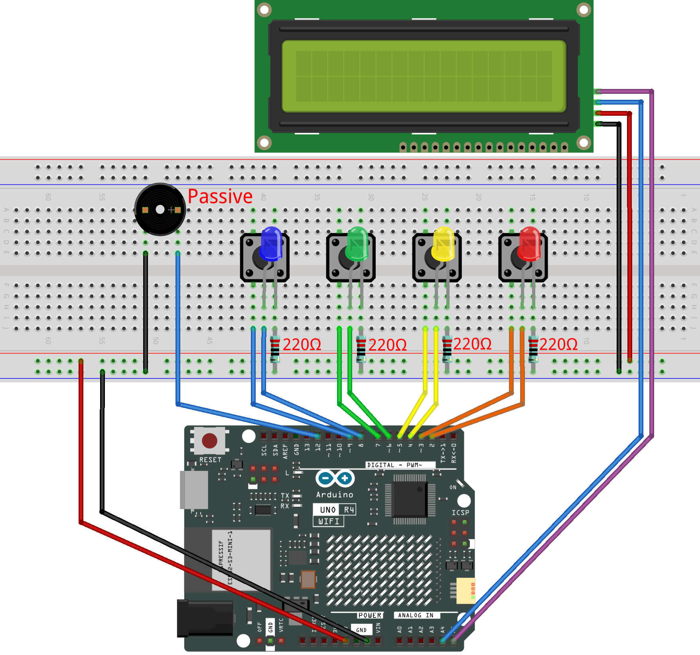

.. _color_memory3.0:

Color Memory 3.0
==============================================================

.. note::
  
  🌟 Welcome to the SunFounder Facebook Community! Whether you're into Raspberry Pi, Arduino, or ESP32, you'll find inspiration, help ideas here.
   
  - ✅ Be the first to get free learning resources. 
   
  - ✅ Stay updated on new products & exclusive giveaways. 
   
  - ✅ Share your creations and get real feedback.
   
  * 👉 Need faster updates or support? Click [|link_sf_facebook|] join our Facebook community 

  * 👉 Or join our WhatsApp group: Click [|link_sf_whatsapp|]
   
Kit purchase
------------------------

Looking for parts? Check out our all-in-one kits below — packed with components, beginner-friendly guides, and tons of fun.

.. raw:: html

     

.. list-table::
   :widths: 20 20 20
   :header-rows: 1

   * - Name
     - Includes Arduino board
     - PURCHASE LINK
   * - Ultimate Sensor Kit
     - Arduino Uno R4 Minima
     - |link_ultimate_sensor_buy|
   * - Elite Explorer Kit
     - Arduino Uno R4 WiFi
     - |link_elite_buy|
   * - 3 in 1 Ultimate Starter Kit
     - Arduino Uno R4 Minima
     - |link_arduinor4_buy|
   * - Universal Maker Sensor Kit
     - ×
     - |link_umsk_buy|

Course Introduction
------------------------

In this lesson, you'll use an I2C LCD, four LEDs, four buttons, and a passive buzzer with the Arduino UNO R4 to build a color memory game.

The game displays an increasingly longer sequence of colored LEDs. Watch carefully and repeat the sequence by pressing the matching buttons. Each correct round advances to the next level, while a wrong input ends the game.

.. .. raw:: html

..  <iframe width="700" height="394" src="https://www.youtube.com/embed/qddrlRVFplk?si=VNuLq8nkpG0O1Ze4" title="YouTube video player" frameborder="0" allow="accelerometer; autoplay; clipboard-write; encrypted-media; gyroscope; picture-in-picture; web-share" referrerpolicy="strict-origin-when-cross-origin" allowfullscreen></iframe>

.. note::

  If this is your first time working with an Arduino project, we recommend downloading and reviewing the basic materials first.
  
  * :ref:`install_arduino`
  * :ref:`introduce_arduino`

**Required Components**

In this project, we need the following components:

.. list-table::
    :widths: 5 20 5 20
    :header-rows: 1

    *   - SN
        - COMPONENT INTRODUCTION	
        - QUANTITY
        - PURCHASE LINK

    *   - 1
        - Arduino UNO R4 Wifi
        - 1
        - |link_unor4_wifi_buy|
    *   - 2
        - USB Type-C cable
        - 1
        - 
    *   - 3
        - Breadboard
        - 1
        - |link_breadboard_buy|
    *   - 4
        - Wires
        - Several
        - |link_wires_buy|
    *   - 5
        - Passive Buzzer
        - 1
        - |link_passive_buzzer_buy|
    *   - 6
        - Button
        - 4
        - |link_button_buy|
    *   - 7
        - LED
        - 4
        - |link_led_buy|
    *   - 8
        - 220Ω resistor
        - 4
        - |link_resistor_buy|
    *   - 9
        - I2C LCD 1602
        - 1
        - |link_i2clcd1602_buy|

**Wiring**

**Common Connections:**

* **LEDS**

  - **Blue:** Connect the LED **anode** to **8** on the Arduino, and the **cathode** to a **220Ω resistor**, then to the negative power bus on the breadboard.
  - **Green:** Connect the LED **anode** to **6** on the Arduino, and the **cathode** to a **220Ω resistor**, then to the negative power bus on the breadboard.
  - **Yellow:** Connect the LED **anode** to **4**on the Arduino , and the **cathode** to a **220Ω resistor**, then to the negative power bus on the breadboard.
  - **Red:** Connect the LED **anode** to **2** on the Arduino, and the **cathode** to a **220Ω resistor**, then to the negative power bus on the breadboard.

* **Passive Buzzer**

  - **＋:** Connect to **12** on the Arduino.
  - **－:** Connect to breadboard’s negative power bus.

* **Buttons**

  - **Blue Button:** Connect to the **Blue LED's cathode** on the breadboard, and the other end to **9** on the Arduino board.
  - **Green Button:** Connect to the **Green LED's cathode** on the breadboard, and the other end to **7** on the Arduino board.
  - **Yellow Button:** Connect to the **Yellow LED's cathode** on the breadboard, and the other end to **5** on the Arduino board.
  - **Red Button:** Connect to the **Red LED's cathode** on the breadboard, and the other end to **3** on the Arduino board.

* **I2C LCD 1602**

  - **SDA:** Connect to **A4** on the Arduino.
  - **SCL:** Connect to **A5** on the Arduino.
  - **GND:** Connect to breadboard’s negative power bus.
  - **VCC:** Connect to breadboard’s red power bus.

**Writing the Code**

.. note::

    * You can copy this code into **Arduino IDE**. 
    * To install the library, use the Arduino Library Manager and search for **LiquidCrystal I2C** and install it.
    * Don't forget to select the board(Arduino UNO R4 WIFI/Minima) and the correct port before clicking the **Upload** button.

.. code-block:: arduino

      #include <Wire.h>
      #include <LiquidCrystal_I2C.h>

      // Create a 16x2 I2C LCD object at address 0x27.
      LiquidCrystal_I2C lcd(0x27, 16, 2);

      // LED pins
      const int redLED = 2;
      const int yellowLED = 4;
      const int greenLED = 6;
      const int blueLED = 8;

      // Button pins
      const int redButton = 3;
      const int yellowButton = 5;
      const int greenButton = 7;
      const int blueButton = 9;

      // Passive buzzer pin
      const int buzzer = 12;

      // Set the maximum number of game levels.
      const int MAX_LEVEL = 100;

      // Store the random color sequence.
      int sequence[MAX_LEVEL];

      // Track the current game level.
      int level = 1;

      // Track whether the game has ended.
      bool gameOver = false;

      void setup() {
        // Set all LED pins as outputs.
        pinMode(redLED, OUTPUT);
        pinMode(yellowLED, OUTPUT);
        pinMode(greenLED, OUTPUT);
        pinMode(blueLED, OUTPUT);

        // Use the internal pull-up resistor for each button.
        pinMode(redButton, INPUT_PULLUP);
        pinMode(yellowButton, INPUT_PULLUP);
        pinMode(greenButton, INPUT_PULLUP);
        pinMode(blueButton, INPUT_PULLUP);

        // Set the buzzer pin as an output.
        pinMode(buzzer, OUTPUT);

        // Start the LCD and turn on its backlight.
        lcd.init();
        lcd.backlight();

        // Start serial communication for debugging.
        Serial.begin(9600);

        // Create a different random sequence after each restart.
        randomSeed(analogRead(A0));

        // Show the start screen and wait for the player.
        showStartScreen();
      }

      void loop() {
        // Continue the game while the player has not made a mistake.
        if (!gameOver) {
          playSequence();

          // Check the player's input for the current level.
          if (getPlayerInput()) {
            showCorrectMessage();
            delay(700);
            level++;
          } else {
            endGame();
          }
        } else {
          // Wait for the player to start a new game.
          showRestartScreen();
          waitForAnyButton();
          startGame();
        }
      }

      void showStartScreen() {
        // Show the title before the first game begins.
        lcd.clear();
        lcd.setCursor(0, 0);
        lcd.print("Color Memory");
        lcd.setCursor(0, 1);
        lcd.print("Press Any Key");

        // Pause here until any button is pressed.
        waitForAnyButton();

        startGame();
      }

      void startGame() {
        // Reset the level and game state.
        level = 1;
        gameOver = false;

        // Show a short ready message.
        lcd.clear();
        lcd.setCursor(0, 0);
        lcd.print("Get Ready!");
        lcd.setCursor(0, 1);
        lcd.print("Game Starts");

        // Turn on all LEDs for the start effect.
        turnOnAllLEDs();
        tone(buzzer, 1000, 400);

        delay(400);

        // End the start effect.
        turnOffAllLEDs();
        noTone(buzzer);

        delay(500);
      }

      void playSequence() {
        // Prevent the sequence array from going out of range.
        if (level > MAX_LEVEL) {
          level = MAX_LEVEL;
        }

        // Add one new random color to the end of the sequence.
        sequence[level - 1] = random(1, 5);

        // Tell the player to watch the sequence.
        lcd.clear();
        lcd.setCursor(0, 0);
        lcd.print("Level ");
        lcd.print(level);
        lcd.setCursor(0, 1);
        lcd.print("Watch...");

        delay(500);

        // Play the full sequence from the first color.
        for (int i = 0; i < level; i++) {
          lightUpLED(sequence[i]);
          delay(200);
        }

        // Reset the input progress before the player's turn.
        showProgress(0);
      }

      bool getPlayerInput() {
        // Ask the player to enter one color for each step.
        for (int i = 0; i < level; i++) {
          int pressedColor = waitForButtonPress();

          // Give immediate light and sound feedback.
          lightUpLED(pressedColor);

          // Update the progress after each button press.
          showProgress(i + 1);

          // End the round if the pressed color is incorrect.
          if (pressedColor != sequence[i]) {
            delay(200);
            return false;
          }

          // Prevent one long press from being counted twice.
          waitForAllButtonsReleased();

          delay(50);
        }

        return true;
      }

      int waitForButtonPress() {
        // Keep checking until one button is pressed.
        while (true) {
          if (digitalRead(redButton) == LOW) {
            delay(15);

            // Check again after a short debounce delay.
            if (digitalRead(redButton) == LOW) {
              return 1;
            }
          }

          if (digitalRead(yellowButton) == LOW) {
            delay(15);

            if (digitalRead(yellowButton) == LOW) {
              return 2;
            }
          }

          if (digitalRead(greenButton) == LOW) {
            delay(15);

            if (digitalRead(greenButton) == LOW) {
              return 3;
            }
          }

          if (digitalRead(blueButton) == LOW) {
            delay(15);

            if (digitalRead(blueButton) == LOW) {
              return 4;
            }
          }
        }
      }

      void waitForAnyButton() {
        // Make sure no button is already being held.
        waitForAllButtonsReleased();

        // Wait until any button is pressed.
        while (true) {
          if (digitalRead(redButton) == LOW ||
              digitalRead(yellowButton) == LOW ||
              digitalRead(greenButton) == LOW ||
              digitalRead(blueButton) == LOW) {

            delay(20);

            // Confirm that the button press is stable.
            if (digitalRead(redButton) == LOW ||
                digitalRead(yellowButton) == LOW ||
                digitalRead(greenButton) == LOW ||
                digitalRead(blueButton) == LOW) {

              tone(buzzer, 1200, 100);
              waitForAllButtonsReleased();
              return;
            }
          }
        }
      }

      void waitForAllButtonsReleased() {
        // Stay here until every button is released.
        while (digitalRead(redButton) == LOW ||
              digitalRead(yellowButton) == LOW ||
              digitalRead(greenButton) == LOW ||
              digitalRead(blueButton) == LOW) {
          delay(5);
        }
      }

      void showProgress(int completed) {
        // Show the current input progress on the LCD.
        lcd.clear();
        lcd.setCursor(0, 0);
        lcd.print("Your Turn!");
        lcd.setCursor(0, 1);
        lcd.print("Progress: ");
        lcd.print(completed);
        lcd.print("/");
        lcd.print(level);
      }

      void showCorrectMessage() {
        // Tell the player that the full sequence was correct.
        lcd.clear();
        lcd.setCursor(0, 0);
        lcd.print("Correct!");
        lcd.setCursor(0, 1);
        lcd.print("Next Level");
      }

      void showRestartScreen() {
        // Ask the player to begin another game.
        lcd.clear();
        lcd.setCursor(0, 0);
        lcd.print("Press Any Key");
        lcd.setCursor(0, 1);
        lcd.print("to Play Again");
      }

      void endGame() {
        // Mark the game as finished.
        gameOver = true;

        // The score is the number of completed levels.
        int score = level - 1;

        // Show the final score.
        lcd.clear();
        lcd.setCursor(0, 0);
        lcd.print("Game Over!");
        lcd.setCursor(0, 1);
        lcd.print("Score: ");
        lcd.print(score);

        // Flash all LEDs and play a sound five times.
        for (int i = 0; i < 5; i++) {
          turnOnAllLEDs();
          tone(buzzer, 1000, 200);

          delay(200);

          turnOffAllLEDs();
          noTone(buzzer);

          delay(150);
        }

        delay(800);
      }

      void lightUpLED(int color) {
        // Match each color number with one LED and one tone.
        switch (color) {
          case 1:
            digitalWrite(redLED, HIGH);
            tone(buzzer, 500);
            break;

          case 2:
            digitalWrite(yellowLED, HIGH);
            tone(buzzer, 600);
            break;

          case 3:
            digitalWrite(greenLED, HIGH);
            tone(buzzer, 700);
            break;

          case 4:
            digitalWrite(blueLED, HIGH);
            tone(buzzer, 800);
            break;

          default:
            return;
        }

        // Keep the LED and tone active for a short time.
        delay(250);

        // Stop the tone and turn off every LED.
        noTone(buzzer);
        turnOffAllLEDs();
      }

      void turnOnAllLEDs() {
        // Turn on all four LEDs.
        digitalWrite(redLED, HIGH);
        digitalWrite(yellowLED, HIGH);
        digitalWrite(greenLED, HIGH);
        digitalWrite(blueLED, HIGH);
      }

      void turnOffAllLEDs() {
        // Turn off all four LEDs.
        digitalWrite(redLED, LOW);
        digitalWrite(yellowLED, LOW);
        digitalWrite(greenLED, LOW);
        digitalWrite(blueLED, LOW);
      }
