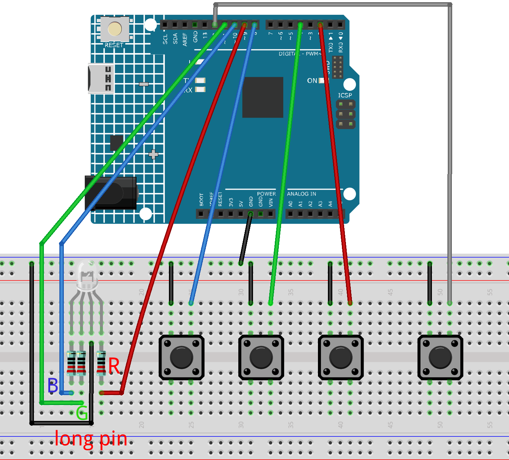

.. _color_palette:

Color Palette
==============================================================

.. note::
  
  🌟 Welcome to the SunFounder Facebook Community! Whether you're into Raspberry Pi, Arduino, or ESP32, you'll find inspiration, help ideas here.
   
  - ✅ Be the first to get free learning resources. 
   
  - ✅ Stay updated on new products & exclusive giveaways. 
   
  - ✅ Share your creations and get real feedback.
   
  * 👉 Need faster updates or support? Click [|link_sf_facebook|] join our Facebook community 

  * 👉 Or join our WhatsApp group: Click [|link_sf_whatsapp|]
   
Kit purchase
------------------------

Looking for parts? Check out our all-in-one kits below — packed with components, beginner-friendly guides, and tons of fun.

.. image:: img/elite_explore_kit.png
   :width: 100%
   :align: center
   :target: https://www.sunfounder.com/collections/arduino-kits-bundles/products/sunfounder-elite-explorer-kit-with-official-arduino-uno-r4-wifi?ref=jbzmncle

.. raw:: html

     

.. list-table::
   :widths: 20 20 20
   :header-rows: 1

   * - Name
     - Includes Arduino board
     - PURCHASE LINK
   * - Ultimate Sensor Kit
     - Arduino Uno R4 Minima
     - |link_ultimate_sensor_buy|
   * - Elite Explorer Kit
     - Arduino Uno R4 WiFi
     - |link_elite_buy|
   * - 3 in 1 Ultimate Starter Kit
     - Arduino Uno R4 Minima
     - |link_arduinor4_buy|
   * - Universal Maker Sensor Kit
     - ×
     - |link_umsk_buy|

Course Introduction
------------------------

In this lesson, you'll use an RGB LED and four buttons with the Arduino UNO R4 WIFI to create an interactive color palette.

Press the red, green, or blue button to display a color. Short-press the function button to mix in another color, or long-press it to clear the current color.

.. raw:: html

  <iframe width="700" height="394" src="https://www.youtube.com/embed/qBhl0QNCz-8" title="YouTube video player" frameborder="0" allow="accelerometer; autoplay; clipboard-write; encrypted-media; gyroscope; picture-in-picture; web-share" referrerpolicy="strict-origin-when-cross-origin" allowfullscreen></iframe>

.. note::

  If this is your first time working with an Arduino project, we recommend downloading and reviewing the basic materials first.
  
  * :ref:`install_arduino`
  * :ref:`introduce_arduino`

**Required Components**

In this project, we need the following components:

.. list-table::
    :widths: 5 20 5 20
    :header-rows: 1

    *   - SN
        - COMPONENT INTRODUCTION	
        - QUANTITY
        - PURCHASE LINK

    *   - 1
        - Arduino UNO R4 WIFI
        - 1
        - |link_unor4_wifi_buy|
    *   - 2
        - USB Type-C cable
        - 1
        - 
    *   - 3
        - Breadboard
        - 1
        - |link_breadboard_buy|
    *   - 4
        - Wires
        - Several
        - |link_wires_buy|
    *   - 5
        - Button
        - 4
        - |link_button_buy|
    *   - 6
        - RGB LED
        - 1
        - |link_led_buy|
    *   - 7
        - 220Ω resistor
        - 3
        - |link_resistor_buy|

**Wiring**

**Common Connections:**

* **RGB LED**

  - **Blue pin:** Connect the LED **Blue pin** to a **220Ω resistor**, then to **10** on the Arduino.
  - **Green pin:** Connect the LED **Green pin** to a **220Ω resistor**, then to **11** on the Arduino.
  - **Red pin:** Connect the LED **Red pin** to a **220Ω resistor**, then to **9** on the Arduino.
  - **Long pin:** Connect the LED **long pin** to the negative power bus on the breadboard.

* **Buttons** 

  - **Blue Button:** Connect to the negative power bus on the breadboard, and the other end to **8** on the Arduino board.
  - **Green Button:** Connect to the negative power bus on the breadboard, and the other end to **4** on the Arduino board.
  - **Red Button:** Connect to the negative power bus on the breadboard, and the other end to **2** on the Arduino board.

  - **Plus Button:** Connect to the negative power bus on the breadboard, and the other end to **12** on the Arduino board.

**Writing the Code**

.. note::

    * You can copy this code into **Arduino IDE**. 
    * Don't forget to select the board(Arduino UNO R4 WIFI/Minima) and the correct port before clicking the **Upload** button.

.. code-block:: arduino

      /*
        Arduino UNO R4 LED Color Palette

        Buttons:
        Red button      -> D2
        Green button    -> D4
        Blue button     -> D8
        Function button -> D12

        The other side of each button connects to GND.

        RGB LED:
        Red channel   -> D9
        Green channel -> D11
        Blue channel  -> D10
        Common cathode -> GND

        Operation:
        1. Press a color button to display that color.
        2. Short-press the function button.
        3. Press another color button to mix colors.
        4. Repeat to add another color.
        5. Long-press the function button to clear all colors.
      */

      // ==================== RGB LED pins ====================

      const byte RED_LED_PIN   = 9;
      const byte GREEN_LED_PIN = 11;
      const byte BLUE_LED_PIN  = 10;

      // ==================== Button pins ====================

      const byte RED_BUTTON_PIN      = 2;
      const byte GREEN_BUTTON_PIN    = 4;
      const byte BLUE_BUTTON_PIN     = 8;
      const byte FUNCTION_BUTTON_PIN = 12;

      // ==================== Settings ====================

      const unsigned long DEBOUNCE_TIME = 40;
      const unsigned long LONG_PRESS_TIME = 1200;

      // false: common-cathode RGB LED, common pin connected to GND
      // true: common-anode RGB LED, common pin connected to 5V
      const bool COMMON_ANODE = false;

      // ==================== Color definitions ====================

      struct Color {
        byte red;
        byte green;
        byte blue;
      };

      const Color RED_COLOR = {
        255, 0, 0
      };

      const Color GREEN_COLOR = {
        0, 255, 0
      };

      const Color BLUE_COLOR = {
        0, 0, 255
      };

      // ==================== Button structure ====================

      struct Button {
        byte pin;
        bool stableState;
        bool lastReading;
        unsigned long lastChangeTime;
        bool pressed;

        void begin(byte buttonPin) {
          pin = buttonPin;

          pinMode(pin, INPUT_PULLUP);

          stableState = digitalRead(pin);
          lastReading = stableState;
          lastChangeTime = millis();
          pressed = false;
        }

        void update() {
          pressed = false;

          bool currentReading = digitalRead(pin);

          if (currentReading != lastReading) {
            lastReading = currentReading;
            lastChangeTime = millis();
          }

          if (millis() - lastChangeTime >= DEBOUNCE_TIME) {
            if (currentReading != stableState) {
              stableState = currentReading;

              if (stableState == LOW) {
                pressed = true;
              }
            }
          }
        }

        bool isHeld() const {
          return stableState == LOW;
        }
      };

      // ==================== Button objects ====================

      Button redButton;
      Button greenButton;
      Button blueButton;
      Button functionButton;

      // ==================== Color mixing variables ====================

      unsigned int totalRed = 0;
      unsigned int totalGreen = 0;
      unsigned int totalBlue = 0;

      byte colorCount = 0;

      bool addMode = false;

      // ==================== Function button variables ====================

      unsigned long functionPressStart = 0;

      bool functionWasPressed = false;
      bool longPressTriggered = false;

      // ==================== RGB LED functions ====================

      void writeLedChannel(byte pin, byte brightness) {
        if (COMMON_ANODE) {
          analogWrite(pin, 255 - brightness);
        } else {
          analogWrite(pin, brightness);
        }
      }

      void setLedColor(byte red, byte green, byte blue) {
        writeLedChannel(RED_LED_PIN, red);
        writeLedChannel(GREEN_LED_PIN, green);
        writeLedChannel(BLUE_LED_PIN, blue);
      }

      void turnOffLed() {
        setLedColor(0, 0, 0);
      }

      // ==================== Color functions ====================

      void showMixedColor() {
        if (colorCount == 0) {
          turnOffLed();
          return;
        }

        byte finalRed = totalRed / colorCount;
        byte finalGreen = totalGreen / colorCount;
        byte finalBlue = totalBlue / colorCount;

        setLedColor(finalRed, finalGreen, finalBlue);

        Serial.print("RGB: ");
        Serial.print(finalRed);
        Serial.print(", ");
        Serial.print(finalGreen);
        Serial.print(", ");
        Serial.println(finalBlue);
      }

      void selectColor(const Color &newColor, const char *colorName) {
        if (addMode && colorCount > 0) {
          // Add the selected color to the current mixture
          totalRed += newColor.red;
          totalGreen += newColor.green;
          totalBlue += newColor.blue;

          colorCount++;
          addMode = false;

          Serial.print(colorName);
          Serial.println(" added.");
        } else {
          // Start a new color selection
          totalRed = newColor.red;
          totalGreen = newColor.green;
          totalBlue = newColor.blue;

          colorCount = 1;
          addMode = false;

          Serial.print(colorName);
          Serial.println(" selected.");
        }

        showMixedColor();
      }

      void clearColors() {
        totalRed = 0;
        totalGreen = 0;
        totalBlue = 0;

        colorCount = 0;
        addMode = false;

        turnOffLed();

        Serial.println("All colors cleared.");
      }

      // ==================== Setup ====================

      void setup() {
        Serial.begin(115200);

        pinMode(RED_LED_PIN, OUTPUT);
        pinMode(GREEN_LED_PIN, OUTPUT);
        pinMode(BLUE_LED_PIN, OUTPUT);

        redButton.begin(RED_BUTTON_PIN);
        greenButton.begin(GREEN_BUTTON_PIN);
        blueButton.begin(BLUE_BUTTON_PIN);
        functionButton.begin(FUNCTION_BUTTON_PIN);

        turnOffLed();

        Serial.println("LED Color Palette ready.");
      }

      // ==================== Main loop ====================

      void loop() {
        redButton.update();
        greenButton.update();
        blueButton.update();
        functionButton.update();

        // Red button: D2
        if (redButton.pressed) {
          selectColor(RED_COLOR, "Red");
        }

        // Green button: D4
        if (greenButton.pressed) {
          selectColor(GREEN_COLOR, "Green");
        }

        // Blue button: D8
        if (blueButton.pressed) {
          selectColor(BLUE_COLOR, "Blue");
        }

        // Function button was pressed
        if (functionButton.pressed) {
          functionPressStart = millis();
          functionWasPressed = true;
          longPressTriggered = false;
        }

        // Long-press the function button to clear all colors
        if (
          functionButton.isHeld() &&
          functionWasPressed &&
          !longPressTriggered &&
          millis() - functionPressStart >= LONG_PRESS_TIME
        ) {
          clearColors();
          longPressTriggered = true;
        }

        // Function button was released
        if (
          functionWasPressed &&
          !functionButton.isHeld()
        ) {
          // Short press: enable color addition
          if (!longPressTriggered) {
            if (colorCount > 0) {
              addMode = true;
              Serial.println(
                "Add mode enabled. Press another color button."
              );
            } else {
              Serial.println(
                "Select a color first."
              );
            }
          }

          functionWasPressed = false;
        }
      }