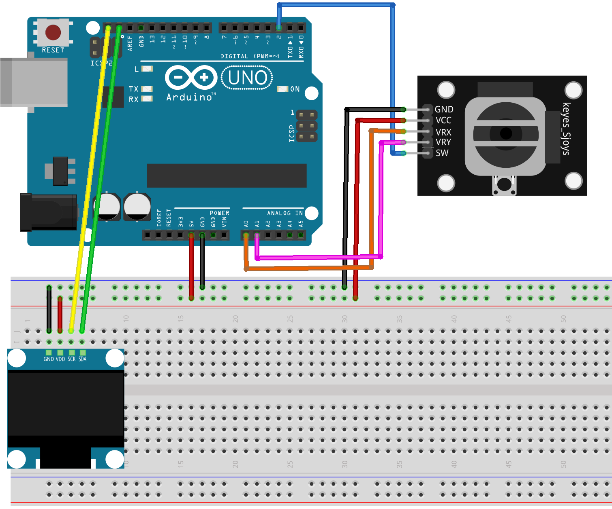

.. _controll_eyes:

Controll eyes
==============================================================

.. note::
  
  🌟 Welcome to the SunFounder Facebook Community! Whether you're into Raspberry Pi, Arduino, or ESP32, you'll find inspiration, help ideas here.
   
  - ✅ Be the first to get free learning resources. 
   
  - ✅ Stay updated on new products & exclusive giveaways. 
   
  - ✅ Share your creations and get real feedback.
   
  * 👉 Need faster updates or support? Click [|link_sf_facebook|] join our Facebook community 

  * 👉 Or join our WhatsApp group: Click [|link_sf_whatsapp|]
   
Kit purchase
------------------------

Looking for parts? Check out our all-in-one kits below — packed with components, beginner-friendly guides, and tons of fun.

.. image:: img/elite_explore_kit.png
   :width: 100%
   :align: center
   :target: https://www.sunfounder.com/collections/arduino-kits-bundles/products/sunfounder-elite-explorer-kit-with-official-arduino-uno-r4-wifi?ref=jbzmncle

.. raw:: html

     

.. list-table::
   :widths: 20 20 20
   :header-rows: 1

   * - Name
     - Includes Arduino board
     - PURCHASE LINK
   * - Ultimate Sensor Kit
     - Arduino Uno R4 Minima
     - |link_ultimate_sensor_buy|
   * - Elite Explorer Kit
     - Arduino Uno R4 WiFi
     - |link_elite_buy|
   * - 3 in 1 Ultimate Starter Kit
     - Arduino Uno R4 Minima
     - |link_arduinor4_buy|
   * - Universal Maker Sensor Kit
     - ×
     - |link_umsk_buy|

Course Introduction
------------------------

This Arduino project animates a pair of interactive eyes on an OLED screen, controlled by a joystick. 

The eyes track the joystick's movement, simulating the effect of following an object within a defined range. 

Pressing the joystick button triggers a blinking animation that mimics a natural blink by covering the upper part of the eyes.

.. raw:: html

  <iframe width="700" height="394" src="https://www.youtube.com/embed/FmRoRYiCy1s?si=Pk_Sj_Jo5-23X_Lv" title="YouTube video player" frameborder="0" allow="accelerometer; autoplay; clipboard-write; encrypted-media; gyroscope; picture-in-picture; web-share" referrerpolicy="strict-origin-when-cross-origin" allowfullscreen></iframe>

.. note::

  If this is your first time working with an Arduino project, we recommend downloading and reviewing the basic materials first.

  * :ref:`install_arduino`
  * :ref:`introduce_arduino`

**Required Components**

In this project, we need the following components:

.. list-table::
    :widths: 5 20 5 20
    :header-rows: 1

    *   - SN
        - COMPONENT INTRODUCTION	
        - QUANTITY
        - PURCHASE LINK

    *   - 1
        - Arduino UNO R4 Minima
        - 1
        - |link_unor4_buy|
    *   - 2
        - USB Type-C cable
        - 1
        - 
    *   - 3
        - Breadboard
        - 1
        - |link_breadboard_buy|
    *   - 4
        - Wires
        - Several
        - |link_wires_buy|
    *   - 5
        - Joystick Module
        - 1
        - |link_joystick_buy|
    *   - 6
        - OLED Display Module
        - 1
        - |link_oled_buy|

**Wiring**

**Common Connections:**

* **Joystick Module**

  - **VRX:** Connect to **A0** on the Arduino.
  - **VRY:** Connect to **A1** on the Arduino.
  - **SW:** Connect to **2** on the Arduino.
  - **GND:** Connect to breadboard’s negative power bus.
  - **VCC:** Connect to breadboard’s red power bus.

* **OLED Display Module**

  - **SDA:** Connect to **SDA** on the Arduino.
  - **SCK:** Connect to **SCL** on the Arduino.
  - **GND:** Connect to breadboard’s negative power bus.
  - **VCC:** Connect to breadboard’s red power bus.

**Writing the Code**

.. note::

    * You can copy this code into **Arduino IDE**. 
    * To install the library, use the Arduino Library Manager and search for **Adafruit SSD1306** and **Adafruit GFX** and install it.
    * Don't forget to select the board(Arduino UNO R4 Minima) and the correct port before clicking the **Upload** button.

.. code-block:: arduino

      #include <Wire.h>
      #include <Adafruit_GFX.h>
      #include <Adafruit_SSD1306.h>

      #define SCREEN_WIDTH 128  // OLED display width, in pixels
      #define SCREEN_HEIGHT 64  // OLED display height, in pixels
      #define OLED_RESET -1     // Reset pin (not used, so set to -1)

      Adafruit_SSD1306 display(SCREEN_WIDTH, SCREEN_HEIGHT, &Wire, OLED_RESET);

      int eyeAreaRadius = 18;     // Radius of the entire
      int pupilRadius = 6;        // Radius of the pupil
      int reflectionRadius1 = 2;  // Radius of the first reflection spot
      int reflectionRadius2 = 1;  // Radius of the second reflection spot
      int eyeMovementMargin = 5;  // Margin to prevent the pupil from touching the eye edges

      const int buttonPin = 2;  // Pin number for the joystick button
      const int xPin = A0;      // Pin number for X-axis input from joystick
      const int yPin = A1;      // Pin number for Y-axis input from joystick

      bool isBlinking = false;  // Flag to track if the eyes are blinking

      // Left eye parameters
      int leftEyeX, leftEyeY;
      int leftEyeCenterX = SCREEN_WIDTH / 2 - 20;  // X-coordinate of the left eye's center
      int leftEyeCenterY = SCREEN_HEIGHT / 2;      // Y-coordinate of the left eye's center
      int leftEyeMaxX = leftEyeCenterX + eyeAreaRadius - pupilRadius - eyeMovementMargin;
      int leftEyeMinX = leftEyeCenterX - eyeAreaRadius + pupilRadius + eyeMovementMargin;
      int leftEyeMaxY = leftEyeCenterY + eyeAreaRadius - pupilRadius - eyeMovementMargin;
      int leftEyeMinY = leftEyeCenterY - eyeAreaRadius + pupilRadius + eyeMovementMargin;

      // Right eye parameters
      int rightEyeX, rightEyeY;
      int rightEyeCenterX = SCREEN_WIDTH / 2 + 20;  // X-coordinate of the right eye's center
      int rightEyeCenterY = SCREEN_HEIGHT / 2;      // Y-coordinate of the right eye's center
      int rightEyeMaxX = rightEyeCenterX + eyeAreaRadius - pupilRadius - eyeMovementMargin;
      int rightEyeMinX = rightEyeCenterX - eyeAreaRadius + pupilRadius + eyeMovementMargin;
      int rightEyeMaxY = rightEyeCenterY + eyeAreaRadius - pupilRadius - eyeMovementMargin;
      int rightEyeMinY = rightEyeCenterY - eyeAreaRadius + pupilRadius + eyeMovementMargin;

      void setup() {
        pinMode(xPin, INPUT);              // Set pin A0 for X-axis input from joystick
        pinMode(yPin, INPUT);              // Set pin A1 for Y-axis input from joystick
        pinMode(buttonPin, INPUT_PULLUP);  // Set button pin as input with internal pull-up resistor

        if (!display.begin(SSD1306_SWITCHCAPVCC, 0x3C)) {
          Serial.println(F("SSD1306 allocation failed"));
          for (;;)
            ;  // Stop if the display initialization fails
        }

        display.clearDisplay();  // Clear the display buffer
        display.display();       // Display the cleared buffer (turn off all pixels)
      }

      void loop() {
        int xValue = analogRead(xPin);             // Read the X-axis value from the joystick
        int yValue = analogRead(yPin);             // Read the Y-axis value from the joystick
        int buttonState = digitalRead(buttonPin);  // Read the state of the button

        // Map joystick values to left eye's pupil position within its allowed range
        leftEyeX = map(xValue, 0, 1023, leftEyeMinX, leftEyeMaxX);
        leftEyeY = map(yValue, 0, 1023, leftEyeMinY, leftEyeMaxY);

        // Map joystick values to right eye's pupil position within its allowed range
        rightEyeX = map(xValue, 0, 1023, rightEyeMinX, rightEyeMaxX);
        rightEyeY = map(yValue, 0, 1023, rightEyeMinY, rightEyeMaxY);

        // Check if the button is pressed to determine if the eyes should blink
        if (buttonState == LOW) {  // If the button is pressed
          isBlinking = true;
        } else {
          isBlinking = false;
        }

        display.clearDisplay();  // Clear the display buffer before drawing

        // Draw the left eye
        display.fillCircle(leftEyeCenterX, leftEyeCenterY, eyeAreaRadius, SSD1306_WHITE);  // Draw the eye area
        display.fillCircle(leftEyeX, leftEyeY, pupilRadius, SSD1306_BLACK);                // Draw the pupil
        display.fillCircle(leftEyeX - 2, leftEyeY - 2, reflectionRadius1, SSD1306_WHITE);  // Draw the first reflection
        display.fillCircle(leftEyeX + 1, leftEyeY + 1, reflectionRadius2, SSD1306_WHITE);  // Draw the second reflection

        // Draw the right eye
        display.fillCircle(rightEyeCenterX, rightEyeCenterY, eyeAreaRadius, SSD1306_WHITE);  // Draw the eye area
        display.fillCircle(rightEyeX, rightEyeY, pupilRadius, SSD1306_BLACK);                // Draw the pupil
        display.fillCircle(rightEyeX - 2, rightEyeY - 2, reflectionRadius1, SSD1306_WHITE);  // Draw the first reflection
        display.fillCircle(rightEyeX + 1, rightEyeY + 1, reflectionRadius2, SSD1306_WHITE);  // Draw the second reflection

        if (isBlinking) {
          // Draw the blinking effect (top half of the eyes black)
          display.fillRect(leftEyeCenterX - eyeAreaRadius, leftEyeCenterY - eyeAreaRadius, 2.5 * eyeAreaRadius, eyeAreaRadius, SSD1306_BLACK);
          display.fillRect(rightEyeCenterX - eyeAreaRadius, rightEyeCenterY - eyeAreaRadius, 2.5 * eyeAreaRadius, eyeAreaRadius, SSD1306_BLACK);
        }

        display.display();  // Update the display with the new drawings
        delay(50);          // Short delay to reduce flickering
      }