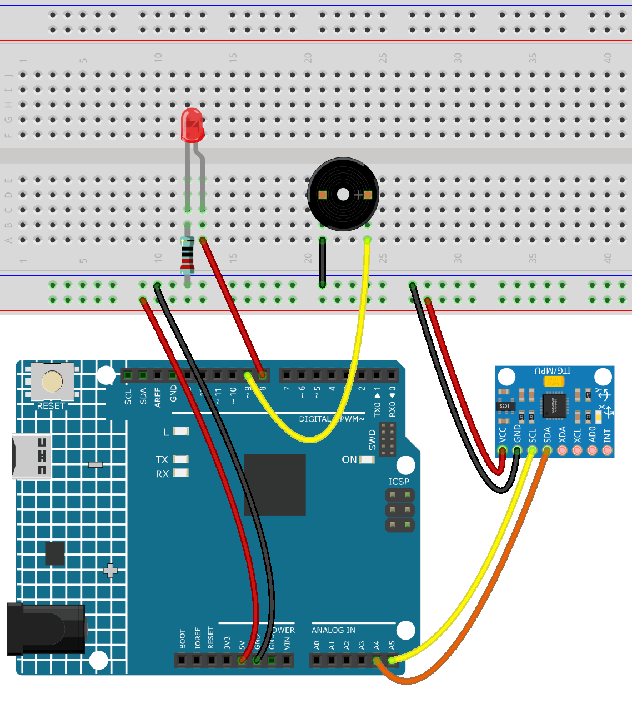

.. _detect_fall:

Detect Fall
==============================================================

.. note::
  
  🌟 Welcome to the SunFounder Facebook Community! Whether you're into Raspberry Pi, Arduino, or ESP32, you'll find inspiration, help ideas here.
   
  - ✅ Be the first to get free learning resources. 
   
  - ✅ Stay updated on new products & exclusive giveaways. 
   
  - ✅ Share your creations and get real feedback.
   
  * 👉 Need faster updates or support? Click [|link_sf_facebook|] join our Facebook community 

  * 👉 Or join our WhatsApp group: Click [|link_sf_whatsapp|]
   
Kit purchase
------------------------

Looking for parts? Check out our all-in-one kits below — packed with components, beginner-friendly guides, and tons of fun.

.. image:: img/elite_explore_kit.png
   :width: 100%
   :align: center
   :target: https://www.sunfounder.com/collections/arduino-kits-bundles/products/sunfounder-elite-explorer-kit-with-official-arduino-uno-r4-wifi?ref=jbzmncle

.. raw:: html

     

.. list-table::
   :widths: 20 20 20
   :header-rows: 1

   * - Name
     - Includes Arduino board
     - PURCHASE LINK
   * - Ultimate Sensor Kit
     - Arduino Uno R4 Minima
     - |link_ultimate_sensor_buy|
   * - Elite Explorer Kit
     - Arduino Uno R4 WiFi
     - |link_elite_buy|
   * - 3 in 1 Ultimate Starter Kit
     - Arduino Uno R4 Minima
     - |link_arduinor4_buy|
   * - Universal Maker Sensor Kit
     - ×
     - |link_umsk_buy|

Course Introduction
------------------------

In this lesson, you’ll learn how to use the MPU6050 sensor with the Arduino to build a simple tilt detection system.

When the device is tilted beyond a set threshold, an LED lights up and a buzzer sounds, providing a quick visual and audio alert.

.. raw:: html

  <iframe width="700" height="394" src="https://www.youtube.com/embed/UszjbfbOnhM?si=i4WX5vxwCNGb-9j_" title="YouTube video player" frameborder="0" allow="accelerometer; autoplay; clipboard-write; encrypted-media; gyroscope; picture-in-picture; web-share" referrerpolicy="strict-origin-when-cross-origin" allowfullscreen></iframe>

.. note::

  If this is your first time working with an Arduino project, we recommend downloading and reviewing the basic materials first.

  * :ref:`install_arduino`
  * :ref:`introduce_arduino`

**Required Components**

In this project, we need the following components:

.. list-table::
    :widths: 5 20 5 20
    :header-rows: 1

    *   - SN
        - COMPONENT INTRODUCTION	
        - QUANTITY
        - PURCHASE LINK

    *   - 1
        - Arduino UNO R4 Minima/Arduino UNO R4 WIFI
        - 1
        - |link_arduinor4_buy|
    *   - 2
        - USB Type-C cable
        - 1
        - 
    *   - 3
        - Breadboard
        - 1
        - |link_breadboard_buy|
    *   - 4
        - Wires
        - Several
        - |link_wires_buy|
    *   - 5
        - 220Ω resistor
        - 1
        - |link_resistor_buy|
    *   - 6
        - LED
        - 1
        - |link_led_buy|
    *   - 7
        - MPU6050 Module
        - 1
        - |link_mpu6050_buy|
    *   - 8
        - Active Buzzer
        - 1
        - 

**Wiring**

**Common Connections:**

* **LED**

  - Connect the LED **anode** to a **1kΩ resistor** then to the negative power bus on the breadboard, and the LED **cathode** to **8** on the Arduino.

* **MPU6050**

  - **SDA:** Connect to **A4** on the Arduino.
  - **SCL:** Connect to **A5** on the Arduino.
  - **GND:** Connect to breadboard’s negative power bus.
  - **VCC:** Connect to breadboard’s red power bus.

* **Active Buzzer**

  - Connect to breadboard’s negative power bus.
  - Connect to **9** on the Arduino.

**Writing the Code**

.. note::

    * You can copy this code into **Arduino IDE**. 
    * To install the library, use the Arduino Library Manager and search for **MPU6050** and install it.
    * Don't forget to select the board(Arduino UNO R3) and the correct port before clicking the **Upload** button.

.. code-block:: arduino

    #include <Wire.h>
    #include <MPU6050.h>

    MPU6050 mpu;

    const int LED_PIN = 8;
    const int BUZZER_PIN = 9;

    // Threshold angle (adjustable)
    const float TILT_THRESHOLD = 45.0;

    void setup() {
      Serial.begin(9600);
      Wire.begin();
      mpu.initialize();

      if (!mpu.testConnection()) {
        Serial.println("MPU6050 connection failed!");
        while (1);
      }

      pinMode(LED_PIN, OUTPUT);
      pinMode(BUZZER_PIN, OUTPUT);

      Serial.println("Tilt detection system ready!");
    }

    void loop() {
      // Get acceleration data
      int16_t ax, ay, az;
      mpu.getAcceleration(&ax, &ay, &az);

      // Convert acceleration to angles (simple approximation)
      float angleX = atan2(ay, az) * 180 / PI;
      float angleY = atan2(ax, az) * 180 / PI;

      Serial.print("AngleX: "); Serial.print(angleX);
      Serial.print("  AngleY: "); Serial.println(angleY);

      // Check tilt
      if (abs(angleX) > TILT_THRESHOLD || abs(angleY) > TILT_THRESHOLD) {
        digitalWrite(LED_PIN, HIGH);
        digitalWrite(BUZZER_PIN, HIGH);
      } else {
        digitalWrite(LED_PIN, LOW);
        digitalWrite(BUZZER_PIN, LOW);
      }

      delay(200);
    }
