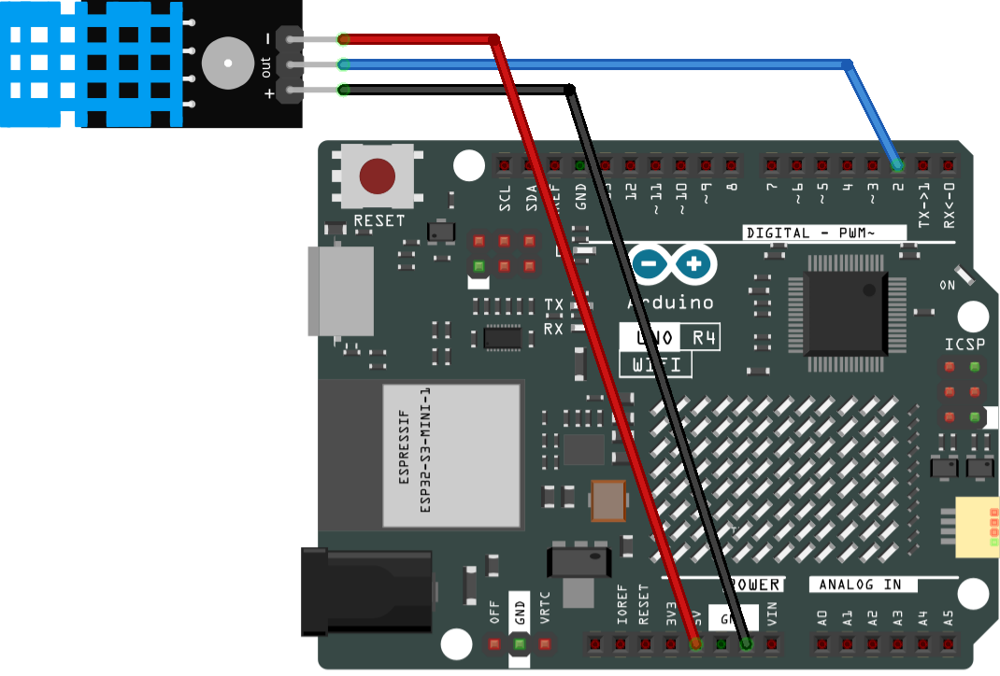

.. _dht11:

DHT-11 Module
==============================================================

.. note::
  
  🌟 Welcome to the SunFounder Facebook Community! Whether you're into Raspberry Pi, Arduino, or ESP32, you'll find inspiration, help ideas here.
   
  - ✅ Be the first to get free learning resources. 
   
  - ✅ Stay updated on new products & exclusive giveaways. 
   
  - ✅ Share your creations and get real feedback.
   
  * 👉 Need faster updates or support? Click [|link_sf_facebook|] join our Facebook community 

  * 👉 Or join our WhatsApp group: Click [|link_sf_whatsapp|]
   
Kit purchase
------------------------

Looking for parts? Check out our all-in-one kits below — packed with components, beginner-friendly guides, and tons of fun.

.. image:: img/ultimate_sensor_kit.png
   :width: 100%
   :align: center
   :target: https://www.sunfounder.com/collections/arduino-kits-bundles/products/sunfounder-ultimate-sensor-kit-with-original-arduino-uno-r4-minima?ref=jbzmncle

.. raw:: html

     

.. list-table::
   :widths: 20 20 20
   :header-rows: 1

   * - Name
     - Includes Arduino board
     - PURCHASE LINK
   * - Elite Explorer Kit
     - Arduino Uno R4 WiFi
     - |link_elite_buy|
   * - 3 in 1 Ultimate Starter Kit
     - Arduino Uno R4 Minima
     - |link_arduinor4_buy|

Course Introduction
------------------------

In this lesson, we will learn how to use the DHT-11 Module with Arduino.

.. .. raw:: html

..  <iframe width="700" height="394" src="https://www.youtube.com/embed/sO1tf1UgKJc" title="YouTube video player" frameborder="0" allow="accelerometer; autoplay; clipboard-write; encrypted-media; gyroscope; picture-in-picture; web-share" referrerpolicy="strict-origin-when-cross-origin" allowfullscreen></iframe>

.. note::

  If this is your first time working with an Arduino project, we recommend downloading and reviewing the basic materials first.
  
  * :ref:`install_arduino`
  * :ref:`introduce_arduino`

**Required Components**

In this project, we need the following components:

.. list-table::
    :widths: 5 20 5 20
    :header-rows: 1

    *   - SN
        - COMPONENT INTRODUCTION	
        - QUANTITY
        - PURCHASE LINK

    *   - 1
        - Arduino UNO R4 WIFI
        - 1
        - |link_unor4_wifi_buy|
    *   - 2
        - USB Type-C cable
        - 1
        - 
    *   - 3
        - Breadboard
        - 1
        - |link_breadboard_buy|
    *   - 4
        - Wires
        - Several
        - |link_wires_buy|
    *   - 5
        - DHT-11 Module
        - 1
        - |link_dht11m_buy|

**Wiring**

**Common Connections:**

* **DHT11 Humiture Sensor Module**

  - **DATA:** Connect to **2** on the Arduino.
  - **GND:** Connect to breadboard’s negative power bus.
  - **VCC:** Connect to breadboard’s red power bus.

**Writing the Code**

.. note::

    * You can copy this code into **Arduino IDE**. 
    * To install the library, use the Arduino Library Manager and search for **DHT** and install it.
    * Don't forget to select the board(Arduino UNO R4) and the correct port before clicking the **Upload** button.

.. code-block:: arduino

      /*
        This code reads the temperature and humidity values from a DHT11 sensor 
        connected to pin 2 and prints them to the serial monitor. 
        It also calculates and prints the heat index value in both Celsius and Fahrenheit.
        
        Board: Arduino Uno R3 (or R4)
        Component: Temperature and humidity module(DHT11)
        Library: https://github.com/adafruit/DHT-sensor-library  (DHT sensor library by Adafruit)
      */

      #include <DHT.h>

      #define DHTPIN 2       // Digital pin connected to the DHT sensor
      #define DHTTYPE DHT11  // Define sensor type: DHT11

      DHT dht(DHTPIN, DHTTYPE);  // Create a DHT sensor object

      void setup() {
        Serial.begin(9600);      // Start serial communication at 9600 baud rate
        Serial.println(F("DHT11 test!"));

        dht.begin();             // Initialize the DHT sensor
      }

      void loop() {
        delay(500);  // Wait 500 ms before next reading

        // Read humidity value (%)
        float h = dht.readHumidity();

        // Read temperature value in Celsius (°C)
        float t = dht.readTemperature();

        // Read temperature value in Fahrenheit (°F)
        float f = dht.readTemperature(true);

        // Check if any reading failed
        if (isnan(h) || isnan(t) || isnan(f)) {
          Serial.println(F("Failed to read from DHT sensor!"));
          return;                // Exit and try again
        }

        // Calculate heat index (feels-like temperature)
        float hif = dht.computeHeatIndex(f, h);        // In Fahrenheit
        float hic = dht.computeHeatIndex(t, h, false); // In Celsius

        // Output humidity and temperature to Serial Monitor
        Serial.print(F("Humidity: "));
        Serial.print(h);
        Serial.print(F("%  Temperature: "));
        Serial.print(t);
        Serial.println(F("°C"));
      }
