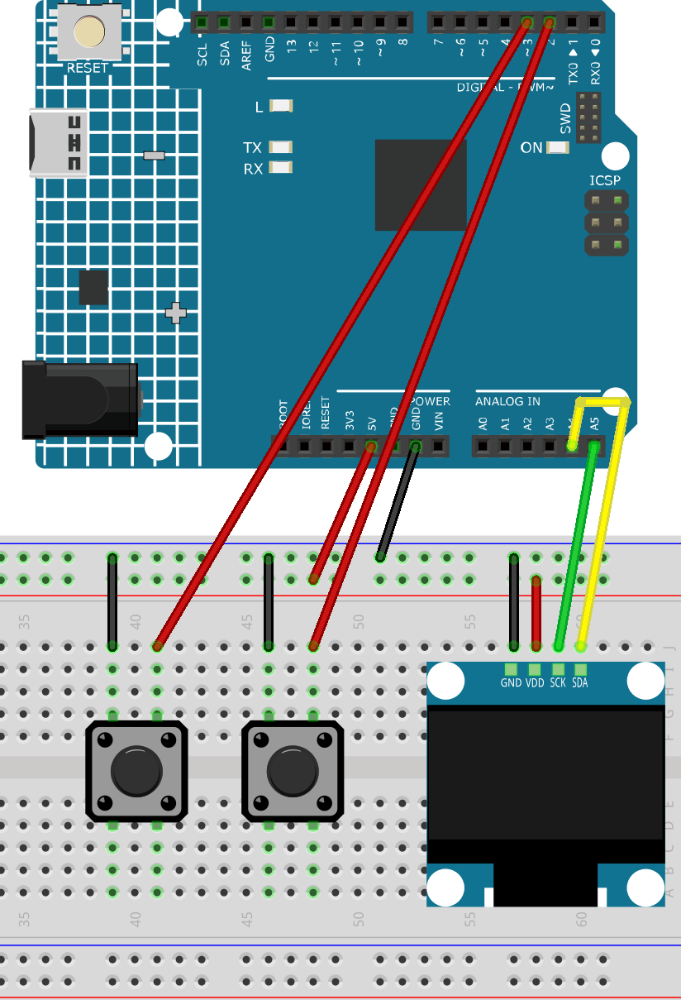

.. _digital_dice2.0:

Digital Dice 2.0
==============================================================

.. note::
  
  🌟 Welcome to the SunFounder Facebook Community! Whether you're into Raspberry Pi, Arduino, or ESP32, you'll find inspiration, help ideas here.
   
  - ✅ Be the first to get free learning resources. 
   
  - ✅ Stay updated on new products & exclusive giveaways. 
   
  - ✅ Share your creations and get real feedback.
   
  * 👉 Need faster updates or support? Click [|link_sf_facebook|] join our Facebook community 

  * 👉 Or join our WhatsApp group: Click [|link_sf_whatsapp|]
   
  * 🎁 Looking for parts?Check out our all-in-one kits below — packed with components, beginner-friendly guides, and tons of fun.
  
  .. list-table::
    :widths: 20 20 20
    :header-rows: 1

    *   - Name	
        - Includes Arduino board
        - PURCHASE LINK
    *   - Elite Explorer Kit	
        - Arduino Uno R4 WiFi
        - |link_elite_buy|
    *   - Ultimate Sensor Kit	
        - Arduino Uno R4 Minima
        - |link_arduinor4_buy|
    *   - Universal Maker Sensor Kit
        - ×
        - |link_umsk_buy|

Course Introduction
------------------------

In this lesson, you’ll learn how to use a OLED Display Module, a button with the Arduino R4 UNO to create a Lamb Run Game. We’ll cover using the Adafruit SSD1306 and GFX libraries to display on the screen.

The OLED Screen will display the game screen, and players can use button to control the game.

.. .. raw:: html

..  <iframe width="700" height="394" src="https://www.youtube.com/embed/KkPsawETYfg?si=4nMpy4ZNZjKVSooc" title="YouTube video player" frameborder="0" allow="accelerometer; autoplay; clipboard-write; encrypted-media; gyroscope; picture-in-picture; web-share" referrerpolicy="strict-origin-when-cross-origin" allowfullscreen></iframe>

.. note::

  If this is your first time working with an Arduino project, we recommend downloading and reviewing the basic materials first.

  * :ref:`install_arduino`
  * :ref:`introduce_arduino`

**Required Components**

In this project, we need the following components:

.. list-table::
    :widths: 5 20 5 20
    :header-rows: 1

    *   - SN
        - COMPONENT INTRODUCTION	
        - QUANTITY
        - PURCHASE LINK

    *   - 1
        - Arduino UNO R4 Minima
        - 1
        - |link_unor4_buy|
    *   - 2
        - USB Type-C cable
        - 1
        - 
    *   - 3
        - Breadboard
        - 1
        - |link_breadboard_buy|
    *   - 4
        - Wires
        - Several
        - |link_wires_buy|
    *   - 5
        - Button
        - 2
        - |link_button_buy|
    *   - 6
        - OLED Display Module
        - 1
        - |link_oled_buy|

**Wiring**

**Common Connections:**

* **OLED Display Module**

  - **SDA:** Connect to **A4** on the Arduino.
  - **SCK:** Connect to **A5** on the Arduino.
  - **GND:** Connect to breadboard’s negative power bus.
  - **VCC:** Connect to breadboard’s red power bus.

* **Buttons**

  - **Normal Button:** Connect to the negative power bus on the breadboard, and the other end to **2** on the Arduino board.
  - **Cheat Butto:** Connect to the negative power bus on the breadboard, and the other end to **3** on the Arduino board.

**Writing the Code**

.. note::

    * You can copy this code into **Arduino IDE**. 
    * To install the library, use the Arduino Library Manager and search for **Adafruit SSD1306** and **Adafruit GFX** and install it.
    * Don't forget to select the board(Arduino UNO R4 Minima) and the correct port before clicking the **Upload** button.

.. code-block:: arduino

      #include <Wire.h>
      #include <Adafruit_GFX.h>
      #include <Adafruit_SSD1306.h>

      #define SCREEN_WIDTH 128
      #define SCREEN_HEIGHT 64
      #define OLED_RESET -1
      #define SCREEN_ADDRESS 0x3C

      Adafruit_SSD1306 display(SCREEN_WIDTH, SCREEN_HEIGHT, &Wire, OLED_RESET);

      // Pin definitions
      const int rollButtonPin = 2;
      const int cheatButtonPin = 3;

      // Rolling control
      bool rolling = false;
      bool cheating = false;
      bool stopPending = false;
      unsigned long stopTime = 0;
      const int stopDelay = 500; // 0.5 second

      void setup() {
        pinMode(rollButtonPin, INPUT_PULLUP);
        pinMode(cheatButtonPin, INPUT_PULLUP);

        Serial.begin(9600);

        if (!display.begin(SSD1306_SWITCHCAPVCC, SCREEN_ADDRESS)) {
          Serial.println(F("OLED init failed"));
          while (true);
        }

        display.clearDisplay();
        display.setTextSize(2);
        display.setTextColor(WHITE);
        display.setCursor(10, 20);
        display.println("Ready...");
        display.display();
      }

      void loop() {
        bool rollPressed = digitalRead(rollButtonPin) == LOW;
        bool cheatPressed = digitalRead(cheatButtonPin) == LOW;

        // Start rolling
        if (rollPressed) {
          rolling = true;
          cheating = false;
          stopPending = false;
        } else if (cheatPressed) {
          rolling = true;
          cheating = true;
          stopPending = false;
        }

        // Schedule stop
        if (rolling && !rollPressed && !cheatPressed && !stopPending) {
          stopTime = millis() + stopDelay;
          stopPending = true;
        }

        // Stop after delay
        if (stopPending && millis() > stopTime) {
          rolling = false;
          stopPending = false;

          // If cheating, force show 6
          if (cheating) {
            displayDice(6);
          }
        }

        // Rolling display
        if (rolling) {
          byte number = random(1, 7);
          displayDice(number);
          delay(80);
        }
      }

      void displayDice(byte number) {
        display.clearDisplay();

        int cx = SCREEN_WIDTH / 2;
        int cy = SCREEN_HEIGHT / 2;
        int spacing = 16;

        switch (number) {
          case 1:
            drawDot(cx, cy);
            break;
          case 2:
            drawDot(cx - spacing, cy - spacing);
            drawDot(cx + spacing, cy + spacing);
            break;
          case 3:
            drawDot(cx, cy);
            drawDot(cx - spacing, cy - spacing);
            drawDot(cx + spacing, cy + spacing);
            break;
          case 4:
            drawDot(cx - spacing, cy - spacing);
            drawDot(cx + spacing, cy - spacing);
            drawDot(cx - spacing, cy + spacing);
            drawDot(cx + spacing, cy + spacing);
            break;
          case 5:
            drawDot(cx, cy);
            drawDot(cx - spacing, cy - spacing);
            drawDot(cx + spacing, cy - spacing);
            drawDot(cx - spacing, cy + spacing);
            drawDot(cx + spacing, cy + spacing);
            break;
          case 6:
            drawDot(cx - spacing, cy - spacing);
            drawDot(cx, cy - spacing);
            drawDot(cx + spacing, cy - spacing);
            drawDot(cx - spacing, cy + spacing);
            drawDot(cx, cy + spacing);
            drawDot(cx + spacing, cy + spacing);
            break;
        }

        display.display();
      }

      void drawDot(int x, int y) {
        display.fillCircle(x, y, 4, WHITE);
      }
