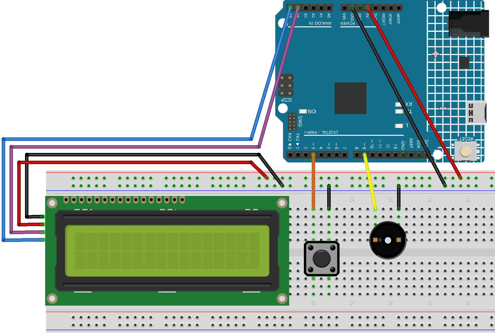

.. _dino_run:

Dino Run 
==============================================================
.. note::
  
  Hello, welcome to the SunFounder Raspberry Pi & Arduino & ESP32 Enthusiasts Community on Facebook! Dive deeper into Raspberry Pi, Arduino, and ESP32 with fellow enthusiasts.

  👉 Ready to explore and create with us? Click [|link_sf_facebook|] and join today!

  To get all the components for this project, consider one of the kits below. 

  Each includes the required parts, extra components for other projects, and beginner-friendly tutorials.

  .. list-table::
    :widths: 20 20 20
    :header-rows: 1

    *   - Name	
        - Includes Arduino board
        - PURCHASE LINK
    *   - Electronic Kit	
        - ×
        - |link_electronic_buy|
    *   - Elite Explorer Kit	
        - ×
        - |link_elite_buy|
    *   - 3 in 1 Ultimate Starter Kit	
        - √
        - |link_arduinor4_buy|

Course Introduction
------------------------

In this lesson, you’ll learn how to use a 1602 LCD, a button, and a passive buzzer with the Arduino R4 UNO to create a dinosaur running challenge game. 

The LCD will display the game screen, and players can press the button to make the dinosaur jump or duck to avoid obstacles. 
Each successful dodge will increase the player's score.

.. raw:: html

    <iframe width="700" height="394" src="https://www.youtube.com/embed/tXVDkziwIbU?si=KxsVHx-1tClx8HN6" title="YouTube video player" frameborder="0" allow="accelerometer; autoplay; clipboard-write; encrypted-media; gyroscope; picture-in-picture; web-share" referrerpolicy="strict-origin-when-cross-origin" allowfullscreen></iframe>

.. note::

  If this is your first time working with an Arduino project, we recommend downloading and reviewing the basic materials first.
  
  * :ref:`install_arduino`
  * :ref:`introduce_arduino`

**Required Components**

In this project, we need the following components:

.. list-table::
    :widths: 5 20 5 20
    :header-rows: 1

    *   - SN
        - COMPONENT INTRODUCTION	
        - QUANTITY
        - PURCHASE LINK

    *   - 1
        - Arduino UNO R4 Minima
        - 1
        - |link_unor4_buy|
    *   - 2
        - USB Type-C cable
        - 1
        - 
    *   - 3
        - Breadboard
        - 1
        - |link_breadboard_buy|
    *   - 4
        - Wires
        - Several
        - |link_wires_buy|
    *   - 5
        - I2C LCD 1602
        - 1
        - |link_i2clcd1602_buy|
    *   - 6
        - Button
        - 1
        - |link_button_buy|
    *   - 7
        - Passive buzzer
        - 1
        - |link_passive_buzzer_buy|

**Wiring**

**Common Connections:**

* **I2C LCD 1602**

  - **SDA:** Connect to **A4** on the Arduino.
  - **SCL:** Connect to **A5** on the Arduino.
  - **GND:** Connect to breadboard’s negative power bus.
  - **VCC:** Connect to breadboard’s red power bus.

* **Passive Buzzer**

  - **＋:** Connect to **9** on the Arduino.
  - **－:** Connect to breadboard’s negative power bus.

* **Button**

  - Connect to breadboard’s negative power bus.
  - Connect to **3** on the Arduino.

**Writing the Code**

.. note::

    * You can copy this code into **Arduino IDE**. 
    * To install the library, use the Arduino Library Manager and search for **LiquidCrystal I2C** and install it.
    * Don't forget to select the board(Arduino UNO R4 Minima) and the correct port before clicking the **Upload** button.

.. code-block:: arduino

        #include <Wire.h>
        #include <LiquidCrystal_I2C.h>

        #define BUTTON_PIN 3
        #define BUZZER_PIN 9  // Buzzer pin

        LiquidCrystal_I2C lcd(0x27, 16, 2); // Modify the address as needed

        // Obstacle types
        #define CACTUS 2
        #define BIRD   3

        // Custom characters: Dinosaur (left and right parts), Cactus, Bird
        byte dino_left[8] = {
          0b00000,
          0b00000,
          0b00010,
          0b00010,
          0b00011,
          0b00011,
          0b00001,
          0b00001
        };

        byte dino_right[8] = {
          0b00111,
          0b00111,
          0b00111,
          0b00100,
          0b11100,
          0b11100,
          0b11000,
          0b01000
        };

        byte cactus[8] = {
          0b00100,
          0b10100,
          0b10100,
          0b10101,
          0b01101,
          0b00101,
          0b00110,
          0b00100
        };

        byte bird[8] = {
          0b00100,
          0b01110,
          0b11111,
          0b01110,
          0b01010,
          0b00000,
          0b00000,
          0b00000
        };

        //==================== Global Variables ====================//

        bool isUp = false;       // Dinosaur row: true = top row, false = bottom row
        bool gameOver = false;   // Game over flag

        int distance = 0;        // Current step count (0~99)
        int hundreds = 0;        // Increments when every 100 steps are completed
        int totalSteps = 0;      // Total steps = hundreds * 100 + distance

        // Speed control
        int obstacleSpeed = 200;
        int minSpeed = 120;      // Minimum refresh interval (to prevent LCD flickering)
        int speedIncrement = 20; // Speed increases (i.e., refresh interval decreases) after each new obstacle

        // First obstacle
        int obstacleX1 = 13;
        int obstacleType1 = CACTUS;
        int lastObstacleType1 = BIRD;
        int repeatCount1 = 0;    // Limit same type to twice consecutively when steps < 100
        int oldObstacleX1 = 13;
        int oldObstacleRow1 = 1;

        // Second obstacle
        int obstacleX2 = -1;     // Initially disabled
        int obstacleType2 = CACTUS;
        int lastObstacleType2 = BIRD;
        int repeatCount2 = 0;
        int oldObstacleX2 = -1;
        int oldObstacleRow2 = 1;

        // Record dinosaur's previous row (for erasing)
        int oldDinoRow = 1;

        //---------------- Function Declarations ----------------//

        void startGame();
        void moveObstacle();
        void drawDinosaur();
        void endGame();

        int  getObstacleRow(int type);
        int  pickObstacleType(int &lastType, int &repeatCount);
        int  pickObstacleType2Diversify(int firstType);
        void fixImpossibleOverlap(int whoJustGenerated);

        //---------------- Setup & Loop ----------------//

        void setup() {
          lcd.init();
          lcd.backlight();

          lcd.createChar(0, dino_left);
          lcd.createChar(1, dino_right);
          lcd.createChar(2, cactus);
          lcd.createChar(3, bird);

          pinMode(BUTTON_PIN, INPUT_PULLUP);
          pinMode(BUZZER_PIN, OUTPUT); // Set buzzer as output

          randomSeed(analogRead(A0) ^ micros());

          startGame();
        }

        void loop() {
          static unsigned long lastButtonTime = 0;
          if (digitalRead(BUTTON_PIN) == LOW) {
            unsigned long now = millis();
            if (now - lastButtonTime > 200) { // Debounce delay
              lastButtonTime = now;
              if (gameOver) {
                startGame();
              } else {
                isUp = !isUp; // Toggle dinosaur's row
              }
            }
          }

          if (!gameOver) {
            moveObstacle();
          }
        }

        //---------------- Game Logic ----------------//

        void startGame() {
          isUp = false;
          gameOver = false;

          distance = 0;
          hundreds = 0;
          totalSteps = 0;
          obstacleSpeed = 200;

          // Initialize the first obstacle
          obstacleX1 = 13;
          obstacleType1 = CACTUS;
          lastObstacleType1 = BIRD;
          repeatCount1 = 0;
          oldObstacleX1 = 13;
          oldObstacleRow1 = 1;

          // Disable the second obstacle initially
          obstacleX2 = -1;
          obstacleType2 = CACTUS;
          lastObstacleType2 = BIRD;
          repeatCount2 = 0;
          oldObstacleX2 = -1;
          oldObstacleRow2 = 1;

          oldDinoRow = 1;

          // Display prompt messages
          lcd.clear();
          lcd.setCursor(0, 0);
          lcd.print(" Dino Run 16x2 ");
          lcd.setCursor(0, 1);
          lcd.print(" Press BTN...  ");
          delay(1000);
          lcd.clear();
        }

        /**
        * Every obstacleSpeed milliseconds, this function:
        * - Moves obstacles
        * - Updates the score
        * - Checks for collisions
        * - Renders the display
        */
        void moveObstacle() {
          static unsigned long lastMoveTime = 0;
          unsigned long now = millis();

          if (now - lastMoveTime >= obstacleSpeed) {
            lastMoveTime = now;

            // 1. Erase obstacles from the previous frame (if within screen bounds)
            if (oldObstacleX1 >= 0 && oldObstacleX1 < 16) {
              lcd.setCursor(oldObstacleX1, oldObstacleRow1);
              lcd.write(' ');
            }
            if (oldObstacleX2 >= 0 && oldObstacleX2 < 16) {
              lcd.setCursor(oldObstacleX2, oldObstacleRow2);
              lcd.write(' ');
            }

            // 2. Update score
            distance++;
            if (distance > 99) {
              distance = 0;
              hundreds++;
            }
            totalSteps = hundreds * 100 + distance;

            // 3. When steps >= 100, enable the second obstacle
            if (totalSteps >= 100 && obstacleX2 < 0) {
              obstacleX2 = 16;
              obstacleType2 = pickObstacleType2Diversify(obstacleType1);
              fixImpossibleOverlap(2);
            }

            // 4. Move obstacles to the left
            obstacleX1--;
            if (totalSteps >= 100) {
              obstacleX2--;
            }

            // 5. When the first obstacle goes off-screen, regenerate it
            if (obstacleX1 < 0) {
              obstacleX1 = 13;
              obstacleType1 = pickObstacleType(lastObstacleType1, repeatCount1);
              fixImpossibleOverlap(1);
              // Increase speed (i.e., decrease refresh interval)
              if (obstacleSpeed > minSpeed) {
                obstacleSpeed -= speedIncrement;
                if (obstacleSpeed < minSpeed) obstacleSpeed = minSpeed;
              }
            }

            // 6. When the second obstacle goes off-screen (and steps >= 100), regenerate it
            if (totalSteps >= 100 && obstacleX2 < 0) {
              obstacleX2 = 16;
              obstacleType2 = pickObstacleType2Diversify(obstacleType1);
              fixImpossibleOverlap(2);
            }

            // 7. Draw the dinosaur, obstacles, and score
            drawDinosaur();

            int row1 = getObstacleRow(obstacleType1);
            if (obstacleX1 >= 0 && obstacleX1 < 16) {
              lcd.setCursor(obstacleX1, row1);
              lcd.write(byte(obstacleType1));
            }
            oldObstacleX1 = obstacleX1;
            oldObstacleRow1 = row1;

            int row2 = getObstacleRow(obstacleType2);
            if (totalSteps >= 100 && obstacleX2 >= 0 && obstacleX2 < 16) {
              lcd.setCursor(obstacleX2, row2);
              lcd.write(byte(obstacleType2));
              oldObstacleX2 = obstacleX2;
              oldObstacleRow2 = row2;
            }

            lcd.setCursor(14, 0);
            lcd.print(hundreds);
            lcd.setCursor(14, 1);
            lcd.print(distance / 10);
            lcd.setCursor(15, 1);
            lcd.print(distance % 10);

            // 8. Collision detection: when an obstacle reaches column 1 or 2,
            //    if it is in the same row as the dinosaur, it's a collision.
            if ((obstacleX1 == 1 || obstacleX1 == 2)) {
              if ((obstacleType1 == CACTUS && !isUp) || (obstacleType1 == BIRD && isUp)) {
                endGame();
                return;
              }
            }
            if (totalSteps >= 100 && (obstacleX2 == 1 || obstacleX2 == 2)) {
              if ((obstacleType2 == CACTUS && !isUp) || (obstacleType2 == BIRD && isUp)) {
                endGame();
                return;
              }
            }
          }
        }

        void drawDinosaur() {
          int newRow = isUp ? 0 : 1;
          // Erase dinosaur from previous row if changed
          if (newRow != oldDinoRow) {
            lcd.setCursor(1, oldDinoRow);
            lcd.write(' ');
            lcd.setCursor(2, oldDinoRow);
            lcd.write(' ');
          }
          lcd.setCursor(1, newRow);
          lcd.write(byte(0));
          lcd.setCursor(2, newRow);
          lcd.write(byte(1));
          oldDinoRow = newRow;
        }

        void endGame() {
          gameOver = true;
          // Play an alternative game over sound sequence using the buzzer:
          tone(BUZZER_PIN, 400, 100); // first note
          delay(150);
          tone(BUZZER_PIN, 600, 100); // second note
          delay(150);
          tone(BUZZER_PIN, 800, 150); // third note (peak)
          delay(200);
          tone(BUZZER_PIN, 600, 150); // fourth note
          delay(200);
          tone(BUZZER_PIN, 400, 200); // fifth note (resolution)
          delay(250);
          noTone(BUZZER_PIN);

          lcd.clear();
          lcd.setCursor(2, 0);
          lcd.print("GAME OVER!!!");
          lcd.setCursor(1, 1);
          lcd.print("Steps: ");
          lcd.print(totalSteps);
        }

        //---------------- Utility Functions ----------------//

        // Returns the row to display the obstacle based on its type:
        // CACTUS on the bottom row (1), BIRD on the top row (0)
        int getObstacleRow(int type) {
          return (type == CACTUS) ? 1 : 0;
        }

        /**
        * pickObstacleType():
        *   - When steps < 100: Limit to avoid three consecutive identical obstacles (allow two in a row).
        *   - When steps >= 100: Choose purely random.
        */
        int pickObstacleType(int &lastType, int &repeatCount) {
          bool limitRepeat = (totalSteps < 100);
          int newType = (random(2) == 0) ? CACTUS : BIRD;

          if (!limitRepeat) {
            return newType;
          } else {
            if (repeatCount >= 2) {
              newType = (lastType == CACTUS) ? BIRD : CACTUS;
              repeatCount = 1;
            } else {
              if (newType == lastType) repeatCount++;
              else repeatCount = 1;
            }
            lastType = newType;
            return newType;
          }
        }

        /**
        * pickObstacleType2Diversify():
        *   For the second obstacle, set a 90% chance to be different from the first obstacle,
        *   and a 10% chance to be the same.
        */
        int pickObstacleType2Diversify(int firstType) {
          int r = random(100);
          if (r < 90) {
            return (firstType == CACTUS) ? BIRD : CACTUS;
          } else {
            return firstType;
          }
        }

        /**
        * fixImpossibleOverlap():
        *   Prevent unavoidable collisions:
        *     Cases like: (12,1) + (12,0), (12,1) + (11,0), or (11,1) + (12,0)
        *   When obstacles are in different rows, ensure their horizontal difference (dx) is at least 2.
        *   If dx < 2, adjust the type or push the newly generated obstacle 2 columns to the right.
        *
        *   whoJustGenerated: 1 indicates the first obstacle was just generated, 2 indicates the second.
        */
        void fixImpossibleOverlap(int whoJustGenerated) {
          while (true) {
            int row1 = getObstacleRow(obstacleType1);
            int row2 = getObstacleRow(obstacleType2);
            int dx = abs(obstacleX1 - obstacleX2);
            // If obstacles are in different rows and their horizontal gap is less than 2, it's an unavoidable collision.
            if (!(row1 != row2 && dx < 2)) break;

            if (whoJustGenerated == 1) {
              obstacleType1 = pickObstacleType2Diversify(obstacleType2);
              row1 = getObstacleRow(obstacleType1);
              dx = abs(obstacleX1 - obstacleX2);
              if (row1 != row2 && dx < 2) {
                obstacleX1 = obstacleX2 + 2; // Force the first obstacle 2 columns to the right
              }
            } else {
              obstacleType2 = pickObstacleType2Diversify(obstacleType1);
              row2 = getObstacleRow(obstacleType2);
              dx = abs(obstacleX1 - obstacleX2);
              if (row1 != row2 && dx < 2) {
                obstacleX2 = obstacleX1 + 2; // Force the second obstacle 2 columns to the right
              }
            }
          }
        }

.. **Experimenting Further**

.. Feel free to get creative—explore on your own, use additional tools, or collaborate with your peers to enhance the game. Here are some ideas to get you started:

.. * Add a jump cooldown to prevent the dinosaur from jumping too frequently.

.. * Include sound effects for milestone scores.

.. * Introduce a third type of obstacle.

.. * Use EEPROM to store the highest score.

.. * Add a start menu and a restart option.
