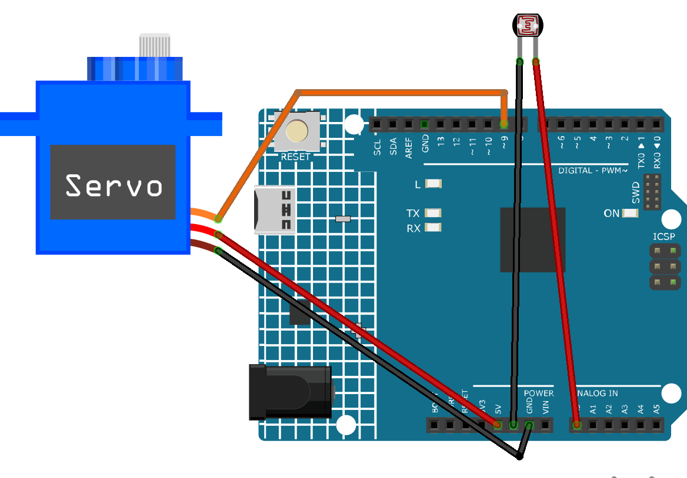

.. _dino_run2.0:

Dino Run 2.0
==============================================================

.. note::
  
  🌟 Welcome to the SunFounder Facebook Community! Whether you're into Raspberry Pi, Arduino, or ESP32, you'll find inspiration, help ideas here.
   
  - ✅ Be the first to get free learning resources. 
   
  - ✅ Stay updated on new products & exclusive giveaways. 
   
  - ✅ Share your creations and get real feedback.
   
  * 👉 Need faster updates or support? Click [|link_sf_facebook|] join our Facebook community 

  * 👉 Or join our WhatsApp group: Click [|link_sf_whatsapp|]
   
Kit purchase
------------------------

Looking for parts? Check out our all-in-one kits below — packed with components, beginner-friendly guides, and tons of fun.

.. image:: img/elite_explore_kit.png
   :width: 100%
   :align: center
   :target: https://www.sunfounder.com/collections/arduino-kits-bundles/products/sunfounder-elite-explorer-kit-with-official-arduino-uno-r4-wifi?ref=jbzmncle

.. raw:: html

     

.. list-table::
   :widths: 20 20 20
   :header-rows: 1

   * - Name
     - Includes Arduino board
     - PURCHASE LINK
   * - Ultimate Sensor Kit
     - Arduino Uno R4 Minima
     - |link_ultimate_sensor_buy|
   * - Elite Explorer Kit
     - Arduino Uno R4 WiFi
     - |link_elite_buy|
   * - 3 in 1 Ultimate Starter Kit
     - Arduino Uno R4 Minima
     - |link_arduinor4_buy|
   * - Universal Maker Sensor Kit
     - ×
     - |link_umsk_buy|

Course Introduction
------------------------

In this project, you’ll learn how to use a light sensor and a servo motor with the Arduino R4 UNO to create a dino run game version 2.0.

When the ambient light suddenly drops—such as when a shadow passes—the servo will quickly activate to simulate a mechanical response, like pressing a button.

This project demonstrates basic sensor input, signal filtering, and actuator control.

.. raw:: html

  <iframe width="700" height="394" src="https://www.youtube.com/embed/sDb7CPerhuA" title="YouTube video player" frameborder="0" allow="accelerometer; autoplay; clipboard-write; encrypted-media; gyroscope; picture-in-picture; web-share" referrerpolicy="strict-origin-when-cross-origin" allowfullscreen></iframe>

.. note::

  If this is your first time working with an Arduino project, we recommend downloading and reviewing the basic materials first.
  
  * :ref:`install_arduino`
  * :ref:`introduce_arduino`

**Required Components**

In this project, we need the following components:

.. list-table::
    :widths: 5 20 5 20
    :header-rows: 1

    *   - SN
        - COMPONENT INTRODUCTION	
        - QUANTITY
        - PURCHASE LINK

    *   - 1
        - Arduino UNO R4 Minima
        - 1
        - |link_unor4_buy|
    *   - 2
        - USB Type-C cable
        - 1
        - 
    *   - 3
        - Breadboard
        - 1
        - |link_breadboard_buy|
    *   - 4
        - Wires
        - Several
        - |link_wires_buy|
    *   - 5
        - Digital Servo Motor
        - 1
        - |link_motor_buy|
    *   - 6
        - Photoresistor
        - 1
        - |link_photoresistor_buy|

**Wiring**

**Common Connections:**

* **Digital Servo Motor**

  - Connect to breadboard’s positive power bus.
  - Connect to breadboard’s negative power bus.
  - Connect to **9** on the Arduino.

* **Photoresistor Module**

  - **VCC:** Connect to **A0** on the Arduino.
  - **GND:** Connect to breadboard’s negative power bus.

**Writing the Code**

.. note::

    * You can copy this code into **Arduino IDE**. 
    * Don't forget to select the board(Arduino UNO R4 Minima) and the correct port before clicking the **Upload** button.

.. code-block:: arduino

      #include <Servo.h>

      // Pin definitions
      const int lightSensorPin = A0;
      const int servoPin = 9;

      // Detection parameters
      const int lightDropThreshold = 400;  // Increase threshold: trigger only if drop exceeds 400
      unsigned int baselineLight = 0;      // Baseline light level at startup

      // Trigger cooldown
      const unsigned long detectionCooldown = 1000;
      unsigned long lastDetectionTime = 0;

      Servo myServo;

      void setup() {
        myServo.attach(servoPin);
        myServo.write(0);
        pinMode(lightSensorPin, INPUT);
        Serial.begin(9600);

        // Initialize baseline light value: average over multiple readings
        delay(1000);  // Wait for stable startup
        baselineLight = getAverageLight(10);  // Average of 10 readings
        Serial.print("Baseline light value: ");
        Serial.println(baselineLight);
      }

      void loop() {
        int currentLight = getAverageLight(5);  // Current light average (more stable)
        unsigned long currentTime = millis();

        Serial.print("Current light: ");
        Serial.println(currentLight);

        // Check if there's a significant drop in light
        if ((baselineLight - currentLight) > lightDropThreshold && currentTime - lastDetectionTime > detectionCooldown) {
          myServo.write(90);   // Rotate
          delay(150);          // Hold the position
          myServo.write(0);    // Return to original position
          lastDetectionTime = currentTime;
        }

        delay(10); 
      }

      // Get average light value to avoid accidental triggers
      int getAverageLight(int samples) {
        long total = 0;
        for (int i = 0; i < samples; i++) {
          total += analogRead(lightSensorPin);
          delay(1);  // Small delay between readings
        }
        return total / samples;
      }
