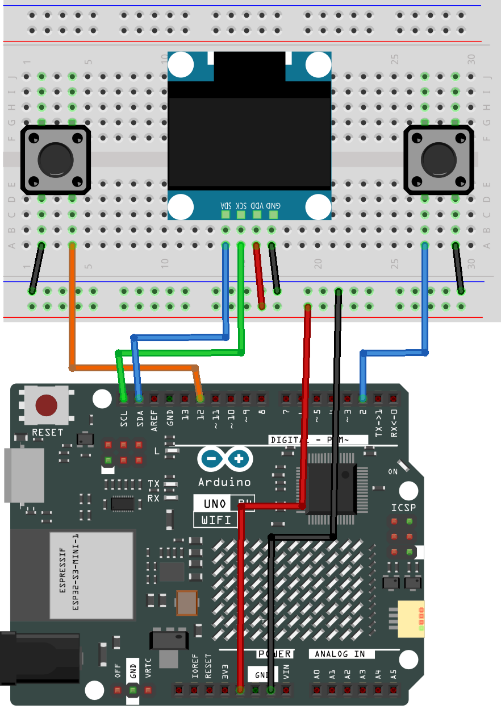

.. _dino_run3.0:

Dino Run3.0
==============================================================

.. note::
  
  🌟 Welcome to the SunFounder Facebook Community! Whether you're into Raspberry Pi, Arduino, or ESP32, you'll find inspiration, help ideas here.
   
  - ✅ Be the first to get free learning resources. 
   
  - ✅ Stay updated on new products & exclusive giveaways. 
   
  - ✅ Share your creations and get real feedback.
   
  * 👉 Need faster updates or support? Click [|link_sf_facebook|] join our Facebook community 

  * 👉 Or join our WhatsApp group: Click [|link_sf_whatsapp|]
   
Kit purchase
------------------------

Looking for parts? Check out our all-in-one kits below — packed with components, beginner-friendly guides, and tons of fun.

.. image:: img/elite_explore_kit.png
   :width: 100%
   :align: center
   :target: https://www.sunfounder.com/collections/arduino-kits-bundles/products/sunfounder-elite-explorer-kit-with-official-arduino-uno-r4-wifi?ref=jbzmncle

.. raw:: html

     

.. list-table::
   :widths: 20 20 20
   :header-rows: 1

   * - Name
     - Includes Arduino board
     - PURCHASE LINK
   * - Ultimate Sensor Kit
     - Arduino Uno R4 Minima
     - |link_ultimate_sensor_buy|
   * - Elite Explorer Kit
     - Arduino Uno R4 WiFi
     - |link_elite_buy|
   * - 3 in 1 Ultimate Starter Kit
     - Arduino Uno R4 Minima
     - |link_arduinor4_buy|
   * - Universal Maker Sensor Kit
     - ×
     - |link_umsk_buy|

Course Introduction
------------------------

In this lesson, you’ll learn how to use an OLED display and two buttons with the Arduino UNO R4 WIFI to create a Dino Run Game. We’ll use the Adafruit SSD1306 and GFX libraries to draw the game graphics on the screen.

Players can press the red button to jump and the blue button to crouch while avoiding cacti and flying birds. The game also tracks the current score and high score.

.. .. raw:: html

..  <iframe width="700" height="394" src="https://www.youtube.com/embed/KkPsawETYfg?si=4nMpy4ZNZjKVSooc" title="YouTube video player" frameborder="0" allow="accelerometer; autoplay; clipboard-write; encrypted-media; gyroscope; picture-in-picture; web-share" referrerpolicy="strict-origin-when-cross-origin" allowfullscreen></iframe>

.. note::

  If this is your first time working with an Arduino project, we recommend downloading and reviewing the basic materials first.

  * :ref:`install_arduino`
  * :ref:`introduce_arduino`

**Required Components**

In this project, we need the following components:

.. list-table::
    :widths: 5 20 5 20
    :header-rows: 1

    *   - SN
        - COMPONENT INTRODUCTION	
        - QUANTITY
        - PURCHASE LINK

    *   - 1
        - Arduino UNO R4 WIFI
        - 1
        - |link_unor4_buy|
    *   - 2
        - USB Type-C cable
        - 1
        - 
    *   - 3
        - Breadboard
        - 1
        - |link_breadboard_buy|
    *   - 4
        - Wires
        - Several
        - |link_wires_buy|
    *   - 5
        - Button
        - 2
        - |link_button_buy|
    *   - 6
        - OLED Display Module
        - 1
        - |link_oled_buy|

**Wiring**

**Common Connections:**

* **OLED Display Module**

  - **SDA:** Connect to **SDA** on the Arduino.
  - **SCK:** Connect to **SCL** on the Arduino.
  - **GND:** Connect to breadboard’s negative power bus.
  - **VCC:** Connect to breadboard’s red power bus.

* **Button 1**

  - Connect to the breadboard’s negative power bus, and the other end to **2** on the Arduino board.

* **Button 2**

  - Connect to the breadboard’s negative power bus, and the other end to **12** on the Arduino board.

**Writing the Code**

.. note::

    * You can copy this code into **Arduino IDE**. 
    * To install the library, use the Arduino Library Manager and search for **Adafruit SSD1306** and **Adafruit GFX** and install it.
    * Don't forget to select the board(Arduino UNO R4 Minima/WIFI) and the correct port before clicking the **Upload** button.

.. code-block:: arduino

      #include <Wire.h>
      #include <Adafruit_GFX.h>
      #include <Adafruit_SSD1306.h>

      // OLED screen settings
      #define SCREEN_WIDTH 128
      #define SCREEN_HEIGHT 64
      #define OLED_RESET -1
      #define OLED_ADDRESS 0x3C

      Adafruit_SSD1306 display(
        SCREEN_WIDTH,
        SCREEN_HEIGHT,
        &Wire,
        OLED_RESET
      );

      // Button pins
      // Blue button: crouch
      // Red button: jump, start, and restart
      const int CROUCH_BUTTON_PIN = 2;
      const int JUMP_BUTTON_PIN = 12;

      // Game layout
      const int GROUND_Y = 55;
      const int DINO_X = 10;

      // Dinosaur sizes
      const int DINO_STAND_WIDTH = 14;
      const int DINO_STAND_HEIGHT = 18;

      const int DINO_CROUCH_WIDTH = 21;
      const int DINO_CROUCH_HEIGHT = 10;

      // Dinosaur vertical position and movement speed
      float dinoY = GROUND_Y - DINO_STAND_HEIGHT;
      float dinoVelocityY = 0;

      // Gravity pulls the dinosaur downward
      // A negative jump velocity moves it upward
      const float GRAVITY = 520.0;
      const float JUMP_VELOCITY = -195.0;

      // Dinosaur status
      bool dinoOnGround = true;
      bool isCrouching = false;

      // Available obstacle types
      enum ObstacleType {
        SINGLE_CACTUS,
        DOUBLE_CACTUS,
        TRIPLE_CACTUS,
        LARGE_CACTUS,
        BIRD
      };

      // Stores the current obstacle information
      struct Obstacle {
        float x;
        int y;
        int width;
        int height;
        ObstacleType type;
      };

      Obstacle obstacle;

      // Main game states
      enum GameState {
        START_SCREEN,
        PLAYING,
        GAME_OVER
      };

      GameState gameState = START_SCREEN;

      // Score values
      unsigned long score = 0;
      unsigned long highScore = 0;
      unsigned long lastScoreTime = 0;

      // Current obstacle movement speed
      float obstacleSpeed = 85.0;

      // Frame and animation timing
      unsigned long lastFrameTime = 0;
      unsigned long lastAnimationTime = 0;

      const unsigned long FRAME_INTERVAL = 30;
      const unsigned long RUN_ANIMATION_INTERVAL = 120;

      // Switches between two running animation frames
      bool runFrame = false;

      // Jump button debounce variables
      bool lastJumpReading = HIGH;
      bool stableJumpState = HIGH;

      unsigned long lastJumpDebounceTime = 0;
      const unsigned long BUTTON_DEBOUNCE_DELAY = 35;

      void setup() {
        // Use the Arduino internal pull-up resistors
        pinMode(CROUCH_BUTTON_PIN, INPUT_PULLUP);
        pinMode(JUMP_BUTTON_PIN, INPUT_PULLUP);

        Serial.begin(9600);

        // Stop the program if the OLED cannot be initialized
        if (!display.begin(SSD1306_SWITCHCAPVCC, OLED_ADDRESS)) {
          Serial.println("SSD1306 OLED initialization failed.");

          while (true) {
          }
        }

        display.clearDisplay();
        display.setTextColor(SSD1306_WHITE);
        display.display();

        // Create a different obstacle sequence after each restart
        randomSeed(analogRead(A0) ^ micros());

        showStartScreen();
      }

      void loop() {
        // Detect one complete press of the jump button
        bool jumpPressed = readJumpButtonPressed();

        // Start the game when the red button is pressed
        if (gameState == START_SCREEN) {
          if (jumpPressed) {
            startGame();
          }

          return;
        }

        // Restart the game after a collision
        if (gameState == GAME_OVER) {
          if (jumpPressed) {
            startGame();
          }

          return;
        }

        // The dinosaur can jump only while touching the ground
        if (jumpPressed && dinoOnGround) {
          startJump();
        }

        unsigned long currentTime = millis();

        // Wait until it is time to draw the next frame
        if (currentTime - lastFrameTime < FRAME_INTERVAL) {
          return;
        }

        // Convert the time between frames into seconds
        float deltaTime =
          (currentTime - lastFrameTime) / 1000.0;

        lastFrameTime = currentTime;

        readCrouchButton();
        updateDinosaur(deltaTime);
        updateObstacle(deltaTime);
        updateScore();
        updateRunAnimation();

        // End the game when the dinosaur touches an obstacle
        if (checkCollision()) {
          endGame();
          return;
        }

        drawGame();
      }

      void startGame() {
        gameState = PLAYING;

        // Reset the score and game speed
        score = 0;
        obstacleSpeed = 85.0;

        // Return the dinosaur to its starting position
        dinoVelocityY = 0;
        dinoOnGround = true;
        isCrouching = false;

        dinoY = GROUND_Y - DINO_STAND_HEIGHT;

        // Reset all timing values
        lastFrameTime = millis();
        lastScoreTime = millis();
        lastAnimationTime = millis();

        // Create the first obstacle
        spawnObstacle(true);

        display.clearDisplay();
        display.display();
      }

      // Draws one line of text in the horizontal center
      void drawCenteredText(
        const char *text,
        int y,
        int textSize
      ) {
        display.setTextSize(textSize);
        display.setTextColor(SSD1306_WHITE);

        int16_t x1;
        int16_t y1;
        uint16_t textWidth;
        uint16_t textHeight;

        display.getTextBounds(
          text,
          0,
          y,
          &x1,
          &y1,
          &textWidth,
          &textHeight
        );

        int x = (SCREEN_WIDTH - textWidth) / 2;

        display.setCursor(x, y);
        display.print(text);
      }

      void showStartScreen() {
        display.clearDisplay();

        drawCenteredText("DINO RUN", 5, 2);
        drawCenteredText("BLUE: CROUCH", 30, 1);
        drawCenteredText("RED: JUMP", 42, 1);
        drawCenteredText("PRESS RED", 55, 1);

        display.display();
      }

      // Returns true only once for each jump button press
      bool readJumpButtonPressed() {
        bool currentReading =
          digitalRead(JUMP_BUTTON_PIN);

        // Restart the debounce timer when the reading changes
        if (currentReading != lastJumpReading) {
          lastJumpDebounceTime = millis();
        }

        bool buttonPressed = false;

        // Accept the new state after it stays stable
        if (
          millis() - lastJumpDebounceTime >
          BUTTON_DEBOUNCE_DELAY
        ) {
          if (currentReading != stableJumpState) {
            stableJumpState = currentReading;

            // INPUT_PULLUP means LOW is pressed
            if (stableJumpState == LOW) {
              buttonPressed = true;
            }
          }
        }

        lastJumpReading = currentReading;

        return buttonPressed;
      }

      void readCrouchButton() {
        bool crouchButtonPressed =
          digitalRead(CROUCH_BUTTON_PIN) == LOW;

        // Crouching is allowed only on the ground
        if (dinoOnGround) {
          isCrouching = crouchButtonPressed;
        } else {
          isCrouching = false;
        }
      }

      void startJump() {
        // Cancel crouching before jumping
        isCrouching = false;
        dinoOnGround = false;

        // Give the dinosaur an upward starting speed
        dinoVelocityY = JUMP_VELOCITY;
      }

      void updateDinosaur(float deltaTime) {
        if (!dinoOnGround) {
          // Apply gravity and update the vertical position
          dinoVelocityY += GRAVITY * deltaTime;
          dinoY += dinoVelocityY * deltaTime;

          int standingGroundY =
            GROUND_Y - DINO_STAND_HEIGHT;

          // Stop the fall when the dinosaur reaches the ground
          if (dinoY >= standingGroundY) {
            dinoY = standingGroundY;
            dinoVelocityY = 0;
            dinoOnGround = true;
          }
        } else {
          // Change the drawing position when crouching
          if (isCrouching) {
            dinoY =
              GROUND_Y - DINO_CROUCH_HEIGHT;
          } else {
            dinoY =
              GROUND_Y - DINO_STAND_HEIGHT;
          }
        }
      }

      void spawnObstacle(bool firstObstacle) {
        // Place the obstacle just outside the right side
        if (firstObstacle) {
          obstacle.x = SCREEN_WIDTH + 20;
        } else {
          obstacle.x =
            SCREEN_WIDTH + random(10, 40);
        }

        int randomType = random(100);

        // Unlock more obstacle types as the score increases
        if (score < 40) {
          if (randomType < 45) {
            obstacle.type = SINGLE_CACTUS;
          } else if (randomType < 80) {
            obstacle.type = DOUBLE_CACTUS;
          } else {
            obstacle.type = LARGE_CACTUS;
          }
        } else if (score < 80) {
          if (randomType < 25) {
            obstacle.type = SINGLE_CACTUS;
          } else if (randomType < 50) {
            obstacle.type = DOUBLE_CACTUS;
          } else if (randomType < 75) {
            obstacle.type = TRIPLE_CACTUS;
          } else {
            obstacle.type = LARGE_CACTUS;
          }
        } else {
          if (randomType < 20) {
            obstacle.type = SINGLE_CACTUS;
          } else if (randomType < 40) {
            obstacle.type = DOUBLE_CACTUS;
          } else if (randomType < 60) {
            obstacle.type = TRIPLE_CACTUS;
          } else if (randomType < 80) {
            obstacle.type = LARGE_CACTUS;
          } else {
            obstacle.type = BIRD;
          }
        }

        // Set the size and position for the selected obstacle
        switch (obstacle.type) {
          case SINGLE_CACTUS:
            obstacle.width = 7;
            obstacle.height = 13;
            obstacle.y =
              GROUND_Y - obstacle.height;
            break;

          case DOUBLE_CACTUS:
            obstacle.width = 13;
            obstacle.height = 13;
            obstacle.y =
              GROUND_Y - obstacle.height;
            break;

          case TRIPLE_CACTUS:
            obstacle.width = 19;
            obstacle.height = 13;
            obstacle.y =
              GROUND_Y - obstacle.height;
            break;

          case LARGE_CACTUS:
            obstacle.width = 10;
            obstacle.height = 19;
            obstacle.y =
              GROUND_Y - obstacle.height;
            break;

          case BIRD:
            obstacle.width = 15;
            obstacle.height = 8;

            // The bird is low enough to require crouching
            obstacle.y = GROUND_Y - 19;
            break;
        }
      }

      void updateObstacle(float deltaTime) {
        // Move the obstacle from right to left
        obstacle.x -=
          obstacleSpeed * deltaTime;

        // Create a new obstacle after the current one leaves
        if (obstacle.x + obstacle.width < 0) {
          spawnObstacle(false);
        }

        // Increase the game speed with the score
        obstacleSpeed =
          85.0 + score * 0.25;

        // Limit the maximum speed
        if (obstacleSpeed > 160.0) {
          obstacleSpeed = 160.0;
        }
      }

      void updateScore() {
        unsigned long currentTime = millis();

        // Add one point every 100 milliseconds
        if (
          currentTime - lastScoreTime >= 100
        ) {
          lastScoreTime = currentTime;

          if (score < 9999) {
            score++;
          }
        }
      }

      void updateRunAnimation() {
        unsigned long currentTime = millis();

        // Change the leg position while running
        if (
          dinoOnGround &&
          currentTime - lastAnimationTime >=
            RUN_ANIMATION_INTERVAL
        ) {
          lastAnimationTime = currentTime;
          runFrame = !runFrame;
        }
      }

      // Checks whether two rectangular areas overlap
      bool rectanglesOverlap(
        int ax,
        int ay,
        int aw,
        int ah,
        int bx,
        int by,
        int bw,
        int bh
      ) {
        return (
          ax < bx + bw &&
          ax + aw > bx &&
          ay < by + bh &&
          ay + ah > by
        );
      }

      bool checkCollision() {
        int dinoWidth;
        int dinoHeight;
        int dinoCollisionY;

        // Use a shorter collision box while crouching
        if (isCrouching && dinoOnGround) {
          dinoWidth = DINO_CROUCH_WIDTH;
          dinoHeight = DINO_CROUCH_HEIGHT;
          dinoCollisionY =
            GROUND_Y - DINO_CROUCH_HEIGHT;
        } else {
          dinoWidth = DINO_STAND_WIDTH;
          dinoHeight = DINO_STAND_HEIGHT;
          dinoCollisionY = (int)dinoY;
        }

        // Slightly reduce both hitboxes to make collisions fairer
        int dinoHitboxX = DINO_X + 2;
        int dinoHitboxY = dinoCollisionY + 2;
        int dinoHitboxWidth = dinoWidth - 4;
        int dinoHitboxHeight = dinoHeight - 3;

        int obstacleHitboxX =
          (int)obstacle.x + 1;

        int obstacleHitboxY =
          obstacle.y + 1;

        int obstacleHitboxWidth =
          obstacle.width - 2;

        int obstacleHitboxHeight =
          obstacle.height - 2;

        return rectanglesOverlap(
          dinoHitboxX,
          dinoHitboxY,
          dinoHitboxWidth,
          dinoHitboxHeight,
          obstacleHitboxX,
          obstacleHitboxY,
          obstacleHitboxWidth,
          obstacleHitboxHeight
        );
      }

      void drawGame() {
        display.clearDisplay();

        // Draw the score last so it stays visible
        drawGround();
        drawDinosaur();
        drawObstacle();
        drawScore();

        display.display();
      }

      void drawScore() {
        display.setTextSize(1);
        display.setTextColor(SSD1306_WHITE);

        // Limit both displayed values to four digits
        unsigned long shownHighScore =
          highScore > 9999
            ? 9999
            : highScore;

        unsigned long shownScore =
          score > 9999
            ? 9999
            : score;

        char scoreText[15];

        snprintf(
          scoreText,
          sizeof(scoreText),
          "HI %04lu %04lu",
          shownHighScore,
          shownScore
        );

        int16_t x1;
        int16_t y1;
        uint16_t textWidth;
        uint16_t textHeight;

        display.getTextBounds(
          scoreText,
          0,
          0,
          &x1,
          &y1,
          &textWidth,
          &textHeight
        );

        // Align the complete score text to the right edge
        int scoreX =
          SCREEN_WIDTH - textWidth;

        if (scoreX < 0) {
          scoreX = 0;
        }

        display.setCursor(scoreX, 0);
        display.print(scoreText);
      }

      void drawGround() {
        // Draw the main ground line
        display.drawLine(
          0,
          GROUND_Y,
          SCREEN_WIDTH - 1,
          GROUND_Y,
          SSD1306_WHITE
        );

        // Small moving pixels create a scrolling ground effect
        int groundOffset =
          ((int)obstacle.x) % 16;

        for (
          int x = groundOffset;
          x < SCREEN_WIDTH;
          x += 16
        ) {
          if (x >= 0) {
            display.drawPixel(
              x,
              GROUND_Y + 4,
              SSD1306_WHITE
            );
          }
        }
      }

      void drawDinosaur() {
        if (isCrouching && dinoOnGround) {
          drawCrouchingDinosaur(
            DINO_X,
            GROUND_Y - DINO_CROUCH_HEIGHT
          );
        } else {
          drawStandingDinosaur(
            DINO_X,
            (int)dinoY
          );
        }
      }

      void drawStandingDinosaur(int x, int y) {
        // Head
        display.fillRect(
          x + 6,
          y,
          8,
          7,
          SSD1306_WHITE
        );

        // Eye
        display.drawPixel(
          x + 11,
          y + 2,
          SSD1306_BLACK
        );

        // Mouth
        display.drawPixel(
          x + 13,
          y + 5,
          SSD1306_BLACK
        );

        // Neck
        display.fillRect(
          x + 5,
          y + 5,
          5,
          6,
          SSD1306_WHITE
        );

        // Body
        display.fillRect(
          x + 3,
          y + 8,
          8,
          7,
          SSD1306_WHITE
        );

        // Tail
        display.drawLine(
          x + 3,
          y + 10,
          x,
          y + 7,
          SSD1306_WHITE
        );

        display.drawLine(
          x + 2,
          y + 11,
          x,
          y + 9,
          SSD1306_WHITE
        );

        // Arm
        display.drawLine(
          x + 9,
          y + 10,
          x + 13,
          y + 11,
          SSD1306_WHITE
        );

        // Alternate the legs while running
        if (dinoOnGround) {
          if (runFrame) {
            display.drawLine(
              x + 5,
              y + 14,
              x + 3,
              y + 17,
              SSD1306_WHITE
            );

            display.drawLine(
              x + 9,
              y + 14,
              x + 11,
              y + 17,
              SSD1306_WHITE
            );
          } else {
            display.drawLine(
              x + 5,
              y + 14,
              x + 7,
              y + 17,
              SSD1306_WHITE
            );

            display.drawLine(
              x + 9,
              y + 14,
              x + 7,
              y + 17,
              SSD1306_WHITE
            );
          }
        } else {
          // Fixed leg position while jumping
          display.drawLine(
            x + 5,
            y + 14,
            x + 3,
            y + 16,
            SSD1306_WHITE
          );

          display.drawLine(
            x + 9,
            y + 14,
            x + 11,
            y + 16,
            SSD1306_WHITE
          );
        }
      }

      void drawCrouchingDinosaur(int x, int y) {
        // Longer and lower body
        display.fillRect(
          x + 3,
          y + 3,
          13,
          6,
          SSD1306_WHITE
        );

        // Head
        display.fillRect(
          x + 14,
          y,
          7,
          7,
          SSD1306_WHITE
        );

        // Eye
        display.drawPixel(
          x + 18,
          y + 2,
          SSD1306_BLACK
        );

        // Mouth
        display.drawPixel(
          x + 20,
          y + 5,
          SSD1306_BLACK
        );

        // Tail
        display.drawLine(
          x + 3,
          y + 4,
          x,
          y + 1,
          SSD1306_WHITE
        );

        display.drawLine(
          x + 3,
          y + 6,
          x,
          y + 4,
          SSD1306_WHITE
        );

        // Alternate the crouching leg positions
        if (runFrame) {
          display.drawLine(
            x + 6,
            y + 8,
            x + 4,
            y + 9,
            SSD1306_WHITE
          );

          display.drawLine(
            x + 12,
            y + 8,
            x + 14,
            y + 9,
            SSD1306_WHITE
          );
        } else {
          display.drawLine(
            x + 7,
            y + 8,
            x + 9,
            y + 9,
            SSD1306_WHITE
          );

          display.drawLine(
            x + 13,
            y + 8,
            x + 11,
            y + 9,
            SSD1306_WHITE
          );
        }
      }

      void drawObstacle() {
        int x = (int)obstacle.x;

        // Draw the correct shape for the current obstacle
        switch (obstacle.type) {
          case SINGLE_CACTUS:
            drawSingleCactus(
              x,
              obstacle.y
            );
            break;

          case DOUBLE_CACTUS:
            drawDoubleCactus(
              x,
              obstacle.y
            );
            break;

          case TRIPLE_CACTUS:
            drawTripleCactus(
              x,
              obstacle.y
            );
            break;

          case LARGE_CACTUS:
            drawLargeCactus(
              x,
              obstacle.y
            );
            break;

          case BIRD:
            drawBird(
              x,
              obstacle.y
            );
            break;
        }
      }

      void drawSingleCactus(int x, int y) {
        // Main stem
        display.fillRect(
          x + 2,
          y,
          3,
          13,
          SSD1306_WHITE
        );

        // Left branch
        display.fillRect(
          x,
          y + 5,
          2,
          3,
          SSD1306_WHITE
        );

        // Right branch
        display.fillRect(
          x + 5,
          y + 3,
          2,
          4,
          SSD1306_WHITE
        );
      }

      void drawDoubleCactus(int x, int y) {
        // Draw two small cacti next to each other
        drawSingleCactus(x, y);
        drawSingleCactus(x + 6, y);
      }

      void drawTripleCactus(int x, int y) {
        // Draw three small cacti next to each other
        drawSingleCactus(x, y);
        drawSingleCactus(x + 6, y);
        drawSingleCactus(x + 12, y);
      }

      void drawLargeCactus(int x, int y) {
        // Main stem
        display.fillRect(
          x + 4,
          y,
          4,
          19,
          SSD1306_WHITE
        );

        // Left branch
        display.fillRect(
          x,
          y + 7,
          4,
          4,
          SSD1306_WHITE
        );

        // Right branch
        display.fillRect(
          x + 7,
          y + 4,
          3,
          6,
          SSD1306_WHITE
        );
      }

      void drawBird(int x, int y) {
        // Body
        display.fillRect(
          x + 5,
          y + 3,
          7,
          4,
          SSD1306_WHITE
        );

        // Head
        display.fillRect(
          x + 11,
          y + 1,
          4,
          4,
          SSD1306_WHITE
        );

        // Beak
        display.drawPixel(
          x + 15,
          y + 3,
          SSD1306_WHITE
        );

        // Eye
        display.drawPixel(
          x + 13,
          y + 2,
          SSD1306_BLACK
        );

        // Tail
        display.drawLine(
          x + 5,
          y + 4,
          x + 1,
          y + 2,
          SSD1306_WHITE
        );

        // Alternate the wing position
        if (runFrame) {
          display.drawLine(
            x + 7,
            y + 3,
            x + 3,
            y,
            SSD1306_WHITE
          );

          display.drawLine(
            x + 8,
            y + 4,
            x + 4,
            y,
            SSD1306_WHITE
          );
        } else {
          display.drawLine(
            x + 7,
            y + 6,
            x + 3,
            y + 8,
            SSD1306_WHITE
          );

          display.drawLine(
            x + 8,
            y + 6,
            x + 5,
            y + 8,
            SSD1306_WHITE
          );
        }
      }

      void endGame() {
        gameState = GAME_OVER;

        // Save the new high score
        if (score > highScore) {
          highScore = score;
        }

        showGameOverScreen();
      }

      void showGameOverScreen() {
        display.clearDisplay();

        char scoreLine[16];
        char bestLine[16];

        unsigned long shownScore =
          score > 9999 ? 9999 : score;

        unsigned long shownHighScore =
          highScore > 9999 ? 9999 : highScore;

        snprintf(
          scoreLine,
          sizeof(scoreLine),
          "SCORE: %04lu",
          shownScore
        );

        snprintf(
          bestLine,
          sizeof(bestLine),
          "BEST: %04lu",
          shownHighScore
        );

        drawCenteredText("GAME OVER", 5, 2);
        drawCenteredText(scoreLine, 31, 1);
        drawCenteredText(bestLine, 42, 1);
        drawCenteredText("PRESS RED", 55, 1);

        display.display();
      }
