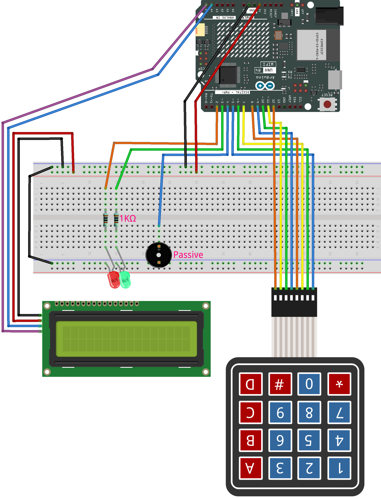

.. _disarm_timer:

Disarm Timer
==============================================================

.. note::
  
  🌟 Welcome to the SunFounder Facebook Community! Whether you're into Raspberry Pi, Arduino, or ESP32, you'll find inspiration, help ideas here.
   
  - ✅ Be the first to get free learning resources. 
   
  - ✅ Stay updated on new products & exclusive giveaways. 
   
  - ✅ Share your creations and get real feedback.
   
  * 👉 Need faster updates or support? Click [|link_sf_facebook|] join our Facebook community 

  * 👉 Or join our WhatsApp group: Click [|link_sf_whatsapp|]
   
Kit purchase
------------------------

Looking for parts? Check out our all-in-one kits below — packed with components, beginner-friendly guides, and tons of fun.

.. image:: img/elite_explore_kit.png
   :width: 100%
   :align: center
   :target: https://www.sunfounder.com/collections/arduino-kits-bundles/products/sunfounder-elite-explorer-kit-with-official-arduino-uno-r4-wifi?ref=jbzmncle

.. raw:: html

     

.. list-table::
   :widths: 20 20 20
   :header-rows: 1

   * - Name
     - Includes Arduino board
     - PURCHASE LINK
   * - Ultimate Sensor Kit
     - Arduino Uno R4 Minima
     - |link_ultimate_sensor_buy|
   * - Elite Explorer Kit
     - Arduino Uno R4 WiFi
     - |link_elite_buy|
   * - 3 in 1 Ultimate Starter Kit
     - Arduino Uno R4 Minima
     - |link_arduinor4_buy|
   * - Universal Maker Sensor Kit
     - ×
     - |link_umsk_buy|

Course Introduction
------------------------

This Arduino project uses a 4x4 keypad, I2C 1602 LCD, LEDs, and a buzzer to simulate a digital bomb countdown system. 

Set a 4-digit code and countdown timer using the keypad. The LCD displays instructions and the timer. 

Use the correct code to disarm before time runs out, or the red LED and buzzer will trigger to signal “explosion.”

.. raw:: html
 
  <iframe width="700" height="394" src="https://www.youtube.com/embed/LgiN9tX-SYM?si=vfpa9kEVkzSl4egj" title="YouTube video player" frameborder="0" allow="accelerometer; autoplay; clipboard-write; encrypted-media; gyroscope; picture-in-picture; web-share" referrerpolicy="strict-origin-when-cross-origin" allowfullscreen></iframe>

.. note::

  If this is your first time working with an Arduino project, we recommend downloading and reviewing the basic materials first.
  
  * :ref:`install_arduino`
  * :ref:`introduce_arduino`

**Required Components**

In this project, we need the following components:

.. list-table::
    :widths: 5 20 5 20
    :header-rows: 1

    *   - SN
        - COMPONENT INTRODUCTION	
        - QUANTITY
        - PURCHASE LINK

    *   - 1
        - Arduino UNO R4 Minima/Arduino UNO R4 WIFI
        - 1
        - |link_unor4_wifi_buy|
    *   - 2
        - USB Type-C cable
        - 1
        - 
    *   - 3
        - Breadboard
        - 1
        - |link_breadboard_buy|
    *   - 4
        - Wires
        - Several
        - |link_wires_buy|
    *   - 5
        - 1kΩ resistor
        - 2
        - |link_resistor_buy|
    *   - 6
        - KeyPad
        - 1
        - |link_keypad_buy|
    *   - 7
        - LED
        - 2
        - |link_led_buy|
    *   - 8
        - I2C LCD 1602
        - 1
        - |link_i2clcd1602_buy|
    *   - 9
        - Passive Buzzer
        - 1
        - |link_passive_buzzer_buy|

**Wiring**

**Common Connections:**

* **LED**

  - **Red:** Connect the LED **cathode** to the negative power bus on the breadboard, and the LEDs **anode** to a **1kΩ resistor** then to **2** on the Arduino.
  - **Green:** Connect the LED **cathode** to the negative power bus on the breadboard, and the LEDs **anode** to a **1kΩ resistor** then to **3** on the Arduino.

* **Keypad**

  - **RowPins:** Connect to  **5** to **8** on the Arduino.
  - **ColPins:** Connect to **9** to **12** on the Arduino.

* **Passive Buzzer**

  - **＋:** Connect to **4** on the Arduino.
  - **－:** Connect to breadboard’s negative power bus.

* **I2C LCD 1602**

  - **SDA:** Connect to **A4** on the Arduino.
  - **SCL:** Connect to **A5** on the Arduino.
  - **GND:** Connect to breadboard’s negative power bus.
  - **VCC:** Connect to breadboard’s red power bus.

**Writing the Code**

.. note::

    * You can copy this code into **Arduino IDE**. 
    * To install the library, use the Arduino Library Manager and search for **LiquidCrystal I2C** and **Adafruit_Keypad** install it.
    * Don't forget to select the board(Arduino UNO R4 WIFI) and the correct port before clicking the **Upload** button.

.. code-block:: arduino

      #include <Adafruit_Keypad.h>
      #include <LiquidCrystal_I2C.h>

      // Pin definitions for 4x4 keypad
      const byte ROWS = 4, COLS = 4;
      char keys[ROWS][COLS] = {
        { '1','2','3','A' },
        { '4','5','6','B' },
        { '7','8','9','C' },
        { '*','0','#','D' }
      };
      byte rowPins[ROWS] = { 5, 6, 7, 8 };
      byte colPins[COLS] = { 9, 10, 11, 12 };
      Adafruit_Keypad keypad(makeKeymap(keys), rowPins, colPins, ROWS, COLS);

      // LED and buzzer pins
      const int RED_LED_PIN   = 2;
      const int GREEN_LED_PIN = 3;
      const int BUZZER_PIN    = 4;

      // I2C LCD at address 0x27, 16 columns × 2 rows
      LiquidCrystal_I2C lcd(0x27, 16, 2);

      // Storage for arm/disarm code and countdown
      int armCode[4], inputCode[4];
      unsigned long timeLeft = 0;

      // Play a simple beep for key presses (1000Hz, 80ms)
      void beepKey() {
        tone(BUZZER_PIN, 1000, 80);
      }

      // Play a lower beep for each countdown tick (800Hz, 100ms)
      void beepCount() {
        tone(BUZZER_PIN, 800, 100);
      }

      // Play three quick beeps when '#' is pressed to arm
      void beepHash() {
        for (int i = 0; i < 3; i++) {
          tone(BUZZER_PIN, 1000, 80);
          delay(120);
        }
      }

      // Play alternating tones and flash LEDs on disarm success
      void beepDisarm() {
        for (int i = 0; i < 3; i++) {
          digitalWrite(RED_LED_PIN, HIGH);
          digitalWrite(GREEN_LED_PIN, LOW);
          tone(BUZZER_PIN, 1200, 200);
          delay(300);
          digitalWrite(RED_LED_PIN, LOW);
          digitalWrite(GREEN_LED_PIN, HIGH);
          tone(BUZZER_PIN, 800, 200);
          delay(300);
        }
        noTone(BUZZER_PIN);
      }

      void setup() {
        Serial.begin(9600);
        keypad.begin();
        pinMode(RED_LED_PIN, OUTPUT);
        pinMode(GREEN_LED_PIN, OUTPUT);
        pinMode(BUZZER_PIN, OUTPUT);

        // Initialize LCD
        lcd.init();
        lcd.backlight();
        lcd.clear();

        // 1. Enter 4-digit arm code
        digitalWrite(RED_LED_PIN, HIGH);
        digitalWrite(GREEN_LED_PIN, HIGH);
        lcd.setCursor(0, 0);
        lcd.print("Bomb Activated!");
        lcd.setCursor(0, 1);
        lcd.print("Code: ");
        for (int i = 0, col = 6; i < 4; ) {
          keypad.tick();
          if (keypad.available()) {
            auto e = keypad.read();
            if (e.bit.EVENT == KEY_JUST_PRESSED && isDigit(e.bit.KEY)) {
              beepKey();
              armCode[i++] = e.bit.KEY - '0';
              lcd.setCursor(col++, 1);
              lcd.print((char)e.bit.KEY);
            }
          }
        }
        delay(500);
        digitalWrite(RED_LED_PIN, LOW);
        digitalWrite(GREEN_LED_PIN, LOW);

        // 2. Show disarm code
        digitalWrite(RED_LED_PIN, HIGH);
        digitalWrite(GREEN_LED_PIN, HIGH);
        lcd.clear();
        lcd.setCursor(0, 0);
        lcd.print("Disarm Code:");
        lcd.setCursor(0, 1);
        for (int i = 0; i < 4; i++) {
          lcd.print(armCode[i]);
        }
        delay(1000);

        // 3. Set countdown time (HH:MM:SS)
        lcd.clear();
        lcd.setCursor(0, 0);
        lcd.print("Time: HH:MM:SS");
        lcd.setCursor(0, 1);
        lcd.print("SET: ");
        int t[6];
        for (int i = 0; i < 6; ) {
          keypad.tick();
          if (keypad.available()) {
            auto e = keypad.read();
            if (e.bit.EVENT == KEY_JUST_PRESSED && isDigit(e.bit.KEY)) {
              beepKey();
              t[i] = e.bit.KEY - '0';
              int pos = (i < 2 ? 5 + i : (i < 4 ? 8 + (i - 2) : 11 + (i - 4)));
              lcd.setCursor(pos, 1);
              lcd.print((char)e.bit.KEY);
              i++;
            }
          }
        }
        int HH = t[0]*10 + t[1];
        int MM = t[2]*10 + t[3];
        int SS = t[4]*10 + t[5];
        timeLeft = HH*3600UL + MM*60UL + SS;

        // 4. Center display initial countdown for 2 seconds
        char buf[9];
        sprintf(buf, "%02d:%02d:%02d", HH, MM, SS);
        lcd.clear();
        lcd.setCursor(0, 0);
        lcd.print("Time:");
        lcd.setCursor((16 - 8) / 2, 1);
        lcd.print(buf);
        delay(2000);

        // 5. Prompt to arm with centered "# To Arm"
        lcd.clear();
        lcd.setCursor((16 - 7) / 2, 0);
        lcd.print("# To Arm");
        while (true) {
          keypad.tick();
          if (keypad.available()) {
            auto e = keypad.read();
            if (e.bit.EVENT == KEY_JUST_PRESSED && e.bit.KEY == '#') {
              beepHash();
              break;
            }
          }
        }

        // 6. Show armed message for 2 seconds
        lcd.clear();
        lcd.setCursor(0, 0);
        lcd.print("Bomb Armed!");
        lcd.setCursor(0, 1);
        lcd.print("Countdown Started!");
        digitalWrite(GREEN_LED_PIN, HIGH);
        delay(2000);
      }

      void loop() {
        static unsigned long prev = millis();
        static bool disarmMode = false;
        static int di = 0;
        char buf[9];

        keypad.tick();

        // 7. Update countdown every second on second line
        unsigned long now = millis();
        if (now - prev >= 1000) {
          prev += 1000;
          if (timeLeft > 0) {
            timeLeft--;
            int h = timeLeft / 3600;
            int m = (timeLeft % 3600) / 60;
            int s = timeLeft % 60;
            sprintf(buf, "%02d:%02d:%02d", h, m, s);
            if (!disarmMode) {
              lcd.clear();
            }
            lcd.setCursor(0, 1);
            lcd.print("Time:");
            lcd.print(buf);
            beepCount();
          }
        }

        // 8. Press '*' to disarm (does not pause countdown)
        if (keypad.available()) {
          auto e = keypad.read();
          if (e.bit.EVENT == KEY_JUST_PRESSED) {
            beepKey();
            if (e.bit.KEY == '*' && !disarmMode) {
              disarmMode = true;
              di = 0;
              lcd.clear();
              lcd.setCursor(0, 0);
              lcd.print("Code:");
              sprintf(buf, "%02d:%02d:%02d",
                      timeLeft / 3600,
                      (timeLeft % 3600) / 60,
                      timeLeft % 60);
              lcd.setCursor(0, 1);
              lcd.print("Time:");
              lcd.print(buf);
            }
            else if (disarmMode && isDigit(e.bit.KEY) && di < 4) {
              inputCode[di] = e.bit.KEY - '0';
              lcd.setCursor(6 + di, 0);
              lcd.print((char)e.bit.KEY);
              di++;
              if (di == 4) {
                bool ok = true;
                for (int i = 0; i < 4; i++) {
                  if (inputCode[i] != armCode[i]) ok = false;
                }
                if (ok) {
                  beepDisarm();
                  lcd.clear();
                  lcd.setCursor(0, 0);
                  lcd.print("Disarmed!");
                  lcd.setCursor(0, 1);
                  lcd.print("Well Done!");
                  while (true);  // stop further action
                }
                disarmMode = false;  // wrong code, back to countdown
              }
            }
          }
        }

        // 11. Explode when time reaches zero
        if (timeLeft == 0) {
          lcd.clear();
          lcd.setCursor(0, 0);
          lcd.print("THE BOMB");
          lcd.setCursor(0, 1);
          lcd.print("EXPLODED!!!");
          while (true) {
            digitalWrite(RED_LED_PIN, HIGH);
            digitalWrite(GREEN_LED_PIN, LOW);
            beepKey();         // use same “beep” tone
            delay(100);
            digitalWrite(RED_LED_PIN, LOW);
            digitalWrite(GREEN_LED_PIN, HIGH);
            beepKey();
            delay(100);
          }
        }
      }
