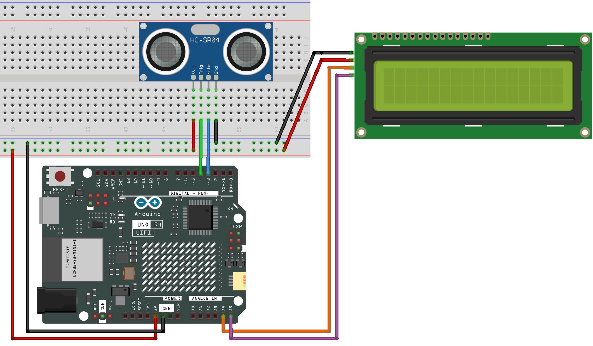

.. _distance_display:

Distance Display
==============================================================

.. note::
  
  🌟 Welcome to the SunFounder Facebook Community! Whether you're into Raspberry Pi, Arduino, or ESP32, you'll find inspiration, help ideas here.
   
  - ✅ Be the first to get free learning resources. 
   
  - ✅ Stay updated on new products & exclusive giveaways. 
   
  - ✅ Share your creations and get real feedback.
   
  * 👉 Need faster updates or support? Click [|link_sf_facebook|] join our Facebook community 

  * 👉 Or join our WhatsApp group: Click [|link_sf_whatsapp|]
   
Kit purchase
------------------------

Looking for parts? Check out our all-in-one kits below — packed with components, beginner-friendly guides, and tons of fun.

.. image:: img/elite_explore_kit.png
   :width: 100%
   :align: center
   :target: https://www.sunfounder.com/collections/arduino-kits-bundles/products/sunfounder-elite-explorer-kit-with-official-arduino-uno-r4-wifi?ref=jbzmncle

.. raw:: html

     

.. list-table::
   :widths: 20 20 20
   :header-rows: 1

   * - Name
     - Includes Arduino board
     - PURCHASE LINK
   * - Ultimate Sensor Kit
     - Arduino Uno R4 Minima
     - |link_ultimate_sensor_buy|
   * - Elite Explorer Kit
     - Arduino Uno R4 WiFi
     - |link_elite_buy|
   * - 3 in 1 Ultimate Starter Kit
     - Arduino Uno R4 Minima
     - |link_arduinor4_buy|
   * - Universal Maker Sensor Kit
     - ×
     - |link_umsk_buy|

Course Introduction
------------------------

In this project, we use an ultrasonic sensor and an I2C 1602 LCD with an Arduino board to create a real-time distance measurement display system. 

The ultrasonic sensor continuously measures the distance to an obstacle, and the result is shown on the LCD screen in centimeters. 

The system updates the display approximately every 800 milliseconds, making it suitable for simple proximity detection applications.

.. raw:: html
 
  <iframe width="700" height="394" src="https://www.youtube.com/embed/ZgshCyLw8Fk?si=ksBdWvVV91WM2iHN" title="YouTube video player" frameborder="0" allow="accelerometer; autoplay; clipboard-write; encrypted-media; gyroscope; picture-in-picture; web-share" referrerpolicy="strict-origin-when-cross-origin" allowfullscreen></iframe>

.. note::

  If this is your first time working with an Arduino project, we recommend downloading and reviewing the basic materials first.
  
  * :ref:`install_arduino`
  * :ref:`introduce_arduino`

**Required Components**

In this project, we need the following components:

.. list-table::
    :widths: 5 20 5 20
    :header-rows: 1

    *   - SN
        - COMPONENT INTRODUCTION	
        - QUANTITY
        - PURCHASE LINK

    *   - 1
        - Arduino UNO R4 WIFI
        - 1
        - |link_unor4_wifi_buy|
    *   - 2
        - USB Type-C cable
        - 1
        - 
    *   - 3
        - Breadboard
        - 1
        - |link_breadboard_buy|
    *   - 4
        - Wires
        - Several
        - |link_wires_buy|
    *   - 5
        - Ultrasonic Sensor Module
        - 1
        - |link_ultrasonic_buy|
    *   - 6
        - I2C LCD 1602
        - 1
        - |link_i2clcd1602_buy|

**Wiring**

**Common Connections:**

* **I2C LCD 1602**

  - **SDA:** Connect to **A4** on the Arduino.
  - **SCL:** Connect to **A5** on the Arduino.
  - **GND:** Connect to breadboard’s negative power bus.
  - **VCC:** Connect to breadboard’s red power bus.

* **Ultrasonic Sensor Module**

  - **Trig:** Connect to **4** on the Arduino.
  - **Echo:** Connect to **3** on the Arduino.
  - **GND:** Connect to breadboard’s negative power bus.
  - **VCC:** Connect to breadboard’s red power bus.

**Writing the Code**

.. note::

    * You can copy this code into **Arduino IDE**. 
    * To install the library, use the Arduino Library Manager and search for **LiquidCrystal I2C** and install it.
    * Don't forget to select the board(Arduino UNO R4 WIFI) and the correct port before clicking the **Upload** button.

.. code-block:: arduino

      #include <LiquidCrystal_I2C.h>

      LiquidCrystal_I2C lcd(0x27, 16, 2);  // initialize the Liquid Crystal Display object with the I2C address 0x27, 16 columns and 2 rows

      // Define the pin numbers for the ultrasonic sensor
      const int echoPin = 3;
      const int trigPin = 4;

      void setup() {
        pinMode(echoPin, INPUT);   // Set echo pin as input
        pinMode(trigPin, OUTPUT);  // Set trig pin as output

        lcd.init();       // initialize the LCD
        lcd.clear();      // clear the LCD display
        lcd.backlight();  // Make sure backlight is on
      }

      void loop() {
        float distance = readDistance();  // Call the function to read the sensor data and get the distance

        lcd.setCursor(0, 0);           //Place the cursor at Line 1, Column 1. From here the characters are to be displayed
        lcd.print("Distance:");        ////Print Distance: on the LCD
        lcd.setCursor(0, 1);           //Set the cursor at Line 1, Column 0
        lcd.print("               ");  //Here is to leave some spaces after the characters so as to clear the previous characters that may still remain.
        lcd.setCursor(7, 1);           //Set the cursor at Line 1, Column 7.
        lcd.print(distance);           // print on the LCD the value of the distance converted from the time between ping sending and receiving.
        lcd.setCursor(14, 1);          //Set the cursor at Line 1, Column 14.
        lcd.print("cm");               //print the unit "cm"

        delay(800);  // Delay for 800 milliseconds before repeating the loop
      }

      // Function to read the sensor data and calculate the distance
      float readDistance() {
        digitalWrite(trigPin, LOW);   // Set trig pin to low to ensure a clean pulse
        delayMicroseconds(2);         // Delay for 2 microseconds
        digitalWrite(trigPin, HIGH);  // Send a 10 microsecond pulse by setting trig pin to high
        delayMicroseconds(10);
        digitalWrite(trigPin, LOW);  // Set trig pin back to low

        // Measure the pulse width of the echo pin and calculate the distance value
        float distance = pulseIn(echoPin, HIGH) / 58.00;  // Formula: (340m/s * 1us) / 2
        return distance;
      }
