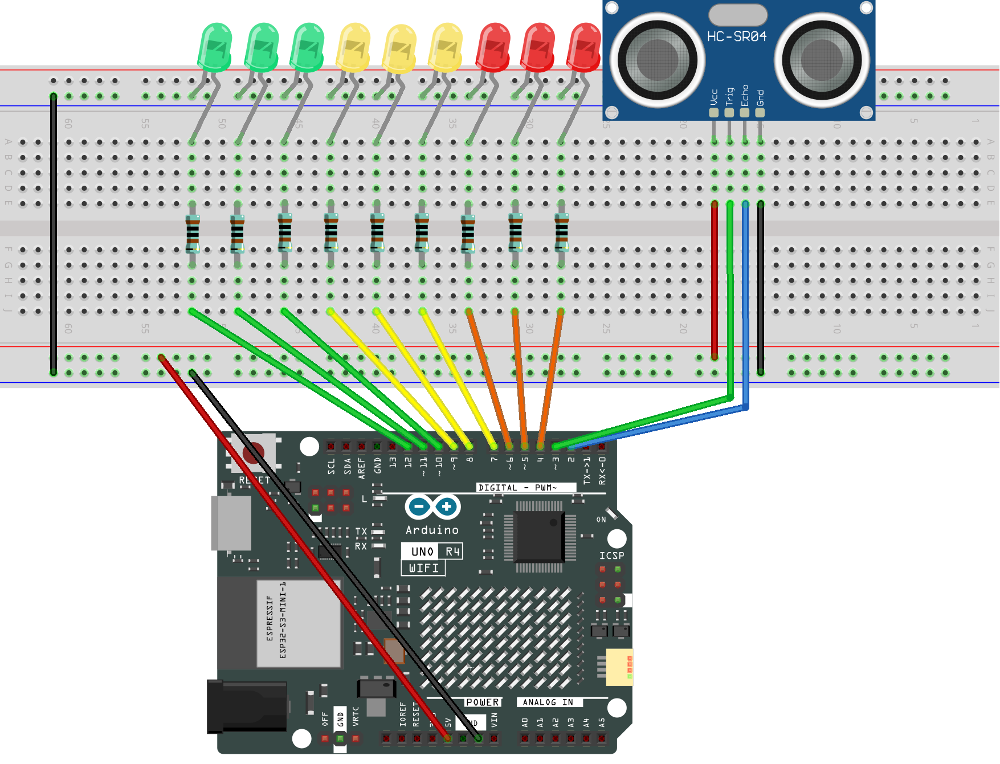

.. _distance_display1.0:

Distance Display 1.0
==============================================================

.. note::
  
  🌟 Welcome to the SunFounder Facebook Community! Whether you're into Raspberry Pi, Arduino, or ESP32, you'll find inspiration, help ideas here.
   
  - ✅ Be the first to get free learning resources. 
   
  - ✅ Stay updated on new products & exclusive giveaways. 
   
  - ✅ Share your creations and get real feedback.
   
  * 👉 Need faster updates or support? Click [|link_sf_facebook|] join our Facebook community 

  * 👉 Or join our WhatsApp group: Click [|link_sf_whatsapp|]
   
  * 🎁 Looking for parts?Check out our all-in-one kits below — packed with components, beginner-friendly guides, and tons of fun.
  
  .. list-table::
    :widths: 20 20 20
    :header-rows: 1

    *   - Name	
        - Includes Arduino board
        - PURCHASE LINK
    *   - Elite Explorer Kit	
        - Arduino Uno R4 WiFi
        - |link_elite_buy|
    *   - 3 in 1 Ultimate Starter Kit
        - Arduino Uno R4 Minima
        - |link_arduinor4_buy|

Course Introduction
------------------------

In this project, we use an ultrasonic sensor and three groups of LEDs (green, yellow, red) to simulate a radar-style proximity alert system with the Arduino board. 

The system measures the distance to an object and activates different LED groups based on how close the object is: green LEDs indicate a safe distance (≤15 cm), yellow LEDs warn that the object is getting closer (≤10 cm), and red LEDs signal a critical proximity alert (≤5 cm). The LEDs turn on from left to right and turn off from right to left to enhance the visual effect.

.. .. raw:: html
 
..  <iframe width="700" height="394" src="https://www.youtube.com/embed/IIe3DMzaRSA?si=EmbqV2plsvQtJ3yr" title="YouTube video player" frameborder="0" allow="accelerometer; autoplay; clipboard-write; encrypted-media; gyroscope; picture-in-picture; web-share" referrerpolicy="strict-origin-when-cross-origin" allowfullscreen></iframe>

.. note::

  If this is your first time working with an Arduino project, we recommend downloading and reviewing the basic materials first.
  
  * :ref:`install_arduino`
  * :ref:`introduce_arduino`

**Required Components**

In this project, we need the following components:

.. list-table::
    :widths: 5 20 5 20
    :header-rows: 1

    *   - SN
        - COMPONENT INTRODUCTION	
        - QUANTITY
        - PURCHASE LINK

    *   - 1
        - Arduino UNO R4 WIFI
        - 1
        - |link_unor4_wifi_buy|
    *   - 2
        - USB Type-C cable
        - 1
        - 
    *   - 3
        - Breadboard
        - 1
        - |link_breadboard_buy|
    *   - 4
        - Wires
        - Several
        - |link_wires_buy|
    *   - 5
        - 1kΩ resistor
        - several
        - |link_resistor_buy|
    *   - 6
        - Ultrasonic Sensor Module
        - 1
        - |link_ultrasonic_buy|
    *   - 7
        - LED
        - several
        - |link_led_buy|

**Wiring**

**Common Connections:**

* **LED**

  - Connect the LEDs **cathode**  to the negative power bus on the breadboard, and the LEDs **anode** to a **1kΩ resistor** then to **4** ~ **12** on the Arduino.

* **Ultrasonic Sensor Module**

  - **Trig:** Connect to **3** on the Arduino.
  - **Echo:** Connect to **2** on the Arduino.
  - **GND:** Connect to breadboard’s negative power bus.
  - **VCC:** Connect to breadboard’s red power bus.

**Writing the Code**

.. note::

    * You can copy this code into **Arduino IDE**. 
    * Don't forget to select the board(Arduino UNO R4 WIFI) and the correct port before clicking the **Upload** button.

.. code-block:: arduino

      const int echoPin = 2;     // Echo pin of the ultrasonic sensor
      const int trigPin = 3;     // Trig pin of the ultrasonic sensor

      // Three LED groups from left to right
      const int greenLEDs[] = {12, 11, 10};  // Green LEDs = safe distance
      const int yellowLEDs[] = {9, 8, 7};    // Yellow LEDs = getting closer
      const int redLEDs[] = {6, 5, 4};       // Red LEDs = very close

      // Flags to track if each LED group is on
      bool greenOn = false;
      bool yellowOn = false;
      bool redOn = false;

      void setup() {
        Serial.begin(9600);  // Start the serial monitor

        pinMode(echoPin, INPUT);    // Set echo pin as input
        pinMode(trigPin, OUTPUT);   // Set trig pin as output

        // Set all LED pins as output
        for (int i = 0; i < 3; i++) {
          pinMode(greenLEDs[i], OUTPUT);
          pinMode(yellowLEDs[i], OUTPUT);
          pinMode(redLEDs[i], OUTPUT);
        }

        Serial.println("Ultrasonic sensor:");
      }

      void loop() {
        float distance = readSensorData();  // Read distance in cm
        Serial.print(distance);
        Serial.println(" cm");

        if (distance <= 15) {
          // 15 cm or less: turn on green LEDs
          if (!greenOn) {
            turnOnLEDs(greenLEDs);
            greenOn = true;
          }

          if (distance <= 10) {
            // 10 cm or less: turn on yellow LEDs
            if (!yellowOn) {
              turnOnLEDs(yellowLEDs);
              yellowOn = true;
            }

            if (distance <= 5) {
              // 5 cm or less: turn on red LEDs
              if (!redOn) {
                turnOnLEDs(redLEDs);
                redOn = true;
              }
            } else {
              // More than 5 cm: turn off red LEDs
              if (redOn) {
                turnOffLEDsReverse(redLEDs);
                redOn = false;
              }
            }

          } else {
            // More than 10 cm: turn off yellow LEDs
            if (yellowOn) {
              turnOffLEDsReverse(yellowLEDs);
              yellowOn = false;
            }
          }

        } else {
          // More than 15 cm: turn off all LEDs
          if (redOn) {
            turnOffLEDsReverse(redLEDs);
            redOn = false;
          }
          if (yellowOn) {
            turnOffLEDsReverse(yellowLEDs);
            yellowOn = false;
          }
          if (greenOn) {
            turnOffLEDsReverse(greenLEDs);
            greenOn = false;
          }
        }

        delay(50);  // Short delay to avoid reading too frequently
      }

      // Measure distance using ultrasonic sensor
      float readSensorData() {
        digitalWrite(trigPin, LOW);
        delayMicroseconds(2);
        digitalWrite(trigPin, HIGH);
        delayMicroseconds(10);
        digitalWrite(trigPin, LOW);

        float duration = pulseIn(echoPin, HIGH);
        return duration / 58.0;  // Convert time to distance in cm
      }

      // Turn on LEDs from left to right
      void turnOnLEDs(const int ledArray[]) {
        for (int i = 0; i < 3; i++) {
          if (digitalRead(ledArray[i]) == LOW) {
            digitalWrite(ledArray[i], HIGH);
            delay(60);  // Add delay for visual effect
          }
        }
      }

      // Turn off LEDs from right to left
      void turnOffLEDsReverse(const int ledArray[]) {
        for (int i = 2; i >= 0; i--) {
          if (digitalRead(ledArray[i]) == HIGH) {
            digitalWrite(ledArray[i], LOW);
            delay(60);  // Add delay for visual effect
          }
        }
      }
