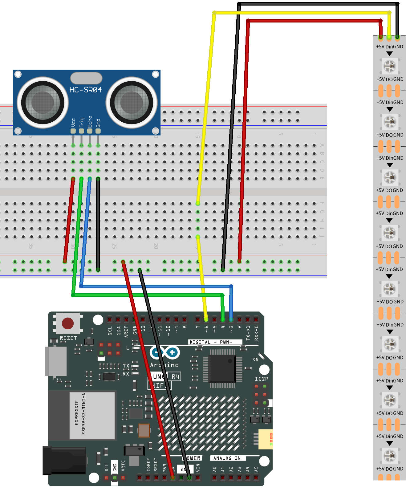

.. _distance_display2.0:

Distance Display 2.0
==============================================================

.. note::
  
  🌟 Welcome to the SunFounder Facebook Community! Whether you're into Raspberry Pi, Arduino, or ESP32, you'll find inspiration, help ideas here.
   
  - ✅ Be the first to get free learning resources. 
   
  - ✅ Stay updated on new products & exclusive giveaways. 
   
  - ✅ Share your creations and get real feedback.
   
  * 👉 Need faster updates or support? Click [|link_sf_facebook|] join our Facebook community 

  * 👉 Or join our WhatsApp group: Click [|link_sf_whatsapp|]
   
Kit purchase
------------------------

Looking for parts? Check out our all-in-one kits below — packed with components, beginner-friendly guides, and tons of fun.

.. image:: img/elite_explore_kit.png
   :width: 100%
   :align: center
   :target: https://www.sunfounder.com/collections/arduino-kits-bundles/products/sunfounder-elite-explorer-kit-with-official-arduino-uno-r4-wifi?ref=jbzmncle

.. raw:: html

     

.. list-table::
   :widths: 20 20 20
   :header-rows: 1

   * - Name
     - Includes Arduino board
     - PURCHASE LINK
   * - Ultimate Sensor Kit
     - Arduino Uno R4 Minima
     - |link_ultimate_sensor_buy|
   * - Elite Explorer Kit
     - Arduino Uno R4 WiFi
     - |link_elite_buy|
   * - 3 in 1 Ultimate Starter Kit
     - Arduino Uno R4 Minima
     - |link_arduinor4_buy|
   * - Universal Maker Sensor Kit
     - ×
     - |link_umsk_buy|

Course Introduction
------------------------

In this project, we use an ultrasonic sensor and a strip of 8 NeoPixel LEDs to create a dynamic radar-style proximity visualization system. 

The number of LEDs lit up depends on the distance to the nearest object—closer objects light up more LEDs. 

When no object is detected nearby (all LEDs off), the system cycles through red, green, and blue color modes, adding a visual indicator of system status. 

This setup creates an engaging, color-changing alert system for monitoring proximity using the Arduino board.

.. raw:: html
 
  <iframe width="700" height="394" src="https://www.youtube.com/embed/k8CqoL9PGE0?si=Tqh2gKOJd6hgFtu8" title="YouTube video player" frameborder="0" allow="accelerometer; autoplay; clipboard-write; encrypted-media; gyroscope; picture-in-picture; web-share" referrerpolicy="strict-origin-when-cross-origin" allowfullscreen></iframe>

.. note::

  If this is your first time working with an Arduino project, we recommend downloading and reviewing the basic materials first.
  
  * :ref:`install_arduino`
  * :ref:`introduce_arduino`

**Required Components**

In this project, we need the following components:

.. list-table::
    :widths: 5 20 5 20
    :header-rows: 1

    *   - SN
        - COMPONENT INTRODUCTION	
        - QUANTITY
        - PURCHASE LINK

    *   - 1
        - Arduino UNO R4 WIFI
        - 1
        - |link_unor4_wifi_buy|
    *   - 2
        - USB Type-C cable
        - 1
        - 
    *   - 3
        - Breadboard
        - 1
        - |link_breadboard_buy|
    *   - 4
        - Wires
        - Several
        - |link_wires_buy|
    *   - 5
        - LED Strip
        - 1
        - |link_ws2812_buy|
    *   - 6
        - Ultrasonic Sensor Module
        - 1
        - |link_ultrasonic_buy|

**Wiring**

**Common Connections:**

* **LED Strip**

  - **Din:** Connect to **6** on the Arduino.
  - **GND:** Connect to breadboard’s negative power bus.
  - **+5V:** Connect to breadboard’s passive power bus.

* **Ultrasonic Sensor Module**

  - **Trig:** Connect to **4** on the Arduino.
  - **Echo:** Connect to **3** on the Arduino.
  - **GND:** Connect to breadboard’s negative power bus.
  - **VCC:** Connect to breadboard’s red power bus.

**Writing the Code**

.. note::

    * You can copy this code into **Arduino IDE**. 
    * To install the library, use the Arduino Library Manager and search for **FastLED** and install it.
    * Don't forget to select the board(Arduino UNO R4 WIFI) and the correct port before clicking the **Upload** button.

.. code-block:: arduino

      #include <FastLED.h>  // Include FastLED library
      #define NUM_LEDS 8    // Number of LEDs in the chain
      #define DATA_PIN 6    // Data pin for LED control

      // Define the pin numbers for the ultrasonic sensor
      const int echoPin = 3;
      const int trigPin = 4;

      CRGB leds[NUM_LEDS];  // Array to hold LED color data
      int currentLeds = 0;  // Current number of LEDs lit
      int colorState = 0;   // Color state: 0 = Red, 1 = Green, 2 = Blue
      bool colorChanged = false; // Flag to track if color has changed

      void setup() {
        pinMode(echoPin, INPUT);   // Set echo pin as input
        pinMode(trigPin, OUTPUT);  // Set trig pin as output

        FastLED.addLeds<NEOPIXEL, DATA_PIN>(leds, NUM_LEDS);  // Initialize LEDs
      }

      void loop() {
        float distance = readDistance();  // Get the measured distance
        int targetLeds = 0;  // Target number of LEDs to light up

        // Calculate the number of LEDs to light based on distance
        if (distance <= 5) {
          targetLeds = NUM_LEDS;  // Light up all LEDs if distance is 5 cm or less
        } else {
          targetLeds = max(0, NUM_LEDS - (int)((distance - 5) / 1));  // Decrease LEDs based on distance
        }

        // Smoothly transition the current LEDs towards the target LEDs
        if (currentLeds < targetLeds) {
          currentLeds++;  // Increment current LEDs
        } else if (currentLeds > targetLeds) {
          currentLeds--;  // Decrement current LEDs
        }

        // Change color when all LEDs are off
        if (currentLeds == 0 && !colorChanged) {
          colorState = (colorState + 1) % 3;  // Cycle through Red, Green, Blue
          colorChanged = true;  // Set the color change flag
        } else if (currentLeds > 0) {
          colorChanged = false;  // Reset the flag when LEDs are on
        }

        // Loop through each LED and set its state based on the current color
        for (int i = 0; i < NUM_LEDS; i++) {
          if (i < currentLeds) {
            // Set the color based on the color state
            if (colorState == 0) {
              leds[i] = CRGB::Red;   // All red
            } else if (colorState == 1) {
              leds[i] = CRGB::Green; // All green
            } else {
              leds[i] = CRGB::Blue;  // All blue
            }
          } else {
            leds[i] = CRGB::Black;  // Turn off LED if not in range
          }
        }

        FastLED.show();  // Update LED strip
        delay(75);       // Short delay for smooth transition
      }

      // Function to read the sensor data and calculate the distance
      float readDistance() {
        digitalWrite(trigPin, LOW);   // Set trig pin to low
        delayMicroseconds(2);         // Wait for 2 microseconds
        digitalWrite(trigPin, HIGH);  // Trigger the sensor
        delayMicroseconds(10);        // Send a 10 microsecond pulse
        digitalWrite(trigPin, LOW);   // Set trig pin back to low

        // Measure the pulse width of the echo pin and calculate distance
        return pulseIn(echoPin, HIGH) / 58.0;  // Convert time to distance in cm
      }
