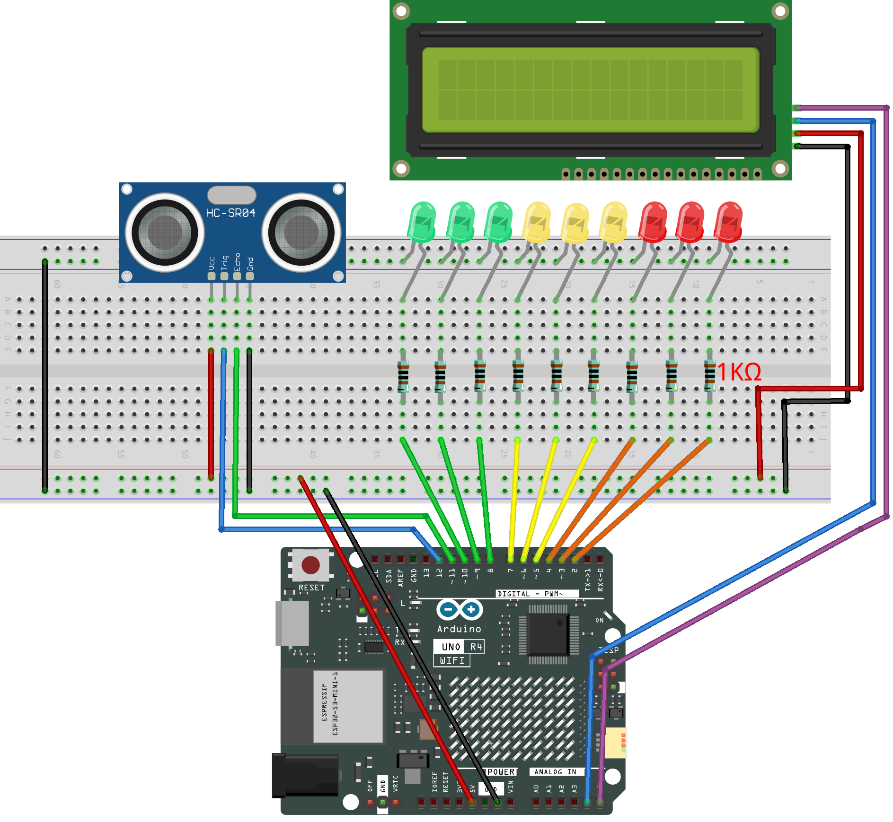

.. _distance_display3.0:

Distance Display 3.0
==============================================================

.. note::
  
  🌟 Welcome to the SunFounder Facebook Community! Whether you're into Raspberry Pi, Arduino, or ESP32, you'll find inspiration, help ideas here.
   
  - ✅ Be the first to get free learning resources. 
   
  - ✅ Stay updated on new products & exclusive giveaways. 
   
  - ✅ Share your creations and get real feedback.
   
  * 👉 Need faster updates or support? Click [|link_sf_facebook|] join our Facebook community 

  * 👉 Or join our WhatsApp group: Click [|link_sf_whatsapp|]
   
  * 🎁 Looking for parts?Check out our all-in-one kits below — packed with components, beginner-friendly guides, and tons of fun.
  
  .. list-table::
    :widths: 20 20 20
    :header-rows: 1

    *   - Name	
        - Includes Arduino board
        - PURCHASE LINK
    *   - Elite Explorer Kit	
        - Arduino Uno R4 WiFi
        - |link_elite_buy|
    *   - 3 in 1 Ultimate Starter Kit
        - Arduino Uno R4 Minima
        - |link_arduinor4_buy|

Course Introduction
------------------------

In this project, we use an ultrasonic sensor and a 1602 LCD and three groups of LEDs (green, yellow, red) to simulate a radar-style proximity alert system with the Arduino board. 

The system measures the distance to an object and activates different LED groups based on how close the object is: green LEDs indicate a safe distance (≤15 cm), yellow LEDs warn that the object is getting closer (≤10 cm), and red LEDs signal a critical proximity alert (≤5 cm). The LEDs turn on from left to right and turn off from right to left to enhance the visual effect.

.. raw:: html
 
  <iframe width="700" height="394" src="https://www.youtube.com/embed/14wtt1neV1I?si=XGVi_7mqG_FxeguJ" title="YouTube video player" frameborder="0" allow="accelerometer; autoplay; clipboard-write; encrypted-media; gyroscope; picture-in-picture; web-share" referrerpolicy="strict-origin-when-cross-origin" allowfullscreen></iframe>

.. note::

  If this is your first time working with an Arduino project, we recommend downloading and reviewing the basic materials first.
  
  * :ref:`install_arduino`
  * :ref:`introduce_arduino`

**Required Components**

In this project, we need the following components:

.. list-table::
    :widths: 5 20 5 20
    :header-rows: 1

    *   - SN
        - COMPONENT INTRODUCTION	
        - QUANTITY
        - PURCHASE LINK

    *   - 1
        - Arduino UNO R4 WIFI
        - 1
        - |link_unor4_wifi_buy|
    *   - 2
        - USB Type-C cable
        - 1
        - 
    *   - 3
        - Breadboard
        - 1
        - |link_breadboard_buy|
    *   - 4
        - Wires
        - Several
        - |link_wires_buy|
    *   - 5
        - 1kΩ resistor
        - several
        - |link_resistor_buy|
    *   - 6
        - Ultrasonic Sensor Module
        - 1
        - |link_ultrasonic_buy|
    *   - 7
        - LED
        - several
        - |link_led_buy|
    *   - 8
        - I2C LCD 1602
        - 1
        - |link_i2clcd1602_buy|

**Wiring**

**Common Connections:**

* **LED**

  - Connect the LEDs **cathode**  to the negative power bus on the breadboard, and the LEDs **anode** to a **1kΩ resistor** then to **2** ~ **10** on the Arduino.

* **Ultrasonic Sensor Module**

  - **Trig:** Connect to **12** on the Arduino.
  - **Echo:** Connect to **11** on the Arduino.
  - **GND:** Connect to breadboard’s negative power bus.
  - **VCC:** Connect to breadboard’s red power bus.

* **I2C LCD 1602**

  - **SDA:** Connect to **A4** on the Arduino.
  - **SCL:** Connect to **A5** on the Arduino.
  - **GND:** Connect to breadboard’s negative power bus.
  - **VCC:** Connect to breadboard’s red power bus.

**Writing the Code**

.. note::

    * You can copy this code into **Arduino IDE**. 
    * To install the library, use the Arduino Library Manager and search for **LiquidCrystal_I2C** and install it.
    * Don't forget to select the board(Arduino UNO R4 WIFI) and the correct port before clicking the **Upload** button.

.. code-block:: arduino

      #include <Wire.h>
      #include <LiquidCrystal_I2C.h>

      // --- LCD (common address 0x27 or 0x3F, adjust if needed) ---
      LiquidCrystal_I2C lcd(0x27, 16, 2);

      // --- Ultrasonic sensor pins ---
      const int echoPin = 12; // Echo pin of ultrasonic sensor
      const int trigPin = 11; // Trig pin of ultrasonic sensor

      // --- LED groups (green, yellow, red) ---
      const int greenLEDs[]  = {10, 9, 8};  // Safe distance
      const int yellowLEDs[] = {7, 6, 5};   // Getting closer
      const int redLEDs[]    = {4, 3, 2};   // Very close
      constexpr uint8_t NUM_LEDS = 3;       // Each group has 3 LEDs

      // --- Flags to track LED states ---
      bool greenOn = false;
      bool yellowOn = false;
      bool redOn = false;

      // --- Distance thresholds with hysteresis (avoid flicker) ---
      constexpr float TH_GREEN_ON  = 15.0f, TH_GREEN_OFF  = 16.0f;
      constexpr float TH_YELLOW_ON = 10.0f, TH_YELLOW_OFF = 11.0f;
      constexpr float TH_RED_ON    = 5.0f,  TH_RED_OFF    = 6.0f;

      // --- For smoothing (moving average filter, 5 samples) ---
      const int NUM_SAMPLES = 5;
      float samples[NUM_SAMPLES];
      int sampleIndex = 0;

      // --- LCD update control (refresh every 200ms) ---
      unsigned long lastLCDUpdate = 0;
      const unsigned long LCD_INTERVAL = 200;

      void setup() {
        Serial.begin(9600);

        pinMode(echoPin, INPUT);
        pinMode(trigPin, OUTPUT);

        // Initialize all LED pins
        for (int i = 0; i < NUM_LEDS; i++) {
          pinMode(greenLEDs[i], OUTPUT);
          pinMode(yellowLEDs[i], OUTPUT);
          pinMode(redLEDs[i], OUTPUT);
          digitalWrite(greenLEDs[i], LOW);
          digitalWrite(yellowLEDs[i], LOW);
          digitalWrite(redLEDs[i], LOW);
        }

        // Initialize LCD
        lcd.init();        // Start LCD
        lcd.backlight();   // Turn on backlight
        lcd.setCursor(0, 0);
        lcd.print("Ultrasonic");
        lcd.setCursor(0, 1);
        lcd.print("Distance(cm)");
        delay(1500);       // Show welcome text for 1.5s
        lcd.clear();

        // Initialize sample buffer for smoothing
        for (int i = 0; i < NUM_SAMPLES; i++) {
          samples[i] = 999.0f; // Fill with "far away" default
        }
      }

      void loop() {
        float distance = readSensorData(); // Get raw distance in cm

        // --- Moving average filter for stable display ---
        samples[sampleIndex] = distance;
        sampleIndex = (sampleIndex + 1) % NUM_SAMPLES;

        float sum = 0;
        for (int i = 0; i < NUM_SAMPLES; i++) sum += samples[i];
        float avgDistance = sum / NUM_SAMPLES;

        // Print both raw and average to Serial Monitor
        Serial.print("Raw: "); Serial.print(distance);
        Serial.print("  Avg: "); Serial.println(avgDistance);

        // --- Update LCD only every 200ms ---
        if (millis() - lastLCDUpdate >= LCD_INTERVAL) {
          lastLCDUpdate = millis();
          lcd.setCursor(0, 0);
          lcd.print("Distance:      ");  // Clear old text
          lcd.setCursor(10, 0);

          if (avgDistance < 999.0f) {
            lcd.print(avgDistance, 1);   // Show with 1 decimal place
            lcd.print("cm ");
          } else {
            lcd.print("Out  ");          // Show "Out" when no echo
          }
        }

        // --- LED control uses raw distance for fast reaction ---
        handleLEDs(distance);

        delay(50); // Small delay to avoid reading too frequently
      }

      // --- LED control function ---
      void handleLEDs(float distance) {
        // Green group
        if (distance <= TH_GREEN_ON) {
          if (!greenOn) { turnOnLEDs(greenLEDs); greenOn = true; }
        } else if (distance >= TH_GREEN_OFF) {
          if (greenOn) { turnOffLEDsReverse(greenLEDs); greenOn = false; }
        }

        // Yellow group
        if (distance <= TH_YELLOW_ON) {
          if (!yellowOn) { turnOnLEDs(yellowLEDs); yellowOn = true; }
        } else if (distance >= TH_YELLOW_OFF) {
          if (yellowOn) { turnOffLEDsReverse(yellowLEDs); yellowOn = false; }
        }

        // Red group
        if (distance <= TH_RED_ON) {
          if (!redOn) { turnOnLEDs(redLEDs); redOn = true; }
        } else if (distance >= TH_RED_OFF) {
          if (redOn) { turnOffLEDsReverse(redLEDs); redOn = false; }
        }
      }

      // --- Read distance from ultrasonic sensor safely ---
      float readSensorData() {
        // Send 10us pulse to Trig pin
        digitalWrite(trigPin, LOW);
        delayMicroseconds(2);
        digitalWrite(trigPin, HIGH);
        delayMicroseconds(10);
        digitalWrite(trigPin, LOW);

        // Measure echo pulse width (timeout 30ms)
        unsigned long duration = pulseIn(echoPin, HIGH, 30000UL);
        if (duration == 0) return 999.0f; // No echo received

        // Convert pulse time to distance (cm)
        return duration / 58.0f;
      }

      // --- Turn on LEDs from left to right ---
      void turnOnLEDs(const int ledArray[]) {
        for (int i = 0; i < NUM_LEDS; i++) {
          digitalWrite(ledArray[i], HIGH);
          delay(60); // Visual effect delay
        }
      }

      // --- Turn off LEDs from right to left ---
      void turnOffLEDsReverse(const int ledArray[]) {
        for (int i = NUM_LEDS - 1; i >= 0; i--) {
          digitalWrite(ledArray[i], LOW);
          delay(60); // Visual effect delay
        }
      }
