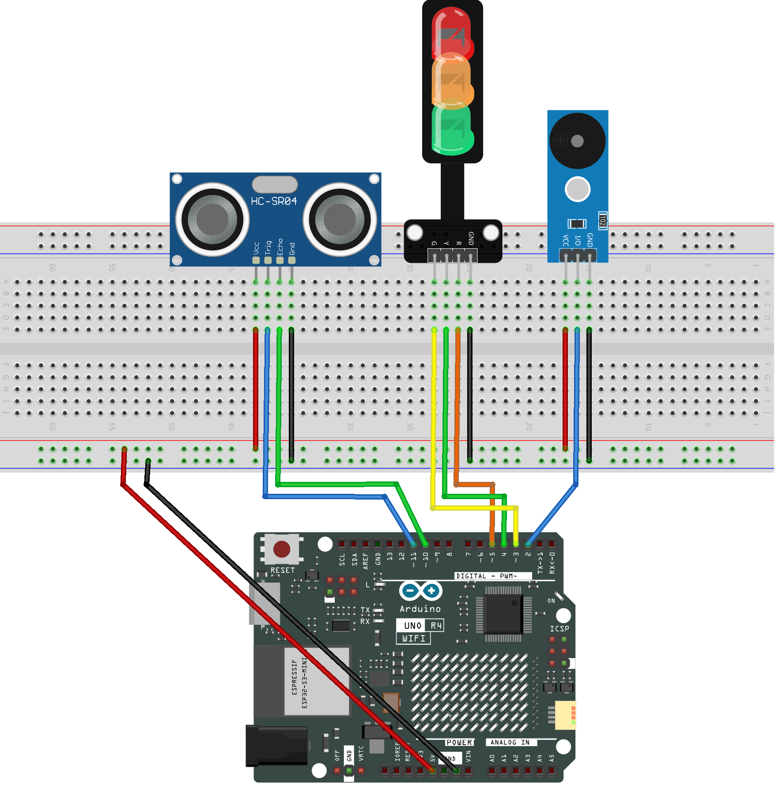

.. _distance_display4.0:

Distance Display 4.0
==============================================================

.. note::
  
  🌟 Welcome to the SunFounder Facebook Community! Whether you're into Raspberry Pi, Arduino, or ESP32, you'll find inspiration, help ideas here.
   
  - ✅ Be the first to get free learning resources. 
   
  - ✅ Stay updated on new products & exclusive giveaways. 
   
  - ✅ Share your creations and get real feedback.
   
  * 👉 Need faster updates or support? Click [|link_sf_facebook|] join our Facebook community 

  * 👉 Or join our WhatsApp group: Click [|link_sf_whatsapp|]
   
  * 🎁 Looking for parts?Check out our all-in-one kits below — packed with components, beginner-friendly guides, and tons of fun.
  
  .. list-table::
    :widths: 20 20 20
    :header-rows: 1

    *   - Name	
        - Includes Arduino board
        - PURCHASE LINK
    *   - Elite Explorer Kit	
        - Arduino Uno R4 WiFi
        - |link_elite_buy|
    *   - 3 in 1 Ultimate Starter Kit
        - Arduino Uno R4 Minima
        - |link_arduinor4_buy|

Course Introduction
------------------------

In this project, an ultrasonic sensor and a set of green, yellow, and red LEDs are used to create a proximity-alert system with the Arduino. 

The sensor continuously measures distance and switches between three states: safe, warning, and danger. The green LED indicates a safe distance, the yellow LED blinks with a beep when an object gets closer, and the red LED turns on with a short alarm when the object is too close. 

The system updates smoothly by completing each LED–buzzer cycle before changing to the next state.

.. raw:: html
 
  <iframe width="700" height="394" src="https://www.youtube.com/embed/QNXRqbYMjao?si=Cq_Bs4-gH6DlXpHm" title="YouTube video player" frameborder="0" allow="accelerometer; autoplay; clipboard-write; encrypted-media; gyroscope; picture-in-picture; web-share" referrerpolicy="strict-origin-when-cross-origin" allowfullscreen></iframe>

.. note::

  If this is your first time working with an Arduino project, we recommend downloading and reviewing the basic materials first.
  
  * :ref:`install_arduino`
  * :ref:`introduce_arduino`

**Required Components**

In this project, we need the following components:

.. list-table::
    :widths: 5 20 5 20
    :header-rows: 1

    *   - SN
        - COMPONENT INTRODUCTION	
        - QUANTITY
        - PURCHASE LINK

    *   - 1
        - Arduino UNO R4 WIFI
        - 1
        - |link_unor4_wifi_buy|
    *   - 2
        - USB Type-C cable
        - 1
        - 
    *   - 3
        - Breadboard
        - 1
        - |link_breadboard_buy|
    *   - 4
        - Wires
        - Several
        - |link_wires_buy|
    *   - 5
        - Ultrasonic Sensor Module
        - 1
        - |link_ultrasonic_buy|
    *   - 6
        - Traffic Light LED
        - 1
        - |link_trafficlinght_buy|
    *   - 7
        - Buzzer Modudle
        - 1
        - |link_buzzer_module_buy|

**Wiring**

**Common Connections:**

* **Traffic light LED**

  - **R:** Connect to **5** on the Arduino.
  - **Y:** Connect to **4** on the Arduino.
  - **G:** Connect to **3** on the Arduino.
  - **GND:** Connect to breadboard’s negative power bus.

* **Ultrasonic Sensor Module**

  - **Trig:** Connect to **11** on the Arduino.
  - **Echo:** Connect to **10** on the Arduino.
  - **GND:** Connect to breadboard’s negative power bus.
  - **VCC:** Connect to breadboard’s red power bus.

* **Buzzer Module**

  - **I/0:** Connect to **2** on the Arduino.
  - **＋:** Connect to breadboard’s red power bus. 
  - **－:** Connect to breadboard’s negative power bus.

**Writing the Code**

.. note::

    * You can copy this code into **Arduino IDE**. 
    * Don't forget to select the board(Arduino UNO R4 WIFI) and the correct port before clicking the **Upload** button.

.. code-block:: arduino

      // ============================
      // Pin Definitions
      // ============================
      const int buzzerPin = 2;
      const int greenPin  = 3;
      const int yellowPin = 4;
      const int redPin    = 5;
      const int trigPin = 11;
      const int echoPin = 10;

      // ============================
      // Distance Thresholds (cm)
      // ============================
      #define SAFE_DIST     15     // Green: >=15 cm
      #define WARNING_DIST   5     // Yellow: 15~5 cm, Red: <5 cm

      // ============================
      // System States
      // ============================
      enum State { SAFE, WARNING, DANGER };
      State currentState = SAFE;
      State nextState = SAFE;   // We switch to next state only after current cycle ends

      // ============================
      // Timing Control (millis)
      // ============================
      unsigned long ledTimer = 0;
      unsigned long beepTimer = 0;
      bool yellowOn = false;

      // ============================
      // Read Distance (cm)
      // ============================
      float getDistance() {
        digitalWrite(trigPin, LOW);
        delayMicroseconds(2);

        digitalWrite(trigPin, HIGH);
        delayMicroseconds(10);
        digitalWrite(trigPin, LOW);

        unsigned long duration = pulseIn(echoPin, HIGH, 30000);
        if (duration == 0) return 999;
        return duration / 58.0;
      }

      // ============================
      // Setup
      // ============================
      void setup() {
        Serial.begin(9600);

        pinMode(buzzerPin, OUTPUT);
        pinMode(greenPin, OUTPUT);
        pinMode(yellowPin, OUTPUT);
        pinMode(redPin, OUTPUT);
        pinMode(trigPin, OUTPUT);
        pinMode(echoPin, INPUT);

        digitalWrite(greenPin, LOW);
        digitalWrite(yellowPin, LOW);
        digitalWrite(redPin, LOW);
        noTone(buzzerPin);
      }

      // ============================
      // Main Loop
      // ============================
      void loop() {
        float dist = getDistance();
        Serial.println(dist);

        // ===== Decide which state we want to switch to =====
        if (dist >= SAFE_DIST)         nextState = SAFE;
        else if (dist >= WARNING_DIST) nextState = WARNING;
        else                           nextState = DANGER;

        unsigned long now = millis();

        // ===== Execute current state (only switch after cycle completes) =====
        switch (currentState) {

          // ---------------- 🟢 SAFE MODE ----------------
          case SAFE:
            digitalWrite(greenPin, HIGH);
            digitalWrite(yellowPin, LOW);
            digitalWrite(redPin, LOW);
            noTone(buzzerPin);

            // If next state is different, switch immediately (no cycle needed)
            currentState = nextState;
            break;

          // ---------------- 🟡 WARNING MODE ----------------
          case WARNING:
            digitalWrite(greenPin, LOW);
            digitalWrite(redPin, LOW);

            // Complete the 500ms blink + beep cycle before switching
            if (now - ledTimer >= 500) {
              ledTimer = now;
              yellowOn = !yellowOn;
              digitalWrite(yellowPin, yellowOn);

              if (yellowOn) tone(buzzerPin, 2000);
              else noTone(buzzerPin);

              // Switch to next state ONLY after the blink finishes
              if (currentState != nextState && !yellowOn) {
                currentState = nextState;
              }
            }
            break;

          // ---------------- 🔴 DANGER MODE ----------------
          case DANGER:
            digitalWrite(greenPin, LOW);
            digitalWrite(yellowPin, LOW);
            digitalWrite(redPin, HIGH);

            // Complete one beep cycle before switching
            if (now - beepTimer >= 300) {
              beepTimer = now;
              tone(buzzerPin, 2000, 120);  // Short beep (not annoying)

              // Switch to next state at end of cycle
              if (currentState != nextState) {
                noTone(buzzerPin);
                currentState = nextState;
              }
            }
            break;
        }
      }
