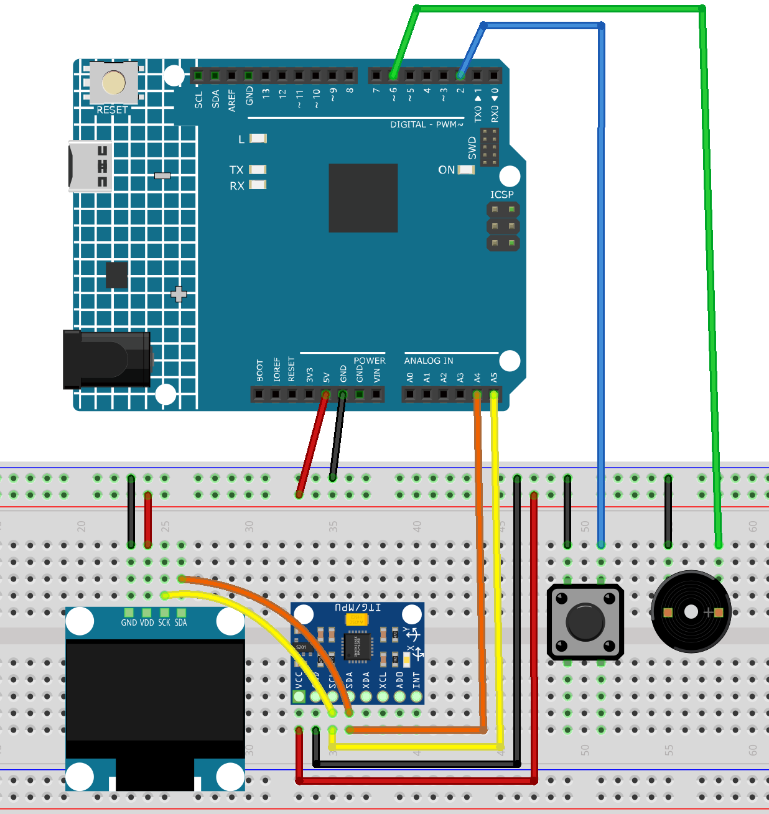

.. _dodge_game2.0:

Dodge Game 2.0
==============================================================

.. note::
  
  🌟 Welcome to the SunFounder Facebook Community! Whether you're into Raspberry Pi, Arduino, or ESP32, you'll find inspiration, help ideas here.
   
  - ✅ Be the first to get free learning resources. 
   
  - ✅ Stay updated on new products & exclusive giveaways. 
   
  - ✅ Share your creations and get real feedback.
   
  * 👉 Need faster updates or support? Click [|link_sf_facebook|] join our Facebook community 

  * 👉 Or join our WhatsApp group: Click [|link_sf_whatsapp|]
   
  * 🎁 Looking for parts?Check out our all-in-one kits below — packed with components, beginner-friendly guides, and tons of fun.
  
  .. list-table::
    :widths: 20 20 20
    :header-rows: 1

    *   - Name	
        - Includes Arduino board
        - PURCHASE LINK
    *   - Elite Explorer Kit	
        - Arduino Uno R4 WiFi
        - |link_elite_buy|
    *   - Ultimate Sensor Kit	
        - Arduino Uno R4 Minima
        - |link_arduinor4_buy|
    *   - Universal Maker Sensor Kit
        - ×
        - |link_umsk_buy|

Course Introduction
------------------------

In this lesson, you'll use an MPU6050 motion sensor, an OLED display, a buzzer, and a button with the Arduino R4 UNO to create a tilt‑controlled obstacle game.

By tilting the device, you control a ball on the screen to dodge moving obstacles. Collisions trigger a buzzer alert, and pressing the button restarts the game.

.. .. raw:: html

..  <iframe width="700" height="394" src="https://www.youtube.com/embed/KkPsawETYfg?si=4nMpy4ZNZjKVSooc" title="YouTube video player" frameborder="0" allow="accelerometer; autoplay; clipboard-write; encrypted-media; gyroscope; picture-in-picture; web-share" referrerpolicy="strict-origin-when-cross-origin" allowfullscreen></iframe>

.. note::

  If this is your first time working with an Arduino project, we recommend downloading and reviewing the basic materials first.

  * :ref:`install_arduino`
  * :ref:`introduce_arduino`

**Required Components**

In this project, we need the following components:

.. list-table::
    :widths: 5 20 5 20
    :header-rows: 1

    *   - SN
        - COMPONENT INTRODUCTION	
        - QUANTITY
        - PURCHASE LINK

    *   - 1
        - Arduino UNO R4 Minima
        - 1
        - |link_unor4_buy|
    *   - 2
        - USB Type-C cable
        - 1
        - 
    *   - 3
        - Breadboard
        - 1
        - |link_breadboard_buy|
    *   - 4
        - Wires
        - Several
        - |link_wires_buy|
    *   - 5
        - Button
        - 1
        - |link_button_buy|
    *   - 6
        - OLED Display Module
        - 1
        - |link_oled_buy|
    *   - 7
        - Active Buzzer
        - 1
        - 
    *   - 8
        - MPU6050 Module
        - 1
        - |link_mpu6050_buy|

**Wiring**

**Common Connections:**

* **OLED Display Module**

  - **SDA:** Connect to **A4** on the Arduino.
  - **SCK:** Connect to **A5** on the Arduino.
  - **GND:** Connect to breadboard’s negative power bus.
  - **VCC:** Connect to breadboard’s red power bus.

* **Button**

  - Connect to the breadboard’s negative power bus, and the other end to **2** on the Arduino board.

* **Active Buzzer**

  - **＋:** Connect to **2** on the Arduino.
  - **－:** Connect to breadboard’s negative power bus.

* **MPU6050**

  - **SDA:** Connect to **A4** on the Arduino.
  - **SCL:** Connect to **A5** on the Arduino.
  - **GND:** Connect to breadboard’s negative power bus.
  - **VCC:** Connect to breadboard’s red power bus.

**Writing the Code**

.. note::

    * You can copy this code into **Arduino IDE**. 
    * To install the library, use the Arduino Library Manager and search for **Adafruit SSD1306** and **Adafruit GFX** and **MPU6050** and install it.
    * Don't forget to select the board(Arduino UNO R4 Minima) and the correct port before clicking the **Upload** button.

.. code-block:: arduino

      #include <Wire.h>
      #include <Adafruit_GFX.h>
      #include <Adafruit_SSD1306.h>
      #include <MPU6050.h>

      #define SCREEN_WIDTH 128
      #define SCREEN_HEIGHT 64
      #define OLED_RESET -1
      Adafruit_SSD1306 display(SCREEN_WIDTH, SCREEN_HEIGHT, &Wire, OLED_RESET);

      #define BUZZER_PIN 6
      #define BUTTON_PIN 2

      MPU6050 mpu;

      struct Obstacle {
        int x, y, width, height;
        bool active;
      };

      const int MAX_OBS = 3;
      Obstacle obstacles[MAX_OBS];

      float ax, ay;
      float ballX = SCREEN_WIDTH / 4;
      float ballY = SCREEN_HEIGHT / 2;
      float ballVx = 0, ballVy = 0;
      const int BALL_RADIUS = 3;

      bool gameOver = false;

      void setup() {
        Serial.begin(9600);
        pinMode(BUZZER_PIN, OUTPUT);
        pinMode(BUTTON_PIN, INPUT_PULLUP);

        // Initialize OLED
        if (!display.begin(SSD1306_SWITCHCAPVCC, 0x3C)) {
          Serial.println("OLED init failed!");
          for(;;);
        }
        display.clearDisplay();
        display.display();

        // Initialize MPU6050
        Wire.begin();
        mpu.initialize();
        if (!mpu.testConnection()) {
          Serial.println("MPU6050 connection failed!");
          while (1);
        }

        resetGame();
      }

      void loop() {
        if (gameOver) {
          display.clearDisplay();
          display.setTextSize(2);
          display.setCursor(20, 20);
          display.println("Game Over");
          display.setTextSize(1);
          display.setCursor(20, 50);
          display.println("Press Btn");
          display.display();
          if (digitalRead(BUTTON_PIN) == LOW) {
            delay(300);
            resetGame();
          }
          return;
        }

        readMPU();
        updateBall();
        updateObstacles();
        checkCollision();
        render();

        delay(2);
      }

      void resetGame() {
        ballX = SCREEN_WIDTH / 4;
        ballY = SCREEN_HEIGHT / 2;
        ballVx = ballVy = 0;
        for (int i = 0; i < MAX_OBS; i++) {
          obstacles[i].active = false;
        }
        gameOver = false;
      }

      void readMPU() {
        int16_t ax_raw, ay_raw, az_raw;
        mpu.getAcceleration(&ax_raw, &ay_raw, &az_raw);
        ax = ax_raw / 16384.0;
        ay = ay_raw / 16384.0;
      }

      void updateBall() {
        ballVx += (ay) * 3.8;  // Horizontal movement
        ballVy += (ax) * 3.8;   // Vertical movement
        ballX += ballVx;
        ballY += ballVy;

        // Friction damping
        ballVx *= 1.0 ;
        ballVy *= 1.0 ;

        // Boundary detection
        if (ballX < BALL_RADIUS) { ballX = BALL_RADIUS; ballVx = 0; }
        if (ballX > SCREEN_WIDTH - BALL_RADIUS) { ballX = SCREEN_WIDTH - BALL_RADIUS; ballVx = 0; }
        if (ballY < BALL_RADIUS) { ballY = BALL_RADIUS; ballVy = 0; }
        if (ballY > SCREEN_HEIGHT - BALL_RADIUS) { ballY = SCREEN_HEIGHT - BALL_RADIUS; ballVy = 0; }
      }

      void updateObstacles() {
        for (int i = 0; i < MAX_OBS; i++) {
          if (obstacles[i].active) {
            obstacles[i].x -= 6;
            if (obstacles[i].x + obstacles[i].width < 0) {
              obstacles[i].active = false;
            }
          } else {
            if (random(0, 100) < 3) { // Randomly generate obstacles
              obstacles[i].x = SCREEN_WIDTH;
              obstacles[i].y = random(10, SCREEN_HEIGHT - 20);
              obstacles[i].width = 8;
              obstacles[i].height = 20;
              obstacles[i].active = true;
            }
          }
        }
      }

      void checkCollision() {
        for (int i = 0; i < MAX_OBS; i++) {
          if (obstacles[i].active) {
            if (ballX + BALL_RADIUS > obstacles[i].x &&
                ballX - BALL_RADIUS < obstacles[i].x + obstacles[i].width &&
                ballY + BALL_RADIUS > obstacles[i].y &&
                ballY - BALL_RADIUS < obstacles[i].y + obstacles[i].height) {
              gameOver = true;
              tone(BUZZER_PIN, 1000, 500); // Play buzzer alert
            }
          }
        }
      }

      void render() {
        display.clearDisplay();
        display.drawCircle(ballX, ballY, BALL_RADIUS, SSD1306_WHITE);

        for (int i = 0; i < MAX_OBS; i++) {
          if (obstacles[i].active) {
            display.fillRect(obstacles[i].x, obstacles[i].y, obstacles[i].width, obstacles[i].height, SSD1306_WHITE);
          }
        }

        display.display();
      }
