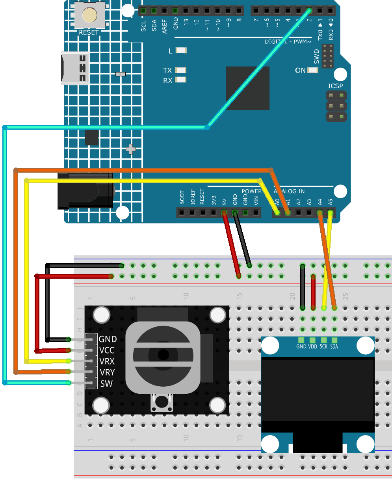

.. _dodge_game:

Dodge Game
==============================================================

.. note::
  
  🌟 Welcome to the SunFounder Facebook Community! Whether you're into Raspberry Pi, Arduino, or ESP32, you'll find inspiration, help ideas here.
   
  - ✅ Be the first to get free learning resources. 
   
  - ✅ Stay updated on new products & exclusive giveaways. 
   
  - ✅ Share your creations and get real feedback.
   
  * 👉 Need faster updates or support? Click [|link_sf_facebook|] join our Facebook community 

  * 👉 Or join our WhatsApp group: Click [|link_sf_whatsapp|]
   
  * 🎁 Looking for parts?Check out our all-in-one kits below — packed with components, beginner-friendly guides, and tons of fun.
  
  .. list-table::
    :widths: 20 20 20
    :header-rows: 1

    *   - Name	
        - Includes Arduino board
        - PURCHASE LINK
    *   - Elite Explorer Kit	
        - Arduino Uno R4 WiFi
        - |link_elite_buy|
    *   - Ultimate Sensor Kit	
        - Arduino Uno R4 Minima
        - |link_arduinor4_buy|
    *   - Universal Maker Sensor Kit
        - ×
        - |link_umsk_buy|

Course Introduction
------------------------

This is a simple dodgeball game using an OLED screen, joystick, and Arduino R4 UNO. Move the player to avoid falling obstacles. 

The longer you survive, the higher your score. Press the joystick button to start or restart the game.

.. raw:: html

  <iframe width="700" height="394" src="https://www.youtube.com/embed/Atxp0ih1vsg?si=6rRc4i0J_O-g6Zp1" title="YouTube video player" frameborder="0" allow="accelerometer; autoplay; clipboard-write; encrypted-media; gyroscope; picture-in-picture; web-share" referrerpolicy="strict-origin-when-cross-origin" allowfullscreen></iframe>

.. note::

  If this is your first time working with an Arduino project, we recommend downloading and reviewing the basic materials first.

  * :ref:`install_arduino`
  * :ref:`introduce_arduino`

**Required Components**

In this project, we need the following components:

.. list-table::
    :widths: 5 20 5 20
    :header-rows: 1

    *   - SN
        - COMPONENT INTRODUCTION	
        - QUANTITY
        - PURCHASE LINK

    *   - 1
        - Arduino UNO R4 WIFI
        - 1
        - |link_unor4_wifi_buy|
    *   - 2
        - USB Type-C cable
        - 1
        - 
    *   - 3
        - Breadboard
        - 1
        - |link_breadboard_buy|
    *   - 4
        - Wires
        - Several
        - |link_wires_buy|
    *   - 5
        - Joystick Module
        - 1
        - |link_joystick_buy|
    *   - 6
        - OLED Display Module
        - 1
        - |link_oled_buy|

**Wiring**

**Common Connections:**

* **OLED Display Module**

  - **SDA:** Connect to **A4** on the Arduino.
  - **SCK:** Connect to **A5** on the Arduino.
  - **GND:** Connect to breadboard’s negative power bus.
  - **VCC:** Connect to breadboard’s red power bus.

* **Joystick Module**

  - **VRY:** Connect to **A1** on the Arduino.
  - **VRX:** Connect to **A0** on the Arduino.
  - **SW:** Connect to **2** on the Arduino.
  - **GND:** Connect to breadboard’s negative power bus.
  - **VCC:** Connect to breadboard’s red power bus.

**Writing the Code**

.. note::

    * You can copy this code into **Arduino IDE**. 
    * To install the library, use the Arduino Library Manager and search for **Adafruit SSD1306** and install it.
    * Don't forget to select the board(Arduino UNO R4 Minima) and the correct port before clicking the **Upload** button.

.. code-block:: arduino

    #include <Wire.h>
    #include <Adafruit_SSD1306.h>

    #define SCREEN_WIDTH 128
    #define SCREEN_HEIGHT 64
    #define OLED_ADDR 0x3C

    Adafruit_SSD1306 display(SCREEN_WIDTH, SCREEN_HEIGHT, &Wire);

    #define JOY_X A0
    #define JOY_Y A1
    #define JOY_BTN 2

    struct Obstacle {
      int x, y;
      int size;
      int speed;
      bool active;
    };

    #define MAX_OBSTACLES 8
    Obstacle obstacles[MAX_OBSTACLES];

    int playerX = SCREEN_WIDTH / 2;
    int playerY = SCREEN_HEIGHT - 10;
    int playerSize = 6;
    bool gameOver = false;
    int score = 0;

    unsigned long lastSpawnTime = 0;
    unsigned long spawnInterval = 1000;  // initial spawn interval
    unsigned long lastSpeedIncrease = 0;
    unsigned long speedIncreaseInterval = 5000;  // every 5 seconds increase difficulty

    void setup() {
      pinMode(JOY_BTN, INPUT_PULLUP);
      display.begin(SSD1306_SWITCHCAPVCC, OLED_ADDR);
      display.clearDisplay();
      display.setTextColor(SSD1306_WHITE);
      randomSeed(analogRead(A3)); // random seed
      showStartScreen();
    }

    void loop() {
      if (gameOver) {
        showGameOver();
        return;
      }

      handleJoystick();
      spawnObstacle();
      updateObstacles();
      checkCollision();
      render();

      // Increase difficulty
      if (millis() - lastSpeedIncrease > speedIncreaseInterval) {
        if (spawnInterval > 400) spawnInterval -= 100;
        lastSpeedIncrease = millis();
      }

      delay(30);
    }

    void showStartScreen() {
      display.clearDisplay();
      display.setTextSize(2);
      display.setCursor(20, 20);
      display.println("Dodgeball");
      display.setTextSize(1);
      display.setCursor(30, 50);
      display.println("Press to Start");
      display.display();
      while (digitalRead(JOY_BTN) == HIGH);
      delay(200);
      resetGame();
    }

    void handleJoystick() {
      int xVal = analogRead(JOY_X);
      int yVal = analogRead(JOY_Y);
      int speed = 3;

      if (xVal < 400) playerX -= speed;
      if (xVal > 600) playerX += speed;
      if (yVal < 400) playerY -= speed;
      if (yVal > 600) playerY += speed;

      playerX = constrain(playerX, 0, SCREEN_WIDTH - playerSize);
      playerY = constrain(playerY, 10, SCREEN_HEIGHT - playerSize);
    }

    void spawnObstacle() {
      if (millis() - lastSpawnTime > spawnInterval) {
        for (int i = 0; i < MAX_OBSTACLES; i++) {
          if (!obstacles[i].active) {
            obstacles[i].x = random(0, SCREEN_WIDTH - 8);
            obstacles[i].y = 0;
            // Randomize type
            if (random(0, 10) < 6) {
              obstacles[i].size = 6;
              obstacles[i].speed = 2;
            } else {
              obstacles[i].size = 10;
              obstacles[i].speed = 1;
            }
            obstacles[i].active = true;
            break;
          }
        }
        lastSpawnTime = millis();
      }
    }

    void updateObstacles() {
      for (int i = 0; i < MAX_OBSTACLES; i++) {
        if (obstacles[i].active) {
          obstacles[i].y += obstacles[i].speed;
          if (obstacles[i].y > SCREEN_HEIGHT) {
            obstacles[i].active = false;
            score++;  // survived = +1 point
          }
        }
      }
    }

    void checkCollision() {
      for (int i = 0; i < MAX_OBSTACLES; i++) {
        if (obstacles[i].active) {
          int dx = abs(playerX - obstacles[i].x);
          int dy = abs(playerY - obstacles[i].y);
          if (dx < (playerSize / 2 + obstacles[i].size / 2) &&
              dy < (playerSize / 2 + obstacles[i].size / 2)) {
            gameOver = true;
            return;
          }
        }
      }
    }

    void render() {
      display.clearDisplay();

      // Draw player
      display.fillCircle(playerX, playerY, playerSize / 2, SSD1306_WHITE);

      // Draw obstacles
      for (int i = 0; i < MAX_OBSTACLES; i++) {
        if (obstacles[i].active) {
          display.fillRect(obstacles[i].x, obstacles[i].y, obstacles[i].size, obstacles[i].size, SSD1306_WHITE);
        }
      }

      // Draw score
      display.setTextSize(1);
      display.setCursor(0, 0);
      display.print("Score: ");
      display.print(score);

      display.display();
    }

    void showGameOver() {
      display.clearDisplay();
      display.setTextSize(2);
      display.setCursor(20, 20);
      display.println("Game Over");
      display.setTextSize(1);
      display.setCursor(30, 45);
      display.print("Score: ");
      display.println(score);
      display.setCursor(20, 57);
      display.print("Press to Retry");
      display.display();
      while (digitalRead(JOY_BTN) == HIGH);
      delay(200);
      showStartScreen();
    }

    void resetGame() {
      gameOver = false;
      playerX = SCREEN_WIDTH / 2;
      playerY = SCREEN_HEIGHT - 10;
      score = 0;
      spawnInterval = 1000;
      lastSpeedIncrease = millis();
      for (int i = 0; i < MAX_OBSTACLES; i++) {
        obstacles[i].active = false;
      }
    }
