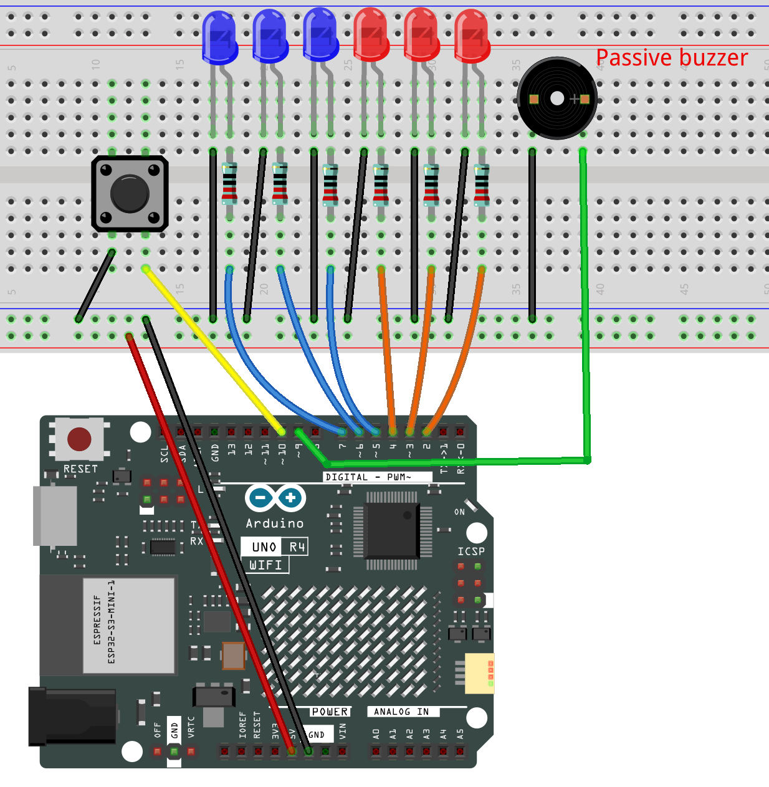

.. _bibubibu:

Emergency Response
==============================================================

.. note::
  
  🌟 Welcome to the SunFounder Facebook Community! Whether you're into Raspberry Pi, Arduino, or ESP32, you'll find inspiration, help ideas here.
   
  - ✅ Be the first to get free learning resources. 
   
  - ✅ Stay updated on new products & exclusive giveaways. 
   
  - ✅ Share your creations and get real feedback.
   
  * 👉 Need faster updates or support? Click [|link_sf_facebook|] join our Facebook community 

  * 👉 Or join our WhatsApp group: Click [|link_sf_whatsapp|]
   
Kit purchase
------------------------

Looking for parts? Check out our all-in-one kits below — packed with components, beginner-friendly guides, and tons of fun.

.. image:: img/elite_explore_kit.png
   :width: 100%
   :align: center
   :target: https://www.sunfounder.com/collections/arduino-kits-bundles/products/sunfounder-elite-explorer-kit-with-official-arduino-uno-r4-wifi?ref=jbzmncle

.. raw:: html

     

.. list-table::
   :widths: 20 20 20
   :header-rows: 1

   * - Name
     - Includes Arduino board
     - PURCHASE LINK
   * - Ultimate Sensor Kit
     - Arduino Uno R4 Minima
     - |link_ultimate_sensor_buy|
   * - Elite Explorer Kit
     - Arduino Uno R4 WiFi
     - |link_elite_buy|
   * - 3 in 1 Ultimate Starter Kit
     - Arduino Uno R4 Minima
     - |link_arduinor4_buy|
   * - Universal Maker Sensor Kit
     - ×
     - |link_umsk_buy|

Course Introduction
------------------------

In this lesson, you will learn how to use an Arduino UNO R4 WiFi with six LEDs, a button, and a passive buzzer to create a police light and siren simulator.

Press the button to start the effect. The red and blue LEDs will flash alternately while the buzzer produces a sweeping police siren sound. Press the button again to stop the lights and siren.

.. .. raw:: html

..  <iframe width="700" height="394" src="https://www.youtube.com/embed/qLM4343hLPs" title="YouTube video player" frameborder="0" allow="accelerometer; autoplay; clipboard-write; encrypted-media; gyroscope; picture-in-picture; web-share" referrerpolicy="strict-origin-when-cross-origin" allowfullscreen></iframe>

.. note::

  If this is your first time working with an Arduino project, we recommend downloading and reviewing the basic materials first.
  
  * :ref:`install_arduino`
  * :ref:`introduce_arduino`

**Required Components**

In this project, we need the following components:

.. list-table::
    :widths: 5 20 5 20
    :header-rows: 1

    *   - SN
        - COMPONENT INTRODUCTION	
        - QUANTITY
        - PURCHASE LINK

    *   - 1
        - Arduino UNO R4 Minima
        - 1
        - |link_unor4_buy|
    *   - 2
        - USB Type-C cable
        - 1
        - 
    *   - 3
        - Breadboard
        - 1
        - |link_breadboard_buy|
    *   - 4
        - Wires
        - Several
        - |link_wires_buy|
    *   - 5
        - 220 resistor
        - Several
        - |link_resistor_buy|
    *   - 6
        - Button
        - 1
        - |link_button_buy|
    *   - 7
        - LED
        - Several
        - |link_led_buy|
    *   - 8
        - Passive Buzzer
        - 1
        - 

**Wiring**

**Common Connections:**

* **LED**

  - Connect the LEDs **cathode** to the negative power bus on the breadboard, and the LEDs **anode** to a **220Ω resistor** then to **2** to **7** on the Arduino.

* **Button**

  - Connect to breadboard’s negative power bus.
  - Connect to **10** on the Arduino.

* **Passive Buzzer**

  - **＋:** Connect to **9** on the Arduino.
  - **－:** Connect to breadboard’s negative power bus.

**Writing the Code**

.. note::

    * You can copy this code into **Arduino IDE**. 
    * Don't forget to select the board(Arduino UNO R4 Minima/WIFI) and the correct port before clicking the **Upload** button.

.. code-block:: arduino

      /*
        Police Light and Siren Project
        Board: Arduino UNO R4 WiFi

        Components:
        - 3 red LEDs
        - 3 blue LEDs
        - 1 passive buzzer
        - 1 push button

        Operation:
        - Press the button once to start the lights and siren.
        - Press it again to stop everything.
      */

      // ==================== Pin settings ====================

      // Red LEDs
      const byte RED_LED_1_PIN = 2;
      const byte RED_LED_2_PIN = 3;
      const byte RED_LED_3_PIN = 4;

      // Blue LEDs
      const byte BLUE_LED_1_PIN = 5;
      const byte BLUE_LED_2_PIN = 6;
      const byte BLUE_LED_3_PIN = 7;

      // Passive buzzer
      const byte BUZZER_PIN = 9;

      // Button
      const byte BUTTON_PIN = 10;

      // ==================== Timing settings ====================

      // Time between red and blue light changes
      const unsigned long LIGHT_INTERVAL = 180;

      // Button debounce time
      const unsigned long DEBOUNCE_DELAY = 40;

      // Siren frequency update interval
      const unsigned long SIREN_INTERVAL = 8;

      // Siren frequency range
      const int MIN_SIREN_FREQUENCY = 650;
      const int MAX_SIREN_FREQUENCY = 1300;

      // Amount the frequency changes each step
      const int SIREN_STEP = 10;

      // ==================== State variables ====================

      // True when the police effect is running
      bool policeEffectRunning = false;

      // Current light state
      bool redLightsOn = true;

      // Light timing
      unsigned long lastLightUpdate = 0;

      // Siren timing
      unsigned long lastSirenUpdate = 0;

      // Current siren frequency
      int sirenFrequency = MIN_SIREN_FREQUENCY;

      // 1 means rising pitch, -1 means falling pitch
      int sirenDirection = 1;

      // ==================== Button variables ====================

      bool lastButtonReading = HIGH;
      bool stableButtonState = HIGH;

      unsigned long lastDebounceTime = 0;

      // ==================== Setup ====================

      void setup() {
        // Configure LED pins
        pinMode(RED_LED_1_PIN, OUTPUT);
        pinMode(RED_LED_2_PIN, OUTPUT);
        pinMode(RED_LED_3_PIN, OUTPUT);

        pinMode(BLUE_LED_1_PIN, OUTPUT);
        pinMode(BLUE_LED_2_PIN, OUTPUT);
        pinMode(BLUE_LED_3_PIN, OUTPUT);

        // Configure buzzer
        pinMode(BUZZER_PIN, OUTPUT);

        // Use the Arduino internal pull-up resistor
        pinMode(BUTTON_PIN, INPUT_PULLUP);

        // Start with everything turned off
        stopPoliceEffect();
      }

      // ==================== Main loop ====================

      void loop() {
        handleButton();

        if (policeEffectRunning) {
          updatePoliceLights();
          updateSiren();
        }
      }

      // ==================== Button handling ====================

      void handleButton() {
        bool currentReading = digitalRead(BUTTON_PIN);

        // Restart the debounce timer when the reading changes
        if (currentReading != lastButtonReading) {
          lastDebounceTime = millis();
        }

        // Accept the reading after it remains stable
        if (
          millis() - lastDebounceTime >= DEBOUNCE_DELAY
        ) {
          if (currentReading != stableButtonState) {
            stableButtonState = currentReading;

            // INPUT_PULLUP means LOW is pressed
            if (stableButtonState == LOW) {
              policeEffectRunning = !policeEffectRunning;

              if (policeEffectRunning) {
                startPoliceEffect();
              } else {
                stopPoliceEffect();
              }
            }
          }
        }

        lastButtonReading = currentReading;
      }

      // ==================== Effect control ====================

      void startPoliceEffect() {
        policeEffectRunning = true;

        redLightsOn = true;

        sirenFrequency = MIN_SIREN_FREQUENCY;
        sirenDirection = 1;

        lastLightUpdate = millis();
        lastSirenUpdate = millis();

        // Start with red LEDs on
        setRedLights(true);
        setBlueLights(false);

        tone(BUZZER_PIN, sirenFrequency);
      }

      void stopPoliceEffect() {
        policeEffectRunning = false;

        setRedLights(false);
        setBlueLights(false);

        noTone(BUZZER_PIN);
      }

      // ==================== LED functions ====================

      void updatePoliceLights() {
        unsigned long currentTime = millis();

        if (
          currentTime - lastLightUpdate >=
          LIGHT_INTERVAL
        ) {
          lastLightUpdate = currentTime;

          redLightsOn = !redLightsOn;

          setRedLights(redLightsOn);
          setBlueLights(!redLightsOn);
        }
      }

      void setRedLights(bool state) {
        digitalWrite(
          RED_LED_1_PIN,
          state ? HIGH : LOW
        );

        digitalWrite(
          RED_LED_2_PIN,
          state ? HIGH : LOW
        );

        digitalWrite(
          RED_LED_3_PIN,
          state ? HIGH : LOW
        );
      }

      void setBlueLights(bool state) {
        digitalWrite(
          BLUE_LED_1_PIN,
          state ? HIGH : LOW
        );

        digitalWrite(
          BLUE_LED_2_PIN,
          state ? HIGH : LOW
        );

        digitalWrite(
          BLUE_LED_3_PIN,
          state ? HIGH : LOW
        );
      }

      // ==================== Siren function ====================

      void updateSiren() {
        unsigned long currentTime = millis();

        if (
          currentTime - lastSirenUpdate >=
          SIREN_INTERVAL
        ) {
          lastSirenUpdate = currentTime;

          // Increase or decrease the siren pitch
          sirenFrequency +=
            SIREN_STEP * sirenDirection;

          // Reverse direction at the upper limit
          if (
            sirenFrequency >=
            MAX_SIREN_FREQUENCY
          ) {
            sirenFrequency =
              MAX_SIREN_FREQUENCY;

            sirenDirection = -1;
          }

          // Reverse direction at the lower limit
          if (
            sirenFrequency <=
            MIN_SIREN_FREQUENCY
          ) {
            sirenFrequency =
              MIN_SIREN_FREQUENCY;

            sirenDirection = 1;
          }

          tone(
            BUZZER_PIN,
            sirenFrequency
          );
        }
      }