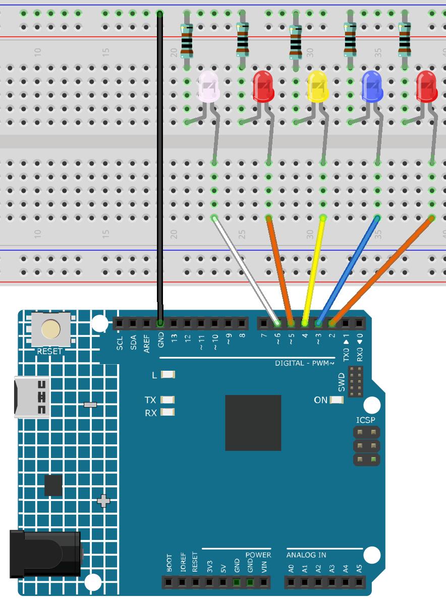

.. _finger_count2.0:

Finger Count 2.0
==============================================================

.. note::
  
  🌟 Welcome to the SunFounder Facebook Community! Whether you're into Raspberry Pi, Arduino, or ESP32, you'll find inspiration, help ideas here.
   
  - ✅ Be the first to get free learning resources. 
   
  - ✅ Stay updated on new products & exclusive giveaways. 
   
  - ✅ Share your creations and get real feedback.
   
  * 👉 Need faster updates or support? Click [|link_sf_facebook|] join our Facebook community 

  * 👉 Or join our WhatsApp group: Click [|link_sf_whatsapp|]
   
  * 🎁 Looking for parts?Check out our all-in-one kits below — packed with components, beginner-friendly guides, and tons of fun.
  
  .. list-table::
    :widths: 20 20 20
    :header-rows: 1

    *   - Name	
        - Includes Arduino board
        - PURCHASE LINK
    *   - Electronic Kit
        - ×
        - |link_electronic_buy|
    *   - Elite Explorer Kit	
        - Arduino Uno R4 WiFi
        - |link_elite_buy|
    *   - 3 in 1 Ultimate Starter Kit	
        - Arduino Uno R4 Minima
        - |link_arduinor4_buy|
    *   - Universal Maker Sensor Kit
        - ×
        - |link_umsk_buy|

Course Introduction
------------------------

This code controls a series of LEDs on an Arduino Uno based on finger count data received from a Python script. The script detects the number of fingers shown to a camera and sends this data to the Arduino via serial communication. The Arduino then lights up the corresponding number of LEDs.

The LEDs are connected to digital pins 2 through 6, with the number of lit LEDs corresponding to the finger count detected by the Python script.

.. .. raw:: html

..     <iframe width="700" height="394" src="https://www.youtube.com/embed/8icjpMEK3Sw?si=vs_wwppY6e1Bj1zH" title="YouTube video player" frameborder="0" allow="accelerometer; autoplay; clipboard-write; encrypted-media; gyroscope; picture-in-picture; web-share" referrerpolicy="strict-origin-when-cross-origin" allowfullscreen></iframe>

.. note::

  If this is your first time working with an Arduino project, we recommend downloading and reviewing the basic materials first.
  
  * :ref:`install_arduino`
  * :ref:`introduce_arduino`
  * |link_python_down|

**Required Components**

In this project, we need the following components:

.. list-table::
    :widths: 5 20 5 20
    :header-rows: 1

    *   - SN
        - COMPONENT INTRODUCTION	
        - QUANTITY
        - PURCHASE LINK

    *   - 1
        - Arduino UNO R4 Minima
        - 1
        - |link_unor4_buy|
    *   - 2
        - USB Type-C cable
        - 1
        - 
    *   - 3
        - Breadboard
        - 1
        - |link_breadboard_buy|
    *   - 4
        - Wires
        - Several
        - |link_wires_buy|
    *   - 5
        - 1kΩ resistor
        - Several
        - |link_resistor_buy|
    *   - 6
        - LED
        - Several
        - |link_led_buy|

**Wiring**

**Common Connections:**

* **LED**

  - Connect the LEDs **cathode** to a **1kΩ resistor** then to the negative power bus on the breadboard, and the LEDs **anode** to the **2** to **6** on the Arduino.

**Operating Steps**

.. note::

    1. You can copy the following code into **Arduino IDE**. 
    2. Don't forget to select the board(Arduino UNO R4 Minima) and the correct port before clicking the **Upload** button.
    3. The python code ``FingerCountSender (3)`` is used here. You can click here :download:`FingerCountSender (3).zip </_static/FingerCountSender (3).zip>` to download it. 
    4. Update the Python script to use the correct serial port(COMx), ensuring it matches the one identified during Arduino setup(COMx).
        .. image:: img/port1.png

.. code-block:: arduino

      // Define the LED pins
      const int ledPins[] = {2, 3, 4, 5, 6}; // Pins where the LEDs are connected
      const int numLeds = 5; // Number of LEDs

      void setup() {
        // Initialize the LED pins as outputs
        for (int i = 0; i < numLeds; i++) {
          pinMode(ledPins[i], OUTPUT);
          digitalWrite(ledPins[i], LOW); // Ensure all LEDs are off initially
        }
        
        // Start serial communication
        Serial.begin(115200);
        Serial.setTimeout(1);
      }

      void loop() {
        // Check if data is available on the serial port
        if (Serial.available() > 0) {

          // Read the incoming data
          int value = Serial.readString().toInt();
          
          // Ensure the value is within the range 0-5
          if (value >= 0 && value <= numLeds) {
            // Turn off all LEDs first
            for (int i = 0; i < numLeds; i++) {
              digitalWrite(ledPins[i], LOW);
            }

            // Turn on the appropriate number of LEDs
            for (int i = 0; i < value; i++) {
              digitalWrite(ledPins[i], HIGH);
            }

          }
        }
      }
