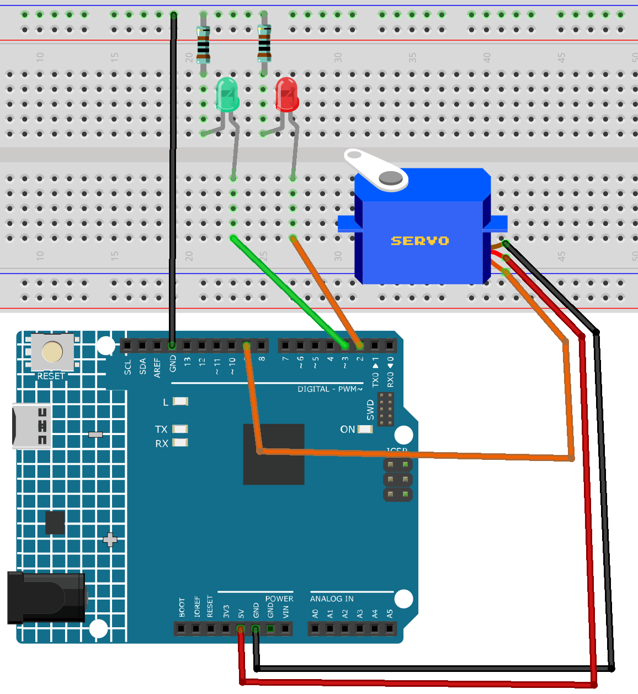

.. _finger_count3.0:

Finger Count 3.0
==============================================================

.. note::
  
  🌟 Welcome to the SunFounder Facebook Community! Whether you're into Raspberry Pi, Arduino, or ESP32, you'll find inspiration, help ideas here.
   
  - ✅ Be the first to get free learning resources. 
   
  - ✅ Stay updated on new products & exclusive giveaways. 
   
  - ✅ Share your creations and get real feedback.
   
  * 👉 Need faster updates or support? Click [|link_sf_facebook|] join our Facebook community 

  * 👉 Or join our WhatsApp group: Click [|link_sf_whatsapp|]
   
  * 🎁 Looking for parts?Check out our all-in-one kits below — packed with components, beginner-friendly guides, and tons of fun.
  
  .. list-table::
    :widths: 20 20 20
    :header-rows: 1

    *   - Name	
        - Includes Arduino board
        - PURCHASE LINK
    *   - Electronic Kit
        - ×
        - |link_electronic_buy|
    *   - Elite Explorer Kit	
        - Arduino Uno R4 WiFi
        - |link_elite_buy|
    *   - 3 in 1 Ultimate Starter Kit	
        - Arduino Uno R4 Minima
        - |link_arduinor4_buy|
    *   - Universal Maker Sensor Kit
        - ×
        - |link_umsk_buy|

Course Introduction
------------------------

In this lesson, we control a servo to open the gate using the gesture password 5-1-5, and close it with the gesture 4, based on data received via serial communication. 

Red and green LEDs indicate the gate status: by default, the gate is closed with the red LED on; when the correct password is entered, the gate opens and the green LED lights up. 

This code controls the servo and LEDs on an Arduino Uno by receiving finger count data from a Python script, which detects the number of fingers shown to a camera and sends the data to the Arduino via serial communication.

.. .. raw:: html

..     <iframe width="700" height="394" src="https://www.youtube.com/embed/8icjpMEK3Sw?si=vs_wwppY6e1Bj1zH" title="YouTube video player" frameborder="0" allow="accelerometer; autoplay; clipboard-write; encrypted-media; gyroscope; picture-in-picture; web-share" referrerpolicy="strict-origin-when-cross-origin" allowfullscreen></iframe>

.. note::

  If this is your first time working with an Arduino project, we recommend downloading and reviewing the basic materials first.
  
  * :ref:`install_arduino`
  * :ref:`introduce_arduino`
  * |link_python_down|

**Required Components**

In this project, we need the following components:

.. list-table::
    :widths: 5 20 5 20
    :header-rows: 1

    *   - SN
        - COMPONENT INTRODUCTION	
        - QUANTITY
        - PURCHASE LINK

    *   - 1
        - Arduino UNO R4 WIFI
        - 1
        - |link_unor4_wifi_buy|
    *   - 2
        - USB Type-C cable
        - 1
        - 
    *   - 3
        - Breadboard
        - 1
        - |link_breadboard_buy|
    *   - 4
        - Wires
        - Several
        - |link_wires_buy|
    *   - 5
        - 1kΩ resistor
        - Several
        - |link_resistor_buy|
    *   - 6
        - LED
        - Several
        - |link_led_buy|
    *   - 7
        - Digital Servo Motor
        - 1
        - |link_motor_buy|

**Wiring**

**Common Connections:**

* **LED**

  - Connect the LEDs **cathode** to a **1kΩ resistor** then to the negative power bus on the breadboard, and the LEDs **anode** to the **2** to **3** on the Arduino.

* **Digital Servo Motor**

  - Connect to breadboard’s positive power bus.
  - Connect to breadboard’s negative power bus.
  - Connect to **9** on the Arduino.

**Operating Steps**

.. note::

    1. Copy the following code into **Arduino IDE**. 
    2. Use the Arduino Library Manager and search for **Servo.h** install library.
    3. Select the board(Arduino UNO R4 WIFI) and the correct port before clicking the **Upload** button.
    4. Then use the Python code ``FingerCountSender(2)`` . You can click here :download:`FingerCountSender(2).zip </_static/FingerCountSender(2).zip>` to download it. 
    5. Update the Python script to use the correct serial port(COMx), ensuring it matches the one identified during Arduino setup(COMx).      
        .. image:: img/port1.png
    6. Then run the python code to open the camera window.

.. code-block:: arduino

      #include <Servo.h>

      // LED pins
      const int redLedPin = 2;
      const int greenLedPin = 3;

      // Servo object and pin
      Servo gateServo;
      const int servoPin = 9;

      // Servo angle definitions
      const int GATE_CLOSED = 90;
      const int GATE_OPEN = 0;

      // Array to store gesture input sequence
      int gestureSequence[3] = {-1, -1, -1}; // Initially empty
      const int expectedSequence[3] = {5, 1, 5}; // Password sequence

      bool gateOpen = false;

      void setup() {
        pinMode(redLedPin, OUTPUT);
        pinMode(greenLedPin, OUTPUT);
        digitalWrite(redLedPin, HIGH);   // Default: red LED on
        digitalWrite(greenLedPin, LOW);

        gateServo.attach(servoPin);
        gateServo.write(GATE_CLOSED); // Default: gate closed

        Serial.begin(115200);
        Serial.setTimeout(1);
      }

      void loop() {
        // Listen for serial data
        if (Serial.available() > 0) {
          int value = Serial.readString().toInt();

          // Only accept values from 0 to 5 (finger count)
          if (value >= 0 && value <= 5) {
            updateGestureSequence(value);

            // Check if gesture matches 5-1-5
            if (isCorrectSequence()) {
              openGate();
            }
          }
        }
      }

      // Update gesture input sequence array
      void updateGestureSequence(int newValue) {
        gestureSequence[0] = gestureSequence[1];
        gestureSequence[1] = gestureSequence[2];
        gestureSequence[2] = newValue;
      }

      // Check if the input sequence matches the expected password
      bool isCorrectSequence() {
        for (int i = 0; i < 3; i++) {
          if (gestureSequence[i] != expectedSequence[i]) {
            return false;
          }
        }
        return true;
      }

      void openGate() {
        if (!gateOpen) {
          Serial.println("✅ Correct gesture password. Gate opening.");
          gateServo.write(GATE_OPEN);
          digitalWrite(greenLedPin, HIGH);
          digitalWrite(redLedPin, LOW);
          gateOpen = true;
        }
      }
