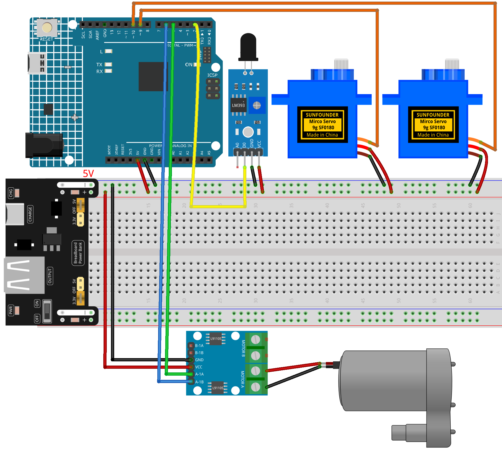

.. _extinguisher:

Extinguisher
==============================================================

.. note::
  
  🌟 Welcome to the SunFounder Facebook Community! Whether you're into Raspberry Pi, Arduino, or ESP32, you'll find inspiration, help ideas here.
   
  - ✅ Be the first to get free learning resources. 
   
  - ✅ Stay updated on new products & exclusive giveaways. 
   
  - ✅ Share your creations and get real feedback.
   
  * 👉 Need faster updates or support? Click [|link_sf_facebook|] join our Facebook community 

  * 👉 Or join our WhatsApp group: Click [|link_sf_whatsapp|]
   
Kit purchase
------------------------

Looking for parts? Check out our all-in-one kits below — packed with components, beginner-friendly guides, and tons of fun.

.. image:: img/umsk_kit.png
   :width: 100%
   :align: center
   :target: https://www.sunfounder.com/collections/raspberrypi-kits/products/sunfounder-universal-maker-sensor-kit?ref=jbzmncle

.. raw:: html

     

.. list-table::
   :widths: 20 20 20
   :header-rows: 1

   * - Name
     - Includes Arduino board
     - PURCHASE LINK
   * - Elite Explorer Kit
     - Arduino Uno R4 WiFi
     - |link_elite_buy|
   * - 3 in 1 Ultimate Starter Kit
     - Arduino Uno R4 Minima
     - |link_arduinor4_buy|

Course Introduction
------------------------

In this lesson, you'll use two servo motors, a Flame Sensor Module, a water pump driven by an L9110 motor driver, and Arduino to create a tracking fire extinguisher system.

The servos continuously scan the area with the flame sensor and water pump. When a flame is detected, the pump automatically activates to spray water toward the detected direction, creating a simple fire tracking and extinguishing effect.

.. .. raw:: html
 
..  <iframe width="700" height="394" src="https://www.youtube.com/embed/7-EbRnddho4?si=DjwbCAGSaGKplZwG" title="YouTube video player" frameborder="0" allow="accelerometer; autoplay; clipboard-write; encrypted-media; gyroscope; picture-in-picture; web-share" referrerpolicy="strict-origin-when-cross-origin" allowfullscreen></iframe>

.. note::

  If this is your first time working with an Arduino project, we recommend downloading and reviewing the basic materials first.
  
  * :ref:`install_arduino`
  * :ref:`introduce_arduino`

**Required Components**

In this project, we need the following components:

.. list-table::
    :widths: 5 20 5 20
    :header-rows: 1

    *   - SN
        - COMPONENT INTRODUCTION	
        - QUANTITY
        - PURCHASE LINK

    *   - 1
        - Arduino UNO R4 WIFI
        - 1
        - |link_unor4_wifi_buy|
    *   - 2
        - USB Type-C cable
        - 1
        - 
    *   - 3
        - Breadboard
        - 1
        - |link_breadboard_buy|
    *   - 4
        - Wires
        - Several
        - |link_wires_buy|
    *   - 5
        - Power Supply
        - 1
        - |link_power_buy|
    *   - 6
        - Digital Servo Motor
        - 2
        - |link_motor_buy|
    *   - 7
        - L9110 Motor Driver Module
        - 1
        - 
    *   - 8
        - Centrifugal Pump
        - 1
        - 
    *   - 9
        - Flame Sensor Module
        - 1
        - |link_flame_buy|

**Wiring**

**Common Connections:**

* **Digital Servo Motor (flame)**

  - Connect to breadboard’s positive power bus.
  - Connect to breadboard’s negative power bus.
  - Connect to **9** on the Arduino.

* **Digital Servo Motor (pump)**

  - Connect to breadboard’s positive power bus.
  - Connect to breadboard’s negative power bus.
  - Connect to **10** on the Arduino.

* **L9110 Motor Driver Module**

  - **GND:** Connect to breadboard’s negative power bus.
  - **VCC:** Connect to breadboard’s red power bus.
  - **A-1A:** Connect to **5** on the Arduino.
  - **A-1B:** Connect to **6** on the Arduino.

* **Centrifugal Pump**

  -  Connect to **L9110 Motor Driver Module** MOTOR A.
  -  Connect to **L9110 Motor Driver Module** MOTOR A.

* **Flame Sensor Module**

  - **D0:** Connect to **2** on the Arduino.
  - **GND:** Connect to breadboard’s negative power bus.
  - **VCC:** Connect to breadboard’s red power bus.

**Writing the Code**

.. note::

    * You can copy this code into **Arduino IDE**. 
    * Don't forget to select the board(Arduino UNO R4 Minima/WIFI) and the correct port before clicking the **Upload** button.

.. code-block:: arduino

      #include <Servo.h>

      // Servo pins
      const int FLAME_SERVO_PIN = 9;
      const int PUMP_SERVO_PIN = 10;

      // Flame sensor pin
      const int FLAME_PIN = 2;

      // L9110 motor driver pins
      const int PUMP_IN1 = 5;
      const int PUMP_IN2 = 6;

      // Servo objects
      Servo flameServo;
      Servo pumpServo;

      // Servo scan settings
      const int SCAN_LEFT = 45;
      const int SCAN_RIGHT = 135;
      const int SCAN_STEP = 2;
      const int SERVO_DELAY = 30;

      // Flame sensor logic
      // Most flame sensor modules output LOW when flame is detected.
      // If your module works the opposite way, change LOW to HIGH.
      const int FLAME_DETECTED_STATE = LOW;

      int currentAngle = SCAN_LEFT;
      int direction = 1;

      void pumpOn() {
        digitalWrite(PUMP_IN1, HIGH);
        digitalWrite(PUMP_IN2, LOW);
      }

      void pumpOff() {
        digitalWrite(PUMP_IN1, LOW);
        digitalWrite(PUMP_IN2, LOW);
      }

      void setup() {
        pinMode(FLAME_PIN, INPUT);
        pinMode(PUMP_IN1, OUTPUT);
        pinMode(PUMP_IN2, OUTPUT);

        flameServo.attach(FLAME_SERVO_PIN);
        pumpServo.attach(PUMP_SERVO_PIN);

        flameServo.write(currentAngle);
        pumpServo.write(currentAngle);

        pumpOff();
      }

      void loop() {
        int flameState = digitalRead(FLAME_PIN);
        bool flameDetected = (flameState == FLAME_DETECTED_STATE);

        flameServo.write(currentAngle);
        pumpServo.write(currentAngle);

        if (flameDetected) {
          pumpOn();
        } else {
          pumpOff();

          currentAngle += direction * SCAN_STEP;

          if (currentAngle >= SCAN_RIGHT) {
            currentAngle = SCAN_RIGHT;
            direction = -1;
          }

          if (currentAngle <= SCAN_LEFT) {
            currentAngle = SCAN_LEFT;
            direction = 1;
          }
        }

        delay(SERVO_DELAY);
      }