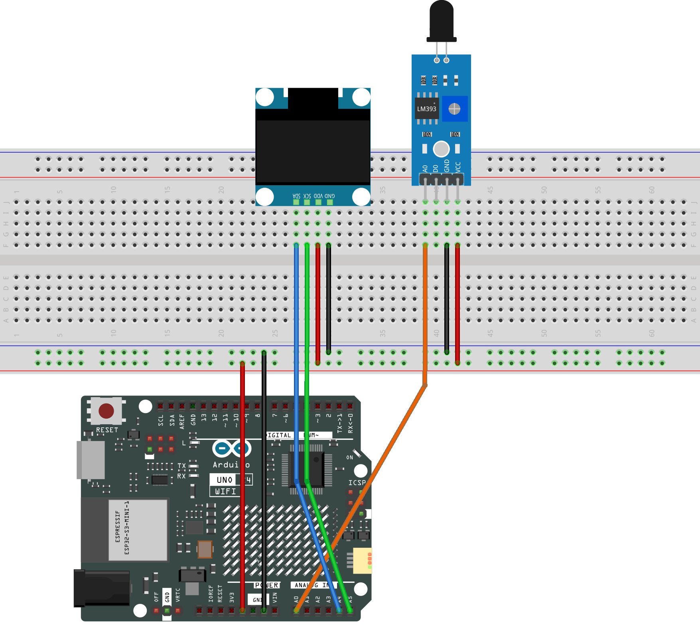

.. _flame_monitor1.0:

Flame Monitor 1.0
==============================================================

.. note::
  
  🌟 Welcome to the SunFounder Facebook Community! Whether you're into Raspberry Pi, Arduino, or ESP32, you'll find inspiration, help ideas here.
   
  - ✅ Be the first to get free learning resources. 
   
  - ✅ Stay updated on new products & exclusive giveaways. 
   
  - ✅ Share your creations and get real feedback.
   
  * 👉 Need faster updates or support? Click [|link_sf_facebook|] join our Facebook community 

  * 👉 Or join our WhatsApp group: Click [|link_sf_whatsapp|]
   
  * 🎁 Looking for parts?Check out our all-in-one kits below — packed with components, beginner-friendly guides, and tons of fun.

  .. list-table::
    :widths: 20 20 20
    :header-rows: 1

    *   - Name	
        - Includes Arduino board
        - PURCHASE LINK
    *   - Elite Explorer Kit	
        - Arduino Uno R4 WiFi
        - |link_elite_buy|
    *   - Ultimate Sensor Kit	
        - Arduino Uno R4 Minima
        - |link_arduinor4_buy|
    *   - Universal Maker Sensor Kit
        - ×
        - |link_umsk_buy|

Course Introduction
------------------------

In this lesson, you’ll learn how to use a Flame Sensor and an OLED Display with the Arduino UNO R4. 
The OLED shows the flame intensity in real time and alerts with “FIRE!” when a flame is detected.

.. .. raw:: html

..    <iframe width="700" height="394" src="https://www.youtube.com/embed/HheaU9hlbW4" title="YouTube video player" frameborder="0" allow="accelerometer; autoplay; clipboard-write; encrypted-media; gyroscope; picture-in-picture; web-share" referrerpolicy="strict-origin-when-cross-origin" allowfullscreen></iframe>

.. note::

  If this is your first time working with an Arduino project, we recommend downloading and reviewing the basic materials first.

  * :ref:`install_arduino`
  * :ref:`introduce_arduino`

**Required Components**

In this project, we need the following components:

.. list-table::
    :widths: 5 20 5 20
    :header-rows: 1

    *   - SN
        - COMPONENT INTRODUCTION	
        - QUANTITY
        - PURCHASE LINK

    *   - 1
        - Arduino UNO R4 Minima
        - 1
        - |link_unor4_buy|
    *   - 2
        - USB Type-C cable
        - 1
        - 
    *   - 3
        - Breadboard
        - 1
        - |link_breadboard_buy|
    *   - 4
        - Wires
        - Several
        - |link_wires_buy|
    *   - 5
        - Flame Sensor Module
        - 1
        - |link_flame_buy|
    *   - 6
        - OLED Display Module
        - 1
        - |link_oled_buy|

**Wiring**

**Common Connections:**

* **Flame Sensor Module**

  - **A0:** Connect to **A0** on the Arduino.
  - **GND:** Connect to breadboard’s negative power bus.
  - **VCC:** Connect to breadboard’s red power bus.

* **OLED Display Module**

  - **SDA:** Connect to **A4** on the Arduino.
  - **SCK:** Connect to **A5** on the Arduino.
  - **GND:** Connect to breadboard’s negative power bus.
  - **VCC:** Connect to breadboard’s red power bus.

**Writing the Code**

.. note::

    * You can copy this code into **Arduino IDE**. 
    * To install the library, use the Arduino Library Manager and search for **Adafruit SSD1306** and **Adafruit GFX** and install it.
    * Don't forget to select the board(Arduino UNO R4 Minima) and the correct port before clicking the **Upload** button.

.. code-block:: arduino

      #include <SPI.h>
      #include <Wire.h>
      #include <Adafruit_GFX.h>
      #include <Adafruit_SSD1306.h>

      #define SCREEN_WIDTH 128   // OLED display width in pixels
      #define SCREEN_HEIGHT 64   // OLED display height in pixels

      #define OLED_RESET -1      // Reset pin (not used here)
      #define SCREEN_ADDRESS 0x3C // I2C address of the OLED display
      Adafruit_SSD1306 display(SCREEN_WIDTH, SCREEN_HEIGHT, &Wire, OLED_RESET);

      #define FLAME_PIN A0       // Analog pin connected to the flame sensor

      void setup() {
        Serial.begin(9600);                         // Start serial communication
        Serial.println(F("Flame Sensor with OLED test!"));

        // Initialize the OLED display
        if (!display.begin(SSD1306_SWITCHCAPVCC, SCREEN_ADDRESS)) {
          Serial.println(F("SSD1306 allocation failed"));
          for (;;); // Stop if OLED initialization fails
        }

        display.clearDisplay();                     // Clear the display buffer
        display.setTextColor(WHITE);                // Set text color to white
      }

      void loop() {
        // Read the analog value from the flame sensor (0–1023)
        int rawValue = analogRead(FLAME_PIN);

        // Invert the value: lower = no fire, higher = fire detected
        int flameValue = 1023 - rawValue;

        // Detect fire if the value is higher than 300 (adjust as needed)
        bool fireDetected = (flameValue > 300);

        // Print sensor data to the Serial Monitor
        Serial.print("Flame Sensor Value: ");
        Serial.println(flameValue);
        if (fireDetected) {
          Serial.println("** Fire detected!!! **");
        } else {
          Serial.println("No Fire detected");
        }

        // Clear previous display content
        display.clearDisplay();

        // Display the flame intensity value
        display.setTextSize(1);              // Small text for label
        display.setCursor(0, 0);             // Set cursor at the top-left
        display.println("Flame Intensity:");

        display.setTextSize(2);              // Larger text for the value
        display.setCursor(0, 10);            // Move slightly down
        display.print(flameValue);

        // Display flame status message
        display.setTextSize(1);              // Small text for label
        display.setCursor(0, 40);            // Lower part of the screen
        display.println("Status:");

        display.setTextSize(2);              // Larger text for status message
        display.setCursor(0, 50);            // Bottom area for output
        if (fireDetected) {
          display.print("FIRE!");
        } else {
          display.print("SAFE");
        }

        // Update the OLED with new content
        display.display();

        // Short delay before next reading
        delay(500);
      }
