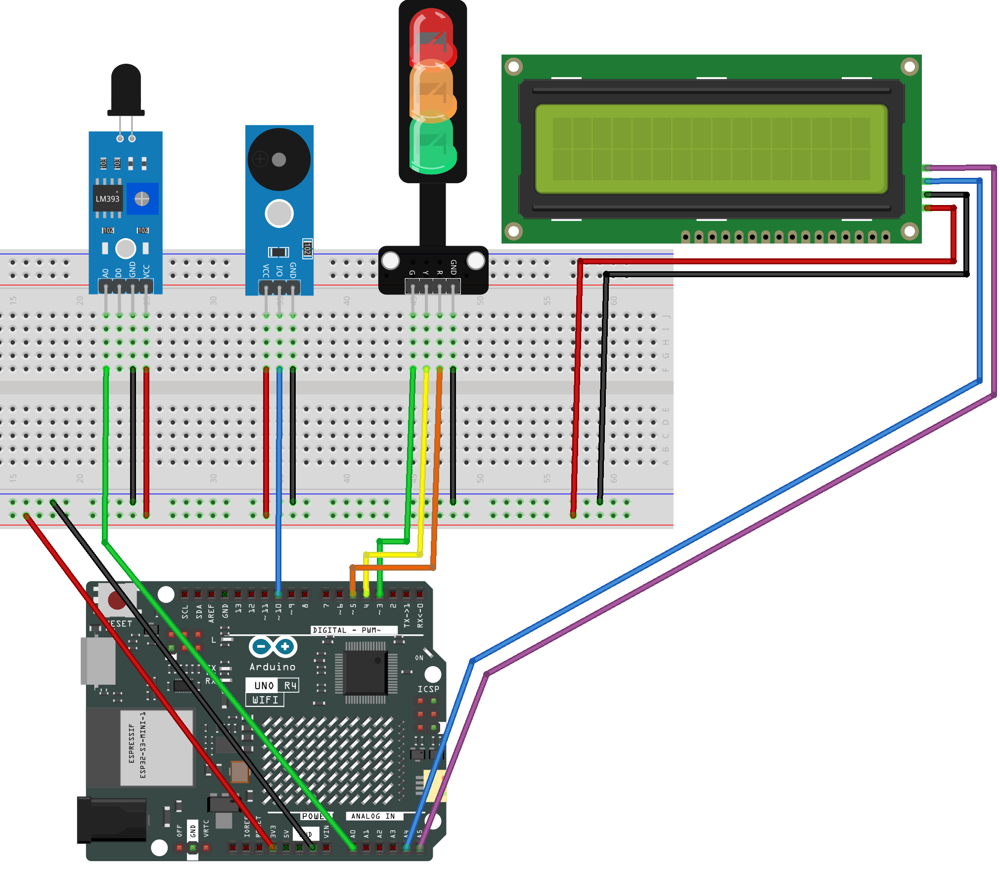

.. _flame_monitor2.0:

Flame Monitor 2.0
==============================================================

.. note::
  
  🌟 Welcome to the SunFounder Facebook Community! Whether you're into Raspberry Pi, Arduino, or ESP32, you'll find inspiration, help ideas here.
   
  - ✅ Be the first to get free learning resources. 
   
  - ✅ Stay updated on new products & exclusive giveaways. 
   
  - ✅ Share your creations and get real feedback.
   
  * 👉 Need faster updates or support? Click [|link_sf_facebook|] join our Facebook community 

  * 👉 Or join our WhatsApp group: Click [|link_sf_whatsapp|]
   
  * 🎁 Looking for parts?Check out our all-in-one kits below — packed with components, beginner-friendly guides, and tons of fun.

  .. list-table::
    :widths: 20 20 20
    :header-rows: 1

    *   - Name	
        - Includes Arduino board
        - PURCHASE LINK
    *   - Elite Explorer Kit	
        - Arduino Uno R4 WiFi
        - |link_elite_buy|
    *   - Ultimate Sensor Kit
        - Arduino Uno R4 Minima
        - |link_arduinor4_buy|
    *   - Universal Maker Sensor Kit
        - ×
        - |link_umsk_buy|

Course Introduction
------------------------

In this lesson, you’ll learn how to use a Flame Sensor, an I2C LCD Display, and the Arduino UNO R4 to monitor fire intensity. The LCD shows real-time readings, while LEDs and a buzzer provide visual and sound alerts for different flame levels.

.. .. raw:: html

..    <iframe width="700" height="394" src="https://www.youtube.com/embed/HheaU9hlbW4" title="YouTube video player" frameborder="0" allow="accelerometer; autoplay; clipboard-write; encrypted-media; gyroscope; picture-in-picture; web-share" referrerpolicy="strict-origin-when-cross-origin" allowfullscreen></iframe>

.. note::

  If this is your first time working with an Arduino project, we recommend downloading and reviewing the basic materials first.

  * :ref:`install_arduino`
  * :ref:`introduce_arduino`

**Required Components**

In this project, we need the following components:

.. list-table::
    :widths: 5 20 5 20
    :header-rows: 1

    *   - SN
        - COMPONENT INTRODUCTION	
        - QUANTITY
        - PURCHASE LINK

    *   - 1
        - Arduino UNO R4 Minima
        - 1
        - |link_unor4_buy|
    *   - 2
        - USB Type-C cable
        - 1
        - 
    *   - 3
        - Breadboard
        - 1
        - |link_breadboard_buy|
    *   - 4
        - Wires
        - Several
        - |link_wires_buy|
    *   - 5
        - Flame Sensor Module
        - 1
        - |link_flame_buy|
    *   - 6
        - Buzzer Modudle
        - 1
        - |link_buzzer_module_buy|
    *   - 7
        - I2C LCD 1602
        - 1
        - |link_i2clcd1602_buy|
    *   - 8
        - Traffic Light LED
        - 1
        - |link_trafficlinght_buy|

**Wiring**

**Common Connections:**

* **Flame Sensor Module**

  - **A0:** Connect to **A0** on the Arduino.
  - **GND:** Connect to breadboard’s negative power bus.
  - **VCC:** Connect to breadboard’s red power bus.

* **Traffic light LED**

  - **R:** Connect to **5** on the Arduino.
  - **Y:** Connect to **4** on the Arduino.
  - **G:** Connect to **3** on the Arduino.
  - **GND:** Connect to breadboard’s negative power bus.

* **Buzzer Modudle**

  - **I/O:** Connect to **10** on the Arduino.
  - **GND:** Connect to breadboard’s negative power bus.
  - **VCC:** Connect to breadboard’s red power bus.

* **I2C LCD 1602**

  - **SDA:** Connect to **A4** on the Arduino.
  - **SCL:** Connect to **A5** on the Arduino.
  - **GND:** Connect to breadboard’s negative power bus.
  - **VCC:** Connect to breadboard’s red power bus.

**Writing the Code**

.. note::

    * You can copy this code into **Arduino IDE**. 
    * To install the library, use the Arduino Library Manager and search for **LiquidCrystal_I2C** and install it.
    * Don't forget to select the board(Arduino UNO R4 Minima) and the correct port before clicking the **Upload** button.

.. code-block:: arduino

      #include <Wire.h>
      #include <LiquidCrystal_I2C.h>

      // Define pin connections
      const int sensorPin = A0;      // Analog pin connected to the flame sensor
      const int redPin = 5;          // Red LED pin
      const int yellowPin = 4;       // Yellow LED pin
      const int greenPin = 3;        // Green LED pin
      const int buzzerPin = 10;      // Buzzer pin

      LiquidCrystal_I2C lcd(0x27, 16, 2);  // I2C LCD address and size

      int flameValue = 0;  // Variable to store the flame sensor reading

      void setup() {
        Serial.begin(9600);       // Initialize serial monitor for debugging
        lcd.init();               // Initialize LCD
        lcd.backlight();          // Turn on LCD backlight

        // Set pin modes
        pinMode(redPin, OUTPUT);
        pinMode(yellowPin, OUTPUT);
        pinMode(greenPin, OUTPUT);
        pinMode(buzzerPin, OUTPUT);

        // Display startup message
        lcd.setCursor(0, 0);
        lcd.print("Flame Monitor");
        delay(1000);
      }

      void loop() {
        // Read analog value from flame sensor (0–1023)
        int rawValue = analogRead(sensorPin);

        // Invert value: when flame is closer, the value increases
        flameValue = 1023 - rawValue;

        // Print flame value to Serial Monitor
        Serial.print("Flame Sensor Value: ");
        Serial.println(flameValue);

        // Show value on LCD
        lcd.setCursor(0, 1);
        lcd.print("Value: ");
        lcd.print(flameValue);
        lcd.print("   ");  // Clear leftover digits

        // Flame detection logic
        if (flameValue < 250) {
          // No flame detected
          setLights(HIGH, LOW, LOW);  // Green ON, others OFF
          noTone(buzzerPin);          // Turn off buzzer
        } 
        else if (flameValue < 450) {
          // Weak flame detected
          setLights(LOW, HIGH, LOW);  // Yellow ON
          tone(buzzerPin, 800, 200);  // Short beep sound
        } 
        else {
          // Strong flame detected (danger)
          setLights(LOW, LOW, HIGH);  // Red ON
          tone(buzzerPin, 1000, 400); // Longer alarm sound
        }

        delay(200);  // Small delay for stability
      }

      // Helper function to control the three LEDs
      void setLights(int greenState, int yellowState, int redState) {
        digitalWrite(greenPin, greenState);
        digitalWrite(yellowPin, yellowState);
        digitalWrite(redPin, redState);
      }
