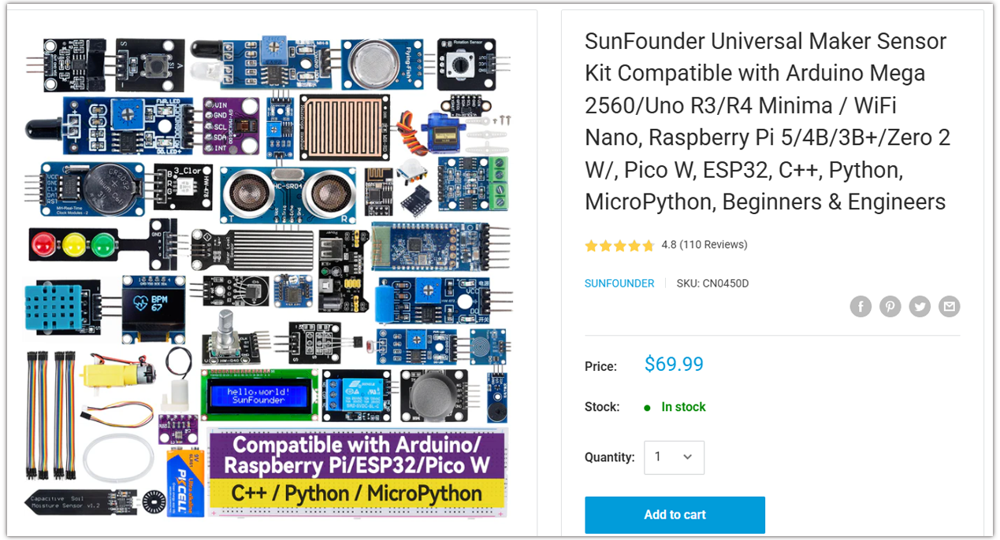
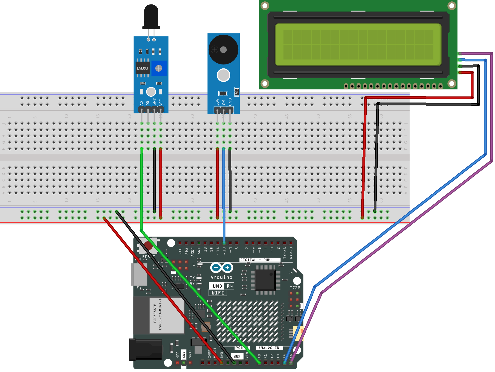

.. _flame_monitor3.0:

Flame Monitor 3.0
==============================================================

.. note::
  
  🌟 Welcome to the SunFounder Facebook Community! Whether you're into Raspberry Pi, Arduino, or ESP32, you'll find inspiration, help ideas here.
   
  - ✅ Be the first to get free learning resources. 
   
  - ✅ Stay updated on new products & exclusive giveaways. 
   
  - ✅ Share your creations and get real feedback.
   
  * 👉 Need faster updates or support? Click [|link_sf_facebook|] join our Facebook community 

  * 👉 Or join our WhatsApp group: Click [|link_sf_whatsapp|]
   
Kit purchase
------------------------

Looking for parts? Check out our all-in-one kits below — packed with components, beginner-friendly guides, and tons of fun.

.. raw:: html

     

.. list-table::
   :widths: 20 20 20
   :header-rows: 1

   * - Name
     - Includes Arduino board
     - PURCHASE LINK
   * - Ultimate Sensor Kit
     - Arduino Uno R4 Minima
     - |link_ultimate_sensor_buy|
   * - Universal Maker Sensor Kit
     - ×
     - |link_umsk_buy|

Course Introduction
------------------------

In this lesson, you’ll learn how to use a Flame Sensor, an I2C LCD Display, and the Arduino UNO R4 to monitor fire intensity. The LCD shows real-time readings, while buzzer provide sound alerts for different flame levels.

.. .. raw:: html

..  <iframe width="700" height="394" src="https://www.youtube.com/embed/PqDevA-9ROE" title="YouTube video player" frameborder="0" allow="accelerometer; autoplay; clipboard-write; encrypted-media; gyroscope; picture-in-picture; web-share" referrerpolicy="strict-origin-when-cross-origin" allowfullscreen></iframe>

.. note::

  If this is your first time working with an Arduino project, we recommend downloading and reviewing the basic materials first.

  * :ref:`install_arduino`
  * :ref:`introduce_arduino`

**Required Components**

In this project, we need the following components:

.. list-table::
    :widths: 5 20 5 20
    :header-rows: 1

    *   - SN
        - COMPONENT INTRODUCTION	
        - QUANTITY
        - PURCHASE LINK

    *   - 1
        - Arduino UNO R4 Minima
        - 1
        - |link_unor4_buy|
    *   - 2
        - USB Type-C cable
        - 1
        - 
    *   - 3
        - Breadboard
        - 1
        - |link_breadboard_buy|
    *   - 4
        - Wires
        - Several
        - |link_wires_buy|
    *   - 5
        - Flame Sensor Module
        - 1
        - |link_flame_buy|
    *   - 6
        - Buzzer Modudle
        - 1
        - |link_buzzer_module_buy|
    *   - 7
        - I2C LCD 1602
        - 1
        - |link_i2clcd1602_buy|

**Wiring**

**Common Connections:**

* **Flame Sensor Module**

  - **A0:** Connect to **A0** on the Arduino.
  - **GND:** Connect to breadboard’s negative power bus.
  - **VCC:** Connect to breadboard’s red power bus.

* **Buzzer Modudle**

  - **I/O:** Connect to **10** on the Arduino.
  - **GND:** Connect to breadboard’s negative power bus.
  - **VCC:** Connect to breadboard’s red power bus.

* **I2C LCD 1602**

  - **SDA:** Connect to **A4** on the Arduino.
  - **SCL:** Connect to **A5** on the Arduino.
  - **GND:** Connect to breadboard’s negative power bus.
  - **VCC:** Connect to breadboard’s red power bus.

**Writing the Code**

.. note::

    * You can copy this code into **Arduino IDE**. 
    * To install the library, use the Arduino Library Manager and search for **LiquidCrystal_I2C** and install it.
    * Don't forget to select the board(Arduino UNO R4 Minima) and the correct port before clicking the **Upload** button.

.. code-block:: arduino

      #include <Wire.h>
      #include <LiquidCrystal_I2C.h>

      // Pin definitions
      const int sensorPin = A0;     // Flame sensor analog pin
      const int buzzerPin = 10;     // Buzzer pin

      // Threshold values
      const int safeThreshold = 100;
      const int dangerThreshold = 700;

      // LCD object (address 0x27, 16 columns, 2 rows)
      LiquidCrystal_I2C lcd(0x27, 16, 2);

      int flameValue = 0;

      void setup() {
        Serial.begin(9600);

        lcd.init();
        lcd.backlight();

        pinMode(buzzerPin, OUTPUT);

        // Startup screen
        lcd.setCursor(0, 0);
        lcd.print("Flame Monitor");
        lcd.setCursor(0, 1);
        lcd.print("Initializing");
        delay(1200);
        lcd.clear();
      }

      void loop() {
        // Read sensor value
        int rawValue = analogRead(sensorPin);

        // Convert to intuitive value
        flameValue = 1023 - rawValue;

        // Serial output for debugging
        Serial.print("Flame Sensor Value: ");
        Serial.println(flameValue);

        // Status detection
        if (flameValue < safeThreshold) {
          displayStatus("Status: Safe");
          noTone(buzzerPin);
        }
        else if (flameValue < dangerThreshold) {
          displayStatus("Status: Warning");
          tone(buzzerPin, 800, 200);
        }
        else {
          displayStatus("Status: Danger");
          tone(buzzerPin, 1000, 400);
        }
        // Display value
        lcd.setCursor(0, 1);
        lcd.print("Value: ");
        lcd.print(flameValue);
        delay(200);
      }

      // Function to display status on first row
      void displayStatus(const char* text) {
        lcd.setCursor(0, 0);
        lcd.print("                ");  // clear first row
        lcd.setCursor(0, 0);
        lcd.print(text);
      }

